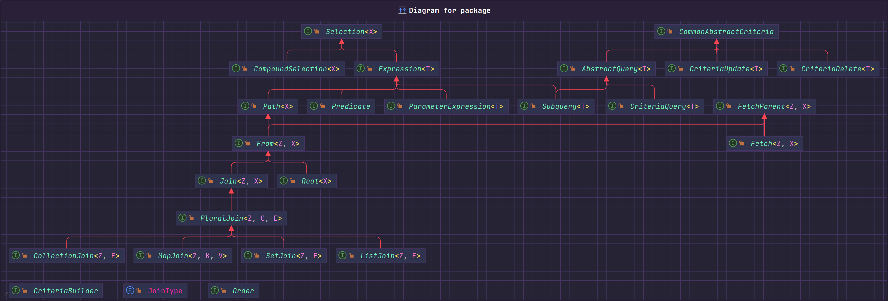

---
category:
  - Hibernate
tag:
  - ORM
  - JPA
  - Hibernate
  - 动态SQL
  - Criteria
date: 2023-09-27
timeline: true
order: 2
---

# 2. 动态SQL（Criteria）

在JPA中写SQL三种方式

- JPQL
  如果你的SQL语句不是动态的那建议使用JPQL，JPQL和SQL写起来差不多。主要区别是JPQL是面向实体类，SQL是直接面向底层的表。
- Criteria
  Criteria 查询提供了用编程的形式去写JPQL，同时它也是类型安全的。通过它可以编写动态的JPQL，比如where条件动态拼接，order by 动态字段等操作。相比于传统的字符串SQL拼接，它的优点就是类型安全。Criteria你也可以说是JPQL的编程版本。
- NativeSQL
  由于JPQL提供的是所有数据库通用的写法，如果你想使用具体数据库的特性，可以写NativeSQL（原生SQL）。

JPA中最难的查询方式就是criteria了，所以本章主要对criteria做介绍。

<center>


图1 criteria设计图
</center>

这张图是criteria中涉及的所有接口以及他们之间的关系。是不是看着感觉很难，不用害怕，下面我用几个例子带你看懂这张图。

## 简单的JPQL例子

下面是一段JPQL看着是不是和SQL很相似，但是仔细观察你可以发现这里面的表名是实体类名，字段名是实体类的属性。

```sql
select u.id from User u left join UserWeChat uw on u.id=uw.id where uw.openId='oEheF5USRu6Y3qWjpb3wJPBfuejw' and u.phonePassword.phoneNumber like '136%'
```

::: info
JPQL和NativeSQL操作对象的区别参考下面。
`UserPhonePassword`是实体类的名字，`USER_PHONE_PASSWORD`是实体类映射到数据库的表名。`phoneNumber`是实体类的属性名，映射到数据库中的表字段是`phone_number`。

```java
@Table(name = "USER_PHONE_PASSWORD")
@Entity
public class UserPhonePassword extends BaseEntity {
  @Column(name = "phone_number", unique = true)
  private String phoneNumber;
}
```

:::

### 连接（Join）

观察这段JPQL，可以看到 u 和 uw 两个别名。u在criteria里面它叫`Root`，因为它是这段sql里面的起始表。uw在criteria里面它叫`Join`，这个就很明显了因为它是通过join得到的。

通过图1你可以看见 `Root`和`Join`都是`From`的子类。在写SQL的时候可以知道from之后可以join别的表，join之后也可以再join别的表。因此`From`的子类就意味着它可以具备join的能力。

:::tip
知识点：`From`的子类可以Join别的表。
:::

### 路径导航（Path Navigation）

总所周知，JPA中可以配置实体类之间的关系，形成一个图网络。网络中的每个节点就是一个实体类，实体类又有多个属性。当写查询语句的时候需要在这个图网络上进行导航这种操作就叫路径导航。

这段sql中 u.id，uw.id，uw.openId，u.phonePassword.phoneNumber都是属于路径导航操作。u对象是`Root(From)`类型，uw是`Join(From)`类型。u.phonePassword是`Path`类型。

在图一中你可以看见`From`是`Path`的子类，而`Path`拥有路径导航的能力，因此不管是`From`，`Join`，`Root`，`Path`都有路径导航能力。

:::tip
知识点：`Path`的子类可以路径导航
:::

## 简单的Criteria例子

JPQL

```sql
select u.id from User u left join UserWeChat uw on u.id=uw.id where uw.openId='oEheF5USRu6Y3qWjpb3wJPBfuejw' and u.phonePassword.phoneNumber like '136%'
```

下面JPQL对应的Mysql原生SQL

```sql
select
    u.id 
from
    user u 
join
    user_wechat uw 
        on u.id=uw.id 
join
    user_phone_password p 
        on u.id=p.id 
where
    uw.open_id=? 
    and p.phone_number like ?
```

下面是用criteria的形式实现上面的JPQL。

```java
  @Test
  public void criteriaDemo() {
    CriteriaBuilder criteriaBuilder = entityManager.getCriteriaBuilder();
    // 创建一个返回类型是String的criteria查询语句
    CriteriaQuery<String> query = criteriaBuilder.createQuery(String.class);
    // 查询语句的root是User。from User u。
    Root<User> u = query.from(User.class);
    // Root对象可以join。由于配置关系时已经确定了外键，这步不需要写on条件。
    Join<User, UserWeChat> uw = u.join(User_.weChat);
    // criteriaBuilder用于构造相等查询条件，条件作用的路径 uw.get(UserWeChat_.openId)。
    query.where(criteriaBuilder.equal(uw.get(UserWeChat_.openId), "oEheF5USRu6Y3qWjpb3wJPBfuejw"),
        // 构造like查询条件，条件作用的路径是u.get(User_.phonePassword).get(UserPhonePassword_.phoneNumber)
        criteriaBuilder.like(u.get(User_.phonePassword).get(UserPhonePassword_.phoneNumber),
            "136%"));
    query.select(u.get(User_.id));
    entityManager.createQuery(query).getResultList().forEach(id->{
      log.info("用户id:{}",id);
    });
  }

```

`Root<User> u = query.from(User.class);` 根据之前的介绍可以知道这步的`u`对象是Root类型。

`Join<User, UserWeChat> uw = u.join(User_.weChat);`由于Root类型是From类型的子类，因此这步可以join。join得到的uw对象是Join类型

`uw.get(UserWeChat_.openId)`就是之前讲的路径导航等于 uw.openId，`criteriaBuilder.equal(路径, 对比的值)` 转换成 JPQL就是uw.openId='oEheF5USRu6Y3qWjpb3wJPBfuejw'

`u.get(User_.phonePassword).get(UserPhonePassword_.phoneNumber)` 转成JPQL就是u.phonePassword.phoneNumber，由于u.phonePassword是`Path`类型它可以继续路径导航，向下得到phoneNumber。

最后再select需要的数据`query.select(u.get(User_.id))`转成JPQL是`select u.id`

:::info
上面例子中的User_, UserPhonePassword_, UserWeChat_都是自动生成的类。UserWeChat_.openId就是相当于字符串"openId"。主要作用就是防止你直接在代码里面写死字符串，到时候实体类的属性变化时不能即使发现bug。
:::

## Select

### SelectExpression

```java
  @Test
  public void selectExpression() {
    CriteriaBuilder criteriaBuilder = entityManager.getCriteriaBuilder();
    CriteriaQuery<String> query = criteriaBuilder.createQuery(String.class);
    Root<User> userRoot = query.from(User.class);
    // 构造 case when
    Expression<String> selectCase = criteriaBuilder.<String>selectCase()
        // when u.avatar is null then 'avatar is null'
        .when(criteriaBuilder.isNull(userRoot.get("avatar")), "avatar is null")
        // else u.avatar
        .otherwise(userRoot.get("avatar"));
        
    // select  upper(case when u.avatar is null then 'avatar is null' else u.avatar  end)
    query.select(criteriaBuilder.upper(selectCase));
    List<String> resultList = entityManager.createQuery(query).getResultList();
    resultList.forEach(log::info);
  }
```

```sql
select
  upper(case
      when u.avatar is null then 'avatar is null'
      else u.avatar
  end)
from
  user u
```

这个例子的主要核心是在`query.select`，写这个看起有点复杂的例子是想表达select内可以传很多类型。

可以看见select方法的参数必须实现Selection。根据图1可以知Selection的主要实现接口是Expression。

```java
 CriteriaQuery<T> select(Selection<? extends T> selection);
```

### SelectMultiExpression

::: warning
在使用criteria时，字段名称指的是实体类上的属性名称，而不是数据库中的字段名称。
比如UserPhonePassword中的phoneNumber在数据库中是phone_number，criteria中使用该字段的方法是root.get("phoneNumber")并不是root.get("phone_number")
:::

```java
  @Test
  public void selectMultiExpression() {
    CriteriaBuilder criteriaBuilder = entityManager.getCriteriaBuilder();
    // 查询的返回结果是Tuple，类似jdbc中的resultSet。Tuple比较灵活，当你不想定义返回结果时可以用Tuple。
    CriteriaQuery<Tuple> query = criteriaBuilder.createQuery(Tuple.class);
    Root<User> userRoot = query.from(User.class);
    // userRoot.get("phonePassword").get("phoneNumber") 会自动join phonePassword。
    // 同时需要注意数据库中phoneNumber是phone_number，所以这边记得是填写实体类中的属性名称而不是数据库中的名称。
    query.multiselect(userRoot.get("nickname"), userRoot.get("phonePassword").get("phoneNumber"));
    entityManager.createQuery(query).getResultList().forEach(res -> {
      // res.get(0)对应multiselect的第一个参数，res.get(1)对应
      log.info("用户昵称：{}, 手机号：{}", res.get(0), res.get(1));
    });
  }
```

### SelectDto1

根据图一可以知道`query.select`还可以传入`CompoundSelection`（Selection的实现类）的对象。下面介绍将select的字段包装成dto。

```java
  @Test
  public void selectDto() {
    CriteriaBuilder criteriaBuilder = entityManager.getCriteriaBuilder();
    // 返回的结果是dto
    CriteriaQuery<UserSimpleResponse> query = criteriaBuilder.createQuery(UserSimpleResponse.class);
    Root<User> userRoot = query.from(User.class);
    // 将select的多个字段组合成一个CompoundSelection
    // UserSimpleResponse的构造方法会接收nickname和phoneNumber两个参数
    CompoundSelection<UserSimpleResponse> construct = criteriaBuilder.construct(
        UserSimpleResponse.class,
        // 对应构造方法的第一个参数
        userRoot.get("nickname"),
        // 对应构造方法的第二个参数
        userRoot.get("phonePassword").get("phoneNumber"));
    query.select(construct);
    entityManager.createQuery(query).getResultList().forEach(res -> {
      log.info(res.toString());
    });
  }
```

```java
@Data
public class UserSimpleResponse {

  private String nickname;
  private String phoneNumber;

  public UserSimpleResponse(String nickname, String phoneNumber) {
    this.nickname = nickname;
    this.phoneNumber = phoneNumber;
  }
}
```

```sql
select
    u.nickname,
    u.phone_number 
from
    user u 
join
    user_phone_password p 
        on u.id=p.id
```

### SelectDto2

这个例子演示了在select中可以传入Join对象通过此来实现`select p.*`。

```java
  @Test
  public void selectDto2() {
    CriteriaBuilder criteriaBuilder = entityManager.getCriteriaBuilder();
    CriteriaQuery<UserPhonePasswordResponse> query = criteriaBuilder.createQuery(
        UserPhonePasswordResponse.class);
    Root<User> userRoot = query.from(User.class);
    Join<Object, Object> phonePasswordJoin = userRoot.join("phonePassword");
    CompoundSelection<UserPhonePasswordResponse> construct = criteriaBuilder.construct(
        UserPhonePasswordResponse.class,
        // 这个参数对应构造方法的第一个参数
        userRoot.get("nickname"),
        // 这个参数对应构造方法的第二个参数
        phonePasswordJoin
        );
    query.select(construct);
    entityManager.createQuery(query).getResultList().forEach(res -> {
      log.info(res.toString());
    });
  }
```

```sql
select
    u1_0.nickname,
    p.*,
from
    user u 
join
    user_phone_password p 
        on u.id=p.id
```

```java
@Data
public class UserPhonePasswordResponse {

  private String nickname;
  private String phoneNumber;
  private String password;

  public UserPhonePasswordResponse(String nickname, UserPhonePassword phonePassword) {
    this.nickname = nickname;
    this.phoneNumber = phonePassword.getPhoneNumber();
    this.password = phonePassword.getPassword();
  }
}

```

### SelectRoot

`root`是根的意思，平常写的sql中肯定会有一个起始表，然后再join到其他的表或者子查询（里面也可以含有root）。一个sql中可以有多个起始表，这边只演示了一个。

`query.from(User.class)`得到userRoot，在图1中得知Root也是Expression的实现接口，因此userRoot对象也可以传入select中。执行的效果就是`u.*`

```java
  @Test
  public void selectRoot() {
    // 用于构造查询语句和查询条件
    CriteriaBuilder criteriaBuilder = entityManager.getCriteriaBuilder();
    // User.class代表查询的返回结果是User类型
    CriteriaQuery<User> query = criteriaBuilder.createQuery(User.class);
    // from user 
    Root<User> userRoot = query.from(User.class);
    // select u.* from user u
    query.select(userRoot);
    List<User> resultList = entityManager.createQuery(query).getResultList();
    resultList.forEach(user -> {
      log.info(user.toString());
    });
  }
```

```sql
select u.* from user u
```

### SelectMultiRoot

上面说了一个SQL中可以包含多个Root，下面演示select多个root。

```java
    @Test
  public void queryMultiRoot() {
    CriteriaBuilder criteriaBuilder = entityManager.getCriteriaBuilder();
    CriteriaQuery<Tuple> query = criteriaBuilder.createQuery(Tuple.class);
    // from user
    Root<User> userRoot = query.from(User.class);
    // from user, role
    Root<Role> roleRoot = query.from(Role.class);
    // select u.*, r.*
    query.multiselect(userRoot, roleRoot);
    List<Tuple> resultList = entityManager.createQuery(query).getResultList();
    resultList.forEach(res -> {
      // res.get(0) -> user, res.get(1)-> role 和 multiselect参数对应
      log.info("用户信息：{}，角色信息：{}", res.get(0), res.get(1));
    });
  }
```

```sql
select u.*, r.* from user u, role r
```

## 条件表达式（Conditional Expressions）

### 比较运算

```query.where(条件1,条件2...条件n)```对应的sql是where 条件1 and 条件2 .... and 条件n

```java
@Test
  public void compare() {
    CriteriaBuilder criteriaBuilder = entityManager.getCriteriaBuilder();
    CriteriaQuery<Menu> query = criteriaBuilder.createQuery(Menu.class);
    Root<Menu> menuRoot = query.from(Menu.class);

    // 可以忽略不写select,默认就是select menuRoot
    // query.select(menuRoot);

    // where里面可以传多个条件 多个条件是and逻辑连接.
    query.where(criteriaBuilder.notEqual(menuRoot.get(Menu_.id), "1"),
        criteriaBuilder.ge(menuRoot.get(Menu_.orderNum), 0));
    entityManager.createQuery(query).getResultList().forEach(menu -> {
      log.info("菜单: {}", menu);
    });
    // 下面的条件不参与where拼接
    // = 运算符
    criteriaBuilder.equal(menuRoot.get(Menu_.id), "1");
    // != 运算符
    criteriaBuilder.notEqual(menuRoot.get(Menu_.id), "1");
    // ---- 下面的条件只能是数值型属性之间的比较 >= > <= <
    //  >= 运算符
    criteriaBuilder.ge(menuRoot.get(Menu_.orderNum), 0);
    //  > 运算符
    criteriaBuilder.gt(menuRoot.get(Menu_.orderNum), 0);
    //  <= 运算符
    criteriaBuilder.le(menuRoot.get(Menu_.orderNum), 0);
    // < 运算符
    criteriaBuilder.lt(menuRoot.get(Menu_.orderNum), 0);
    // ---- 下面的条件可以是非数值型属性之间的比较 >= > <= <
    //  >= 运算符
    criteriaBuilder.greaterThanOrEqualTo(menuRoot.get(Menu_.createdAt), LocalDateTime.now());
    //  > 运算符
    criteriaBuilder.greaterThan(menuRoot.get(Menu_.createdAt), LocalDateTime.now());
    // <= 运算符
    criteriaBuilder.lessThanOrEqualTo(menuRoot.get(Menu_.createdAt), LocalDateTime.now());
    // > 运算符
    criteriaBuilder.lessThan(menuRoot.get(Menu_.createdAt), LocalDateTime.now());

  }
```

```sql
select
  m.*
from
  menu m
where
  m.id!=?
  and m.order_num>=?
```

### 逻辑运算

`criteriaBuilder.or(条件1,条件2)`会返回一个新的条件即(条件1 or 条件2)

```java
  @Test
  public void logical() {
    CriteriaBuilder criteriaBuilder = entityManager.getCriteriaBuilder();
    CriteriaQuery<User> query = criteriaBuilder.createQuery(User.class);
    Root<User> userRoot = query.from(User.class);
    //           (
    //              u.nickname=?
    //              or u.nickname=?
    //          )
    query.where(criteriaBuilder.or(criteriaBuilder.equal(userRoot.get(User_.nickname), "起凡"),
            criteriaBuilder.equal(userRoot.get(User_.nickname), "默认用户")),
        // and u.avatar not like ? escape ''
        criteriaBuilder.not(criteriaBuilder.like(userRoot.get(User_.avatar), "%https%")),
        // and u.gender in (?,?)
        userRoot.get(User_.gender).in(GenderType.MALE, GenderType.FEMALE));
    entityManager.createQuery(query).getResultList().forEach(res -> {
      log.info(res.toString());
    });
  }
```

```sql
  select
      u.*
  from
      user u
  where
      (
          u.nickname=?
          or u.nickname=?
      )
      and u.avatar not like ? escape ''
      and u.gender in (?,?)
```

### Null运算

```java
  @Test
  public void isNull() {
    CriteriaBuilder criteriaBuilder = entityManager.getCriteriaBuilder();
    CriteriaQuery<Menu> query = criteriaBuilder.createQuery(Menu.class);
    Root<Menu> menuRoot = query.from(Menu.class);
    query.where(criteriaBuilder.isNotNull(menuRoot.get(Menu_.orderNum)));
    entityManager.createQuery(query).getResultList().forEach(menu -> {
      log.info("菜单:{}", menu);
    });
  }
```

```sql
select
    m.*
from
    menu m
where
    m.order_num is not null
```

### Between

```java
  @Test
  public void between() {
    CriteriaBuilder criteriaBuilder = entityManager.getCriteriaBuilder();
    CriteriaQuery<Menu> query = criteriaBuilder.createQuery(Menu.class);
    Root<Menu> menuRoot = query.from(Menu.class);
    // where里面可以传多个条件 多个条件是and逻辑连接.
    query.where(criteriaBuilder.between(menuRoot.get(Menu_.orderNum), 0, 2));
    entityManager.createQuery(query).getResultList().forEach(menu -> {
      log.info("菜单: {}", menu);
    });
  }
```

```sql
select
    m.*
from
    menu m
where
    m.order_num between ? and ?
```

### In/Not In

```java
  @Test
  public void inAndNotIn() {
    CriteriaBuilder criteriaBuilder = entityManager.getCriteriaBuilder();
    CriteriaQuery<Menu> query = criteriaBuilder.createQuery(Menu.class);
    Root<Menu> menuRoot = query.from(Menu.class);
    query.where(menuRoot.get(Menu_.menuType).in(MenuType.MENU, MenuType.DIRECTORY));
    entityManager.createQuery(query).getResultList().forEach(menu -> {
      log.info("菜单: {}", menu);
    });
    // 后面加一个not就是not in了
    menuRoot.get(Menu_.menuType).in(MenuType.MENU, MenuType.DIRECTORY).not();
  }
```

```sql
select
    m.*
from
    menu m
where
    m.menu_type in (?,?)
```

### like

```sql
  @Test
  public void like() {
    CriteriaBuilder criteriaBuilder = entityManager.getCriteriaBuilder();
    CriteriaQuery<Menu> query = criteriaBuilder.createQuery(Menu.class);
    Root<Menu> menuRoot = query.from(Menu.class);
    query.where(criteriaBuilder.like(menuRoot.get(Menu_.name), "%管理%"));
    entityManager.createQuery(query).getResultList().forEach(menu -> {
      log.info("菜单:{}", menu);
    });
  }
```

```sql
select m.* from menu m where m.name like '%管理%'
```

## Join

```java
  @Test
  public void join() {
    CriteriaBuilder criteriaBuilder = entityManager.getCriteriaBuilder();
    CriteriaQuery<User> query = criteriaBuilder.createQuery(User.class);
    Root<User> userRoot = query.from(User.class);
    // 因为在配置关系的时候已经确定好外键了所以这边会自动生成on条件
    //      left join
    //          user_phone_password p
    //              on u.id=p.id
    Join<User, UserPhonePassword> phonePasswordJoin = userRoot.join(User_.phonePassword,
        JoinType.LEFT);
    query.where(criteriaBuilder.equal(phonePasswordJoin.get(UserPhonePassword_.phoneNumber),
        "13656987996"));
    entityManager.createQuery(query).getResultList().forEach(user -> {
      log.info("用户：{}", user);
    });
  }

```

```sql
select
    u.*
from
    user u
left join
    user_phone_password p
        on u.id=p.id
where
    p.phone_number=?
```

## GroupByHaving

```java
  @Test
  public void groupByHaving() {
    CriteriaBuilder criteriaBuilder = entityManager.getCriteriaBuilder();
    CriteriaQuery<User> query = criteriaBuilder.createQuery(User.class);
    Root<User> userRoot = query.from(User.class);
    SetJoin<User, Role> roleSetJoin = userRoot.join(User_.roles);
    query.groupBy(userRoot.get(User_.id));
    query.having(criteriaBuilder.ge(criteriaBuilder.count(userRoot.get(User_.id)), 2));
    entityManager.createQuery(query).getResultList().forEach(user -> {
      log.info("user:{}", user);
    });
  }
```

```sql
select u.id
from user u
         join user_role r on u.id = r.user_id
group by u.id
having count(u.id) >= ?
```

## OrderBy

```java
  @Test
  public void orderBy() {
    CriteriaBuilder criteriaBuilder = entityManager.getCriteriaBuilder();
    CriteriaQuery<User> query = criteriaBuilder.createQuery(User.class);
    Root<User> userRoot = query.from(User.class);

    query.orderBy(criteriaBuilder.desc(criteriaBuilder.size(userRoot.get(User_.roles))));
    entityManager.createQuery(query).getResultList().forEach(user -> {
      log.info("user:{}", user);
    });
  }
```

```sql
select
    u.*
from
    user u
order by
    (select
        count(1)
    from
        user_role r
    where
        u.id=r.user_id) desc
```

## 子查询（SubQuery）

```java
  @Test
  public void subQuery() {
    CriteriaBuilder criteriaBuilder = entityManager.getCriteriaBuilder();
    CriteriaQuery<Role> query = criteriaBuilder.createQuery(Role.class);
    Root<User> userRoot = query.from(User.class);
    userRoot.fetch(User_.phonePassword);
    SqmSetJoin<User, Role> fetch = (SqmSetJoin<User, Role>) userRoot.fetch(User_.roles);

    // 子查询的返回结果是String
    Subquery<String> subquery = query.subquery(String.class);
    // from role r
    Root<Role> roleRoot = subquery.from(Role.class);
    // where r.id!=1
    subquery.where(criteriaBuilder.notEqual(roleRoot.get(Role_.id), "1"));
    subquery.select(roleRoot.get(Role_.id));
    query.where(fetch.get(Role_.id).in(subquery));
    entityManager.createQuery(query).getResultList().forEach(user -> {
      log.info("user: {}", user);
    });
  }
```

```sql
select u.*,
       p.*,
       r.*
from user u
         join
     user_phone_password p
     on u.id = p.id
         join
     (user_role ur
         join
         role r
      on r.id = ur.role_id)
     on u.id = ur.user_id
where ur.role_id in (select r2.id
                     from role r2
                     where r2.id != ?)
```