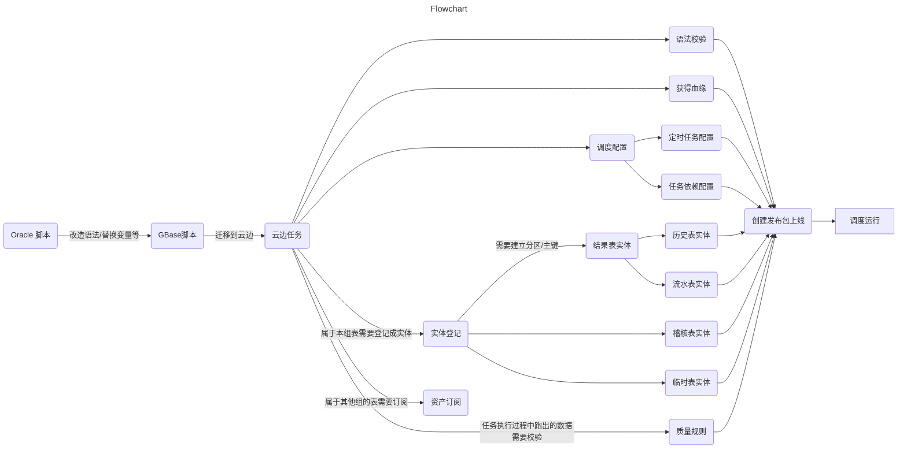

# 脚本迁移自动化
## 手动迁移流程图



## 迁移流程图

脚本迁移中，提取SQL片段，提取注释，替换变量，改造常见语法这些都是十分重复的工作，而这些重复的工作占用了80%的工作时间。
只有少量的时间在修改逻辑性的片段，所以如果能用脚本解决掉这大量的重复工作，那效率的提升是显而易见的的。


<div>
<svg xmlns="http://www.w3.org/2000/svg" xmlns:xlink="http://www.w3.org/1999/xlink" contentStyleType="text/css"  preserveAspectRatio="none" style="background:#FFFFFF;" version="1.1" viewBox="0 0 354 539"  zoomAndPan="magnify"><defs/><g><ellipse cx="63" cy="20" fill="#222222" rx="10" ry="10" style="stroke:#222222;stroke-width:1.0;"/><rect fill="#F1F1F1" height="35.9609" rx="12.5" ry="12.5" style="stroke:#181818;stroke-width:0.5;" width="102" x="12" y="50"/><text fill="#000000" font-family="sans-serif" font-size="12" lengthAdjust="spacing" textLength="82" x="22" y="72.9492">oracle&#21407;&#22987;&#33050;&#26412;</text><path d="M123,110.2959 L123,119.9414 L103,123.9414 L123,127.9414 L123,137.5869 A0,0 0 0 0 123,137.5869 L196,137.5869 A0,0 0 0 0 196,137.5869 L196,120.2959 L186,110.2959 L123,110.2959 A0,0 0 0 0 123,110.2959 " fill="#FEFFDD" style="stroke:#181818;stroke-width:0.5;"/><path d="M186,110.2959 L186,120.2959 L196,120.2959 L186,110.2959 " fill="#FEFFDD" style="stroke:#181818;stroke-width:0.5;"/><a href="/blog/images/knowledge/newland/script/img_1.png" target="_top" title="http://localhost:8081/@fs/D:\workplace\code\opensource\qifan-blog-vuepress2\docs\knowledge&#10;ewland\script\img_1.png" xlink:actuate="onRequest" xlink:href="/blog/images/knowledge/newland/script/img_1.png" xlink:show="new" xlink:title="http://localhost:8081/@fs/D:\workplace\code\opensource\qifan-blog-vuepress2\docs\knowledge&#10;ewland\script\img_1.png" xlink:type="simple"><text fill="#0000FF" font-family="sans-serif" font-size="13" lengthAdjust="spacing" text-decoration="underline" textLength="52" x="129" y="129.3242">&#27491;&#21017;&#21305;&#37197;</text></a><rect fill="#F1F1F1" height="35.9609" rx="12.5" ry="12.5" style="stroke:#181818;stroke-width:0.5;" width="80" x="23" y="105.9609"/><text fill="#000000" font-family="sans-serif" font-size="12" lengthAdjust="spacing" textLength="60" x="33" y="128.9102">&#20195;&#30721;&#22359;&#35782;&#21035;</text><path d="M124,166.2568 L124,175.9023 L104,179.9023 L124,183.9023 L124,193.5479 A0,0 0 0 0 124,193.5479 L197,193.5479 A0,0 0 0 0 197,193.5479 L197,176.2568 L187,166.2568 L124,166.2568 A0,0 0 0 0 124,166.2568 " fill="#FEFFDD" style="stroke:#181818;stroke-width:0.5;"/><path d="M187,166.2568 L187,176.2568 L197,176.2568 L187,166.2568 " fill="#FEFFDD" style="stroke:#181818;stroke-width:0.5;"/><a href="/blog/images/knowledge/newland/script/img_2.png" target="_top" title="http://localhost:8081/@fs/D:\workplace\code\opensource\qifan-blog-vuepress2\docs\knowledge&#10;ewland\script\img_2.png" xlink:actuate="onRequest" xlink:href="/blog/images/knowledge/newland/script/img_2.png" xlink:show="new" xlink:title="http://localhost:8081/@fs/D:\workplace\code\opensource\qifan-blog-vuepress2\docs\knowledge&#10;ewland\script\img_2.png" xlink:type="simple"><text fill="#0000FF" font-family="sans-serif" font-size="13" lengthAdjust="spacing" text-decoration="underline" textLength="52" x="130" y="185.2852">&#27491;&#21017;&#21305;&#37197;</text></a><rect fill="#F1F1F1" height="35.9609" rx="12.5" ry="12.5" style="stroke:#181818;stroke-width:0.5;" width="82" x="22" y="161.9219"/><text fill="#000000" font-family="sans-serif" font-size="12" lengthAdjust="spacing" textLength="62" x="32" y="184.8711">V_SQL&#25552;&#21462;</text><path d="M118.5,222.2178 L118.5,231.8633 L98.5,235.8633 L118.5,239.8633 L118.5,249.5088 A0,0 0 0 0 118.5,249.5088 L191.5,249.5088 A0,0 0 0 0 191.5,249.5088 L191.5,232.2178 L181.5,222.2178 L118.5,222.2178 A0,0 0 0 0 118.5,222.2178 " fill="#FEFFDD" style="stroke:#181818;stroke-width:0.5;"/><path d="M181.5,222.2178 L181.5,232.2178 L191.5,232.2178 L181.5,222.2178 " fill="#FEFFDD" style="stroke:#181818;stroke-width:0.5;"/><a href="/blog/images/knowledge/newland/script/img_3.png" target="_top" title="http://localhost:8081/@fs/D:\workplace\code\opensource\qifan-blog-vuepress2\docs\knowledge&#10;ewland\script\img_3.png" xlink:actuate="onRequest" xlink:href="/blog/images/knowledge/newland/script/img_3.png" xlink:show="new" xlink:title="http://localhost:8081/@fs/D:\workplace\code\opensource\qifan-blog-vuepress2\docs\knowledge&#10;ewland\script\img_3.png" xlink:type="simple"><text fill="#0000FF" font-family="sans-serif" font-size="13" lengthAdjust="spacing" text-decoration="underline" textLength="52" x="124.5" y="241.2461">&#27491;&#21017;&#21305;&#37197;</text></a><rect fill="#F1F1F1" height="35.9609" rx="12.5" ry="12.5" style="stroke:#181818;stroke-width:0.5;" width="71" x="27.5" y="217.8828"/><text fill="#000000" font-family="sans-serif" font-size="12" lengthAdjust="spacing" textLength="48" x="37.5" y="240.832">&#27880;&#37322;&#25552;&#21462;</text><path d="M117,278.1787 L117,287.8242 L97,291.8242 L117,295.8242 L117,305.4697 A0,0 0 0 0 117,305.4697 L190,305.4697 A0,0 0 0 0 190,305.4697 L190,288.1787 L180,278.1787 L117,278.1787 A0,0 0 0 0 117,278.1787 " fill="#FEFFDD" style="stroke:#181818;stroke-width:0.5;"/><path d="M180,278.1787 L180,288.1787 L190,288.1787 L180,278.1787 " fill="#FEFFDD" style="stroke:#181818;stroke-width:0.5;"/><a href="/blog/images/knowledge/newland/script/img_4.png" target="_top" title="http://localhost:8081/@fs/D:\workplace\code\opensource\qifan-blog-vuepress2\docs\knowledge&#10;ewland\script\img_4.png" xlink:actuate="onRequest" xlink:href="/blog/images/knowledge/newland/script/img_4.png" xlink:show="new" xlink:title="http://localhost:8081/@fs/D:\workplace\code\opensource\qifan-blog-vuepress2\docs\knowledge&#10;ewland\script\img_4.png" xlink:type="simple"><text fill="#0000FF" font-family="sans-serif" font-size="13" lengthAdjust="spacing" text-decoration="underline" textLength="52" x="123" y="297.207">&#26367;&#25442;&#35268;&#21017;</text></a><rect fill="#F1F1F1" height="35.9609" rx="12.5" ry="12.5" style="stroke:#181818;stroke-width:0.5;" width="68" x="29" y="273.8438"/><text fill="#000000" font-family="sans-serif" font-size="12" lengthAdjust="spacing" textLength="48" x="39" y="296.793">&#21464;&#37327;&#26367;&#25442;</text><path d="M129,325.4941 L129,343.7852 L109,347.7852 L129,351.7852 L129,370.0762 A0,0 0 0 0 129,370.0762 L342,370.0762 A0,0 0 0 0 342,370.0762 L342,335.4941 L332,325.4941 L129,325.4941 A0,0 0 0 0 129,325.4941 " fill="#FEFFDD" style="stroke:#181818;stroke-width:0.5;"/><path d="M332,325.4941 L332,335.4941 L342,335.4941 L332,325.4941 " fill="#FEFFDD" style="stroke:#181818;stroke-width:0.5;"/><text fill="#000000" font-family="sans-serif" font-size="13" lengthAdjust="spacing" textLength="192" x="135" y="344.5225">&#27604;&#22914; alter table  truncate partition</text><text fill="#000000" font-family="sans-serif" font-size="13" lengthAdjust="spacing" textLength="94" x="135" y="361.8135">&#25913;&#25104; delete from</text><rect fill="#F1F1F1" height="35.9609" rx="12.5" ry="12.5" style="stroke:#181818;stroke-width:0.5;" width="92" x="17" y="329.8047"/><text fill="#000000" font-family="sans-serif" font-size="12" lengthAdjust="spacing" textLength="72" x="27" y="352.7539">&#24120;&#35265;&#35821;&#27861;&#25913;&#36896;</text><path d="M129,385.7656 L129,404.0566 L109,408.0566 L129,412.0566 L129,430.3477 A0,0 0 0 0 129,430.3477 L240,430.3477 A0,0 0 0 0 240,430.3477 L240,395.7656 L230,385.7656 L129,385.7656 A0,0 0 0 0 129,385.7656 " fill="#FEFFDD" style="stroke:#181818;stroke-width:0.5;"/><path d="M230,385.7656 L230,395.7656 L240,395.7656 L230,385.7656 " fill="#FEFFDD" style="stroke:#181818;stroke-width:0.5;"/><a href="/blog/images/knowledge/newland/script/img_5.png" target="_top" title="http://localhost:8081/@fs/D:\workplace\code\opensource\qifan-blog-vuepress2\docs\knowledge&#10;ewland\script\img_5.png" xlink:actuate="onRequest" xlink:href="/blog/images/knowledge/newland/script/img_5.png" xlink:show="new" xlink:title="http://localhost:8081/@fs/D:\workplace\code\opensource\qifan-blog-vuepress2\docs\knowledge&#10;ewland\script\img_5.png" xlink:type="simple"><text fill="#0000FF" font-family="sans-serif" font-size="13" lengthAdjust="spacing" text-decoration="underline" textLength="90" x="135" y="404.7939">Oracle&#26657;&#39564;&#35268;&#21017;</text></a><a href="/blog/images/knowledge/newland/script/img_6.png" target="_top" title="http://localhost:8081/@fs/D:\workplace\code\opensource\qifan-blog-vuepress2\docs\knowledge&#10;ewland\script\img_6.png" xlink:actuate="onRequest" xlink:href="/blog/images/knowledge/newland/script/img_6.png" xlink:show="new" xlink:title="http://localhost:8081/@fs/D:\workplace\code\opensource\qifan-blog-vuepress2\docs\knowledge&#10;ewland\script\img_6.png" xlink:type="simple"><text fill="#0000FF" font-family="sans-serif" font-size="13" lengthAdjust="spacing" text-decoration="underline" textLength="90" x="135" y="422.085">Gbase&#26657;&#39564;&#35268;&#21017;</text></a><rect fill="#F1F1F1" height="35.9609" rx="12.5" ry="12.5" style="stroke:#181818;stroke-width:0.5;" width="92" x="17" y="390.0762"/><text fill="#000000" font-family="sans-serif" font-size="12" lengthAdjust="spacing" textLength="72" x="27" y="413.0254">&#26657;&#39564;&#35268;&#21017;&#25913;&#36896;</text><rect fill="#F1F1F1" height="35.9609" rx="12.5" ry="12.5" style="stroke:#181818;stroke-width:0.5;" width="104" x="11" y="450.3477"/><text fill="#000000" font-family="sans-serif" font-size="12" lengthAdjust="spacing" textLength="84" x="21" y="473.2969">&#32479;&#19968;&#28165;&#31354;&#31293;&#26680;&#34920;</text><ellipse cx="63" cy="517.3086" fill="none" rx="11" ry="11" style="stroke:#222222;stroke-width:1.0;"/><ellipse cx="63" cy="517.3086" fill="#222222" rx="6" ry="6" style="stroke:#111111;stroke-width:1.0;"/><line style="stroke:#181818;stroke-width:1.0;" x1="63" x2="63" y1="30" y2="50"/><polygon fill="#181818" points="59,40,63,50,67,40,63,44" style="stroke:#181818;stroke-width:1.0;"/><line style="stroke:#181818;stroke-width:1.0;" x1="63" x2="63" y1="85.9609" y2="105.9609"/><polygon fill="#181818" points="59,95.9609,63,105.9609,67,95.9609,63,99.9609" style="stroke:#181818;stroke-width:1.0;"/><line style="stroke:#181818;stroke-width:1.0;" x1="63" x2="63" y1="141.9219" y2="161.9219"/><polygon fill="#181818" points="59,151.9219,63,161.9219,67,151.9219,63,155.9219" style="stroke:#181818;stroke-width:1.0;"/><line style="stroke:#181818;stroke-width:1.0;" x1="63" x2="63" y1="197.8828" y2="217.8828"/><polygon fill="#181818" points="59,207.8828,63,217.8828,67,207.8828,63,211.8828" style="stroke:#181818;stroke-width:1.0;"/><line style="stroke:#181818;stroke-width:1.0;" x1="63" x2="63" y1="253.8438" y2="273.8438"/><polygon fill="#181818" points="59,263.8438,63,273.8438,67,263.8438,63,267.8438" style="stroke:#181818;stroke-width:1.0;"/><line style="stroke:#181818;stroke-width:1.0;" x1="63" x2="63" y1="309.8047" y2="329.8047"/><polygon fill="#181818" points="59,319.8047,63,329.8047,67,319.8047,63,323.8047" style="stroke:#181818;stroke-width:1.0;"/><line style="stroke:#181818;stroke-width:1.0;" x1="63" x2="63" y1="365.7656" y2="390.0762"/><polygon fill="#181818" points="59,380.0762,63,390.0762,67,380.0762,63,384.0762" style="stroke:#181818;stroke-width:1.0;"/><line style="stroke:#181818;stroke-width:1.0;" x1="63" x2="63" y1="426.0371" y2="450.3477"/><polygon fill="#181818" points="59,440.3477,63,450.3477,67,440.3477,63,444.3477" style="stroke:#181818;stroke-width:1.0;"/><line style="stroke:#181818;stroke-width:1.0;" x1="63" x2="63" y1="486.3086" y2="506.3086"/><polygon fill="#181818" points="59,496.3086,63,506.3086,67,496.3086,63,500.3086" style="stroke:#181818;stroke-width:1.0;"/><!--SRC=[nTFBIWCn50RWVPuYBw3LUa6c6nU26q54SECKIMVIwT2OZ4bgjofLYxUwy7x1gc3hZIxSJ2tYopJfp5iujWkhY4kxp27XVFmvHqZ49J0OHnR1QkzALRQ3mfc-U4e0O3GRjwtoghey3ceRglYO09H93BdhP2IOdyz8wHcn664M8Xacf34sC3OO6q-Bs8HXvXdFUWHPsBIOZKtcOIfOZaVd9JUDQ5-ACATlEOSzZeM8cpQpX9cbB4-mxM2JuZn1r3Q5nLrFckwYip3Oxr47wkTRLJnLE_LmVJUP19ZQyDC4ZBc5sPafNTfNfQEUCkD_C_LBDTpSwZXXJw53VqDLwIJSBEdpTxrx4ur23w737MXR4bGA4VSxrFU3ocfGUzOlX_gW7gwKlyMgQmVgRWqY8Z674gK8Xb3o7BLGTCMBPj-LBgCWUgcB-z3614VrD6UBtPzMlWuVTZgzVsdntu6Cj0EPRcziDosAvRyfestAP0g9dvAlz5gDgwQ_eltrrlrhg_gcotvmNKq08Pdt0G00]--></g></svg>
</div>

```regexp
(if;|commit;|0\)\);|;)(((?!(Commit|0\)\)|end[ \t]IF|DATE\);))[\w\W])*)V_SQL[ \t\n]*:=[ \t\n]*'([^;]*(?=\'?[\n \t]*;))(((?!(if))[\w\W])*)(?=;)

V_SQL[ \t\n]*:=[ \t\n]*'([^;]*(?=\'?[\n \t]*;))

(if;|commit;|0\)\);|;)(((?!(Commit|0\)\)|end[ \t]IF|DATE\);))[\w\W])*)V_SQL[ \t\n]*:=
```