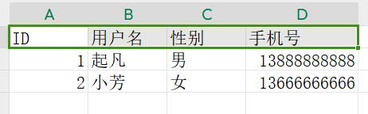

<!-- # 上传Excel并解析

:::center



::: -->
@slidestart

```java
@RestController
@Slf4j
@AllArgsConstructor
public class TestController {

    @SneakyThrows
    @PostMapping("read-user-excel")
    public List<UserExcelModel> readUserExcel(@RequestParam MultipartFile file) {
        List<UserExcelModel> models = new ArrayList<>();
        EasyExcel.read(file.getInputStream(),
                UserExcelModel.class,
                new PageReadListener<UserExcelModel>(dataList -> {
                    models.addAll(dataList);
                    for (UserExcelModel demoData : dataList) {
                        log.info("读取到一条数据{}", demoData);
                    }
                })).excelType(ExcelTypeEnum.XLSX).sheet().doRead();
        return models;
    }
    @Data
    public static class UserExcelModel {
        @ExcelProperty("ID")
        private String id;
        @ExcelProperty("用户名")
        private String username;
        @ExcelProperty("性别")
        private String gender;
        @ExcelProperty("手机号")
        private String phone;
    }
}
```

@slideend

```vue
<script lang="ts" setup>
import type { UploadFile } from "element-plus/es/components/upload/src/upload";
import { ref } from "vue";
import axios from "axios";
const userList = ref([]);
const handleFileChange = (file: UploadFile) => {
  axios({
    url: "/api/read-user-excel",
    method: "post",
    data: { file: file.raw },
    headers: {
      "Content-Type": "multipart/form-data",
    },
  }).then((res) => {
    userList.value = res.data.data;
  });
};
</script>

<template>
  <div>
    <el-row justify="end">
      <el-upload
        class="excel-upload"
        accept=".xlsx,.xls"
        :show-file-list="false"
        :auto-upload="false"
        :limit="1"
        @change="handleFileChange"
      >
        <el-button size="small" type="primary">导入excel</el-button>
      </el-upload>
    </el-row>
    <el-table :data="userList">
      <el-table-column label="id" prop="id"></el-table-column>
      <el-table-column label="用户名" prop="username"></el-table-column>
      <el-table-column label="性别" prop="gender"></el-table-column>
      <el-table-column label="手机号" prop="phone"></el-table-column>
    </el-table>
  </div>
</template>

<style scoped>
.xxxx {
  .bbbb {
    color: red;
  }

  .red {
    color: red;
  }
}
</style>

```
