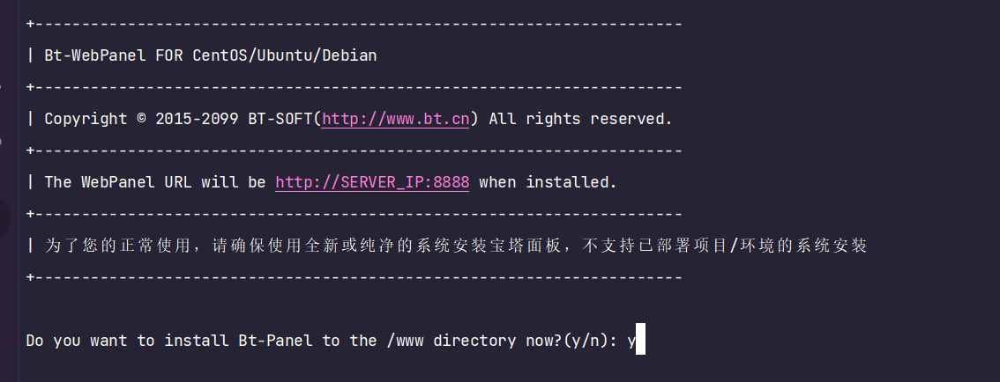
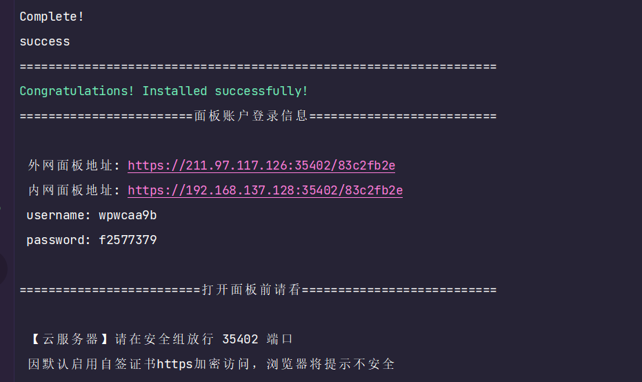
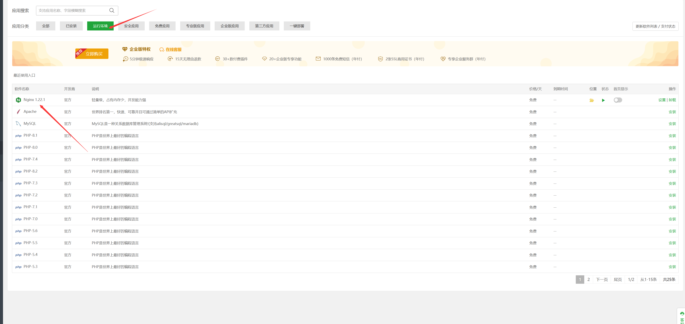
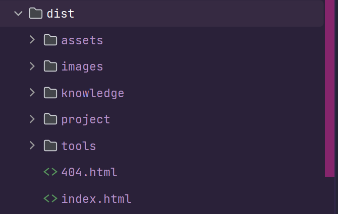
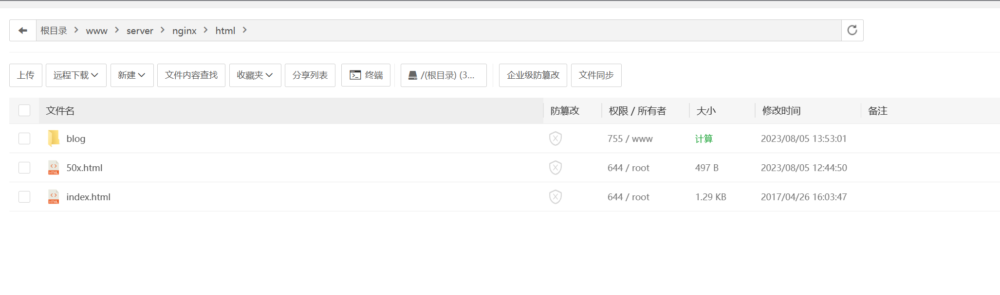
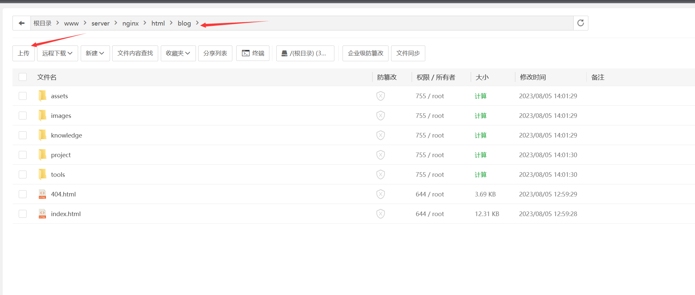
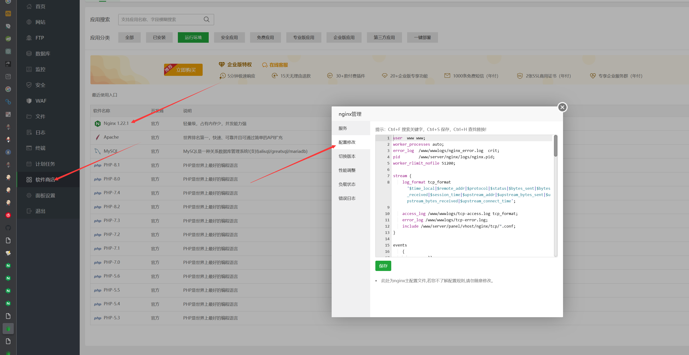
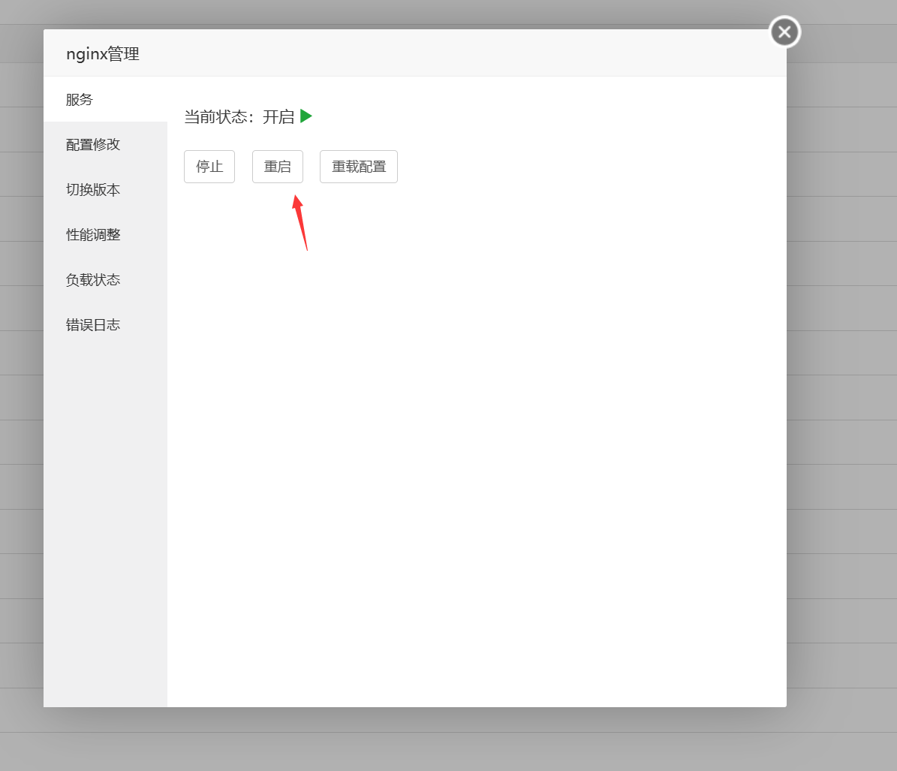
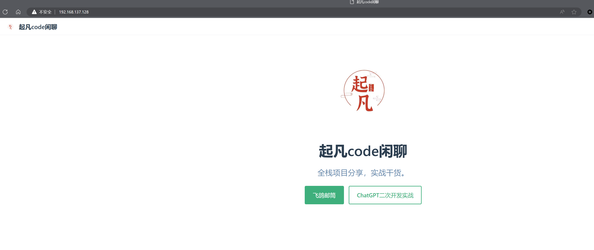

# 手把手教你搭建静态/博客网站

在搭建静态网站中，搭建博客是一个很典型的应用场景。我们一般用markdown写好博客内容，通过webpack打包成前端的html，jss，css等其他静态资源。然后我们需要将这些静态资源放到服务器上供他人阅读。本期的教程就是教搭建如何使用Nginx将我们的博客搭建起来。

## 宝塔面板

宝塔面板是一个很好用的软件管理工具可以帮助你快速的安装各种软件并且可视化的配置这些软件，也包含了一些常用的运维监控。比如防火墙，CPU占用异常，定时任务等。

如果不使用宝塔面板，你需要手工输入命令安装各类软件，操作起来费时费力并且容易出错，而且需要记住很多Linux的命令，非常复杂。

使用宝塔后，比如你安装Nginx，Docker，Mysql只需要在软件商店里面点击安装就行了。

### 安装宝塔

根据你的系统在[官网](https://www.bt.cn/new/download.html)这边选择对应的脚本。我这边以CentOS7为例子

```shell
yum install -y wget && wget -O install.sh https://download.bt.cn/install/install_6.0.sh && sh install.sh ed8484bec
```

安装的过程中会询问是否同意安装到/www目录，选择y同意（图1）。

<center>


图 1 确认安装宝塔
</center>

安装结束后，会出现以下提示（图2）。复制外网地址，且需要在云服务器的安全组中开放35402（下面有提示，每个人需要开放端口不一样）。打开网站后输入下面的账号密码。

如果你忘记了下面的网址和密码，只需要在服务器上输入bt，再根据提示输入 14 查看面板默认信息，就会出现安装成功后提示的信息。

<center>


图 2 宝塔安装完成
</center>

### 安装Nginx

在宝塔面板的左侧菜单中找到软件商店（图3），点击右侧的安装按钮然后选择极速安装等待安装完成。

<center>
图 3 安装nginx
</center>

## Nginx

Nginx是我不管自己学习时还是工作后都经常用到的一个服务器，负载均衡，SSL证书，K8S Ingress
Controller，反向代理，静态内容缓存，网站搭建等等。作为个人开发者反向代理，网站搭建，SSL证书配置这三个的使用频率是最高的，在工作中上诉的功能都经常会用到。

那这次我们要讲的网站搭建就是把Nginx当作静态资源服务器，访问nginx的时候它会根据我们配置的规则读取网页html，js，css，等其他图片媒体资源。

### 上传静态网站文件

可以看到这是我打包后的博客，你们的目录不必和我的一样，只需要确保你的网站里面有index.html。


<center>
图 4 待上传的博客
</center>

在宝塔面板的左侧菜单栏中找到`文件`菜单，并切换目录到`/www/server/nginx/html`。我们在这个目录下新建一个文件夹`blog`。


<center>
图 5 新建blog文件夹
</center>

点击左上角的上传，上传你网站内容的压缩包，然后解压到blog中，上传完后的目录结构。确保blog下有index.html


<center>
图 6 上传博客内容
</center>

### nginx配置

我们已经上传完博客，当用户访问我们网站的时候我们希望把博客内容从服务器上读取并返回给用户的浏览器。

按照（图7）的指示点开nginx的配置文件，我们在`http{}`下新增一个sever监听80端口，并且匹配`/`开头的请求，将`/`
后的路径在root目录下查找，查找成功则返回内容。

```
server {
  listen 80;
  server_name qifan;
  index index.html index.htm;
  location / {
    root /www/server/nginx/html/blog;
  }
}
```


<center>
图 7 修改nginx配置文件
</center>

完整版的配置文件

```
user  www www;
worker_processes auto;
error_log  /www/wwwlogs/nginx_error.log  crit;
pid        /www/server/nginx/logs/nginx.pid;
worker_rlimit_nofile 51200;

stream {
    log_format tcp_format '$time_local|$remote_addr|$protocol|$status|$bytes_sent|$bytes_received|$session_time|$upstream_addr|$upstream_bytes_sent|$upstream_bytes_received|$upstream_connect_time';
  
    access_log /www/wwwlogs/tcp-access.log tcp_format;
    error_log /www/wwwlogs/tcp-error.log;
    include /www/server/panel/vhost/nginx/tcp/*.conf;
}

events
    {
        use epoll;
        worker_connections 51200;
        multi_accept on;
    }

http
    {
        include       mime.types;
		#include luawaf.conf;

		include proxy.conf;

        default_type  application/octet-stream;

        server_names_hash_bucket_size 512;
        client_header_buffer_size 32k;
        large_client_header_buffers 4 32k;
        client_max_body_size 50m;

        sendfile   on;
        tcp_nopush on;

        keepalive_timeout 60;

        tcp_nodelay on;

        fastcgi_connect_timeout 300;
        fastcgi_send_timeout 300;
        fastcgi_read_timeout 300;
        fastcgi_buffer_size 64k;
        fastcgi_buffers 4 64k;
        fastcgi_busy_buffers_size 128k;
        fastcgi_temp_file_write_size 256k;
		fastcgi_intercept_errors on;

        gzip on;
        gzip_min_length  1k;
        gzip_buffers     4 16k;
        gzip_http_version 1.1;
        gzip_comp_level 2;
        gzip_types     text/plain application/javascript application/x-javascript text/javascript text/css application/xml;
        gzip_vary on;
        gzip_proxied   expired no-cache no-store private auth;
        gzip_disable   "MSIE [1-6]\.";

        limit_conn_zone $binary_remote_addr zone=perip:10m;
		limit_conn_zone $server_name zone=perserver:10m;

        server_tokens off;
        access_log off;
# 下面的这个server{}是新增的
server {
  listen 80;
  server_name qifan;
  index index.html index.htm;
  location / {
    root /www/server/nginx/html/blog;
  }
}
server
    {
        listen 888;
        server_name phpmyadmin;
        index index.html index.htm index.php;
        root  /www/server/phpmyadmin;

        #error_page   404   /404.html;
        include enable-php.conf;

        location ~ .*\.(gif|jpg|jpeg|png|bmp|swf)$
        {
            expires      30d;
        }

        location ~ .*\.(js|css)?$
        {
            expires      12h;
        }

        location ~ /\.
        {
            deny all;
        }

        access_log  /www/wwwlogs/access.log;
    }
include /www/server/panel/vhost/nginx/*.conf;
}
```

> 举个例子，假设我的服务器ip地址是，192.168.0.1。我现在访问http:
> //192.168.0.1/images/logo.jpg（默认80端口）。因为我们在nginx中配置了server，它在80端口下监听。所以我们首先是访问到了nginx，又因为我们配置了location匹配`/`
> 开头的请求，所以所有的请求会被拦截。拦截后nginx将`/`后的路径拼接到root`/www/server/nginx/html/blog`
> 上，去服务的目录里面找是否存在该资源。因此我们实际访问的是`/www/server/nginx/html/blog/images/logo.jpg`。

重启nginx，输入服务器的ip地址。如果访问不到请查看是否开放80端口。


<center>
图 8 重启nginx
</center>


<center>
图 9 访问效果
</center>

