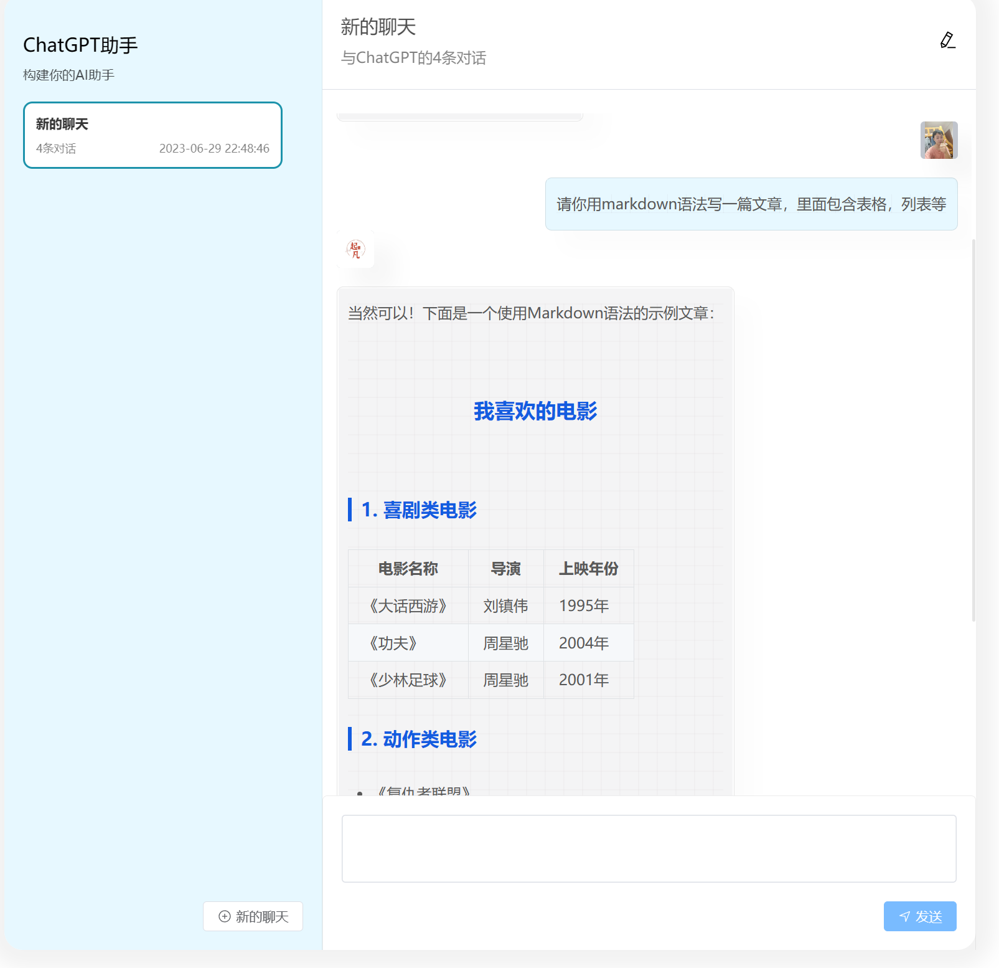
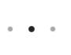
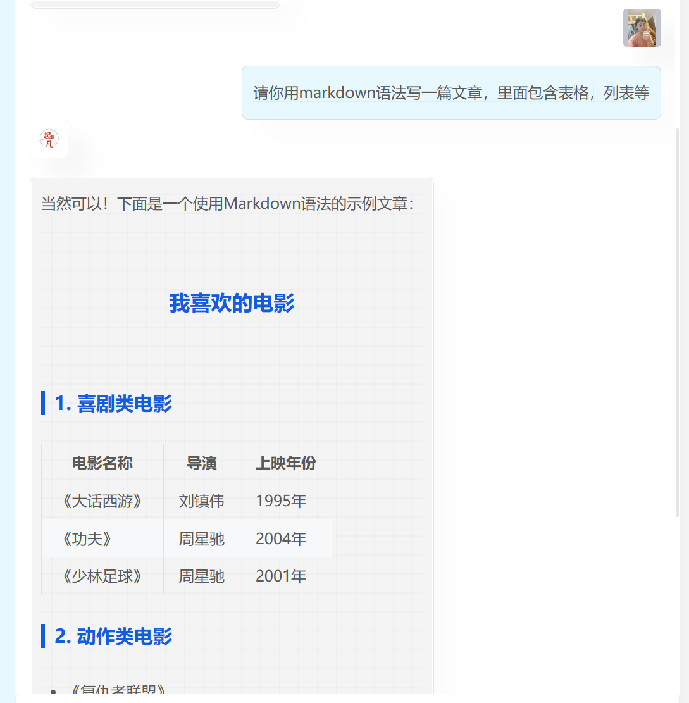
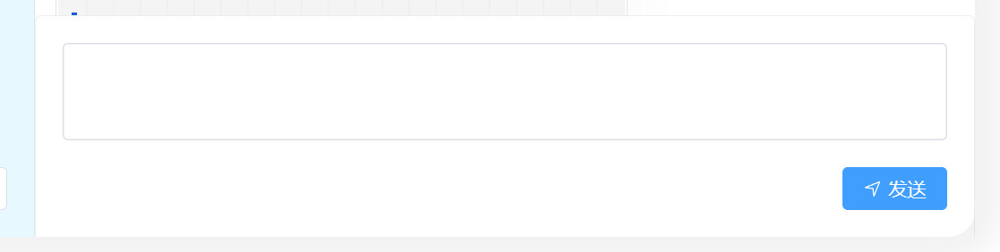

# 第十期 消息发送和markdown显示消息记录

## 本期内容

1. 消息发送和消息订阅
2. 等待回复的加载动画（`animation`+ `@keyframes`）
3. markdown 格式消息展示
4. 消息列表切换过渡（`<transition-group></transition-group>`）

<center>


图1 最终结果
</center>

## 代码实现

### 等待加载动画

当用户发送完消息等待 ChatGPT 回复的过程中有一些延迟，我们需要写一个文字加载的动画告知用户等待回复。

主要思路是创建三个黑点，然后第一个和第三个同频率的放大缩小且伴随着颜色深淡变化。第二个播放的也是同样的动画，但是慢了
0.5。这样使得整体有一种波浪感，展现出了加载的效果。

<center>


图2 加载动画
</center>

```vue

<template>
  <div class="loading">
    <!--  三个 div 三个黑点 -->
    <div></div>
    <div></div>
    <div></div>
  </div>
</template>

<style lang="scss" scoped>
.loading {
  // 三个黑点水平展示
  display: flex;
  // 三个黑点均匀分布在54px中
  justify-content: space-around;
  color: #000;
  width: 54px;
  padding: 15px;

  div {
    background-color: currentColor;
    border: 0 solid currentColor;
    width: 5px;
    height: 5px;
    // 变成黑色圆点
    border-radius: 100%;
    // 播放我们下面定义的动画，每次动画持续0.7s且循环播放。
    animation: ball-beat 0.7s -0.15s infinite linear;
  }

  div:nth-child(2n-1) {
    // 慢0.5秒
    animation-delay: -0.5s;
  }
}

// 动画定义
@keyframes ball-beat {
  // 关键帧定义，在50%的时候是颜色变透明，且缩小。
  50% {
    opacity: 0.2;
    transform: scale(0.75);
  }
  // 在100%时是回到正常状态，浏览器会自动在这两个关键帧间平滑过渡。
  100% {
    opacity: 1;
    transform: scale(1);
  }
}
</style>

```

### 聊天消息展示

<br/>
<br/>
<center>


图3 消息展示
</center>

时间格式化，后面 for 循环渲染消息组件的时候，使用的 key 是 createdAt 而不是 id。因此我们需要将 date 对象格式化成时间字符串。

```shell
npm install dayjs
```

ChatGPT 回复的消息是 Markdown 格式，如果直接显示在页面上格式会乱掉。因此我们需要引入 Markdown 编辑器来展示 ChatGPT 回复的消息。

```shell
npm install md-editor-v3
```

在 main.ts 中定义 MdPreview 和引入 markdown 样式

```ts
import {MdPreview} from "md-editor-v3";
import "md-editor-v3/lib/preview.css";

const app = createApp(App);

app
    .use(ElementPlus)
    .use(createPinia())
    .use(router)
    .component("MdPreview", MdPreview);
```

消息展示从角色上可以分为 `User`代表用户发送的消息，应该显示在右侧。角色为`Assistant`
代表 ChatGPT 回复的消息，因此显示在左侧。除了位置不同之外，头像也有差别。用户发送的消息显示用户的头像，ChatGPT 回复的消息显示的是
LOGO。

新建`home/components/MessageRow.vue`

```vue

<script lang="ts" setup>
import {PropType} from "vue";
import {ChatMessage} from "../../../../typings";

// message：接受消息对象，展示消息内容和头像，并且根据角色调整消息位置。
// avatar：用户头像，如果角色是 Assistant则使用 logo。
const props = defineProps({
  message: {type: Object as PropType<ChatMessage>, required: true},
  avatar: {type: String, default: "https://www.jarcheng.top/images/logo.jpg"},
});
</script>

<!-- 整个div是用来调整内部消息的位置，每条消息占的空间都是一整行，然后根据right还是left来调整内部的消息是靠右边还是靠左边 -->
<template>
  <div :class="['message-row', message.role === 'user' ? 'right' : 'left']">
    <!-- 消息展示，分为上下，上面是头像，下面是消息 -->
    <div class="row">
      <!-- 头像， -->
      <div class="avatar-wrapper">
        <el-avatar
            v-if="message.role === 'user'"
            :src="avatar"
            class="avatar"
            shape="square"
        />
        <el-avatar v-else :src="logo" class="avatar" shape="square"/>
      </div>
      <!-- 发送的消息或者回复的消息 -->
      <div class="message">
        <!-- 预览模式，用来展示markdown格式的消息 -->
        <MdPreview
            :id="'preview-only'"
            :preview-theme="'smart-blue'"
            :model-value="message.content"
            :style="{
            backgroundColor:
              message.role === 'user' ? 'rgb(231, 248, 255)' : '#f4f4f5',
          }"
            v-if="message.content"
        ></MdPreview>
        <!-- 如果消息的内容为空则显示加载动画 -->
        <TextLoading v-else></TextLoading>
      </div>
    </div>
  </div>
</template>

<style lang="scss" scoped>
.message-row {
  display: flex;

  &.right {
    // 消息显示在右侧
    justify-content: flex-end;

    .row {
      // 头像也要靠右侧
      .avatar-wrapper {
        display: flex;
        justify-content: flex-end;
      }

      // 用户回复的消息和ChatGPT回复的消息背景颜色做区分
      .message {
        background-color: rgb(231, 248, 255);
      }
    }
  }

  // 默认靠左边显示
  .row {
    .avatar-wrapper {
      .avatar {
        box-shadow: 20px 20px 20px 3px rgba(0, 0, 0, 0.03);
        margin-bottom: 20px;
      }
    }

    .message {
      font-size: 15px;
      padding: 1.5px;
      // 限制消息展示的最大宽度
      max-width: 500px;
      // 圆润一点
      border-radius: 7px;
      // 给消息框加一些描边，看起来更加实一些，要不然太扁了轻飘飘的。
      border: 1px solid rgba(black, 0.1);
      // 增加一些阴影看起来更加立体
      box-shadow: 20px 20px 20px 1px rgba(0, 0, 0, 0.01);
    }
  }
}

// 调整markdown组件的一些样式，deep可以修改组件内的样式，正常情况是scoped只能修改本组件的样式。
:deep(.md-editor-preview-wrapper) {
  padding: 0 10px;

  .smart-blue-theme p {
    line-height: unset;
  }
}
</style>
```

测试效果

`HomeView.vue`

```vue

<template>
  <div class="home-view">
    <div class="chat-panel">
      <!-- 省略... -->
      <div class="message-panel">
        <!-- 省略... -->
        <el-divider :border-style="'solid'"/>
        <div class="message-list">
          <MessageRow
              :message="{ content: '你好', role: 'user' } as ChatMessage"
              :avatar="'https://www.jarcheng.top/images/logo.jpg'"
          ></MessageRow>

          <MessageRow
              :message="{content:'',role:'assistant'} as ChatMessage"
          ></MessageRow>
        </div>
      </div>
    </div>
  </div>
</template>
```

### 消息输入框

<br/>
<center>


图4 消息输入框
</center>
在element-ui的文本域组件基础上，我们添加了一个发送按钮和发送事件。点击按钮时向外部发送文本域的内容并且清楚掉文本域的内容。

新建 `home/components/MessageInput.vue`

```vue

<script lang="ts" setup>
import {ref} from "vue";

// 发送消息消息事件
const emit = defineEmits<{
  send: [message: string];
}>();
// 输入框内的消息
const message = ref("");
const sendMessage = () => {
  emit("send", message.value);
  // 发送完清除
  message.value = "";
};
</script>

<template>
  <div class="message-input">
    <div class="input-wrapper">
      <!-- 按回车键发送，输入框高度三行 -->
      <el-input
          v-model="message"
          :autosize="false"
          :rows="3"
          class="input"
          resize="none"
          type="textarea"
          @keydown.enter="sendMessage"
      >
      </el-input>
      <div class="button-wrapper">
        <el-button type="primary" @click="sendMessage">
          <el-icon class="el-icon--left">
            <Position/>
          </el-icon>
          发送
        </el-button>
      </div>
    </div>
  </div>
</template>

<style lang="scss" scoped>
.message-input {
  padding: 20px;
  border-top: 1px solid rgba(black, 0.07);
  border-left: 1px solid rgba(black, 0.07);
  border-right: 1px solid rgba(black, 0.07);
  border-top-right-radius: 5px;
  border-top-left-radius: 5px;
}

.button-wrapper {
  display: flex;
  justify-content: flex-end;
  margin-top: 20px;
}
</style>
```

### 消息发送

我们发出一条消息肯定还对应着一条ChatGPT的回复消息。因此当我们发送消息时需要创建两条消息，第一条消息是我们的提问通过websocket发送给后端。第二条是ChatGPT的回复，由于websocket会把结果一个token一个token推送回来，因此我们需要订阅消息并且将每次收到的token追加到第二条消息中。

`HomeView.vue`

```vue

<script lang="ts" setup>
// 省略
// 连接后端的websocekt服务
const client = new Client({
  brokerURL: "ws://localhost:8080/handshake",
  onConnect: () => {
    // 连接成功后订阅ChatGPT回复地址
    client.subscribe("/user/queue/chatMessage/receive", (message) => {
      // 将每次回复的结果追加到回复结果中
      responseMessage.value.content += message.body;
      console.log(message.body);
    });
  },
});
// 发起连接
client.activate();
// ChatGPT的回复
const responseMessage = ref({} as ChatMessage);
const handleSendMessage = (message: string) => {
  // 新建一个ChatGPT回复对象，不能重复使用同一个对象。
  responseMessage.value = {
    role: "assistant",
    content: "",
    // 因为回复的消息没有id，所以统一将创建时间+index当作key
    createdAt: dayjs().format("YYYY-MM-DD HH:mm:ss"),
  } as ChatMessage;
  // 用户的提问
  const chatMessage = {
    session: Object.assign({}, activeSession.value),
    content: message,
    role: "user",
    createdAt: dayjs().format("YYYY-MM-DD HH:mm:ss"),
  } as ChatMessage;
  // 防止循环依赖，会导致json序列化失败
  chatMessage.session.messages = [];
  client.publish({
    destination: "/socket/chatMessage/send",
    body: JSON.stringify(chatMessage),
  });
  // 将两条消息显示在页面中
  activeSession.value.messages.push(...[chatMessage, responseMessage.value]);
};
</script>
<template>
  <div class="home-view">
    <div class="chat-panel">
      <!-- 省略... -->
      <div class="message-panel">
        <!-- 省略... -->
        <el-divider :border-style="'solid'"/>
        <div class="message-list">
          <!-- 过渡效果 -->
          <transition-group name="list">
            <message-row
                v-for="(message, index) in activeSession.messages"
                :key="message.createdAt + index"
                :avatar="activeSession.createdBy.avatar"
                :message="message"
            ></message-row>
          </transition-group>
        </div>
        <!-- 监听发送事件 -->
        <message-input @send="handleSendMessage"></message-input>
      </div>
    </div>
  </div>
</template>
<style lang="scss" scoped>
.home-view {
  // 省略...
  .chat-panel {
    // 省略...

    /* 右侧消息记录面板*/
    .message-panel {
      width: 700px;
      // 这边删除掉高度 height
      // height: 800px

      // 省略...

      .message-list {
        height: 700px;
        padding: 15px;
        // 消息条数太多时，溢出部分滚动
        overflow-y: scroll;
        // 当切换聊天会话时，消息记录也随之切换的过渡效果
        .list-enter-active,
        .list-leave-active {
          transition: all 0.5s ease;
        }

        .list-enter-from,
        .list-leave-to {
          opacity: 0;
          transform: translateX(30px);
        }
      }
    }
  }
}
</style>
```

在 app.vue 中全局修改滚动条的默认样式

```css
::-webkit-scrollbar {
    --bar-width: 5px;
    width: 5px;
    height: 5px;
}

::-webkit-scrollbar-track {
    background-color: transparent;
}

::-webkit-scrollbar-thumb {
    background-color: rgba(0, 0, 0, 0.1);
    border-radius: 20px;
    background-clip: content-box;
    border: 1px solid transparent;
}
```
