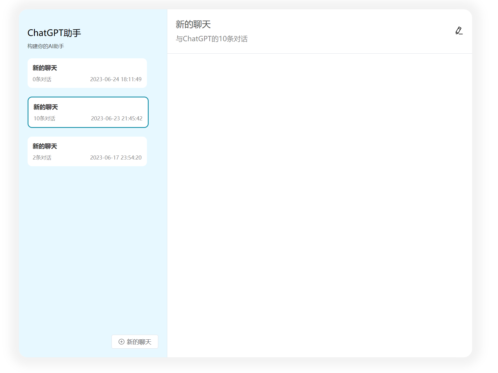
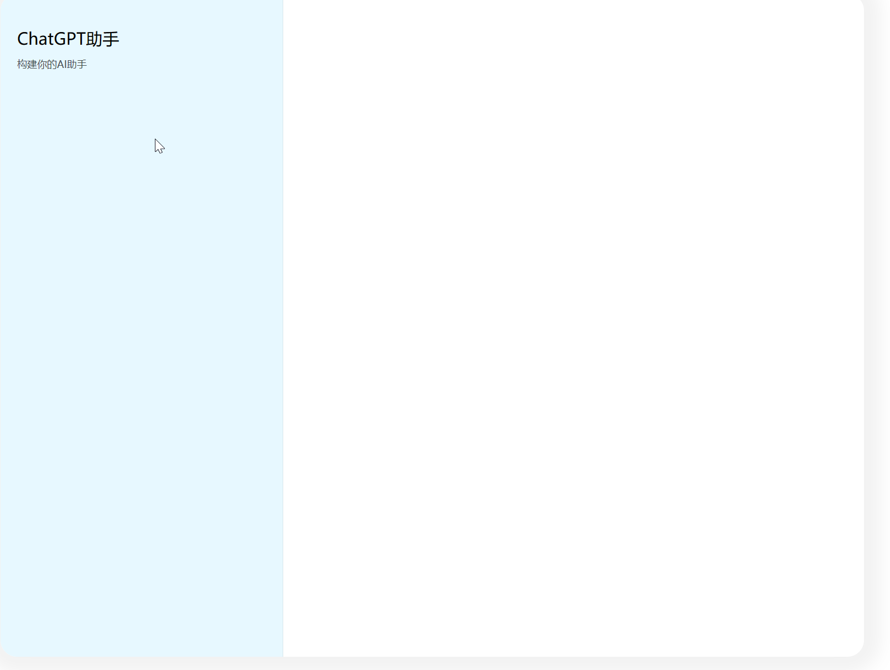
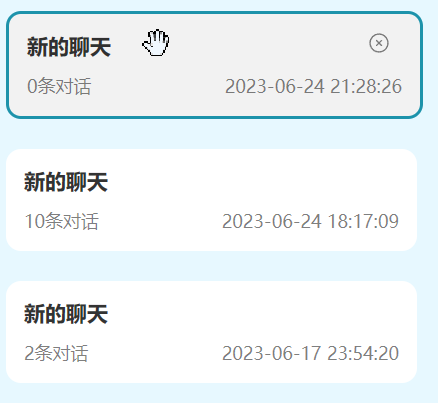
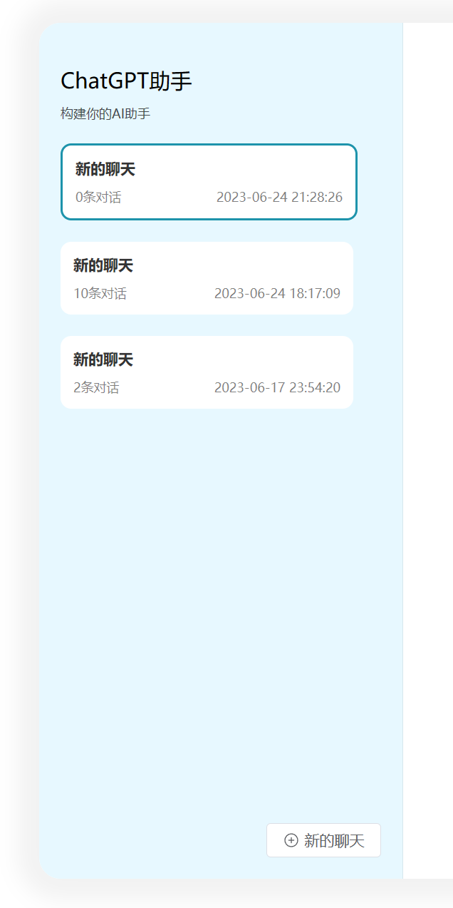
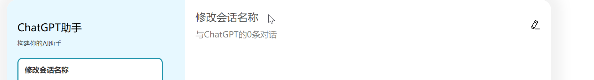
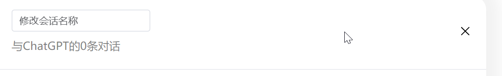

# 第九期 Vue3/ElementUI Plus 实现聊天面板

## 本期内容

详细讲述布局划分，组件抽取，一步步实现下面的结果图。左侧蓝色区域是会话列表，右侧是消息记录。蓝色区域内的一个个小卡片是聊天会话组件，在组件内定义了相关的交互，删除，点击，鼠标悬浮。

1. 点击左侧的会话，右侧的内容也会随之发生改变。
2. 鼠标放在会话上会弹出删除按钮，点击可以发起删除请求同时发送事件从会话列表中剔除该会话。
3. 点击新的聊天可以新增会话。
4. 点击右上角的修改按钮可以修改会话名称。
<div style="text-align: center;">
  
  <div>图1. 最终结果</div>
</div>

## 代码实现

### 1. 搭建聊天面板骨架

<div style="text-align: center;">
  
  <div>图2. 聊天面板骨架</div>
</div>

```vue
<template>
  <!-- 最外层页面于窗口同宽，使聊天面板居中 -->
  <div class="home-view">
    <!-- 整个聊天面板 -->
    <div class="chat-panel">
      <!-- 左侧的会话列表 -->
      <div class="session-panel">
        <div class="title">ChatGPT助手</div>
        <div class="description">构建你的AI助手</div>
      </div>
      <!-- 右侧的消息记录 -->
      <div class="message-panel"></div>
    </div>
  </div>
</template>
<style lang="scss" scoped>
.home-view {
  display: flex;
  /* 与窗口同宽 */
  width: 100vw;
  /* 水平方向上剧中 */
  justify-content: center;

  .chat-panel {
    /* 聊天面板flex布局，让会话列表和聊天记录左右展示 */
    display: flex;
    /* 让聊天面板圆润一些 */
    border-radius: 20px;
    background-color: white;
    /* 给一些阴影 */
    box-shadow: 0 0 20px 20px rgba(black, 0.05);
    /* 与上方增加一些间距 */
    margin-top: 70px;
    /* 左侧聊天会话面板*/
    .session-panel {
      background-color: rgb(231, 248, 255);
      width: 300px;
      border-top-left-radius: 20px;
      border-bottom-left-radius: 20px;
      padding: 20px;
      position: relative;
      border-right: 1px solid rgba(black, 0.07);
      /* 标题*/
      .title {
        margin-top: 20px;
        font-size: 20px;
      }
      /* 描述*/
      .description {
        color: rgba(black, 0.7);
        font-size: 10px;
        margin-top: 10px;
      }
    }
    /* 右侧消息记录面板*/
    .message-panel {
      width: 700px;
      height: 800px;
    }
  }
}
</style>
```

### 2. 聊天会话小卡片

<div style="text-align: center;">
  
  <div>图3. 会话卡片</div>
</div>
聊天会话可以封装成组件，分散首页的代码逻辑。

```vue
<script lang="ts" setup>
import { CircleClose } from "@element-plus/icons-vue";
import { ChatSession } from "../../../../typings";
import { deleteChatSession } from "@/api/chat-session";
// active：用来标记当前会话是否处于选中状态
// session：用于展示的会话信息
const prop = defineProps<{ active: boolean; session: ChatSession }>();
// 定义删除事件，当触发删除事件时会向外部发送被删除的会话。
const emit = defineEmits<{
  delete: [session: ChatSession];
}>();
// 当鼠标放到会话上时，会弹出删除图标，点击删除图标调用删除接口并发送删除事件。
const handleDeleteSession = () => {
  deleteChatSession([prop.session.id]).then((res) => {
    if (res.success) {
      // 发送删除事件
      emit("delete", prop.session);
    }
  });
};
</script>
<template>
  <!-- 如果处于激活状态则增加 active class -->
  <div :class="['session-item', active ? 'active' : '']">
    <!-- 会话的名称 -->
    <div class="name">{{ session.topic }}</div>
    <!-- 会话内的消息数量和最近修改的时间 -->
    <div class="count-time">
      <div class="count">
        {{ session.messages ? session.messages.length : 0 }}条对话
      </div>
      <div class="time">{{ session.updatedAt }}</div>
    </div>
    <!-- 当鼠标放在会话上时会弹出遮罩 -->
    <div class="mask"></div>
    <!-- 当鼠标放在会话上时会弹出删除按钮 -->
    <div class="btn-wrapper">
      <el-icon :size="15" class="close">
        <el-popconfirm
          title="是否确认永久删除该聊天会话？"
          @confirm="handleDeleteSession"
        >
          <template #reference>
            <CircleClose />
          </template>
        </el-popconfirm>
      </el-icon>
    </div>
  </div>
</template>
<style lang="scss" scoped>
.session-item {
  /* 加一下padding不要让会话内容靠边界太近 */
  padding: 12px;
  background-color: white;
  /* 给边界一些圆角看起来圆润一些 */
  border-radius: 10px;
  /* 固定宽度 */
  width: 250px;
  /* 父相子绝，父元素是相对布局的情况下，子元素的绝对布局是相当于父元素绝对布局。 */
  position: relative;
  /* 当鼠标放在会话上时改变鼠标的样式，暗示用户可以点击。目前还没做拖动的效果，以后会做。 */
  cursor: grab;
  /* 子元素的遮罩一开始会在外面，让溢出的遮罩不显示 */
  overflow: hidden;

  .name {
    /* 会话名称字体要大一些 */
    font-size: 14px;
    /* 凸显名称，加粗 */
    font-weight: 700;
    width: 200px;
    /* 加粗后颜色淡一些 */
    color: rgba(black, 0.8);
  }

  .count-time {
    /* 增加一些距离 */
    margin-top: 10px;
    /* 让字体小一些不能比会话名称要大（14px） */
    font-size: 10px;
    color: rgba(black, 0.5);
    /* 让消息数量和最近更新时间显示水平显示 */
    display: flex;
    /* 让消息数量和最近更新时间分布在水平方向的两端 */
    justify-content: space-between;
  }

  /* 当处于激活状态时增加蓝色描边 */
  &.active {
    /* 增加一些过渡 */
    transition: all 0.12s linear;
    border: 2px solid #1d93ab;
  }

  /* 当鼠标放在会话上时触发下面的css样式*/
  &:hover {
    /* 遮罩入场，从最左侧滑进去，渐渐变得不透明 */
    .mask {
      opacity: 1;
      left: 0;
    }

    .btn-wrapper {
      /* 暗示用户这个按钮可以点击 */
      &:hover {
        cursor: pointer;
      }

      /* 按钮入场，从最右侧滑进去，渐渐变得不透明 */
      opacity: 1;
      right: 20 px;
    }
  }

  .mask {
    /* 渐变样式 */
    transition: all 0.2s ease-out;
    /* 相当于父亲绝对布局 */
    position: absolute;
    background-color: rgba(black, 0.05);
    /* 和父亲元素一样宽盖住父元素 */
    width: 100%;
    /* 和父亲元素一样高 */
    height: 100%;
    /*位置移到父元素的最上面 */
    top: 0;
    /* 向父元素的最左侧再增加一个父亲元素当前宽度的距离 */
    left: -100%;
    /* 透明度为0 */
    opacity: 0;
  }
  /* 删除按钮样式的逻辑和mask类似 */
  .btn-wrapper {
    color: rgba(black, 0.5);
    transition: all 0.2s ease-out;
    position: absolute;
    top: 10px;
    right: -20px;
    z-index: 10;
    opacity: 0;

    .edit {
      margin-right: 5px;
    }
  }
}
</style>
```

### 3. 侧边会话列表展示和会话创建

点击会话列表中的会话小卡片会切换当前激活的会话。鼠标放在会话小卡片上会弹出删除按钮。点击新的聊天按钮之后会话列表会新增会话小卡片。

<center>
  
  <div>图4. 会话列表和新建会话</div>
</center>

```vue
<script lang="ts" setup>
import { onMounted, ref } from "vue";
import { ChatSession } from "../../../typings";
import {
  findChatSessionById,
  queryChatSession,
  saveChatSession,
} from "@/api/chat-session";
import SessionItem from "@/views/home/components/SessionItem.vue";
import { CirclePlus } from "@element-plus/icons-vue";

const isEdit = ref(false);
const activeSession = ref({ messages: [] } as ChatSession);
const sessionList = ref([] as ChatSession[]);
onMounted(() => {
  // 查询自己的聊天会话
  queryChatSession({ pageSize: 1000, pageNum: 1, query: {} }).then((res) => {
    // 讲会话添加到列表中
    sessionList.value.push(...res.result.list);
    // 默认选中的聊天会话是第一个
    if (sessionList.value.length > 0) {
      activeSession.value = sessionList.value[0];
    }
  });
});
// 切换会话
const handleSessionSwitch = (session: ChatSession) => {
  activeSession.value = session;
};
// 从会话列表中删除会话
const handleDeleteSession = (session: ChatSession) => {
  const index = sessionList.value.findIndex((value) => {
    return value.id === session.id;
  });
  sessionList.value.splice(index, 1);
};
// 新增会话
const handleCreateSession = async () => {
  const res = await saveChatSession({ topic: "新的聊天" });
  sessionList.value.unshift((await findChatSessionById(res.result)).result);
};
</script>
<template>
  <div class="home-view">
    <div class="chat-panel">
      <div class="session-panel">
        <!-- 省略... -->

        <!-- 会话列表 -->
        <div class="session-list">
          <!-- for循环遍历会话列表用会话组件显示，并监听点击事件和删除事件。点击时切换到被点击的会话，删除时从会话列表中提出被删除的会话。 -->
          <!--  -->
          <SessionItem
            v-for="(session, index) in sessionList"
            :key="session.id"
            :active="session.id === activeSession.id"
            :session="sessionList[index]"
            class="session"
            @click="handleSessionSwitch(session)"
            @delete="handleDeleteSession"
          ></SessionItem>
        </div>
        <div class="button-wrapper">
          <div class="new-session">
            <el-button @click="handleCreateSession">
              <el-icon :size="15" class="el-icon--left">
                <CirclePlus />
              </el-icon>
              新的聊天
            </el-button>
          </div>
        </div>
      </div>
      <!-- 省略... -->
    </div>
  </div>
</template>
<style lang="scss" scoped>
.home-view {
  /* 省略... */
  .chat-panel {
    /* 省略... */
    .session-panel {
      /* 省略... */
      .session-list {
        .session {
          /* 每个会话之间留一些间距 */
          margin-top: 20px;
        }
      }

      .button-wrapper {
        /* session-panel是相对布局，这边的button-wrapper是相对它绝对布局 */
        position: absolute;
        bottom: 20px;
        left: 0;
        display: flex;
        /* 让内部的按钮显示在右侧 */
        justify-content: flex-end;
        /* 宽度和session-panel一样宽*/
        width: 100%;

        /* 按钮于右侧边界留一些距离 */
        .new-session {
          margin-right: 20px;
        }
      }
    }
  }
  /* 省略... */
}
</style>
```

### 4. 会话编辑

未编辑状态，点击右侧按钮开始编辑。

<center>
  
  <div>图6. 未编辑状态会话名称</div>
</center>

编辑状态，可以点击右侧按钮取消编辑。也按回车键确认编辑

<center>
  
  <div>图7. 编辑状态会话名称</div>
</center>

```vue
<script lang="ts" setup>
// 省略...
import { CirclePlus, Close, EditPen } from "@element-plus/icons-vue";

// 省略...
const handleUpdateSession = () => {
  saveChatSession(activeSession.value);
  isEdit.value = false;
};
</script>
<template>
  <div class="home-view">
    <div class="chat-panel">
      <!-- 省略... -->
      <div class="message-panel">
        <!-- 会话名称 -->
        <div class="header">
          <div class="front">
            <!-- 如果处于编辑状态则显示输入框让用户去修改 -->
            <div v-if="isEdit" class="title">
              <!-- 按回车代表确认修改 -->
              <el-input
                v-model="activeSession.topic"
                @keydown.enter="handleUpdateSession"
              ></el-input>
            </div>
            <!-- 否则正常显示标题 -->
            <div v-else class="title">{{ activeSession.topic }}</div>
            <div class="description">
              与ChatGPT的{{ activeSession.messages.length }}条对话
            </div>
          </div>
          <!-- 尾部的编辑按钮 -->
          <div class="rear">
            <el-icon :size="20">
              <!-- 不处于编辑状态显示编辑按钮 -->
              <EditPen @click="isEdit = true" v-if="!isEdit" />
              <!-- 处于编辑状态显示取消编辑按钮 -->
              <Close @click="isEdit = false" v-else></Close>
            </el-icon>
          </div>
        </div>
        <el-divider :border-style="'solid'" />
      </div>
    </div>
  </div>
</template>
<style lang="scss" scoped>
.home-view {
  /* 省略... */

  .chat-panel {
    /* 省略... */

    .message-panel {
      /* 省略... */

      .header {
        padding: 20px 20px 0 20px;
        display: flex;
        /* 会话名称和编辑按钮在水平方向上分布左右两边 */
        justify-content: space-between;

        /* 前部的标题和消息条数 */
        .front {
          .title {
            color: rgba(black, 0.7);
            font-size: 20px;
          }

          .description {
            margin-top: 10px;
            color: rgba(black, 0.5);
          }
        }
        /* 尾部的编辑和取消编辑按钮 */
        .rear {
          display: flex;
          align-items: center;
        }
      }
    }
  }
}
</style>
```
