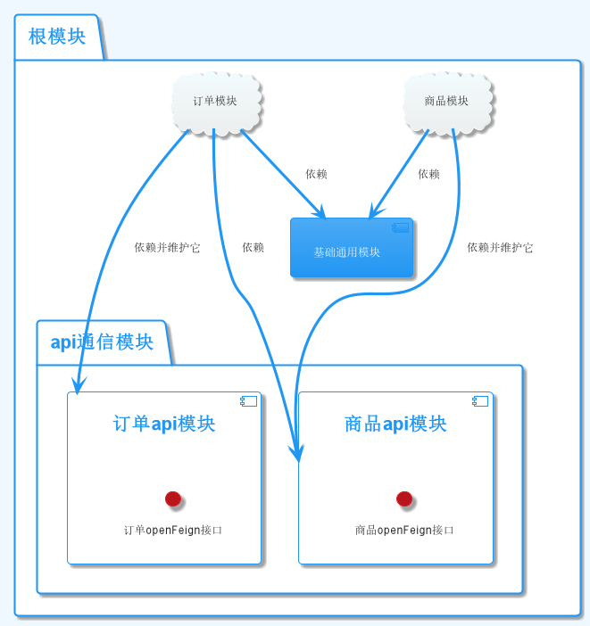
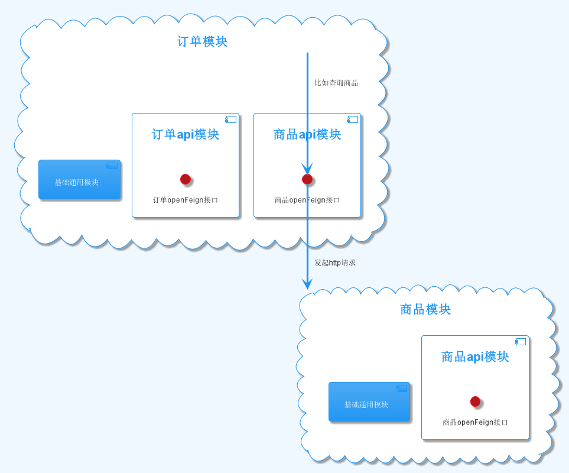

# 多模块微服务构建部署实战
## 介绍


本项目的教学目的是通过一个多模块的项目，来讲解如何搭建多模块，开发，部署。初次之外你还可以学到其他重要的后端知识。

::: tip 
知识概览
:::


1. Maven多模块构建
2. SpringBoot打包成可执行jar包
3. Docker Compose部署到Docker
4. 微服务六边形架构（领域驱动DDD）
5. JPA+QueryDsl 增删改查，动态sql，多表join
6. Java Bean Validation 数据校验
7. MapStruct业务分层间dto转化

## 1. 多模块与微服务

<iframe src="//player.bilibili.com/player.html?aid=604812922&bvid=BV1N84y1v7K7&cid=882113458&page=1" scrolling="no" border="0" frameborder="no" framespacing="0" allowfullscreen="true"  height=600 style="width:100%"></iframe>

### 1.1 多模块项目基本结构



模块类型：

1. pom类型
   负责通依赖管理和子模块管理，根模块和api通信模块属于这个类别
2. jar类型
   可执行的：订单模块，商品模块（云朵状，微服务）
   不可执行的：其他的类库

在微服务开发中，一个项目中往往有多个模块。有的模块是一个服务（云朵状模块），有的模块是公用的类库，有的模块负责管理依赖和管理子模块。

### 1.2 多模块打包

依赖图打包后，变成这样



单体应用也可以用多模块的形式开发，多模块可以将我们的通用业务逻辑分块，最后打包时合并成一个可执行的jar包

微服务项目采用多模块开发时，每个微服务都可以看成一个单体应用，最后每个微服务合并所有依赖打包成可执行的jar包。
微服务与微服务之间在jar包层面是不能互相引用的。它们之间通过openFeign远程调用（也可以是别的远程调用协议）。

## 2. 开始搭建


::: tip
开发环境
:::

1. maven3.8（需要配置镜像）
2. jdk11
3. idea2022.2（不懂激活可以问我）

- microservice-practice
    - microservice-common
    - microservice-api
        - microservice-product-api
        - microservice-order-api
    - microservice-product
    - microservice-order

### 2.1 新建项目 microservice-practice
1. 声明版本号
    ```xml
    <revision>1.0-SNAPSHOT</revision>
    ```
2. 读取版本
   ```xml
    <groupId>io.qifan.microservice</groupId>
    <artifactId>microservice-parent</artifactId>
    <version>${revision}</version>
   ```
3. 指定父亲

   ```xml

   <parent>
       <groupId>org.springframework.boot</groupId>
       <artifactId>spring-boot-starter-parent</artifactId>
       <version>2.7.5</version>
   </parent>
   ```
4. package改为`pom`

   ```xml

   <packaging>pom</packaging>
   ```
5. 管理子模块（需要子模块创建完再添加）

   ```xml

   <modules>
       <module>microservice-common</module>
       <module>microservice-api</module>z
       <module>microservice-order</module>
       <module>microservice-product</module>
   </modules>
   ```

注意：下面的模块名与artifactId同名，并且groupId与项目的groupId一致。

### 2.2 新建模块 microservice-common


1. 指定父亲模块

    ```xml
    <parent>
        <artifactId>microservice-parent</artifactId>
        <groupId>io.qifan.microservice</groupId>
        <version>${revision}</version>
    </parent>
    ```

### 2.3 新建模块 microservice-api

1. 指定父亲模块

   ```xml
    <parent>
        <artifactId>microservice-parent</artifactId>
        <groupId>io.qifan.microservice</groupId>
        <version>${revision}</version>
    </parent>
   ```

2. package改为pom

   ```xml
   <packaging>pom</packaging>
   ```

3. 管理子模块（需要子模块创建完再添加）

   ```xml

   <modules>
       <module>infrastructure-product-api</module>
       <module>infrastructure-order-api</module>
   </modules>
   ```
### 2.4 新建api子模块 microservice-product-api

1. 指定父亲模块

   ```xml
    <parent>
        <artifactId>microservice-parent</artifactId>
        <groupId>io.qifan.microservice</groupId>
        <version>${revision}</version>
    </parent>
   ```

### 2.5 新建api子模块 microservice-order-api

1. 指定父亲模块

   ```xml

    <parent>
        <artifactId>microservice-parent</artifactId>
        <groupId>io.qifan.microservice</groupId>
        <version>${revision}</version>
    </parent>
   ```

### 2.6 新建模块 microservice-product

1. 指定父亲模块

   ```xml

    <parent>
        <artifactId>microservice-parent</artifactId>
        <groupId>io.qifan.microservice</groupId>
        <version>${revision}</version>
    </parent>
   ```

2. 添加springboot打包插件

   要让这个`spring boot`模块打包之后是是可以执行，需要添加下面这个插件。

    ```xml

    <plugin>
        <groupId>org.springframework.boot</groupId>
        <artifactId>spring-boot-maven-plugin</artifactId>
    </plugin>
    ```

    注意：只有`spring boot`模块才能使用这个插件。

### 2.7 新建模块 microservice-order


**操作和上面一样**


## 3. 基础模块（microservice-common）


::: tip
通用的枚举接口
:::
```java

public interface BaseEnum {

    Integer getCode();


    String getName();
}
```
::: tip
异常枚举值
:::
```java
public enum ResultCode implements BaseEnum {
    Success(1, "操作成功"),
    Fail(0, "操作失败"),
    NotFindError(10001, "未查询到信息"),
    SaveError(10002, "保存信息失败"),
    UpdateError(10003, "更新信息失败"),
    ValidateError(10004, "数据检验失败"),
    StatusHasValid(10005, "状态已经被启用"),
    StatusHasInvalid(10006, "状态已经被禁用"),
    SystemError(10007, "系统异常"),
    BusinessError(10008, "业务异常"),
    ParamSetIllegal(10009, "参数设置非法"),
    TransferStatusError(10010, "当前状态不正确，请勿重复提交"),
    NotGrant(10011, "没有操作该功能的权限，请联系管理员");

    /**
     * code的取值规则，xx代表模块，xxx代表功能异常 例如：基础模块（10）的查询异常（001）
     */
    private Integer code;
    /**
     * 异常信息
     */
    private String name;

    ResultCode(Integer code, String name) {
        this.code = code;
        this.name = name;
    }

    @Override
    public Integer getCode() {
        return this.code;
    }

    @Override
    public String getName() {
        return this.name;
    }

    public static Optional<ResultCode> of(Integer code) {
        return Arrays.stream(ResultCode.values()).filter(resultCode -> resultCode.getCode().equals(code)).findFirst();
    }

}
```
::: tip
业务异常
:::
```java
/**
 * 业务异常，需要返回给用户看的
 */
@Data
public class BusinessException extends RuntimeException {
    ResultCode resultCode;

    public BusinessException(ResultCode resultCode) {
        super(resultCode.getName());
        this.resultCode = resultCode;
    }

    public BusinessException(ResultCode resultCode, String msg) {
        super(msg);
        this.resultCode = resultCode;
    }
}
```

::: tip
系统异常
:::

```java
/**
 * 系统异常，不需要给用户看
 */
public class SystemException extends RuntimeException {
    public SystemException(String msg) {
        super(msg);
    }
}

```


::: tip
通一返回结果
:::

```java

@Data
public class R<T> implements Serializable {
    private static final long serialVersionUID = 1L;

    private Integer code;

    private String msg;

    private T result;

    public R() {
        
    }


    private R(T result, Integer code, String msg) {
        this.result = result;
        this.code = code;
        this.msg = msg;
    }

    private R(T result, ResultCode resultCode) {
        this.result = result;
        this.msg = resultCode.getName();
        this.code = resultCode.getCode();
    }

    public static R<String> ok() {
        return new R<>("", ResultCode.Success);
    }

    public static <T> R<T> ok(T data) {
        return new R<>(data, ResultCode.Success);
    }

    public static R<String> fail(ResultCode resultCode) {
        return new R<>("", resultCode);
    }

    public static R<String> fail(ResultCode resultCode, String msg) {
        return new R<>("", resultCode.getCode(), msg);
    }

    public boolean isSuccess() {
        return Objects.equals(ResultCode.Success.getCode(), this.getCode());
    }

}
```

::: tip
基础Entity
:::

```java

/**
 * 基础的entity。
 * 有如下作用
 * 1. 每次插入前调用{@link #prePersist()}来初始化创建时间和更新时间并完成数据校验。
 * 2. 每次更新前调用{@link #preUpdate()}来初始化更新时间并完成数据校验
 * 3. id自增
 * 4. version乐观锁，并发控制
 */
@MappedSuperclass
@Getter
@Setter
@ToString
@RequiredArgsConstructor
public abstract class BaseEntity extends AbstractAggregateRoot<BaseEntity> {
    static final Validator validator = Validation.buildDefaultValidatorFactory().getValidator();


    @Id
    @GeneratedValue(strategy = GenerationType.AUTO)
    private Long id;

    @Column(name = "created_at", nullable = false, updatable = false)
    private LocalDateTime createdAt;

    @Column(name = "updated_at", nullable = false)
    private LocalDateTime updatedAt;

    @Version
    @Column(name = "version")
    private Integer version;

    @PrePersist
    public void prePersist() {
        doValidate(this);
        setCreatedAt(LocalDateTime.now());
        setUpdatedAt(LocalDateTime.now());
    }

    @PreUpdate
    public void preUpdate() {
        doValidate(this);
        this.setUpdatedAt(LocalDateTime.now());
    }

    @Override
    public boolean equals(Object o) {
        if (this == o) return true;
        if (o == null || Hibernate.getClass(this) != Hibernate.getClass(o)) return false;
        BaseEntity that = (BaseEntity) o;
        return id != null && Objects.equals(id, that.id);
    }

    @Override
    public int hashCode() {
        return getClass().hashCode();
    }

    public <T> void doValidate(T t) {
        Set<ConstraintViolation<T>> constraintViolations = validator.validate(t, Default.class);
        if (!CollectionUtils.isEmpty(constraintViolations)) {
            throw new ConstraintViolationException(constraintViolations);
        }
    }
}

```

::: tip
基础Repository
:::

```java

/**
 * 基础repository，其他实体类的repository只需继承这个类就拥有增删改查，动态sql的功能。
 * @param <T>
 */
@NoRepositoryBean
public interface BaseRepository<T> extends JpaRepository<T, Long>, JpaSpecificationExecutor<T>, QuerydslPredicateExecutor<T> {
}
```

## 4. 商品模块（microservice-product）


::: tip
知识概览
:::

1. 全局异常拦截
2. 数据校验
3. api文档
4. mapstruct
5. 函数式编程
6. jpa
   
### 4.1 JPA+QueryDsl集成


::: tip
pom依赖
:::

```xml
    <dependencies>
        <dependency>
            <groupId>org.springframework.boot</groupId>
            <artifactId>spring-boot-starter-web</artifactId>
        </dependency>
        <dependency>
            <groupId>org.springframework.boot</groupId>
            <artifactId>spring-boot-starter-test</artifactId>
        </dependency>
        <dependency>
            <groupId>mysql</groupId>
            <artifactId>mysql-connector-java</artifactId>
        </dependency>
        <dependency>
            <groupId>io.qifan.microservice</groupId>
            <artifactId>microservice-common</artifactId>
            <version>${revision}</version>
        </dependency>
        <dependency>
            <groupId>com.querydsl</groupId>
            <artifactId>querydsl-apt</artifactId>
        </dependency>
        <dependency>
            <groupId>com.querydsl</groupId>
            <artifactId>querydsl-jpa</artifactId>
        </dependency>
    </dependencies>
    <build>
        <plugins>
            <plugin>
                <groupId>org.springframework.boot</groupId>
                <artifactId>spring-boot-maven-plugin</artifactId>
            </plugin>
            <!-- queryDsl生成查询类 -->
            <plugin>
                <groupId>com.mysema.maven</groupId>
                <artifactId>apt-maven-plugin</artifactId>
                <version>1.1.3</version>
                <executions>
                    <execution>
                        <goals>
                            <goal>process</goal>
                        </goals>
                        <configuration>
                            <outputDirectory>target/generated-sources/java</outputDirectory>
                            <processor>com.querydsl.apt.jpa.JPAAnnotationProcessor</processor>
                        </configuration>
                    </execution>
                </executions>
            </plugin>
        </plugins>
    </build>
```
::: tip
spring boot启动类
:::

```java
import org.springframework.boot.SpringApplication;
import org.springframework.boot.autoconfigure.SpringBootApplication;
//TODO 出现模块依赖异常时，删掉.idea 重新打开项目
@SpringBootApplication
public class ProductApplication {
    public static void main(String[] args) {
        SpringApplication.run(ProductApplication.class, args);
    }
}
```

::: tip
package-info
:::
```java
@QueryEntities(value = {BaseEntity.class})
package io.qifan.microservice.product;

import com.querydsl.core.annotations.QueryEntities;
import io.qifan.microservice.common.jpa.BaseEntity;
```
::: tip
application.yml 配置端口
:::

```yml
server:
  port: 9000
spring:
  profiles:
    active: dev
```
::: tip
application-dev.yml 配置数据库
:::

```yml
spring:
  datasource:
    url: jdbc:mysql://localhost:3306/microservice
    username: root
    password: '123456'
    driver-class-name: com.mysql.cj.jdbc.Driver
  jpa:
    hibernate:
      ddl-auto: update
```

::: tip
商品entity
:::

entity是一个服务的核心，所有业务都是围绕entity在转。

```java
@Entity
@Table(name = "goods", indexes = @Index(columnList = "name", unique = true))
@Data
public class Goods extends BaseEntity {

    /**
     * null，""都会报错
     */
    @NotBlank(message = "商品名称不能为空")
    private String name;
    /**
     * 价格要用BigDecimal
     * 最大范围+-99999999.99
     */
    @NotNull(message = "价格不能为空")
    @DecimalMin(value = "0.01", message = "价格")
    @Column(nullable = false, precision = 10, scale = 2)
    private BigDecimal price;

    @NotBlank(message = "封面不能为空")
    private String cover;

    @NotNull(message = "库存不能为空")
    @Min(value = 0, message = "库存不能为负数")
    private Integer stock;
}

```
::: tip
商品repository 
:::

基础增删改查

```java
public interface GoodsRepository extends BaseRepository<Goods> {
}
```

::: tip
打包+编译
:::

1. 右侧maven-> microservice-parent -> lifecycle-> install
2. maven-> microservice-parent -> lifecycle-> compile

注意：需要删掉注释掉 microservice-order的 `build` 标签 

::: tip
测试
:::

依次运行下面两个测试方法。

```java
@SpringBootTest
@Slf4j
public class GoodsTest {
    @Autowired
    GoodsRepository goodsRepository;

    @Test
    public void createTest() {
        Goods goods = new Goods();
        goods.setCover("https://www.jarcheng.top/blog/qifan_logo.jpg");
        goods.setName("测试商品");
        goods.setPrice(BigDecimal.TEN);
        goods.setStock(100);
        Goods save = goodsRepository.save(goods);
        log.info("插入商品：{}", save);
    }

    @Test
    public void findByName() {
        goodsRepository.findOne(QGoods.goods.name.eq("测试商品"))
                .ifPresent((Goods goods) -> {
                    log.info(goods.toString());
                });
    }
}
```

### 4.2 MapStruct集成

在六边形架构中，应用层和外部沟通是通过dto，而和领域层是通过entity。所以在应用层我们需要将dto转成entity，把entity转成dto。

::: tip
定义概念
:::

1. request：传进来的dto
2. response：返回出去的dto
3. entity：实体类，和数据库相对应。
4. mapper：映射类，将request映射成entity或者将entity映射成response

mapstruct主要作用就是在mapper这边做映射。
::: tip
pom 导入依赖
:::

```xml
<dependency>
    <groupId>org.mapstruct</groupId>
    <artifactId>mapstruct</artifactId>
    <version>${mapstruct.version}</version>
</dependency>
```
::: tip
pom导入插件
:::

```xml
<plugin>
    <groupId>org.apache.maven.plugins</groupId>
    <artifactId>maven-compiler-plugin</artifactId>
    <version>${maven-compiler-plugin.version}</version>
    <configuration>
        <source>11</source>
        <target>11</target>
        <annotationProcessorPaths>
            <path>
                <groupId>org.mapstruct</groupId>
                <artifactId>mapstruct-processor</artifactId>
                <version>${mapstruct.version}</version>
            </path>
            <path>
                <groupId>org.projectlombok</groupId>
                <artifactId>lombok</artifactId>
                <version>${lombok.version}</version>
            </path>
            <path>
                <groupId>org.projectlombok</groupId>
                <artifactId>lombok-mapstruct-binding</artifactId>
                <version>0.2.0</version>
            </path>
        </annotationProcessorPaths>
    </configuration>
</plugin>
```

::: tip
GoodsCreateRequest 创建商品请求
:::
```java
@Data
public class GoodsCreateRequest {
    @NotBlank(message = "商品名称不能为空")
    private String name;

    @NotNull(message = "价格不能为空")
    @DecimalMin(value = "0.01", message = "价格")
    private BigDecimal price;

    @NotBlank(message = "封面不能为空")
    private String cover;

    @NotNull(message = "库存不能为空")
    @Min(value = 0, message = "库存不能为负数")
    private Integer stock;
}
```
::: tip
GoodsMapper 映射类
:::

```java
@Mapper
public interface GoodsMapper {
    GoodsMapper INSTANCE = Mappers.getMapper(GoodsMapper.class);
    Goods createRequest2Entity(GoodsCreateRequest request);
}
```

::: tip
maven编译
:::

右侧maven-> microservcie-parent -> lifecycle -> compile
::: tip
测试
:::
```java

@SpringBootTest
@Slf4j
public class GoodsDemoTest {
    @Autowired
    GoodsRepository goodsRepository;

    @Test
    public void mapperTest() {
        // 创建请求dto
        GoodsCreateRequest goodsCreateRequest = new GoodsCreateRequest();
        goodsCreateRequest.setCover("http://xxxx");
        goodsCreateRequest.setName("笔记本");
        goodsCreateRequest.setPrice(BigDecimal.TEN);
        goodsCreateRequest.setStock(10);
        log.info("转换前：{}", goodsCreateRequest);
        Goods goods = GoodsMapper.INSTANCE.createRequest2Entity(goodsCreateRequest);
        log.info("转换后：{}", goods);
        Goods save = goodsRepository.save(goods);
        log.info("entity插入到数据库：{}", save);

    }
}
``` 

### 4.3 商品增删改查

::: tip
GoodsApplication Service（应用层服务）
:::
```java
@Service
@RequiredArgsConstructor
@Slf4j
@Transactional
public class GoodsApplicationService {
    // @RequiredArgsConstructor + final 会自动注入。
    // 不需要@Autowired
    private final GoodsRepository goodsRepository;

    public Long create(GoodsCreateRequest createRequest) {
        // MapStruct，GoodsCreateRequest转成Goods(dto-> entity)
        Goods goods = GoodsMapper.INSTANCE.createRequest2Entity(createRequest);
        Goods saveResult = goodsRepository.save(goods);
        // saveResult 和 goods是同一个对象
        log.info("创建商品：{}", saveResult);
        return goods.getId();
    }

    public void update(GoodsUpdateRequest updateRequest, Long id) {
        // 这个goods肯定不为null，如果为null下面会抛出异常，就不会返回结果。
        Goods goods = goodsRepository
                // 先查找要更新的entity
                .findById(id)
                // 如果为空则抛出异常
                .orElseThrow(() -> new BusinessException(ResultCode.NotFindError));


        /*
         假设我要更新封面和价格，正常是这样写的。
         封面和价格不为空，则更新entity，然后更新数据库。
         if (StringUtils.isNotBlank(updateRequest.getCover())) {
             goods.setCover(updateRequest.getCover());
          }
         if (updateRequest.getPrice()!=null) {
            goods.setPrice(goods.getPrice());
          }
         goodsRepository.save(goods);
         显然上面这种写法很丑
        */

        // 使用mapstruct一行搞定，用更新请求去更新entity。
        GoodsMapper.INSTANCE.updateEntityFromUpdateRequest(updateRequest, goods);
        goodsRepository.save(goods);
        log.info("更新商品：{}", goods);
    }

    public GoodsResponse findById(Long id) {
        Goods goods = goodsRepository
                // 查找
                .findById(id)
                // 为空则抛出异常
                .orElseThrow(() -> new BusinessException(ResultCode.NotFindError));
        // 将entity转成response
        return GoodsMapper.INSTANCE.entity2Response(goods);
    }

    public List<GoodsResponse> findAllById(List<Long> ids) {
        // 根据多个id查询多个商品
        List<Goods> goodsList = goodsRepository.findAllById(ids);
        // 将List<Goods> -> List<GoodsResponse>
        return goodsList.stream()
                .map(GoodsMapper.INSTANCE::entity2Response)
                .collect(Collectors.toList());
    }
}
```

::: tip
GoodsController 
:::
```java 
@RestController
@RequestMapping("goods")
@RequiredArgsConstructor
public class GoodsController {
    private final GoodsApplicationService goodsApplicationService;

    @GetMapping("findById/{id}")
    public R<GoodsResponse> findById(@PathVariable Long id) {
        return R.ok(goodsApplicationService.findById(id));
    }


    @PostMapping("create")
    public R<Long> create(@RequestBody @Valid GoodsCreateRequest createRequest) {
        return R.ok(goodsApplicationService.create(createRequest));
    }

    @PostMapping("update/{id}")
    public R<String> update(@RequestBody GoodsUpdateRequest updateRequest, @PathVariable Long id) {
        goodsApplicationService.update(updateRequest, id);
        return R.ok();
    }


    @PostMapping("findAllById")
    public R<List<GoodsResponse>> findAllById(@RequestBody List<Long> ids) {
        return R.ok(goodsApplicationService.findAllById(ids));
    }
}
```
::: tip
测试
:::

测试使用idea自带的http client。

在controller中，选择要测试的接口，左侧有一个图标，点击会自动生成一个请求地址。

运行下面的测试请求
```
### 创建商品
POST http://localhost:9000/goods/create
Content-Type: application/json

{
  "name": "华为手机",
  "price": 5800,
  "cover": "http://xxx123",
  "stock": 100
}


### 根据id批量查找商品

POST http://localhost:9000/goods/findAllById
Content-Type: application/json

[49,48,46]


### 更新商品

POST http://localhost:9000/goods/update/49
Content-Type: application/json


{
  "stock": 200
}
```

### 4.4 动态查询+分页

前端查询的时候可能不加任何的过滤条件，也可能会添加部分过滤条件。
我们使用queryDsl来实现这个功能。

场景：前端想根据商品名称分页查询，也可能不要商品名称直接分页查询。
::: tip
查询请求dto
:::

这个dto是面向前端的。而后端是面向实体类。到时候需要用到mapstruct映射。
```java
@Data
public class GoodsQueryRequest {
    private String name;
}
```

::: tip
GoodsMapper
:::

新增下面的方法，做GoodsQueryRequest->Goods映射。

```java
    QueryRequest<Goods> queryRequest2Entity(QueryRequest<GoodsQueryRequest> request);

```

::: tip
domain service
:::

动态查询具有判断逻辑，可能会有拓展性，不适合放在 application service。

```java
@Service
@RequiredArgsConstructor
@Slf4j
public class GoodsService {

    /**
     * @param queryRequest（分页条件+需要过滤的条件）
     * @return
     */
    public Page<Goods> query(QueryRequest<Goods> queryRequest) {
        // 动态的过滤条件
        BooleanBuilder booleanBuilder = new BooleanBuilder();
        // 如果存在商品名称则添加这个条件
        if (StringUtils.isNotBlank(queryRequest.getQuery().getName())) {
            // 使用queryDsl（和mybatis-plus类似）
            booleanBuilder.and(QGoods
                    .goods
                    .name
                    .like("%" + queryRequest.getQuery().getName() + "%"));
        }
        // 查询
        return goodsRepository.findAll(booleanBuilder, queryRequest.toPage());
    }
}
```

::: tip
application service
:::

因为domain service是面向实体类，而外部查询请求是dto。使用需要应用层做类型装换。防止domain service被外部污染。

新增如下内容

```java
@Service
@RequiredArgsConstructor
@Slf4j
@Transactional
public class GoodsApplicationService {
    private final GoodsService goodsService;

    public PageResult<GoodsResponse> query(QueryRequest<GoodsQueryRequest> queryRequest) {
        // 将查询请求dto映射为entity
        Page<Goods> queryResult = goodsService.query(GoodsMapper.INSTANCE.queryRequest2Entity(queryRequest));

        // 这边首先将，entity映射为response。再将page映射为PageResult（因为page里面包含了很多没必要的信息，需要过滤掉）。
        return PageResult.of(queryResult
                        .toList()
                        .stream()
                        .map(GoodsMapper.INSTANCE::entity2Response)
                        .collect(Collectors.toList()),
                queryResult.getTotalElements(),
                queryResult.getSize(),
                queryResult.getNumber());
    }


}
```
::: tip
controller
:::

新增查询接口

```java

@PostMapping("query")
public R<PageResult<GoodsResponse>> query(@RequestBody QueryRequest<GoodsQueryRequest> queryRequest) {
    return R.ok(goodsApplicationService.query(queryRequest));
}
```
::: tip
测试
:::

```
### 携带过滤条件

POST http://localhost:8080/goods/query
Content-Type: application/json

{
  "page": 0,
  "pageSize": 5,
  "query": {
    "name": "笔记本"
  }
}
### 不携带过滤条件

POST http://localhost:8080/goods/query
Content-Type: application/json

{
  "page": 0,
  "pageSize": 5,
  "query": {
  }
}
###
```


### 4.5 库存的增加和减少

::: tip
GoodsStockUpdateRequest
:::

库存修改dto，先定义修改库存需要哪些参数

```java

@Data
@AllArgsConstructor
public class GoodsStockUpdateRequest {
    @NotNull(message = "商品id不能为空")
    Long goodsId;

    @NotNull(message = "购买数量不能为空")
    Integer count;
}
```

::: tip
GoodsEntity
:::

新增库存属性修改的方法。要修改entity的库存只能通过这种形式，因为通过entity提供的方法去修改，可以具有判断逻辑。而通过get set的形式需要额外写if else判断。

```java
public void decrease(Integer count) {
    stock -= count;
    if (stock < 0) {
        throw new BusinessException(ResultCode.UpdateError, "库存不足");
    }
}

public void increase(Integer count) {
    stock += count;
}
```

::: tip
GoodsService
:::

领域层service是不依赖外界的dto，它只在乎自己的entity和自己的参数。


增加下面的库存修改方法
```java
    public void decreaseStock(Long goodsId, Integer count) {
        // optional函数式编程
        Goods goods = goodsRepository
                .findById(goodsId)
                .orElseThrow(() -> new BusinessException(ResultCode.NotFindError));
        goods.decrease(count);
        goodsRepository.save(goods);
        // 记得每次增加修改删除都要打印日志
        log.info("商品id：{}，减少库存：{}，剩余库存：{}", goodsId, count, goods.getStock());
    }

    public void increaseStock(Long goodsId, Integer count) {
        Goods goods = goodsRepository
                .findById(goodsId)
                .orElseThrow(() -> new BusinessException(ResultCode.NotFindError));
        goods.increase(count);
        goodsRepository.save(goods);
        log.info("商品id：{}，增加库存：{}，剩余库存：{}", goodsId, count, goods.getStock());
    }
```
::: tip
GoodsApplicationService
:::

应用层将更新请求转成domain层需要的参数。
```java
public void increaseStock(List<GoodsStockUpdateRequest> goodsStockUpdateRequests) {
    goodsStockUpdateRequests.forEach(request -> {
        goodsService.increaseStock(request.getGoodsId(), request.getCount());
    });
}

public void decreaseStock(List<GoodsStockUpdateRequest> goodsStockUpdateRequests) {
    goodsStockUpdateRequests.forEach(request -> {
        goodsService.decreaseStock(request.getGoodsId(), request.getCount());
    });
}
```
::: tip
controller
:::
```java

    /**
     * （可以批量增加，也可以批量减少）
     * @param goodsStockUpdateRequests
     * @return
     */
    @PostMapping("stock/decrease")
    public R<String> decreaseStock(@RequestBody @Valid List<GoodsStockUpdateRequest> goodsStockUpdateRequests) {
        goodsApplicationService.decreaseStock(goodsStockUpdateRequests);
        return R.ok();
    }

    @PostMapping("stock/increase")
    public R<String> increaseStock(@RequestBody List<GoodsStockUpdateRequest> goodsStockUpdateRequests) {
        goodsApplicationService.increaseStock(goodsStockUpdateRequests);
        return R.ok();
    }
```
::: tip
测试
:::
```
### 增加10库存
POST http://localhost:8080/goods/stock/increase
Content-Type: application/json

[
  {
    "goodsId": 46,
    "count": 10
  }
]


### 减少20库存（如果库存不足会报错）


POST http://localhost:8080/goods/stock/decrease
Content-Type: application/json

[
  {
    "goodsId": 46,
    "count": 20
  }
]
```

### 4.6 openFeign服务调用

::: tip
根pom管理依赖
:::
```xml
    <dependency>
        <groupId>org.springframework.cloud</groupId>
        <artifactId>spring-cloud-dependencies</artifactId>
        <version>${cloud.version}</version>
        <type>pom</type>
        <scope>import</scope>
    </dependency>
```
::: tip
api模块pom依赖
:::
```xml
    <dependency>
        <groupId>org.springframework.cloud</groupId>
        <artifactId>spring-cloud-starter-openfeign</artifactId>
    </dependency>
```

::: tip
C:\Windows\System32\drivers\etc\hosts
:::

在文件末尾添加这两行dns
```
127.0.0.1 microservice-product
127.0.0.1 microservice-order
```


::: tip
GoodsFeignClient 
:::

其他模块引用product-api，然后调用`GoodsFeignClient`就可以发起http请求，不需要像我们之前测试那样手动填写url，再发起请求。

```java
@FeignClient(value = "goods", url = "http://microservice-product:9000", path = "goods")
public interface GoodsFeignClient {
    @PostMapping("findAllById")
    R<List<GoodsResponse>> findAllById(@RequestBody List<Long> ids);

    @PostMapping("stock/decrease")
    R<String> decreaseStock(@RequestBody List<GoodsStockUpdateRequest> goodsStockUpdateRequests);


    @PostMapping("stock/increase")
    R<String> increaseStock(@RequestBody List<GoodsStockUpdateRequest> goodsStockUpdateRequests);
}
```
::: tip
订单模块扫描FeignClient
:::

```java
@SpringBootApplication
@EnableFeignClients(basePackages = "io.qifan.microservice.api")
public class OrderApplication {
    public static void main(String[] args) {
        SpringApplication.run(OrderApplication.class, args);
    }
}
```

::: tip
测试
:::
1. 先运行ProductApplication
2. 订单模块先初始化一下（看代码）
3. 在订单模块下编写如下测试
```java
@SpringBootTest
@Slf4j
public class GoodsClientTest {
    @Autowired
    GoodsFeignClient goodsFeignClient;

    /**
     *   发起http请求去访问商品模块
     *   1. SpringCloudOpenFeign在启动时根据@EnableFeignClients(basePackages = "io.qifan.microservice.api")
     *   扫描到@FeignClient，替我们生成代理类。
     *   2. 我们调用 goodsFeignClient.findAllById() 调用代理类
     *   3. 代理类根据 @FeignClient上的url确定服务ip+端口。
     *   3.1 因为http://microservice-product:9000 这个url里面没有ip，所以发起请求时会先从本机的hosts找到有没有
     *   microservice-product对应的ip，找到有127.0.0.1，替换结果变为 http://127.0.0.1:9000
     *   4. 代理类根据@GetMapping（也可以是PostMapping等其他Mapping）确定要调用哪个路径
     *   5. 代理类根据@RequestBody，@RequestParam，@PathVariable等来确定参数格式
     *   6. 最后拼接上面的信息发起一个http请求，就像我们之前测试的时候发起http请求一样。
     */
    @Test
    public void findById() {

        R<List<GoodsResponse>> allById = goodsFeignClient.findAllById(List.of(46L, 49L));
        allById.getResult().forEach(goodsResponse -> {
            log.info(goodsResponse.toString());
        });
    }

}
```

### 4.7 全局异常拦截

业务执行过程中出现的异常，在这边统一拦截下来，然后转成统一的返回结果，返回给前端。
```java
@RestControllerAdvice
@Slf4j
public class GlobalExceptionAdvice {

    @ExceptionHandler(BusinessException.class)
    public ResponseEntity<R<String>> handleBusinessException(BusinessException e) {
        log.error("业务异常", e);
        return ResponseEntity.status(HttpStatus.BAD_REQUEST).body(R.fail(e.getResultCode()));
    }

    @ExceptionHandler(SystemException.class)
    public ResponseEntity<R<String>> handleSystemException(SystemException e) {
        log.error("系统异常", e);
        return ResponseEntity.status(HttpStatus.BAD_REQUEST).body(R.fail(ResultCode.SystemError));
    }

    @ExceptionHandler(Exception.class)
    public ResponseEntity<R<String>> handleException(Exception e) {
        log.error("系统异常", e);
        return ResponseEntity.status(HttpStatus.BAD_REQUEST).body(R.fail(ResultCode.SystemError));
    }

    @ExceptionHandler(ConstraintViolationException.class)
    public ResponseEntity<R<String>> handleValidateException(ConstraintViolationException e) {
        log.warn("校验异常", e);
        // 不合格的字段，可能有多个，只需要返回其中一个提示用户就行
        // 比如密码为空
        ArrayList<ConstraintViolation<?>> constraintViolations = new ArrayList<>(e.getConstraintViolations());
        return ResponseEntity.status(HttpStatus.BAD_REQUEST)
                .body(R.fail(ResultCode.ValidateError, constraintViolations.get(0).getMessage()));

    }

    @ExceptionHandler(MethodArgumentNotValidException.class)
    public ResponseEntity<R<String>> handleValidateException(MethodArgumentNotValidException e) {
        log.warn("校验异常", e);
        // 不合格的字段，可能有多个，只需要返回其中一个提示用户就行
        // 比如密码为空
        List<FieldError> fieldErrors = e.getFieldErrors();
        FieldError fieldError = fieldErrors.get(0);
        return ResponseEntity.status(HttpStatus.BAD_REQUEST)
                .body(R.fail(ResultCode.ValidateError, fieldError.getDefaultMessage()));

    }
}
```

## 5. 订单模块
### 5.1 订单领域层
::: tip
知识概览
:::
1. 聚合根（`Aggregates`）
2. 使用`Converter`在java和数据库之间转换类型。
3. jpa join查询
4. 使用值对象（`Value Object`）来明确字段语义和数据校验

::: tip
订单项
:::
```java
@Data
@Table(name = "base_order_item")
@Entity
public class BaseOrderItem extends BaseEntity {

    @NotNull(message = "商品id不能为空")
    private Long goodsId;

    @NotNull(message = "数量不能为空")
    private Integer count;

 
    // 商品是java对象，在数据库是json类型，插入到数据库时需要转换一下。
    @Convert(converter = ProductConverter.class)
    @Column(columnDefinition = "json", nullable = false)
    private GoodsResponse goods;
}

```
::: tip
订单聚合根
:::

实际的业务中，一个订单包含多个订单项（1对多）。所以`OrderItem`通过外键关联`BaseOrder`。同时一个订单还会关联用户，优惠券等信息，本案例没体现。

这种实体类就是聚合根了。它关联了许多相关实体。
```java
@Entity
@Table(name = "base_order")
@Getter
@Setter
@ToString(callSuper = true)
@RequiredArgsConstructor
public class BaseOrder extends BaseEntity {

    @NotNull(message = "订单金额不能为空")
    @Column(precision = 12, scale = 2)
    private BigDecimal totalAmount;

    @NotNull(message = "账户id不能为空")
    private Long accountId;

    // 插入订单也会同时插入订单项，查询订单时也会自动join查出订单项。
    @OneToMany(fetch = FetchType.EAGER, cascade = CascadeType.ALL)
    // 在订单项表生成外键base_order_id，关联本表的主键。
    // 订单项实体类不需要base_order_id这个字段，这边会自动生成这个字段。
    @JoinColumn(name = "base_order_id")
    @Size(min = 1, message = "购买商品不能为空")
    private List<BaseOrderItem> itemList;

    // 订单状态是java枚举类型，在数据库是int类型，插入到数据库时需要转换一下。
    @Convert(converter = OrderStateConverter.class)
    @NotNull(message = "订单状态不能为空")
    private OrderState orderState;

    // 创建时的初始化操作由实体类本身去操作，不需要外部去set
    public void create() {
        totalAmount = BigDecimal.ZERO;
        orderState = OrderState.UNPAID;
    }
}
```
::: tip
订单状态值对象
:::

想象一下如果我们不用值对象来标识订单状态，单单一个`Integer`类型来标识。
有如下缺点：
1. 语义不清晰，除了开发这个功能的人，其他人都难以明白每个值的含有，以及有多少取值。甚至开发者到后面自己都晕了（没错就是我了T_T）
2. 需要额外的校验逻辑，整数的取值很大，需要判断整数取值是否超出了范围。

使用值对象虽然没有上面的缺点，但是它也有自己的的缺点
如下：
1. 需要编写转换器来在数据库和dto之间转换，工作量提升。


```java
@RequiredArgsConstructor
public enum OrderState implements BaseEnum {
    UNPAID(0, "待支付"),
    PAID(1, "已支付"),
    CANCELED(-1, "已取消");


    final Integer code;

    final String name;

    @Override
    public Integer getCode() {
        return code;
    }

    @Override
    public String getName() {
        return name;
    }

    // 根据code找到枚举对象
    public static Optional<OrderState> of(Integer code) {
        return Arrays.stream(OrderState.values())
                .filter(resultCode -> resultCode.getCode().equals(code))
                .findFirst();
    }
}
```
::: tip
Converter 转换器
:::
当实体类中存在自定义的java对象时，无法直接保存到数据库。这时需要编写转换器。

Converter与Mapper类似，一个解决的是entity与数据库的字段映射，一个解决的是entity与dto的字段映射。

**订单状态转换器**
```java
@Converter
public class OrderStateConverter implements AttributeConverter<OrderState, Integer> {

    /**
     * 这个映射在 实体类 -> 数据库和实体类 -> Response时都可以用。
     * 订单状态枚举类型-> 整数类型
     */
    @Override
    public Integer convertToDatabaseColumn(OrderState orderState) {
        return orderState.getCode();
    }
    /**
     * 这个映射在 数据库 -> 实体类和Request -> 实体类时都可以用。
     * 整数类型 -> 订单状态枚举类型
     */
    @Override
    public OrderState convertToEntityAttribute(Integer integer) {
        return OrderState.of(integer).orElseThrow(()->new SystemException("订单状态反序列化异常"));
    }
}
```

**商品转换器**
```java
@Converter
public class ProductConverter implements AttributeConverter<GoodsResponse, String> {

    /**
     * 数据库里面product这个字段是string类型，而java里面这个字段是GoodsResponse
     * GoodsResponse序列化成json字符串
     *
     * @param attribute 实体类需要转换的字段
     * @return json字符串
     */
    @Override
    public String convertToDatabaseColumn(GoodsResponse attribute) {
        try {
            return JacksonObject.objectMapper.writeValueAsString(attribute);
        } catch (JsonProcessingException e) {
            throw new BusinessException(ResultCode.SystemError, "商品详情转json异常");
        }
    }

    /**
     * 数据库里面product这个字段是string类型，而java里面这个字段是GoodsResponse
     * json字符串反序列化成GoodsResponse
     *
     * @param dbData 数据库里面的json字符串
     * @return GoodsResponse对象
     */
    @Override
    public GoodsResponse convertToEntityAttribute(String dbData) {
        try {
            return JacksonObject.objectMapper.readValue(dbData, GoodsResponse.class);
        } catch (JsonProcessingException e) {
            throw new BusinessException(ResultCode.SystemError, "json转商品详情异常");
        }
    }
}
```
::: tip
OrderRepository
:::
```java
public interface BaseOrderRepository extends BaseRepository<BaseOrder> {
}
```

::: tip
测试
:::

场景：小明提交了一个订单，订单里面由两个商品。小明也可以查看自己的订单。

```java
@SpringBootTest
@Slf4j
public class OrderTest {
    @Autowired
    BaseOrderRepository baseOrderRepository;
    @Autowired
    GoodsFeignClient goodsFeignClient;

    @Test
    public void saveTest() {
        GoodsResponse goods1 = new GoodsResponse();
        goods1.setId(40L);
        goods1.setCover("http://xxxx");
        goods1.setName("笔记本");
        goods1.setPrice(BigDecimal.valueOf(4000));
        goods1.setStock(10);

        GoodsResponse goods2 = new GoodsResponse();
        goods2.setId(41L);
        goods2.setCover("http://xxxx");
        goods2.setName("鼠标");
        goods2.setPrice(BigDecimal.valueOf(100));
        goods2.setStock(10);

        // 购买了一台笔记本
        BaseOrderItem baseOrderItem1 = new BaseOrderItem();
        baseOrderItem1.setGoods(goods1);
        baseOrderItem1.setCount(1);
        baseOrderItem1.setGoodsId(goods1.getId());

        // 购买了两个鼠标
        BaseOrderItem baseOrderItem2 = new BaseOrderItem();
        baseOrderItem2.setGoods(goods2);
        baseOrderItem2.setCount(2);
        baseOrderItem2.setGoodsId(goods2.getId());

        // 订单关联两个订单项
        BaseOrder baseOrder = new BaseOrder();
        // 初始化操作
        baseOrder.create();
        baseOrder.setAccountId(1L);
        baseOrder.setTotalAmount(BigDecimal.valueOf(4200));
        baseOrder.setItemList(List.of(baseOrderItem1, baseOrderItem2));

        baseOrderRepository.save(baseOrder);
        log.info("订单：{}，创建成功", baseOrder);
    }

    @Test
    void findTest() {
        // 查询小明的订单
        baseOrderRepository.findAll(QBaseOrder.baseOrder.accountId.eq(1L)).forEach(baseOrder -> {
            log.info(baseOrder.toString());
        });

    }
}
```

### 5.2 订单创建
上节的订单创建案例比较简单，没有商品查询和价格核算，也不是http请求。

这节我们通过http发起请求来创建一个订单
::: tip
订单项mapper
:::
```java
@Mapper
public interface BaseOrderItemMapper {
  BaseOrderItemMapper INSTANCE = Mappers.getMapper(BaseOrderItemMapper.class);

  BaseOrderItem createRequest2Entity(BaseOrderItemCreateRequest request);

  BaseOrderItemResponse entity2Response(BaseOrderItem entity);
}
```
::: tip
基础订单mapper
:::

可以看见，基础订单mapper使用了订单项mapper。因为`BaseOrder`实体类的`itemList`字段类型是`List<BaseOrderItem>`，而`BaseOrderCreateRequest`的`itemList`字段类型是`
List<BaseOrderItemCreateRequest>`。

`BaseOrderItemCreateRequest`-> `BaseOrderItem`的映射`BaseOrderItemMapper`里面已经有了，所以直接使用就行。

```java
@Mapper(
        uses = {BaseOrderItemMapper.class, OrderStateConverter.class}
)
public interface BaseOrderMapper {
    BaseOrderMapper INSTANCE = Mappers.getMapper(BaseOrderMapper.class);

    BaseOrder createRequest2Entity(BaseOrderCreateRequest request);

    BaseOrderResponse entity2Response(BaseOrder entity);
}
```
::: tip
订单应用层service
:::

应用层的订单创建主要是流程编排。可以看见下面的create方法不包含任何逻辑，就是按流程来创建订单。
```java
@Service
@RequiredArgsConstructor
@Slf4j
@Transactional
public class OrderApplicationService {
    private final BaseOrderService baseOrderService;
    private final BaseOrderRepository baseOrderRepository;

    public Long create(BaseOrderCreateRequest createRequest) {
        BaseOrder baseOrder = BaseOrderMapper.INSTANCE.createRequest2Entity(createRequest);
        // 订单初始话操作
        baseOrder.create();
        // 价格计算，扣减库存
        baseOrderService.computePrice(baseOrder);
        // 插入订单到数据库，同时插入订单项到数据库
        baseOrderRepository.save(baseOrder);
        log.info("创建订单：{}", baseOrder);
        return baseOrder.getId();

    }
}
```
::: tip
领域层订单service
:::
```java
@Service
@RequiredArgsConstructor
@Slf4j
public class BaseOrderService {
    private final GoodsFeignClient goodsFeignClient;


    public void computePrice(BaseOrder baseOrder) {
        List<Long> goodsIds = baseOrder
                .getItemList()
                .stream()
                .map(BaseOrderItem::getGoodsId)
                .collect(Collectors.toList());
        // 调用商品服务查询信息
        List<GoodsResponse> result = goodsFeignClient.findAllById(goodsIds).getResult();
        // 计算价格
        for (int i = 0; i < result.size(); i++) {
            GoodsResponse goods = result.get(i);
            BaseOrderItem baseOrderItem = baseOrder.getItemList().get(i);
            // 设置商品详情
            baseOrderItem.setGoods(goods);
            // 计算价格
            // 商品单价*数量
            BigDecimal itemPrice = goods.getPrice().multiply(BigDecimal.valueOf(baseOrderItem.getCount()));
            // 累加
            baseOrder.setTotalAmount(baseOrder.getTotalAmount().add(itemPrice));
        }
        log.info("总价格：{}", baseOrder.getTotalAmount());
        List<GoodsStockUpdateRequest> goodsStockUpdateRequests = baseOrder.getItemList()
                .stream()
                // 得到要扣减的商品id和扣除数量
                .map(item -> new GoodsStockUpdateRequest(item.getGoodsId(), item.getCount()))
                .collect(Collectors.toList());
        // 调用商品服务扣减库存
        goodsFeignClient.decreaseStock(goodsStockUpdateRequests);
        log.info("计算价格，并扣减库存。商品购买详情：{}", baseOrder.getItemList());
    }
}

```

::: tip
controller
:::

```java
@RestController
@RequestMapping("order")
@RequiredArgsConstructor
public class OrderController {
    private final OrderApplicationService orderApplicationService;

    private final BaseOrderRepository baseOrderRepository;

    @PostMapping("create")
    public R<Long> create(@RequestBody BaseOrderCreateRequest createRequest) {
        return R.ok(orderApplicationService.create(createRequest));
    }

    @PostMapping("query")
    public R<PageResult<BaseOrderResponse>> query(@RequestBody QueryRequest<BaseOrderQueryRequest> queryRequest) {
        BooleanBuilder booleanBuilder = new BooleanBuilder();
        if (queryRequest.getQuery().getAccountId() != null) {
            booleanBuilder.and(QBaseOrder.baseOrder.accountId.eq(queryRequest.getQuery().getAccountId()));
        }
        if (queryRequest.getQuery().getOrderState() != null) {
            booleanBuilder.and(QBaseOrder.baseOrder.orderState.eq(OrderState.of(queryRequest.getQuery().getOrderState())));

        }
        Page<BaseOrder> all = baseOrderRepository.findAll(booleanBuilder, queryRequest.toPage());
        return R.ok(PageResult.of(all
                        .getContent()
                        .stream()
                        .map(BaseOrderMapper.INSTANCE::entity2Response)
                        .collect(Collectors.toList()),
                all.getTotalElements(),
                all.getSize(),
                all.getNumber()));
    }
}
```

::: tip
测试
:::
```
### 创建订单
POST http://localhost:9001/order/create
Content-Type: application/json

{
  "accountId": 1,
  "itemList": [
    {
      "goodsId": 48,
      "count": 2
    },
    {
      "goodsId": 49,
      "count": 1
    }
  ]
}

### 查询订单

POST http://localhost:9001/order/query
Content-Type: application/json

{
  "page": 0,
  "pageSize": 5,
  "query": {
    "accountId": 1,
    "orderState": 0
  }
}
```


## 6. 六边形架构


### 6.1 领域层（`domain`）
领域层是真正的逻辑实现层，将一个复杂逻辑打碎层一个个domian。再通过应用层将一个个单一逻辑领域编排组合成一个应用来提供服务。

1. 基本的实体类（`Entity`）和数据库相对应
2. 实体类里面的复杂属性又可以抽象出值对象（`Value Object`）
3. 聚合根（`Aggregates`），在实际业务中，有些表往往管理许多子表。那这种实体就是聚合根。我们希望查聚合根时可以直接查出相关对象，插入聚合根时能同时在子表插入数据。聚合根提高我们的逻辑内聚。
4. 领域事件（`Domain Event`）。当我们创建一个订单时，我们可能还需要做一些后续从操作，这些操作具有拓展性，甚至这些操作不在本服务。这个时候就需要用到领域事件（观察者模式），来做逻辑上的解耦。
5. 领域服务（`Domain Service`）。领域服务只专注与实体类上的单一逻辑，这个逻辑可能会涉及到几个相关的实体类。像创建一个聚合根时，往往需要同时创建其他的实体。

### 6.2 应用层（`Application`）
应用层又称用例，用例是外部最关系的概念，因为它意味着功能。所以应用层的作用是将多个逻辑组合成一个用例与外部交互。所以总的来说应用层是走一个逻辑的流程，而不去实现逻辑。

1. 处理controoler调用，做类型转换，将dto转成entity，让`domain service`去实现逻辑。
2. 处理复杂逻辑时，组合多个`domain service`去实现。
3. 不依赖其他`application service`

### 6.3 基础设施层（`Infrastructure`）

圆圈外围的右半部分。

基础设施层一般就是配置，中间件的实现等。
### 6.4 端口（`Port`）
应用层使用基础层的提供的能力通过`port`，在我们的代码里面其实就是接口。比如`GoodsRepository`。如果操作redis，那`RedisTemplate`就是端口。对于应用层它不需要去实现这些基础层的接口，它只需要使用接口。

### 6.5 外部接口（`Interface`）
圆圈外围的左半部分。

将应用层的能力暴露给外部的就叫interface（和java的interface不是一个意思），我们熟悉的controller就是interface。除此之外还有rabbitmq监听消息也算这一层。

总之外部调用应用层的都是这一层，不管调用是来自前端页面还是后台管理员还是服务内部调用。
### 6.6 `Querys`和`Commands`

外部的调用分为查询（query）和增删改（command），查询是可以跳过应用层和领域层，直接调用repository查询。
调用如果是增删改类型则需要走应用层和领域层。


## 7. docker 部署
### 7.1 制作镜像


::: tip
打包
:::
   
右侧maven -> microservice-parent -> install

::: tip
 microservice-product/Dockerfile
:::
   
编写dockerfile，生成自己的docker镜像。
```docker
# 基础镜像是jdk11
FROM openjdk:11
# 作者的信息，可以不填
MAINTAINER http://www.jarcheng.top/blog
# 注意这里，这个地方访问的是build时指定的资源路径。而不是当前文件夹下的文件。
# 将资源路径内的的jar包夹复制到镜像内并且重命名为app.jar。
COPY microservice-product-1.0-SNAPSHOT.jar app.jar
# 镜像实例化，即启动容器后的运行命令，我们这边就是启动服务
ENTRYPOINT ["java","-jar", "/app.jar"]
```
::: tip
生成镜像
:::
   
运行下面命令时，`docker deamon` 依据`Dockerfile`生成镜像。

```
docker build -f ./Dockerfile -t microservice-product:1.0  ./target
```

1. 指定资源路径，我们这边用的是`'./target'`。
2. 指定`Dockerfile` 路径，dockerfile里面描述了构建镜像的步骤。
3. 指定镜像名字，生成的镜像后如何命名通过`-t`指定。`':'`的前是面镜像名称，后面是版本号。

### 7.2 运行容器

```
docker run -p 9000:9000 ^ 
-e spring.profiles.active=prod ^
-d ^
--name product ^
microservice-product:1.0
```

1. `-p` 指定本机端口号到容器端口的映射。
2. `-e` 指定环境变量。修改配置文件的。我们这边修改的是springboot的`spring.profiles.active=prod`。
3. `-d` 代表后台运行
4. `--name` 指定容器名称
5. 最后面`microservice-product:1.0`代表镜像名称

镜像相当于java的类，容器相当于java的对象。一个镜像可以实例化多个容器。

注意：
1. `-`是`--`的缩写，即`-p`=`--port`。
2. 本小节的容器启动会报错，因为springboot找不到mysql。

### 7.3 Mysql容器

```
docker run -p 3308:3306 ^
-d ^
--name mysql8 ^
-e MYSQL_ROOT_PASSWORD=qifan123. ^
-e TZ=Asia/Shanghai  ^
-e MYSQL_DATABASE=microservice ^
-v mysql-data:/var/lib/mysql ^
mysql:8.0.26 ^
mysqld --character-set-server=utf8mb4 --collation-server=utf8mb4_unicode_ci
```
1. `-p`，因为我本地的mysql已经占用了3306，所以mysql容器的3306映射到本机的3308端口。
2. `-d`，后台启动。
3. `--name`，指定容器名称
4. `-e`，`MYSQL_ROOT_PASSWORD=qifan123`指定root密码，
   `MYSQL_DATABASE=microservice` 指定mysql启动后自动创建microservice数据库，`TZ=Asia/Shanghai` 指定mysql的时区。
5. `-v`，持久化数据。`mysql-data:/var/lib/mysql`，将容器内的`/var/lib/mysql`的文件映射到docker deamon的`mysql-data`数据卷内。为mysql的数据都是存在`/var/lib/mysql`中，即使把mysql容器删了，`mysql-data`内依然存有数据。这样即使重启容器数据也不会丢失。
6. `mysql:8.0.26`，容器要使用的镜像。
7. `mysqld`，容器启动后可以选择额外的命令操作。我们这边是mysql启动后，执行`mysqld --character-set-server=utf8mb4 --collation-server=utf8mb4_unicode_ci`，将mysql的字符集指定为utf8。

### 7.4 多容器连接
容器默认情况下与本机不在同一个网络下，不像我们开发环境那样可以通过localhost互相访问。所以我们可以创建一个虚拟网络，让相关的容器在同一个网络下，他们就可以彼此访问了。

1. 创建桥接网络 `docker network create microservice`。
2. mysql运行命令添加`--network=microservice --network-alias=microservice-mysql`，然后运行。让mysql容器加入`microservice`网络，并且域名是`microservice-mysql`。这样商品服务容器可以通过`microservice-mysql`找到mysql容器的ip地址。
3. 商品容器添加运行命令,`--network=microservice --network-alias=microservice-product`，然后运行。
### 7.5 总流程

::: tip
创建网络
:::
```
docker network create microservice
```
::: tip
运行mysql容器（远程拉取镜像）。
:::

```
docker run -p 3308:3306 -d  --name mysql8 ^
-e MYSQL_ROOT_PASSWORD=qifan123. ^
-e TZ=Asia/Shanghai  ^
-e MYSQL_DATABASE=microservice ^
-v mysql-data:/var/lib/mysql ^
--network=microservice ^ --network-alias=microservice-mysql ^
mysql:8.0.26 ^
mysqld --character-set-server=utf8mb4 --collation-server=utf8mb4_unicode_ci
```

::: tip
构建商品服务镜像（在microservice-product下运行）
:::

```
docker build -f ./Dockerfile -t microservice-product:1.0  ./target
```
::: tip
构建订单服务镜像（在microservice-order下运行）
:::

```
docker build -f ./Dockerfile -t microservice-order:1.0  ./target
```


::: tip
启动商品服务容器
:::

```
docker run -p 9000:9000 ^
-e spring.profiles.active=prod ^
-d ^
--network=microservice ^
--network-alias=microservice-product ^
--name product ^
microservice-product:1.0
```


::: tip
启动订单服务容器
:::

```
docker run -p 9001:9001 ^
-e spring.profiles.active=prod ^
-d ^
--network=microservice ^
--network-alias=microservice-order ^
--name order ^
microservice-order:1.0
```


### 7.6 拓展docker compose一次性部署
::: tip
microservice-practice/docker-compose
:::
```yml
version: "3.9"
services:
  microservice-mysql:
    # 镜像名称
    image: mysql:8.0.26
    # 相当于 --name
    container_name: microservice-mysql
    # 相当于多个 -e
    environment:
      MYSQL_ROOT_PASSWORD: qifan123.
      TZ: Asia/Shanghai
      MYSQL_DATABASE: microservice
    # 相当于 -p
    ports:
      - "3308:3306"
    # 相当于 -v
    volumes:
      - microservice-mysql-data:/var/lib/mysql
    # 容器启动后执行下面这个命令
    command: [ 'mysqld', '--character-set-server=utf8mb4', '--collation-server=utf8mb4_unicode_ci' ]
  microservice-order:
    image: qifan/microservice-order:1.0
    # 如果本地找不到镜像就build一下。这个build是当image找不到时才执行。
    build:
      # 指定context在tartget目录下
      context: microservice-order/target
      # 和 -f 不同的是，dockerfile这个属性的值必须相当于context路径
      # context在target目录，所以'..'是target的上级目录
      dockerfile: ../Dockerfile
    container_name: microservice-order
    environment:
      spring.profiles.active: prod
    ports:
      - "9001:9001"
    depends_on:
      - microservice-mysql
  microservice-product:
    image: qifan/microservice-product:1.0
    # 如果本地找不到镜像就build一下。
    build:
      context: microservice-product/target
      dockerfile: ../Dockerfile
    container_name: microservice-product
    environment:
      spring.profiles.active: prod
    ports:
      - "9000:9000"
    depends_on:
      - microservice-mysql
volumes:
  microservice-mysql-data: { }
```

注意：因为同一个`services`下的`service`默认都在同一个网络下，所以不需要再创建桥接网络。每个service的名字就是它们在这个网络内的域名例如`microservice-mysql`。