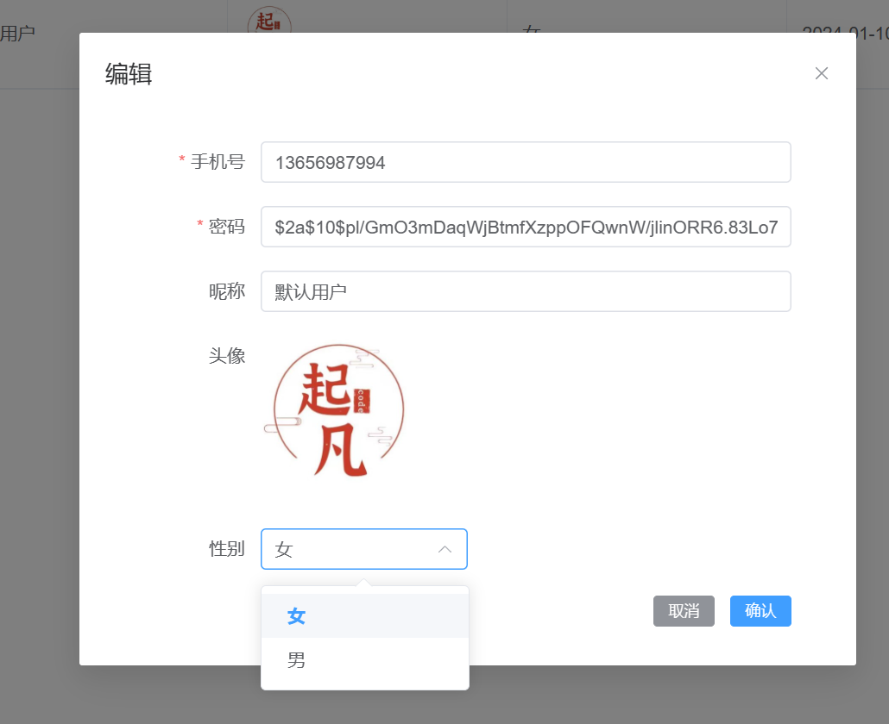
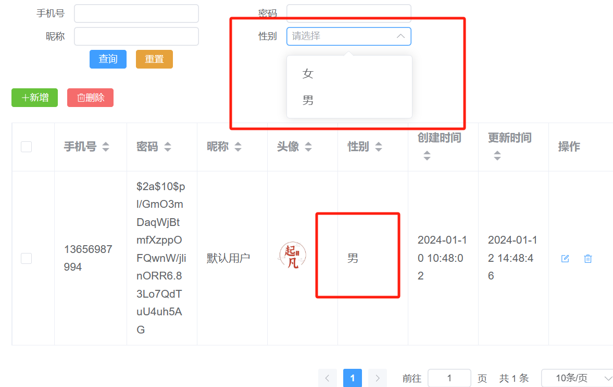

# 字典管理

相信大家都有在代码中使用枚举类的情况。比如下面的用户性别。

```java
@Getter
public enum Gender{
    MALE,
    FEMALE,
    ;
}
```

在后端定义完枚举，前端也需要定义同样的下拉框用于创建或者修改用户的性别。

```vue
<script lang="ts" setup>
import { ref } from 'vue'

const genderList = ref([
  { label: '男', value: 'MALE' },
  { label: '女', value: 'FEMALE' }
])
</script>
<template>
  <div>
    <el-select>
      <el-option
        v-for="gender in genderList"
        :key="gender.value"
        :label="gender.label"
        :value="gender.value"
      >
      </el-option>
    </el-select>
  </div>
</template>

<style lang="scss" scoped></style>
```

当在表格中显示用户的信息时，还需要将用户的性别翻译成中文。

```ts
const genderTranslate = (value: string) => {
  const gender = genderList.value.find((item) => item.value == value)
  return gender ? gender.label : ''
}
// 将MALE翻译成中文
genderTranslate('MALE')
```

每次增加一个字典都需要增加这么多的代码，并且可能多个地方都需要使用这样的重复劳动不仅增加了代码的冗余也增加了维护的难度。

因此下面介绍一种字典管理+代码生成的形式来同步前后的枚举。

## 字典表

```sql
create table dict
(
    id           varchar(36)  not null
        primary key,
    created_time datetime(6)  not null,
    edited_time  datetime(6)  not null,
    creator_id   varchar(36)  not null,
    editor_id    varchar(36)  not null,
    key_id       int          not null,
    key_en_name  varchar(255) not null,
    key_name     varchar(36)  not null,
    dict_id      int          not null,
    dict_name    varchar(36)  not null,
    dict_en_name varchar(255) not null,
    order_num    int          not null,
    constraint dict_pk
        unique (key_id, dict_id)
);
```

## 定义实体类

```java
@Entity
@GenEntity
public interface Dict extends BaseEntity {

  @GenField(value = "值编号", order = -1)
  @Key
  int keyId();

  @GenField(value = "值名称", order = 0)
  String keyName();

  @GenField(value = "值英文名称", order = 1)
  String keyEnName();

  @GenField(value = "字典编号", order = 2)
  @Key
  int dictId();

  @GenField(value = "字典名称", order = 3)
  String dictName();

  @GenField(value = "字段英文名称", order = 4)
  String dictEnName();

  @GenField(value = "排序号", order = 5)
  int orderNum();
}
```

## 生成代码

运行`mall-server/src/test/java/io/qifan/mall/server/MallCodeGenerator.java`。  

## 字典选择和翻译组件

### 字典缓存

```ts
const dictMap: Record<number, Promise<Page<DictDto['DictRepository/COMPLEX_FETCHER']>>> = {}
export const queryDict = (dictSpec: DictSpec) => {  
  if (!dictSpec.dictId) return
  // 检查缓存是否存在promise
  let res = dictMap[dictSpec.dictId]
  // 存在直接把promise返回
  if (res) return res
  // 发起请求得到promise
  res = api.dictController.query({
    body: {
      pageNum: 1,
      pageSize: 1000,
      likeMode: 'ANYWHERE',
      query: dictSpec,
      sorts: [{ property: 'dictId', direction: 'ASC' }]
    }
  })
  // 缓存结果，后续调用不需要再发请求
  dictMap[dictSpec.dictId] = res
  return res
}
```

### 字典翻译

```vue
<script setup lang="ts">
import { computed, onMounted, ref } from 'vue'
import type { DictDto } from '@/apis/__generated/model/dto'
import { queryDict } from '@/components/dict/dict'
// 接受字典编号和值英文名称
const props = withDefaults(defineProps<{ dictId: number; value?: string }>(), { value: '' })
const options = ref<DictDto['DictRepository/COMPLEX_FETCHER'][]>([])
onMounted(async () => {
    // 根据字典编号查询出所有字典项
  const res = queryDict({ dictId: props.dictId })
  if (res) {
    options.value = (await res).content
  }
})
const keyName = computed(() => {
    // 用字典英文名称去匹配
  const option = options.value.find((option) => {
    return option.keyEnName === props.value
  })
  // 得到中文名称
  return option ? option.keyName : ''
})
</script>

<template>
  <div>{{ keyName }}</div>
</template>

<style scoped lang="scss"></style>
```

### 字典选择

```vue
<script setup lang="ts">
import { onMounted, ref } from 'vue'
import type { DictDto } from '@/apis/__generated/model/dto'
import { queryDict } from '@/components/dict/dict'

const props = withDefaults(defineProps<{ dictId: number; modelValue?: string }>(), {
  modelValue: ''
})
const emit = defineEmits<{ 'update:modelValue': [value: string] }>()
const options = ref<DictDto['DictRepository/COMPLEX_FETCHER'][]>([])
onMounted(async () => {
  const res = queryDict({ dictId: props.dictId })
  if (res) {
    options.value = (await res).content
  }
})
</script>

<template>
  <el-select
    v-bind="$attrs"
    class="dict-select"
    :model-value="modelValue"
    clearable
    @change="
      (v) => {
        emit('update:modelValue', v)
      }
    "
  >
    <el-option
      v-for="option in options"
      :key="option.id"
      :value="option.keyEnName"
      :label="option.keyName"
    ></el-option>
  </el-select>
</template>

<style scoped lang="scss">
.dict-select {
  width: 160px;
}
</style>
```

## 前后端枚举生成

### 编写模板文件

#### 字典上下文

```java
package io.qifan.mall.server.dict.model;

import io.qifan.mall.server.dict.entity.Dict;
import java.util.List;
import java.util.Map;
import lombok.AllArgsConstructor;
import lombok.Data;

@Data
@AllArgsConstructor
public class DictGenContext {

  private List<String> dictTypes;
  private Map<String, List<Dict>> dictMap;
}

```

#### 后端枚举生成模板

在resource/templates下新建`dict-java.ftl`

```
<#-- @ftlvariable name="" type="io.qifan.mall.server.dict.model.DictGenContext" -->
package io.qifan.mall.server.dict.model;
import lombok.Getter;
public class DictConstants {
<#list getDictTypes() as type>
  public static final String ${getDictMap()[type][0].dictEnName()} = "${getDictMap()[type][0].dictEnName()}";
</#list>
<#list getDictTypes() as type>
  @Getter
  public enum ${type}{
  <#list getDictMap()[type] as dict>
    ${dict.keyEnName()},
  </#list>
  ;
  }
</#list>
}

```

#### 前端字典编号模板

```
<#-- @ftlvariable name="" type="io.qifan.mall.server.dict.model.DictGenContext" -->
export const DictConstants = {
<#list getDictTypes() as type>
    ${getDictMap()[type][0].dictEnName()}: ${getDictMap()[type][0].dictId()?c},
</#list>
}
```

### 生成枚举

在DictService中新增前后端代码生成方法。

```java
  public DictGenContext getDictGenContext() {
    Converter<String, String> converter = CaseFormat.UPPER_UNDERSCORE.converterTo(
        CaseFormat.UPPER_CAMEL);
    List<Dict> all = dictRepository.findAll();
    Map<String, List<Dict>> dictMaps = new HashMap<>();
    all.forEach(dict -> {
      String dictEnName = converter.convert(dict.dictEnName());
      dictMaps.putIfAbsent(converter.convert(dictEnName), new ArrayList<>());
      List<Dict> dictList = dictMaps.get(dictEnName);
      dictList.add(dict);
    });
    return new DictGenContext(
        all.stream().map(dict -> converter.convert(dict.dictEnName())).distinct()
            .collect(Collectors.toList()),
        dictMaps);
  }

  @SneakyThrows
  public void generateJava() {
    DictGenContext dictGenContext = getDictGenContext();
    // 获取模板
    Template template = configuration.getTemplate("dict-java.ftl");
    // 创建输出文件
    File outputFile = new File(
        "mall-server/src/main/java/io/qifan/mall/server/dict/model/DictConstants.java");
    outputFile.createNewFile();
    // 创建Writer对象
    Writer writer = new FileWriter(outputFile, false);
    // 渲染模板
    template.process(dictGenContext, writer);
    writer.flush();
    writer.close();
  }

  @SneakyThrows
  public String generateTS() {
    DictGenContext dictGenContext = getDictGenContext();
    // 获取模板
    Template template = configuration.getTemplate("dict-ts.ftl");
    // 创建Writer对象
    StringWriter stringWriter = new StringWriter();
    // 渲染模板
    template.process(dictGenContext, stringWriter);
    return stringWriter.getBuffer().toString();
  }
```

:::info

spring boot已经内置了FreeMarker模板引擎的AutoConfiguration,在项目中引入FreeMarker依赖就会自动加载，不需要额外的配置。只需要在resource下新建一个文件夹templates，然后在templates下新建一个文件，然后在文件中写入模板代码即可。
使用的时候注入`Configuration`再去读取templates下的.ftl文件。

```java
Template template = configuration.getTemplate("dict-java.ftl");
```

:::

### API

在DictController中新增两个代码生成API

```java
  @GetMapping("ts")
  public byte[] generateTS() {
    return dictService.generateTS().getBytes(StandardCharsets.UTF_8);
  }
  @GetMapping("java")
  public void generateJava() {
    dictService.generateJava();
  }
```

ResponseInterceptor新增响应拦截器，之前没有识别`byte[]`类型的返回。

```java
    @SneakyThrows
    @Override
    public Object beforeBodyWrite(Object body, MethodParameter returnType,
                                  MediaType selectedContentType, Class selectedConverterType,
                                  ServerHttpRequest request, ServerHttpResponse response) {
        // 如果返回类型是byte[]直接返回。
        if (body instanceof byte[]){
            return body;
        }
        if (body instanceof R) {
            return body;
        }
        if (body instanceof String) {
            response.getHeaders().setContentType(MediaType.APPLICATION_JSON);
            return objectMapper.writeValueAsString(R.ok(body));
        }
        log.debug("响应结果：{}", body);
        return R.ok(body);

    }
```

### 前端同步字典编号

```js
/* eslint-env node */
import http from 'http'
import fs from 'fs'
import fse from 'fs-extra'
import { v4 as uuidv4 } from 'uuid'
import os from 'os'
import path from 'path'
import AdmZip from 'adm-zip'
const sourceUrl = 'http://localhost:8877/ts.zip'
const tmpFilePath = os.tmpdir() + '/' + uuidv4() + '.zip'
const generatePath = 'src/apis/__generated'

console.log('Downloading ' + sourceUrl + '...')

const tmpFile = fs.createWriteStream(tmpFilePath)
http.get(sourceUrl, (response) => {
  response.pipe(tmpFile)
  tmpFile.on('finish', () => {
    tmpFile.close()
    console.log('File save success: ', tmpFilePath)

    if (fs.existsSync(generatePath)) {
      console.log('Removing existing generatePath...')
      fse.removeSync(generatePath)
      console.log('Existing generatePath removed.')
    }

    console.log('Unzipping the file...')
    const zip = new AdmZip(tmpFilePath)
    zip.extractAllTo(generatePath, true)
    console.log('File unzipped successfully.')
    // Remove the temporary file
    console.log('Removing temporary file...')
    fs.unlink(tmpFilePath, (err) => {
      if (err) {
        console.error('Error while removing temporary file:', err)
      } else {
        console.log('Temporary file removed.')
      }
    })
    traverseDirectory(modelPath)
    traverseDirectory(servicePath)
    getDictConstants()
  })
})

// 替换目录路径
const modelPath = 'src/apis/__generated/model'
const servicePath = 'src/apis/__generated/services'

// 递归遍历目录中的所有文件
function traverseDirectory(directoryPath) {
  const files = fs.readdirSync(directoryPath)

  files.forEach((file) => {
    const filePath = path.join(directoryPath, file)
    const stats = fs.statSync(filePath)

    if (stats.isDirectory()) {
      traverseDirectory(filePath)
    } else if (stats.isFile() && path.extname(filePath) === '.ts') {
      replaceInFile(filePath)
    }
  })
}

// 替换文件中的文本
function replaceInFile(filePath) {
  const fileContent = fs.readFileSync(filePath, 'utf8')
  const updatedContent = fileContent
    .replaceAll('readonly ', '')
    .replace(/ReadonlyArray/g, 'Array')
    .replaceAll('ReadonlyMap', 'Map')
    .replace(/Map<(\S+), (\S+)>/g, '{ [key: $1]: $2 }')
    .replace(/query: (\S+)/g, 'query: T')
  fs.writeFileSync(filePath, updatedContent, 'utf8')
}
// 同步字典编号
const getDictConstants = () => {
  const dict = fs.createWriteStream('src/apis/__generated/model/enums/DictConstants.ts')
  http.get('http://localhost:8877/dict/ts', (response) => {
    response.on('data', (chunk) => {
      dict.write(chunk.toString())
    })
  })
}

```

## 快速上手

### 修改类型

修改User实体类的gender类型为`DictConstants.Gender`。并指定生成的类型为`ItemType.SELECTABLE`同时指定字典的英文名称为`DictConstants.GENDER`。

```java
  @GenField(value = "性别", order = 4, type = ItemType.SELECTABLE, dictEnName = DictConstants.GENDER)
  @Null
  DictConstants.Gender gender();
```

删除原来的gender查询字段`src/main/dto/io/qifan/mall/server/user/entity/User.dto`。

因为原来的gender类型是String，可以使用like，现在删除掉like查询条件默认就用eq查询条件。

```text
specification UserSpec {
    #allScalars
    like/i(id)
    like/i(phone)
//  like/i(gender)  删除掉like，#allScalars会把gender字段视为eq查询条件
    like/i(nickname)
    like/i(password)
    ge(createdTime)
    le(createdTime)
    ge(editedTime)
    le(editedTime)
}
```

### 生成代码/效果展示

在生成的表达中，选择用户性别时，前端有根据字典编号去调用字典的查询接口，得到待选项。



表格展示性别时把gender字段的值转换为字典的中文名称。


