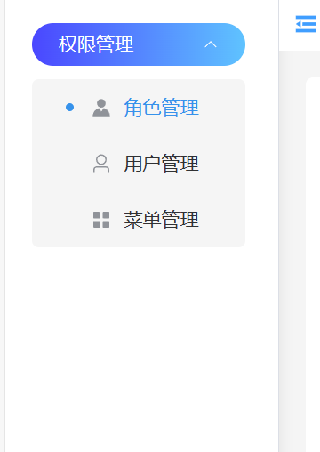
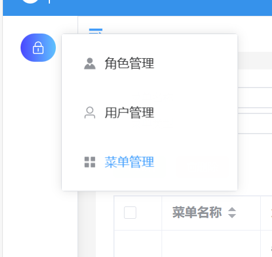
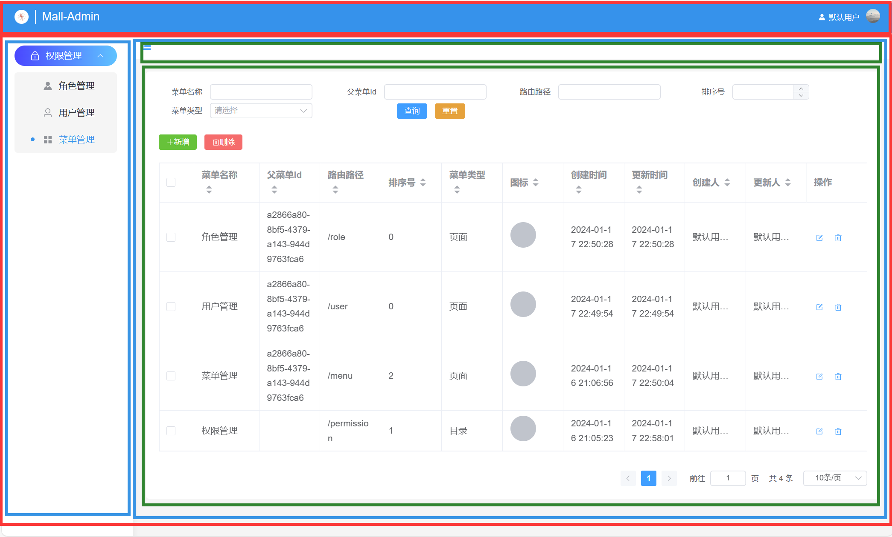

---
category:
  - 起凡商城
tag:
  - 侧边菜单树
  - 权限管理
  - 后台框架

order: 0
date: 2024-01-17
timeline: true
---
# 侧边栏

## 查询用户菜单

### 菜单抓取器

在MenuRepostiory中新增基本属性抓取器，查询用户拥有的菜单只需要返回基本字段就行

```java
MenuFetcher SIMPLE_FETCHER = MenuFetcher.$.allScalarFields();
```

### 查询方法

在UserService中新增getUserMenus返回用户的菜单。

由于菜单和用户的中间隔了两张中间表和一张角色表，下面的链式查询写的比较长。

首先通过RoleMenuRel表关联Role表再关联到UserRoleRel最后关联到User表在id字段上添加条件。

```java
  private final MenuRepository menuRepository;
  public List<Menu> getUserMenus() {
    MenuTable t = MenuTable.$;
    // roles(RoleMenuRel) -> role(Role) -> users(UserRoleRel) -> user(User) -> id = 当前用户id   
    return menuRepository.sql()
        .createQuery(t)
        .where(t.roles(roleMenuRelTableEx -> roleMenuRelTableEx
            .role()
            .users(userRoleRelTableEx -> userRoleRelTableEx
                .user()
                .id()
                .eq(StpUtil.getLoginIdAsString()))))
        .select(t.fetch(MenuRepository.SIMPLE_FETCHER)).execute();
  }

```

### 定义API

定义获取用户菜单接口并使用`@FetchBy`声明返回类型，菜单的返回类型只包含基本字段。

```java
  @GetMapping("menus")
  public List<@FetchBy(value = "SIMPLE_FETCHER",ownerType = MenuRepository.class) Menu>  getUserMenus(){
    return  userService.getUserMenus();
  }
```

## 前端递归菜单树

### 同步API

在后端新增[用户菜单api](#定义api)，前端需要同步这个api。

1. 后端重新生成类型

    ```shell
    mvn clean install
    ```

2. 重启MallServerApplication
3. 前端同步API

    ```shell
    npm run api
    ```

### 获取用户菜单

1. 修改MenuTreeDto类型
    `typings/index.d.ts`

    ```ts
    export type MenuTreeDto = {
    children?: MenuTreeDto[]
    } & MenuDto['MenuRepository/SIMPLE_FETCHER']
    ```

2. 调用api，获得菜单列表和递归生成菜单树并全局缓存
    `stores/homeStore.ts`

    ```ts
    export const useHomeStore = defineStore('home', () => {
    const userInfo = ref<UserDto['UserRepository/COMPLEX_FETCHER']>({
        createdTime: '',
        editedTime: '',
        id: '',
        nickname: '',
        password: '',
        phone: ''
    })
    const menuList = ref<MenuDto['MenuRepository/SIMPLE_FETCHER'][]>([])
    const menuTreeList = ref<MenuTreeDto[]>([])
    const getUserInfo = async () => {
        userInfo.value = await api.userController.getUserInfo()
    }

    const getMenuList = async () => {
        if (menuList.value.length > 0) return menuList.value
        // 获取用户菜单
        const res = await api.userController.getUserMenus()
        // 缓存菜单列表
        menuList.value = res
        // 递归生成菜单树
        menuTreeList.value = buildMenuTree(null, res)
        return res
    }
    const init = async () => {
        await getUserInfo()
        await getMenuList()
    }

    init()
    return { userInfo, getUserInfo, getMenuList, init, menuList, menuTreeList }
    })
    ```

### 侧边菜单树

菜单树的递归生成用的是TSX，如果采用组件递归会出现样式问题。
:::center

:::
:::center

:::

```vue
<script lang="tsx">
import { defineComponent, h, resolveComponent } from 'vue'
import { ElIcon, ElMenu, ElMenuItem, ElSubMenu, ElPopover } from 'element-plus'
import { useHomeStore } from '@/stores/home-store'
import type { MenuTreeDto } from '@/typings'
import { useRoute } from 'vue-router'
import router from '@/router'
export default defineComponent({
  components: {},
  props: {
    // 控制是否展开
    collapse: {
      type: Boolean
    }
  },
  setup(props) {
    // 获取全局缓存的菜单树
    const homeStore = useHomeStore()
    const route = useRoute()
    // tsx递归生成菜单树
    const subMenuList = (menuList: MenuTreeDto[], depth: number) => {
      menuList = menuList.sort((a, b) => (a.orderNum ?? 999) - (b.orderNum ?? 999))
      if (!menuList) return
      return menuList.map((menu) => {
        // 菜单类型是目录则用ElSubMenu，并且继续递归向下生成子菜单。
        if (menu.menuType === 'DIRECTORY') {
          return (
            <ElSubMenu class={depth === 0 ? 'root' : ''} key={menu.path} index={menu.path}>
              {{
                title: () => {
                    // 加载动态的图标
                  return [
                    menu.icon ? <ElIcon size={16}>{h(resolveComponent(menu.icon))}</ElIcon> : '',
                    <span>{menu.name}</span>
                  ]
                },
                default: () => subMenuList(menu.children || [], depth + 1)
              }}
            </ElSubMenu>
          )
        } else if (menu.menuType === 'PAGE') {
            // 菜单类型是页面用ElMenuItem
          return (
            <ElMenuItem
              class={depth === 0 ? 'root' : ''}
              key={menu.path}
              index={menu.path}
              onClick={() => router.push(menu.path)}
            >
              {{
                default: () => {
                  return [
                    <ElPopover content={menu.name} hideAfter={0} placement={'right'}>
                      {{
                        reference: () =>
                          menu.icon ? (
                            <ElIcon size={16}>{h(resolveComponent(menu.icon))}</ElIcon>
                          ) : (
                            ''
                          )
                      }}
                    </ElPopover>,
                    <span>{menu.name}</span>
                  ]
                }
              }}
            </ElMenuItem>
          )
        }
        return <div></div>
      })
    }
    return () => (
      <ElMenu collapse={props.collapse} defaultActive={route.path}>
        {subMenuList(homeStore.menuTreeList, 0)}
      </ElMenu>
    )
  }
})
</script>

<style lang="scss" scoped>
@mixin item-color {
  .el-icon {
    color: rgb(144, 147, 153);
  }
  &:hover {
    color: #3692eb;
    .el-icon {
      svg {
        :deep(path) {
          fill: #3692eb !important;
        }
      }
    }
  }
}
@mixin item-active {
  background-image: linear-gradient(to left, #5fc3ff, #4a47ff);
  color: white;
  .el-icon {
    color: white;
    svg {
      :deep(path) {
        fill: white !important;
      }
    }
  }
}
@mixin item-basic {
  height: 32px;
  line-height: 32px;
  margin-top: 20px;
  border-radius: 25px;
}
:deep(.el-sub-menu__title) {
  @include item-color;
}
.el-menu-item {
  @include item-color;
}

.el-menu {
  border-right: 0;
  width: 160px;

  :deep(.el-menu) {
    border-radius: 5px;
    background-color: #f5f5f5;
    overflow: hidden;

    .el-menu-item {
      height: 42px;
      line-height: 42px;
      position: relative;
      &.is-active {
        color: #3692eb;
        &::before {
          content: '';
          position: absolute;
          background-color: #3692eb;
          height: 6px;
          width: 6px;
          border-radius: 3px;
          left: 25px;
        }
      }
    }
  }
  .root {
    &.el-menu-item {
      @include item-basic;
      &.is-active {
        @include item-active;
      }
    }

    &.el-sub-menu {
      :deep(.el-sub-menu__title) {
        margin-bottom: 10px;
        @include item-basic;
      }
      &.is-active {
        :deep(.el-sub-menu__title) {
          @include item-active;
        }
      }
    }
  }
  &.el-menu--collapse {
    width: 40px;
    .el-menu-item {
      padding: 8px;
      width: 40px;
    }
    :deep(.el-sub-menu__title) {
      padding: 8px;
      width: 40px;
    }
  }
}
</style>
```

### 菜单图标

菜单的图片用的是ElementUI中的图片，因此不需要上传图片。
修改`menu-create-form`和`menu-update-form`中的图标表达项，修改成输入框。

当创建或者修改菜单输入，输入ElmentUi中的图标名称如`User`，`Avatar`，`Menu`等等。在[侧边菜单树](#侧边菜单树)中会读取icon字段并加载对应的图标。

```html
      <el-form-item label="图标" prop="icon">
        <el-input v-model.trim="createForm.icon"></el-input>
      </el-form-item>
```

## 页面框架



### 框架代码

请参考[页面框架图](#页面框架)阅读下面的代码。

```vue
<script setup lang="ts">
import AsideMenu from '@/layout/components/aside-menu.vue'
import { ref } from 'vue'
import { Avatar, Fold } from '@element-plus/icons-vue'
import { useHomeStore } from '@/stores/home-store'
import { storeToRefs } from 'pinia'
import logo from '@/assets/logo.jpg'
const isCollapse = ref(false)
const homeStore = useHomeStore()
const { userInfo } = storeToRefs(homeStore)
</script>

<template>
  <el-container class="index">
    <!-- 对应红色的上半部分，展示页头，用户信息，退出登录等 -->
    <el-header class="header-wrapper">
      <div class="header">
        <div class="logo">
          <el-avatar :src="logo" :size="22"></el-avatar>
          <div class="separator"></div>
          <span>Mall-Admin</span>
        </div>
        <div class="flex-grow"></div>
        <div class="username-wrapper">
          <el-icon>
            <avatar></avatar>
          </el-icon>
          <div class="username">{{ userInfo.nickname }}</div>
          <div class="avatar" v-if="userInfo.avatar">
            <el-avatar :src="userInfo.avatar" :size="22"></el-avatar>
          </div>
        </div>
      </div>
    </el-header>
    <!-- 对应红色的下半部分 -->
    <el-container class="menu-router">
        <!-- 对应蓝色的左半部分，展示侧边菜单 -->
      <div class="aside-menu-wrapper">
        <aside-menu :collapse="isCollapse"></aside-menu>
      </div>
      <!-- 对应蓝色的右半部分 -->
      <el-main class="router-wrapper">
        <!-- 对应绿色的上半部分，展示页签 -->
        <el-header class="router-header">
          <div @click="isCollapse = !isCollapse" class="fold-wrapper">
            <el-icon :class="['fold', isCollapse ? 'expand' : '']" size="20">
              <fold></fold>
            </el-icon>
          </div>
        </el-header>
        <!-- 对应绿色的下半部分，展示子路由 -->
        <el-scrollbar class="router">
          <router-view v-slot="{ Component }">
            <transition name="slide">
              <component :is="Component" />
            </transition>
          </router-view>
        </el-scrollbar>
      </el-main>
    </el-container>
  </el-container>
</template>

<style scoped lang="scss">
.index {
  background-color: #f5f5f5;
  .header-wrapper {
    height: 50px;
    background-color: #3692eb;
    .header {
      height: 100%;
      border-bottom: unset;
      display: flex;
      color: white;
      .logo {
        display: flex;
        align-items: center;
        font-size: 18px;
        .separator {
          width: 1px;
          height: 22px;
          background-color: #ffffff;
          margin: 0 10px;
        }
      }
      .flex-grow {
        flex-grow: 1;
      }
      .username-wrapper {
        display: flex;
        align-items: center;
        font-size: 12px;

        .username {
          color: white;
          margin-left: 5px;
        }
        .avatar {
          margin-left: 10px;
        }
      }
    }
  }
  .menu-router {
    .aside-menu-wrapper {
      border-right: solid 1px var(--el-menu-border-color);
      box-shadow: 1px 20px 10px #e3e3e3;
      padding: 0 20px;
      background-color: white;
      height: calc(100vh - 50px);
      flex-shrink: 0;
      overflow: scroll;
    }
    .router-wrapper {
      border-top: var(--el-border-color-light) 1px solid;
      padding: 0;
      height: calc(100vh - 50px);

      .router-header {
        padding: 0;
        height: 40px;
        background-color: white;
        display: flex;
        align-items: center;

        .fold-wrapper {
          height: 100%;
          display: flex;
          align-items: center;

          .fold {
            &:hover {
              cursor: pointer;
            }

            color: var(--el-color-primary);
            margin-left: 10px;
            transform: rotate(0deg);
            transition: transform 0.3s linear;
          }

          .expand {
            transform: rotate(180deg);
          }
        }
      }
      .router {
        height: calc(100vh - 130px);
        margin: 20px 20px 0px 20px;
        border-radius: 5px;

        :deep(.el-scrollbar__view) {
          height: 100%;
        }
      }
    }
  }
}
</style>
```

### 路由配置

将 user，role，menu三个路由放在框架页面路由的children中。这样才可以在框架页面中的`<router-view></router-view>`展示（绿色下半区域）。

`router/index.ts`

```ts
import { createRouter, createWebHistory } from 'vue-router'
import RegisterView from '@/views/login/register-view.vue'
import LoginView from '@/views/login/login-view.vue'
import DictView from '@/views/dict/dict-view.vue'
import RoleView from '@/views/role/role-view.vue'
import MenuView from '@/views/menu/menu-view.vue'
import LayoutView from '@/layout/layout-view.vue'

const router = createRouter({
  history: createWebHistory(import.meta.env.BASE_URL),
  routes: [
    {
      path: '/',
      name: 'layout-view',
      component: LayoutView,
      children: [
        { path: '/user', component: () => import('@/views/user/user-view.vue') },
        {
          path: '/role',
          name: 'role',
          component: RoleView
        },
        {
          path: '/menu',
          name: 'menu',
          component: MenuView
        }
      ]
    },
    {
      path: '/login',
      name: 'login',
      component: LoginView
    },
    {
      path: '/register',
      name: 'register',
      component: RegisterView
    },
    {
      path: '/dict',
      name: 'dict',
      component: DictView
    }
  ]
})

export default router

```
