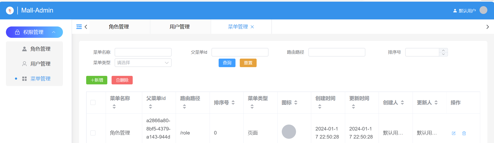
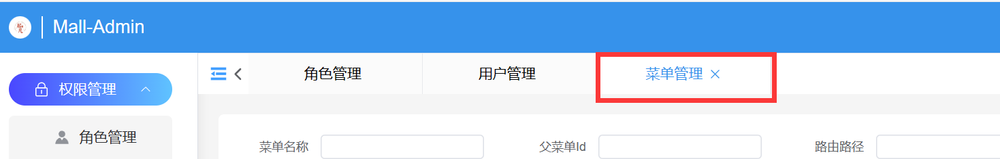
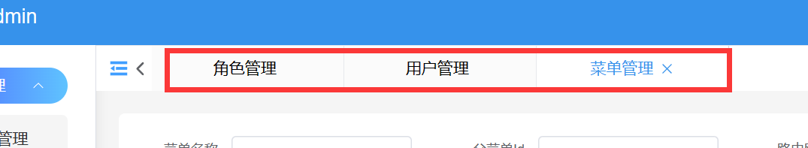

---
category:
  - 起凡商城
tag:
  - 页签栏
  - 权限管理
  - 后台框架

order: 1
date: 2024-01-18
timeline: true
---
# 页签栏

:::center

:::

## Store全局缓存Tag

```ts
import router from '@/router'
import { defineStore, storeToRefs } from 'pinia'
import type { RouteLocationPathRaw } from 'vue-router'
import type { MenuDto } from '@/apis/__generated/model/dto'
import { useHomeStore } from '@/stores/home-store'
import { useStorage } from '@vueuse/core'
// tag是基于menu拓展的，不需要太多的不必要属性，从menu中选择（id，name，menuType，icon，path）再加上（reloadKey和route（跳转路由））
export type TagMenu = Pick<
  MenuDto['MenuRepository/COMPLEX_FETCHER'],
  'id' | 'name' | 'menuType' | 'icon' | 'path'
> & {
  reloadKey: number
  route: RouteLocationPathRaw
}
export const useTagStore = defineStore('tags', () => {
  const { menuList } = storeToRefs(useHomeStore())
  // 当前激活的页签
  const activeTag = useStorage<TagMenu>('activeTag', {
    id: '',
    menuType: 'DIRECTORY',
    name: '',
    path: '',
    reloadKey: 0,
    route: { path: '' }
  })
  // 页签列表
  const tags = useStorage<TagMenu[]>('tagList', [])
  // 打开页签的时候可以传入"/user"或者{path: "/user",query:{id:1}}这两种类型。和使用router.push差不多。
  const openTag = async (path: string | RouteLocationPathRaw) => {
    // 如果path是 string把path变成 {path: path}格式，统一参数。
    const route = typeof path == 'string' ? { path } : path
    // 根据path在用户的菜单列表中查找菜单
    const menu = menuList.value.find((value) => value.path === route.path)
    // 如果菜单类型不是PAGE则返回
    if (!menu || menu.menuType != 'PAGE') return
    const currentIndex = tags.value.findIndex((item) => {
      return item.path === menu.path
    })
    // 设置激活菜单
    activeTag.value = { ...menu, reloadKey: 0, route }
    // 如果页签列表中已经存在菜单，说明之前打开过相同的路径。不存在在新建一个页签，存在替换。
    if (currentIndex === -1) {
        // 新增页签
      tags.value.push(activeTag.value)
    } else {
        // 替换旧的页签为新的页签
      tags.value.splice(currentIndex, 1, activeTag.value)
    }
    await router.push(route)
    return menu
  }
  const closeTag = async (index: number) => {
    const delItem = tags.value[index]
    // 删除页签
    tags.value.splice(index, 1)
    // [1,2,3,4] 如果删除索引2，对应的元素是3。删除后列表变为[1,2,4]，此时索引2对应的元素是4。
    // [1,2,3] 如果删除索引2，删除后的列表变为[1,2]，此时索引2对应的元素为空。
    // [1] 如果删除索引为0，删除后的列表变为[]，此时索引0对应的元素为空。
    // 根据上面的三个例子可以知道，当关闭一个页签时，有三种选择
    // 1. 打开删除后列表的相同索引（原来后面的，选择补位到前面了）
    // 2. 打开删除后列表的前面所有（原来前面的）
    // 3. 删除后列表已经为空了，打开首页。
    const item = tags.value[index] ? tags.value[index] : tags.value[index - 1]
    if (item) {
      delItem.id === activeTag.value.id && (await openTag(item.path))
    } else {
        // 回到首页
      await router.push('/')
    }
  }
  // 清空页签，并回到首页
  const closeAll = async () => {
    tags.value = []
    await router.push('/')
  }
  // 关闭其他页签
  const closeOther = (tag: TagMenu) => {
    tags.value = [tag]
  }
  return {
    activeTag,
    tags,
    closeTag,
    closeAll,
    closeOther,
    openTag
  }
})
```

## 页签组件

:::center

:::

`layout/components/router-tag.vue`

```vue
<template>
  <div>
    <!-- 右键页签时弹出操作项 -->
    <el-popover
      :key="tag.path"
      :width="100"
      :show-after="100"
      :popper-style="{ padding: 0 }"
      v-model:visible="visible"
      trigger="contextmenu"
    >
      <div>
        <div class="menu-list">
          <div class="menu-item" @click="handleCommand('copy')" v-if="isActive">复制路径</div>
          <div class="menu-item" @click="handleCommand('closeOther')">关闭其他</div>
          <div class="menu-item" @click="handleCommand('closeAll')">关闭所有</div>
        </div>
      </div>
      <template #reference>
        <div :class="['tag', isActive ? 'active' : '', 'tag' + index]" @click="handleTagClick(tag)">
          <div class="rag-link">
            {{ tag.name }}
          </div>
          <!-- 父亲元素也有@click，子元素触发点击事件时要阻止事件继续向外传播。@click.stop -->
          <el-icon class="close" size="14" @click.stop="closeTag(index)">
            <close></close>
          </el-icon>
        </div>
      </template>
    </el-popover>
  </div>
</template>

<script setup lang="ts">
import { type TagMenu, useTagStore } from '@/layout/store/tag-store'
import { storeToRefs } from 'pinia'
import { Close } from '@element-plus/icons-vue'
import { computed, ref } from 'vue'
const props = defineProps<{ tag: TagMenu; index: number }>()
const visible = ref(false)
const isActive = computed(() => {
  return props.tag.path === activeTag.value.path
})
const tagStore = useTagStore()
const { closeAll, closeOther, closeTag, openTag } = tagStore
const { activeTag } = storeToRefs(tagStore)
// 将命令和对应的操作用map映射
const handleCommand = (command: 'copy' | 'closeAll' | 'closeOther') => {
  const commandMap = {
    copy: () => {
      navigator.clipboard.writeText(window.location.href)
    },
    closeAll,
    closeOther: () => {
      closeOther(props.tag)
    }
  }
  commandMap[command]()
  visible.value = false
}

const handleTagClick = (tag: TagMenu) => {
  // tag.route中详细记录了跳转的路由以及参数。当重新打开页签时要保证参数不能丢失
  openTag(tag.route)
}
</script>

<style lang="scss" scoped>
.menu-list {
  display: flex;
  flex-direction: column;
  .menu-item {
    padding: 5px 10px;
    &:hover {
      color: var(--el-color-primary-dark-2);
      background-color: var(--el-color-primary-light-8);
      cursor: pointer;
    }
  }
}
.tag {
  display: flex;
  align-items: center;
  height: 40px;
  line-height: 40px;
  padding: 0 15px;
  justify-content: center;
  border-right: rgba(#d4d7de, 0.5) 1px solid;
  background-color: rgba(#f5f5f5, 0.4);
  position: relative;
  min-width: 140px;

  &:hover {
    cursor: pointer;
  }
  &.active {
    background-color: white;
    border-right: #d4d7de 1px solid;
    .rag-link {
      color: #3692eb;
      font-weight: 500;
    }
    .close {
      width: 14px;
      color: #3692eb;
    }
  }
  &:hover {
    .close {
      width: 14px;
    }
  }
  .close {
    width: 0;
    transition: all 0.3s ease-in-out;
    color: #d4d7de;
  }
  .rag-link {
    transition: all 0.5s ease-in-out;
    margin-right: 5px;
    font-size: 14px;
    // 文字只能显示一行
    -webkit-line-clamp: 1;
    -webkit-box-orient: vertical;
    display: -webkit-box;
    overflow: hidden;
    // 溢出部分用 ...代替
    text-overflow: ellipsis;
  }
}
</style>
```

## 页签栏组件



`layout/components/router-tags.vue`

```vue
<template>
  <div class="tags">
    <!-- 当页签太多溢出时，点击左方向可以向左滚动 -->
    <el-button link @click="scroll('left')"
      ><el-icon><ArrowLeftBold /></el-icon>
    </el-button>
    <div class="tags-wrapper" ref="tagWrapperRef">
      <!-- 当页签新增或者删除时的过渡动画 -->
      <transition-group name="list">
        <router-tag
          :tag="tag"
          :index="index"
          v-for="(tag, index) in tagStore.tags"
          :key="tag.id"
        ></router-tag>
      </transition-group>
    </div>
    <!-- 当页签太多溢出时，点击右方向可以向右滚动 -->
    <el-button link @click="scroll('right')">
      <el-icon><ArrowRightBold /></el-icon>
    </el-button>
  </div>
</template>

<script setup lang="ts">
import { useTagStore } from '@/layout/store/tag-store'
import RouterTag from './router-tag.vue'
import { ref } from 'vue'
import { ArrowLeftBold, ArrowRightBold } from '@element-plus/icons-vue'
const tagStore = useTagStore()
const tagWrapperRef = ref<HTMLDivElement>()
const scroll = (direction: 'right' | 'left') => {
  tagWrapperRef.value?.scrollTo({
    left: tagWrapperRef.value?.scrollLeft + direction == 'right' ? 100 : -100,
    behavior: 'smooth'
  })
}
</script>

<style lang="scss" scoped>
.list-enter-active,
.list-leave-active {
  transition: all 0.5s ease;
}
.list-enter-from,
.list-leave-to {
  opacity: 0;
  transform: translateY(30px);
}
.tags {
  display: flex;
  justify-content: space-between;
  width: calc(100% - 40px);
  .tags-wrapper {
    box-sizing: border-box;
    display: flex;
    align-items: center;
    width: 100%;
    overflow-x: scroll;

    &::-webkit-scrollbar {
      // --bar-width: 2px;
      height: 0px;
    }

    &::-webkit-scrollbar-track {
      background-color: transparent;
    }

    &::-webkit-scrollbar-thumb {
      background-color: rgba(0, 0, 0, 0.1);
      border-radius: 20px;
      background-clip: content-box;
      border: 1px solid transparent;
    }
  }
}
</style>
```

## 侧边栏菜单页签联动

当点击左边的菜单树时，需要打开页签。

`layout/components/aside-menu.vue`

```vue
<script lang="tsx">
import { defineComponent, h, resolveComponent } from 'vue'
import { ElIcon, ElMenu, ElMenuItem, ElSubMenu, ElPopover } from 'element-plus'
import { useHomeStore } from '@/stores/home-store'
import type { MenuTreeDto } from '@/typings'
import { useTagStore } from '@/layout/store/tag-store'
export default defineComponent({
  components: {},
  props: {
    collapse: {
      type: Boolean
    }
  },
  setup(props) {
    // 新增tagStore
    const tagStore = useTagStore()
    const subMenuList = (menuList: MenuTreeDto[], depth: number) => {
      menuList = menuList.sort((a, b) => (a.orderNum ?? 999) - (b.orderNum ?? 999))
      if (!menuList) return
      return menuList.map((menu) => {
        if (menu.menuType === 'DIRECTORY') {
            // 忽略...
        } else if (menu.menuType === 'PAGE') {
          return (
            // 修改  onClick={() => tagStore.openTag(menu.path)}
            <ElMenuItem
              class={depth === 0 ? 'root' : ''}
              key={menu.path}
              index={menu.path}
              onClick={() => tagStore.openTag(menu.path)}
            > 
            </ElMenuItem>
          )
        }
        return <div></div>
      })
    }
    // 修改 defaultActive={tagStore.activeTag.path}
    return () => (
      <ElMenu collapse={props.collapse} defaultActive={tagStore.activeTag.path}>
        {subMenuList(homeStore.menuTreeList, 0)}
      </ElMenu>
    )
  }
})
</script>

<!-- 忽略.... -->
```

`layout/layout-view.vue`

## 展示页签栏

```html
<template>
  <el-container class="index">
    <!-- 忽略... -->
    <el-container class="menu-router">
     <!-- 忽略... -->
      <el-main class="router-wrapper">
        <el-header class="router-header">
          <div @click="isCollapse = !isCollapse" class="fold-wrapper">
            <el-icon :class="['fold', isCollapse ? 'expand' : '']" size="20">
              <fold></fold>
            </el-icon>
          </div>
          <!-- 引用页签栏组件 -->
          <router-tags></router-tags>
        </el-header>
        <!-- 忽略... -->
      </el-main>
    </el-container>
  </el-container>
</template>
```

## 路由拦截

`router/index.ts`

```ts
import { createRouter, createWebHistory } from 'vue-router'
import RegisterView from '@/views/login/register-view.vue'
import LoginView from '@/views/login/login-view.vue'
import DictView from '@/views/dict/dict-view.vue'
import RoleView from '@/views/role/role-view.vue'
import MenuView from '@/views/menu/menu-view.vue'
import LayoutView from '@/layout/layout-view.vue'
import { useHomeStore } from '@/stores/home-store'

const router = createRouter({
  history: createWebHistory(import.meta.env.BASE_URL),
  routes: [
    // 忽略...
  ]
})
// 添加路由拦截，在进入路由之前需要校验是否有该菜单的权限
router.beforeEach(async (to, from, next) => {
  const homeStore = useHomeStore()
  if (
    (await homeStore.getMenuList()).findIndex((menu) => menu.path === to.path) >= 0 ||
    to.path === '/'
  ) {
    next()
  } else {
    return next('/')
  }
})
export default router

```
