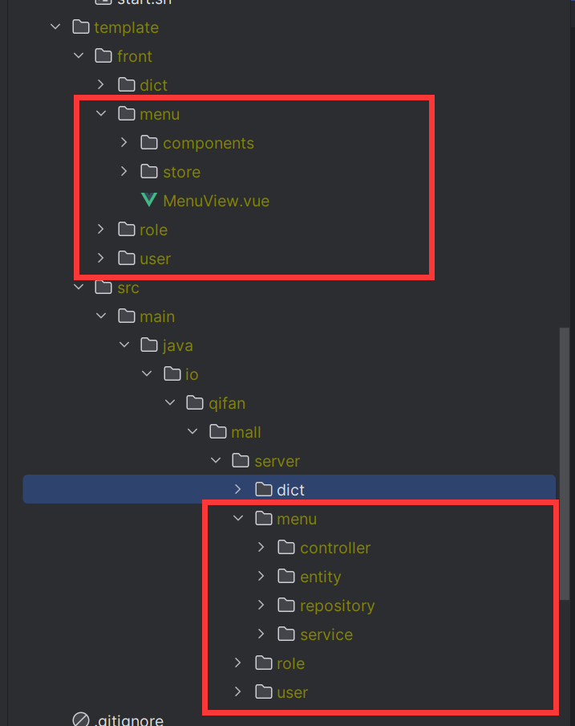
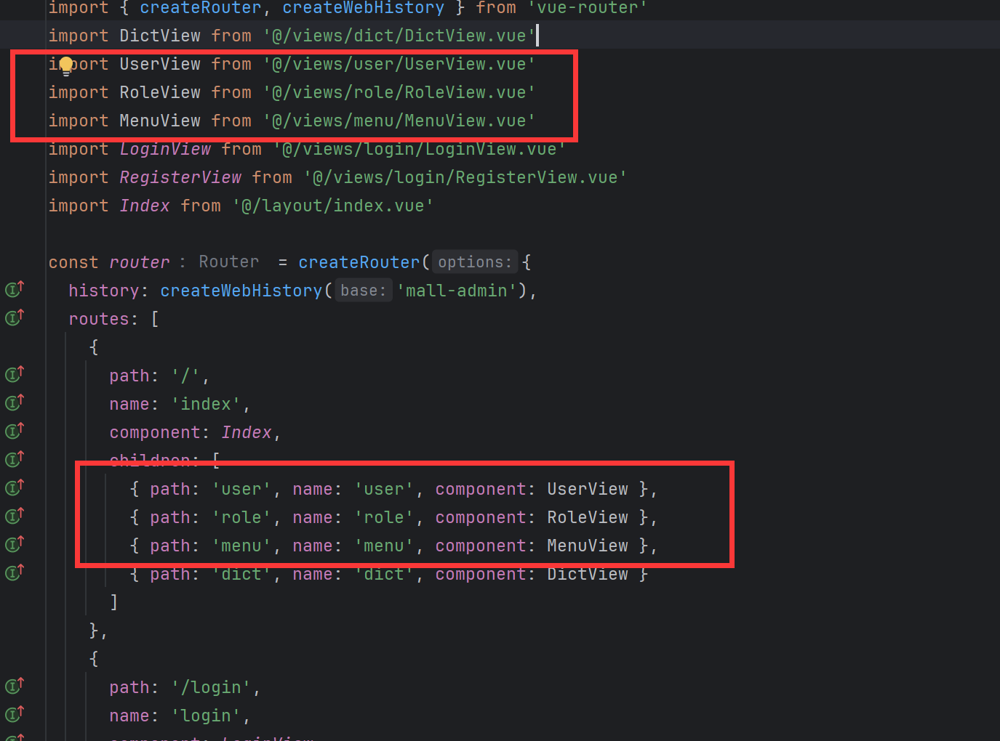

# 增删改查实现

## 生成代码

在`User, Role, Menu`上添加`@GenEntity`。

:::center

:::
:::center

:::
:::info
[@GenEntity](../reference/generator/README.md/#genentity) 加上这个注解即可生成增删改查代码。

[开发流程](../start/develop.md)请参考快速上手
:::

##  添加路由

代码生成的前端代码复制到项目中还无法直接访问，以menu生成的代码为例，需要将MenuView配置到路由`router/index.ts`中。

## 浏览器访问

`localhost:5173/mall-admin/menu`即可访问菜单的增删改查。