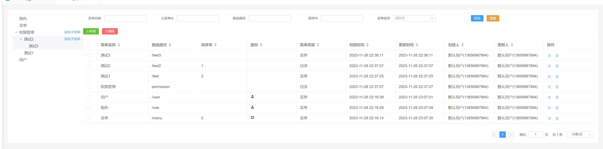

# 菜单


## 树形菜单

常规的增删改查是在管理页面提供一个表格然后进行操作。由于菜单的结构是树形的，因此可以用表格展示菜单详情，用树形组件展示菜单结构。

:::tip
表格组件也可以展示树形，但是这样就无法使用查询条件和分页查询。
:::



## 实体设计

通过parent关联父亲菜单，children关联子菜单。这样一个树形结构的菜单就有了

```java
@GenEntity
@Entity
public interface Menu extends BaseEntity {
    @Nullable
    @ManyToOne
    Menu parent();

    @IdView
    @GenField(value = "父菜单Id", order = 1)
    @Nullable
    String parentId();

    @OneToMany(mappedBy = "parent")
    List<Menu> children();
   
    // 忽略其他的属性
}
```

## 递归查询

在MenuService定义查询菜单树，从根节点开始查`menuTable.parentId().isNull()`。

```java
public List<Menu> queryMenuTree() {
    MenuTable menuTable = MenuTable.$;
    return menuRepository.sql()
            .createQuery(menuTable)
            .where(menuTable.parentId().isNull())
            .select(menuTable.fetch(MenuRepository.MENU_TREE_FETCHER))
            .execute();
}
```

在MenuRepository中定义了树形结构的抓取器（[递归查询](https://babyfish-ct.gitee.io/jimmer-doc/docs/query/object-fetcher/recursive)）。

- `.allScalarFields()`菜单实体类的[普通属性](https://babyfish-ct.gitee.io/jimmer-doc/docs/query/object-fetcher/props)
- `.parentId()`抓取[视图属性](https://babyfish-ct.gitee.io/jimmer-doc/docs/query/object-fetcher/view)
  ，parentId是parent的id视图。
- `.children()`抓取[关联属性](https://babyfish-ct.gitee.io/jimmer-doc/docs/query/object-fetcher/association)。对于每个子菜单，又定义了抓取规则
    - `                .children(MenuFetcher.$.allScalarFields(), RecursiveListFieldConfig::recursive));`子菜单递归查询子菜单
```java
MenuFetcher MENU_TREE_FETCHER = MenuFetcher.$
        .allScalarFields()
        .parentId()
        .children(MenuFetcher.$
                .allScalarFields()
                .children(MenuFetcher.$.allScalarFields(), RecursiveListFieldConfig::recursive));

```

## 前端树结构展示

### 菜单树组件

```vue
<script setup lang="ts">
import type { MenuTreeDto } from '@/typings'

const defaultProps = {
  children: 'children',
  label: 'name'
}
// 传入的参数是菜单树
defineProps<{ menuTree: MenuTreeDto[] }>()
// 定义拓展slot，其实是el-tree的slot
defineSlots<{
  default(props: { node: { label: string }; data: MenuTreeDto }): void
}>()
</script>

<template>
  <el-tree :data="menuTree" :props="defaultProps" v-bind="$attrs">
    <template #default="{ node, data }: { node: { label: string }; data: MenuTreeDto }">
      <slot :node="node" :data="data"></slot>
    </template>
  </el-tree>
</template>

<style scoped lang="scss"></style>
```

### 加载菜单树

在menu-store中定义菜单树变量和它的加载方法。

```ts
export const useMenuStore = defineStore('menu', () => {
  // 忽略...
  const menuTreeList = ref<MenuTreeDto[]>([])
  const reloadMenuTree = () => {
    api.menuController.queryMenuTree().then((res) => {
      menuTreeList.value = res
    })
  }
  return {
  // 忽略...
    menuTreeList,
    reloadMenuTree
  }
})

```
### 显示菜单树


在MenuView中显示左侧的菜单树(图1)
```vue
<script lang="ts" setup>
import MenuTable from './components/MenuTable.vue'
import MenuQuery from './components/MenuQuery.vue'
import MenuDialog from './components/MenuDialog.vue'
import MenuTree from '@/views/menu/components/MenuTree.vue'
import { useMenuStore } from './store/menu-store'
import { storeToRefs } from 'pinia'
import { useDictHelper } from '@/components/dict/dict'
import type { MenuTreeDto } from '@/typings'
const menuStore = useMenuStore()
// store中定义了menuTreeList和它的加载方法
const { createForm, menuTreeList } = storeToRefs(menuStore)
// 初始化菜单树
menuStore.reloadMenuTree()
// 点击添加子菜单时需要用打开创建菜单对话框
const handleCreate = (data: MenuTreeDto) => {
  menuStore.openDialog('CREATE')
  createForm.value = { ...menuStore.initForm }
  createForm.value.parentId = data.id
}
// 菜单字典，目录/菜单/按钮。只有目录类型的菜单才可以添加子菜单
const { dictFilter } = useDictHelper(1002)
</script>
<template>
  <div class="menu-view">
    <div class="menu-tree">
      <menu-tree :menu-tree="menuTreeList">
        <template v-slot="{ node, data }">
          <span class="custom-tree-node">
            <span>{{ node.label }}</span>
            <span>
              <el-button
                type="primary"
                link
                size="small"
                @click="handleCreate(data)"
                v-if="data.menuType === dictFilter('目录')"
                >添加子菜单</el-button
              >
            </span>
          </span>
        </template>
      </menu-tree>
    </div>
    <div class="menu-manage">
      <MenuQuery></MenuQuery>
      <MenuDialog></MenuDialog>
      <MenuTable></MenuTable>
    </div>
  </div>
</template>

<style lang="scss" scoped>
.menu-view {
  display: flex;
  background: white;
  padding: 20px;
  border-radius: 5px;
  .menu-tree {
    width: 300px;
  }
  .menu-manage {
    width: 100%;
  }
}
.custom-tree-node {
  flex: 1;
  display: flex;
  align-items: center;
  justify-content: space-between;
  font-size: 14px;
  padding-right: 8px;
}
</style>
```