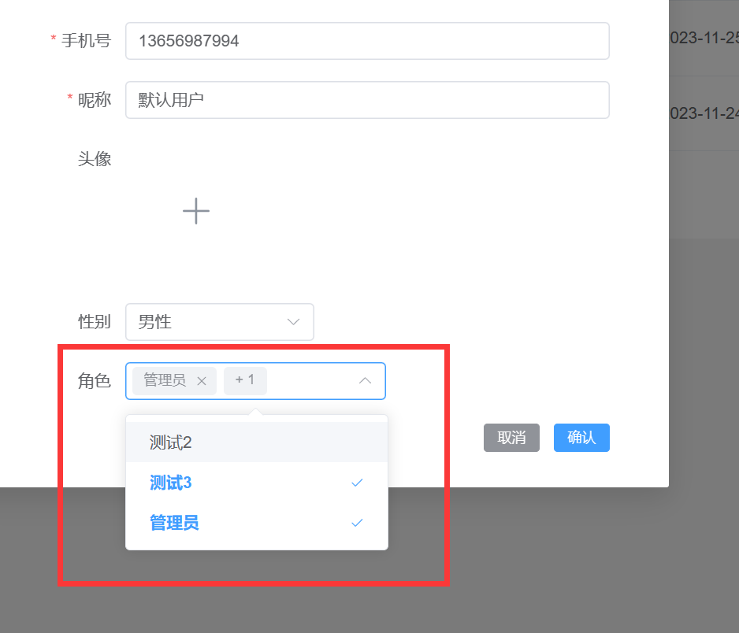

# 用户

## 用户创建配置角色

### 修改dto

[Dto](https://babyfish-ct.gitee.io/jimmer-doc/docs/object/view/dto-language#3-viewinput%E5%92%8Cspecification)有input，view，speciation三种类型。input专门用于输入，在当前的场景中需要接收前端传入的roleIds。
因此要在UserInput中添加`roleIds`。

```text
# mall-server/src/main/dto/io/qifan/mall/server/user/entity/User.dto
input UserInput {
    #allScalars(User)
    id?
    # 新增roleIds
    roleIds: Array<String>
}
```

### 前端实现

使用[RemoteSelect组件](../reference/front/README.md/#远程选择器)即可实现下图效果

:::center

:::

1. 提供待选项获取方法

    ```ts
    const roleQueryOptions = async (keyword: string) => {
      return (await api.roleController.query({ body: { query: { name: keyword } } })).content
    }
    ```
2. 双向绑定已选的角色

   在user-store.ts中定义了`createForm`，类型是UserInput。在[dto修改](#修改dto)中新增了roleIds，代表前端需要传roleIds。
    ```ts
    // roleIds和remote-select双向绑定
    const initForm: UserInput = { roleIds: [], password: '', nickname: '', phone: '' }
    const createForm = ref<UserInput>(initForm)
    ```
3. 映射待选项到label和value

    - `label-prop="name"`代表角色的名称映射到el-option的label属性
    - `value-prop="id""`代表角色的id映射到el-option的value属性（默认就是id，所以这边没填）

4. 汇总

```vue
<script lang="ts" setup>
const userStore = useUserStore()
const { createForm } = storeToRefs(userStore)
// 获取角色列表
const roleQueryOptions = async (keyword: string) => {
  return (await api.roleController.query({ body: { query: { name: keyword } } })).content
}
</script>
<template>
  <div class="create-form">
    <el-form ref="createFormRef" :model="createForm" :rules="rules" class="form" labelWidth="120">
      <el-form-item label="角色">
        <!--  双向绑定和定义映射 -->
        <remote-select
          :query-options="roleQueryOptions"
          v-model="createForm.roleIds"
          label-prop="name"
          multiple
        >
        </remote-select>
      </el-form-item>
    </el-form>
  </div>
</template>
```

:::info
[RemoteSelect组件](../reference/front/README.md#远程选择器)：快速选择远程数据
:::

### 后端实现

前端实现提交的数据结构如下

```json
{
  "createdTime": "2023-11-24 17:13:08",
  "editedTime": "2023-11-29 17:09:43",
  "id": "1cb4db50-66fa-4250-9916-73283e536fa0",
  "phone": "13656987994",
  "password": "$2a$10$UeZxmCdikKwYFK.wk7lp8Oj6ZzoXUZKUhV9qFGXuc74.IqgDP9AU2",
  "nickname": "默认用户",
  "avatar": null,
  "gender": "0710c8a5-021c-404d-b09e-56db95c259e9",
  "roleIds": [
    "1",
    "17509f5c-9a6b-429c-b467-cadbd8873d2d"
  ]
}
```

在图1中可知选中了两个角色，所以roleIds里面包含两条id数据。

1. UserInput中有roleIds，需要转成User中的`List<UserRoleRel> roles()`;
2. UserInput是User的Dto，因此它可以通过userInput.toEntity()转成User对象
3. 由于User是不可变对象，要修改需要同[Draft对象](https://babyfish-ct.gitee.io/jimmer-doc/docs/object/draft)。如UserDraft

通过上面三点可以知道Input类型的Dto插入到数据库需要哪些步骤，在`UserService`的save方法中新增下面的代码。

```java
public String save(UserInput userInput) {
    User user = userInput.toEntity();
    return userRepository.save(UserDraft.$.produce(user, draft -> {
        // 将List<String> roleIds map映射--> List<UserRoleRel> roles
        Arrays.stream(userInput.getRoleIds()).forEach(roleId -> {
            // 向user对象中添加UserRoleRel
            draft.addIntoRoles(userRole -> {
                // 设置UserRoleRel，
                userRole.applyRole(role -> role.setId(roleId));
                // user中有@Key phone，要不然需要创建完用户得到id才可以。
                userRole.setUser(user);
            });
        });
    })).id();
}
```

## 编辑用户（回显）修改角色

当创建完用户之后，当编辑用户的时候需要显示用户已有的角色。

1. 后端查询编辑用户的角色
2. 前端遍历roleVies得到roleIds
3. 双向绑定到RemoteSelect组件即可实现默认选中已有的角色

### 视图属性RolesView

`rolesView`是`roles`的视图属性，获得`UserRoleRel`中的`role`得到`List<Role>`。

```java
 @OneToMany(mappedBy = "user")
 List<UserRoleRel> roles();
 @ManyToManyView(
         prop = "roles",
         deeperProp = "role"[]()
 )
 List<Role> rolesView();
```

### 属性抓取

在`UserRepository`中定义了一个通用的对象抓取器。在这个数据抓取，`.allScalarFields()`代表抓取普通属性。后面又新增了`rolesView(true)`抓取视图属性，这样就可以返用户关联的角色。

```java
UserFetcher COMPLEX_FETCHER = UserFetcher.$.allScalarFields().rolesView(true);
```

返回的结果，可以看见除了普通属性之外，还包含了一个视图属性rolesView

```json
{
   "createdTime": "2023-11-24 17:13:08",
   "editedTime": "2023-11-30 14:00:55",
   "id": "1cb4db50-66fa-4250-9916-73283e536fa0",
   "phone": "13656987994",
   "password": "$2a$10$UeZxmCdikKwYFK.wk7lp8Oj6ZzoXUZKUhV9qFGXuc74.IqgDP9AU2",
   "nickname": "默认用户",
   "avatar": null,
   "gender": "0710c8a5-021c-404d-b09e-56db95c259e9",
   "rolesView": [
      {
         "id": "1"
      },
      {
         "id": "17509f5c-9a6b-429c-b467-cadbd8873d2d"
      },
      {
         "id": "d5352808-e463-4af9-9252-6db6b7df2ca0"
      }
   ]
}
```

:::info
[对象抓取器（Fetcher）](https://babyfish-ct.gitee.io/jimmer-doc/docs/query/object-fetcher/)：抓取的属性包含三种类型

- 普通属性，数据库表中和实体对应的属性
- 关联属性，一对一，一对多，多对一，多对多
- 视图属性，就像上面的rolesView，就是一种视图属性
  :::

### 前端遍历获取roleId

前端将`res.rolesView`映射成`roleIds`

```ts
const res = await api.userController.findById({ id: updateForm.value.id || '' })
updateForm.value = { ...res, roleIds: res.rolesView.map((role) => role.id) }
```

### 双向绑定roleIds

由于roleIds中已经有值，此时下拉框中会选中该用户已有的角色。

```vue
 <remote-select
        :query-options="roleQueryOptions"
        v-model="updateForm.roleIds"
        label-prop="name"
        multiple
>
</remote-select>
```