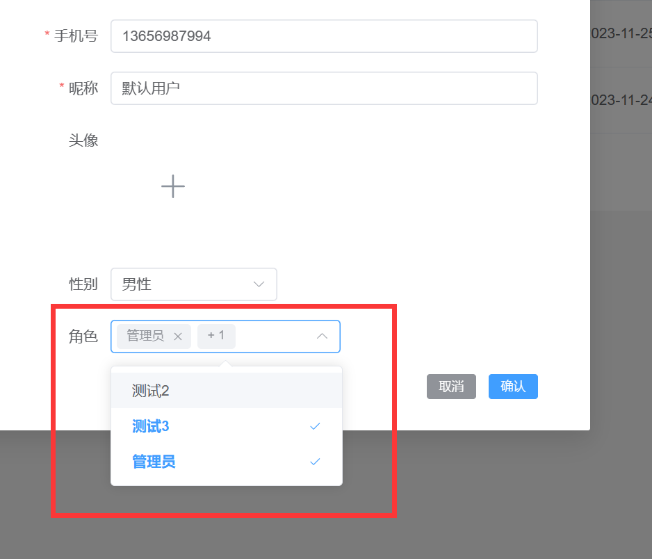

---
category:
  - 起凡商城
tag:
  - 角色
  - 权限管理

order: 1
date: 2024-01-15
timeline: true
---
# 用户角色

## 建表

角色表

```sql
-- auto-generated definition
create table role
(
    id           varchar(36) not null
        primary key,
    created_time datetime(6) not null,
    edited_time  datetime(6) not null,
    creator_id   varchar(36) not null,
    editor_id    varchar(36) not null,
    name         varchar(36) not null,
    constraint role_pk
        unique (name)
);
```

用户角色关联表

```sql
-- auto-generated definition
create table user_role_rel
(
    id           varchar(36) not null
        primary key,
    created_time datetime(6) not null,
    edited_time  datetime(6) not null,
    creator_id   varchar(36) not null,
    editor_id    varchar(36) not null,
    role_id      varchar(36) not null,
    user_id      varchar(36) not null,
    constraint role_id
        unique (role_id, user_id)
);
```

## 实体类

### Role

根据[ER图](./README.md/#er图)中可以知道角色是权限模型的核心部分，它不仅和用户建立起了多对多关系，同时也和菜单建立起了多对多关系。
`UserRoleRel`负责建立起用户和角色的多对多关联。

```java
@GenEntity
@Entity
public interface Role extends BaseEntity {
    @GenField(value = "角色名称")
    @Key
    String name();
    @OneToMany(mappedBy = "role")
    List<UserRoleRel> users();
}
```

:::info
[@OneToMany(mappedBy = "xxx")](https://babyfish-ct.gitee.io/jimmer-doc/docs/mapping/base/association/one-to-many)代表一对多映射，和ER图中的一对多相对应。
由于一对多的一方不存在外键，因此为了确定是哪张表关联了自己需要指定`mappedBy = "xxx"`。

[@Key](https://babyfish-ct.gitee.io/jimmer-doc/docs/mapping/advanced/key)是业务主键。还有一种主键是`@Id`，这种主键和业务无关。
两者都可以唯一的标识一行记录，只是前者有业务的意义。如User表中的Phone也可以唯一代表一个用户，但是它多了一个业务含义——手机号。

[BaseEntity](../reference/backend/README.md/#baseentity)包含通用的id, editedTime, createdTime, editor, creator。并且会在创建或者更新时自动填写这些字段。
:::

### UserRoleRel

要实现两个实体类的多对多关联必然需要一张中间表。UserRoleRel就是负责建立起User和Role这个联系的中间表。

除了BaseEntity中的逻辑主键`@Id`之外，还包含了两个业务主键`@Key`，分别是userId和roleId。他们组合起来可以唯一标识一行记录，因此加上了`@Key`。

用户拥有多个角色，当减少关联的角色时我们希望删除掉UserRoleRel中相应的记录。[`@OnDissociate(DissociateAction.DELETE)`](https://babyfish-ct.gitee.io/jimmer-doc/docs/mutation/save-command/dissociation#%E8%84%B1%E5%8B%BE%E4%B8%AD%E9%97%B4%E8%A1%A8%E6%95%B0%E6%8D%AE)
即可达到这种脱钩操作。

```java
@Entity
public interface UserRoleRel extends BaseEntity {

  @ManyToOne
  @Key
  @OnDissociate(DissociateAction.DELETE)
  User user();

  @ManyToOne
  @Key
  Role role();
}
```

:::info
[`@OnDissociate`](https://babyfish-ct.gitee.io/jimmer-doc/docs/mutation/save-command/dissociation#%E8%84%B1%E5%8B%BE%E4%B8%AD%E9%97%B4%E8%A1%A8%E6%95%B0%E6%8D%AE)当删除时触发的脱钩操作。有级联删除/置空/检查报错。
:::

### User

在User中新增roles和rolesView。

```java
@GenEntity
@Entity
public interface User extends BaseDateTime {

  @Id
  @GeneratedValue(generatorType = UUIDIdGenerator.class)
  String id();

  @GenField(value = "手机号", order = 0)
  @Key
  String phone();

  @GenField(value = "密码", order = 1)
  String password();

  @GenField(value = "昵称", order = 2)
  @Null
  String nickname();

  @GenField(value = "头像", order = 3, type = ItemType.PICTURE)
  @Null
  String avatar();

  @GenField(value = "性别", order = 4, type = ItemType.SELECTABLE, dictEnName = DictConstants.GENDER)
  @Null
  DictConstants.Gender gender();

  @Null
  @OneToOne(mappedBy = "user")
  UserWeChat wechat();

  @OneToMany(mappedBy = "user")
  List<UserRoleRel> roles();
}
```

:::info
[BaseEntity](../reference/backend/README.md/#baseentity)包含通用的 editedTime, createdTime。并且会在创建或者更新时自动填写这些字段。
:::

## 生成角色增删改查

运行`mall-server/src/test/java/io/qifan/mall/server/MallCodeGenerator.java`。将template目录下的前后端增删改查复制到相应的位置，请参考[开发流程](../start/develop.md)。

## 用户角色创建

### 修改dto

[Dto](https://babyfish-ct.gitee.io/jimmer-doc/docs/object/view/dto-language#3-viewinput%E5%92%8Cspecification)有input，view，speciation三种类型。input专门用于输入，在当前的场景中需要接收前端传入的roleIds。
因此要在UserInput中添加`roleIds`。

```text
# mall-server/src/main/dto/io/qifan/mall/server/user/entity/User.dto
input UserInput {
    #allScalars(User)
    id?
    # 新增roleIds
    roleIds: Array<String>
}
```

### 后端实现

前端实现提交的数据结构如下

```json
{
  "createdTime": "2023-11-24 17:13:08",
  "editedTime": "2023-11-29 17:09:43",
  "id": "1cb4db50-66fa-4250-9916-73283e536fa0",
  "phone": "13656987994",
  "password": "$2a$10$UeZxmCdikKwYFK.wk7lp8Oj6ZzoXUZKUhV9qFGXuc74.IqgDP9AU2",
  "nickname": "默认用户",
  "avatar": null,
  "gender": "0710c8a5-021c-404d-b09e-56db95c259e9",
  "roleIds": [
    "1",
    "17509f5c-9a6b-429c-b467-cadbd8873d2d"
  ]
}
```

在图1中可知选中了两个角色，所以roleIds里面包含两条id数据。

1. UserInput中有roleIds，需要转成User中的`List<UserRoleRel> roles()`;
2. UserInput是User的Dto，因此它可以通过userInput.toEntity()转成User对象
3. 由于User是不可变对象，要修改需要同[Draft对象](https://babyfish-ct.gitee.io/jimmer-doc/docs/object/draft)。如UserDraft

通过上面三点可以知道Input类型的Dto插入到数据库需要哪些步骤，在`UserService`的save方法中新增下面的代码。

```java
public String save(UserInput userInput) {
    User user = userInput.toEntity();
    return userRepository.save(UserDraft.$.produce(user, draft -> {
        // 将List<String> roleIds map映射--> List<UserRoleRel> roles
        Arrays.stream(userInput.getRoleIds()).forEach(roleId -> {
            // 向user对象中添加UserRoleRel
            draft.addIntoRoles(userRole -> {
                // 设置UserRoleRel，
                userRole.applyRole(role -> role.setId(roleId));
                // user中有@Key phone，要不然需要创建完用户得到id才可以。
                userRole.setUser(user);
            });
        });
    })).id();
}
```

### 前端实现

使用[RemoteSelect组件](../reference/front/README.md/#远程选择器)即可实现下图效果

:::center

:::

1. 提供待选项获取方法

    ```ts
    const roleQueryOptions = async (keyword: string) => {
      return (await api.roleController.query({ body: { query: { name: keyword } } })).content
    }
    ```

2. 双向绑定已选的角色

   在user-store.ts中定义了`createForm`，类型是UserInput。在[dto修改](#修改dto)中新增了roleIds，代表前端需要传roleIds。

    ```ts
    // roleIds和remote-select双向绑定
    const initForm: UserInput = { roleIds: [], password: '', nickname: '', phone: '' }
    const createForm = ref<UserInput>(initForm)
    ```

3. 映射待选项到label和value

    ```vue
    <remote-select
            :query-options="roleQueryOptions"
            v-model="updateForm.roleIds"
            label-prop="name"
            multiple
          >
    ```

    - `label-prop="name"`代表角色的名称映射到el-option的label属性
    - `value-prop="id""`代表角色的id映射到el-option的value属性（默认就是id，所以这边没填）

4. 汇总

```vue
<script lang="ts" setup>
const userStore = useUserStore()
const { createForm } = storeToRefs(userStore)
// 获取角色列表
const roleQueryOptions = async (keyword: string) => {
  return (await api.roleController.query({ body: { query: { name: keyword } } })).content
}
</script>
<template>
  <div class="create-form">
    <el-form ref="createFormRef" :model="createForm" :rules="rules" class="form" labelWidth="120">
      <el-form-item label="角色">
        <!--  双向绑定和定义映射 -->
        <remote-select
          :query-options="roleQueryOptions"
          v-model="createForm.roleIds"
          label-prop="name"
          multiple
        >
        </remote-select>
      </el-form-item>
    </el-form>
  </div>
</template>
```

:::info
[RemoteSelect组件](../reference/front/README.md#远程选择器)：快速选择远程数据
:::

## 编辑用户（回显）修改角色

当创建完用户之后，当编辑用户的时候需要显示用户已有的角色。

1. 后端查询编辑用户的角色
2. 前端遍历roleVies得到roleIds
3. 双向绑定到RemoteSelect组件即可实现默认选中已有的角色

### 视图属性RolesView

`rolesView`是`roles`的视图属性，获得`UserRoleRel`中的`role`得到`List<Role>`。

```java
  @ManyToManyView(
      prop = "roles",
      deeperProp = "role"
  )
  List<Role> rolesView();
```

:::info
[@ManyToManyView](https://babyfish-ct.gitee.io/jimmer-doc/docs/mapping/advanced/view/many-to-many-view#%E5%88%9D%E8%AF%86manytomanyview)：
在权限模型中，如果用户需要获得它关联的角色，需要通过下面这种方式获得`List<Role> roles=user.getRoles().map(userRoleRel -> userRoleRel.getRole()).toList();`。
使用`@ManyToManyView`可以便捷的将`UserRoleRel`中的`Role`获取。
:::

### 属性抓取

在`UserRepository`中定义了一个通用的对象抓取器。在这个数据抓取，`.allScalarFields()`代表抓取普通属性。后面又新增了`rolesView(RoleFetcher.$.name())`抓取角色视图且列表中的角色只抓取name字段，这样就可以返用户关联的角色。

```java
UserFetcher USER_ROLE_FETCHER = UserFetcher.$.allScalarFields().rolesView(RoleFetcher.$.name());
```

返回的结果，可以看见除了普通属性之外，还包含了一个视图属性rolesView

```json
{
  "code": 1,
  "msg": "操作成功",
  "result": {
    "createdTime": "2024-01-10 10:48:02",
    "editedTime": "2024-01-15 14:45:10",
    "id": "0f07d638-f1bc-4011-88d8-6dc650ab06a7",
    "phone": "13656987994",
    "password": "$2a$10$pl/GmO3mDaqWjBtmfXzppOFQwnW/jlinORR6.83Lo7QdTuU4uh5AG",
    "nickname": "默认用户",
    "avatar": "https://my-community.oss-cn-qingdao.aliyuncs.com/20240110212158起凡.jpg",
    "gender": "PRIVATE",
    "rolesView": [
      {
        "id": "4a83f185-30bb-4464-9e68-239698e89a5e",
        "name": "普通用户"
      },
      {
        "id": "5f785900-d317-4210-979d-d17a40ba8ecc",
        "name": "管理员"
      }
    ]
  },
  "success": true
}
```

:::info
[对象抓取器（Fetcher）](https://babyfish-ct.gitee.io/jimmer-doc/docs/query/object-fetcher/)：抓取的属性包含三种类型

- 普通属性，数据库表中和实体对应的属性
- 关联属性，一对一，一对多，多对一，多对多
- 视图属性，就像上面的rolesView，就是一种视图属性
  :::

### 返回形状

之前的查询用户信息并没有返回角色信息。将`UserController`中的用户信息查询接口返回形状指定为`USER_ROLE_FETCHER`

```java
  @GetMapping("{id}")
  public @FetchBy(value = "USER_ROLE_FETCHER") User findById(
      @PathVariable String id) {
    return userService.findById(id);
  }
  @GetMapping("user-info")
  public @FetchBy(value = "USER_ROLE_FETCHER") User getUserInfo() {
    return userService.getUserInfo();
  }
```

### 前端遍历获取roleId

前端将`res.rolesView`映射成`roleIds`

```ts
const res = await api.userController.findById({ id: updateForm.value.id || '' })
updateForm.value = { ...res, roleIds: res.rolesView.map((role) => role.id) }
```

### 双向绑定roleIds

由于roleIds中已经有值，此时下拉框中会选中该用户已有的角色。

```vue
 <remote-select
        :query-options="roleQueryOptions"
        v-model="updateForm.roleIds"
        label-prop="name"
        multiple
>
</remote-select>
```
