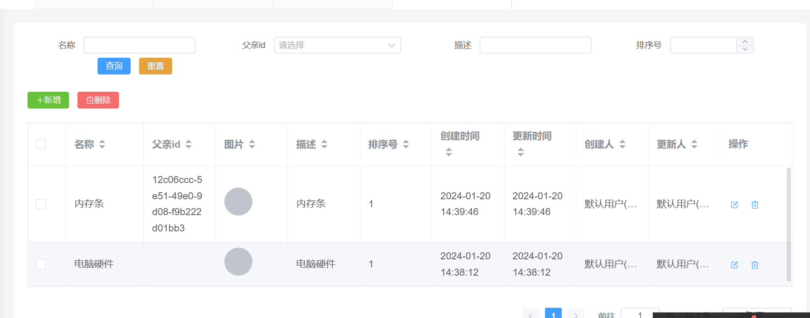

---
category:
  - 起凡商城
tag:
  - 商品管理
  - 商品类别

order: 1
date: 2024-01-18
timeline: true
---

# 商品类别

:::center

:::

## 建表

```sql
-- auto-generated definition
create table product_category
(
    id           varchar(36)  not null
        primary key,
    created_time datetime(6)  not null,
    edited_time  datetime(6)  not null,
    creator_id   varchar(36)  not null,
    editor_id    varchar(36)  not null,
    name         varchar(50)  not null,
    parent_id    varchar(36)  null,
    image        varchar(100) null,
    description  text         not null,
    sort_order   int          not null
);
```

## 实体类

```java
@GenEntity
@Entity
public interface ProductCategory extends BaseEntity {

  @GenField(value = "名称", order = 0)
  String name();

  @Null
  @GenField(value = "父亲id", order = 1)
  String parentId();

  @GenField(value = "图片", type = ItemType.PICTURE, order = 2)
  @Null
  String image();

  @GenField(value = "描述", order = 3)
  String description();

  @GenField(value = "排序号", order = 4)
  Integer sortOrder();
}
```

## 生成代码

参考[开发流程](../start/develop.md)

## 父亲类别选择

### 父亲类别查询

`product-category-store.ts`

```ts
export const categoryQueryOption = async (keyword: string, parentId: string) => {
  return (
    await api.productCategoryController.query({
      body: { query: { name: keyword, id: parentId } }
    })
  ).content
}
```

### 远程选择器

`product-category-create-form.vue`

```html
      <el-form-item label="父亲id" prop="parentId">
        <remote-select
          label-prop="name"
          :query-options="categoryQueryOption"
          v-model="createForm.parentId"
        ></remote-select>
      </el-form-item>
```

`product-category-query.vue`

```html
      <el-form-item label="父亲id">
        <remote-select
          label-prop="name"
          :query-options="categoryQueryOption"
          v-model="query.parentId"
        ></remote-select>
      </el-form-item>
```

`product-category-update-form.vue`

```html
      <el-form-item label="父亲id" prop="parentId">
        <remote-select
          label-prop="name"
          :query-options="categoryQueryOption"
          v-model="updateForm.parentId"
        ></remote-select>
      </el-form-item>
```
