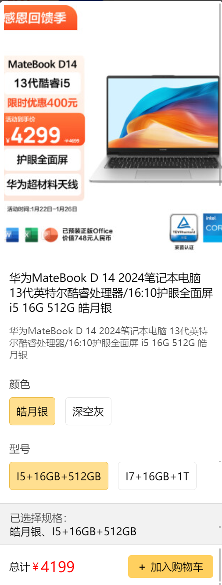

# 小程序商品sku选择



## 后端加载商品详情

::::tabs  
@tab Product

关联商品SKU

```java {5-6}
@Entity
@GenEntity
public interface Product extends BaseEntity {
    // 忽略...
  @OneToMany(mappedBy = "product")
  List<ProductSku> skuList();
}
```

@tab ProductRepository

@slidestart  

## 抓取商品SKU

```java [6]
public interface ProductRepository extends JRepository<Product, String> {

    // 忽略...
  ProductFetcher PRODUCT_SKU_FETCHER = ProductFetcher.$.allScalarFields()
      .categoryId()
      .skuList(ProductSkuFetcher.$.allScalarFields())
      .creator(UserFetcher.$.phone().nickname())
      .editor(UserFetcher.$.phone().nickname());
    // 忽略...
}
```

--

## 抓取其他字段

```java [4-8]
public interface ProductRepository extends JRepository<Product, String> {

    // 忽略...
  ProductFetcher PRODUCT_SKU_FETCHER = ProductFetcher.$.allScalarFields()
      .categoryId()
      .skuList(ProductSkuFetcher.$.allScalarFields())
      .creator(UserFetcher.$.phone().nickname())
      .editor(UserFetcher.$.phone().nickname());
    // 忽略...
}
```

@slideend

@tab ProductService

使用抓取器

```java {10}
@Service
@Slf4j
@AllArgsConstructor
@Transactional
public class ProductService {

  private final ProductRepository productRepository;

  public Product findById(String id) {
    return productRepository.findById(id, ProductRepository.PRODUCT_SKU_FETCHER)
        .orElseThrow(() -> new BusinessException(ResultCode.NotFindError, "数据不存在"));
  }
  // 忽略...
}
```

@tab ProductController

声明DTO类型, `PRODUCT_SKU_FETCHER`描述了需要从数据库中获取的字段.

```java {10}
@RestController
@RequestMapping("product")
@AllArgsConstructor
@DefaultFetcherOwner(ProductRepository.class)
public class ProductController {

  private final ProductService productService;

  @GetMapping("{id}")
  public @FetchBy(value = "PRODUCT_SKU_FETCHER") Product findById(@PathVariable String id) {
    return productService.findById(id);
  }
  // 忽略...
}
```

::::

## 使用SKU选择对话框组件

::::tabs
@tab html

- `:key="chosenProduct.id"`当点击不同的商品时，SKU对话框需要重新渲染，要不然上一个商品的数据缓存还在。

```html {2-7,12,18}
<template>
  <product-sku-dialog
    v-if="chosenProduct"
    :key="chosenProduct.id"
    v-model:visible="dialogVisible"
    :product="chosenProduct"
  ></product-sku-dialog>
  <walter-fall :data-list="pageData.content" class="product-walter-fall">
    <template #itemLeft="{ item }">
      <product-cover
        :product="item"
        @click="handleChoose(item.id)"
      ></product-cover>
    </template>
    <template #itemRight="{ item }">
      <product-cover
        :product="item"
        @click="handleChoose(item.id)"
      ></product-cover>
    </template>
  </walter-fall>
  <register-popup></register-popup>
</template>
```

:::tip
在vue中如果存在相同的key值，它会选择复用已有DOM元素而不是创建新的元素。这样可以节省内存，并且维持组件的状态。
:::

@tab ts

```ts
type ProductSkuFetcherDto = ProductDto["ProductRepository/PRODUCT_SKU_FETCHER"];
const chosenProduct = ref<ProductSkuFetcherDto>();
const dialogVisible = ref(false);
const handleChoose = (id: string) => {
  // 点击商品触发
  // 根据商品id获取详情
  api.productController.findById({ id }).then((res) => {
    dialogVisible.value = true;
    chosenProduct.value = res;
  });
};
```

::::
