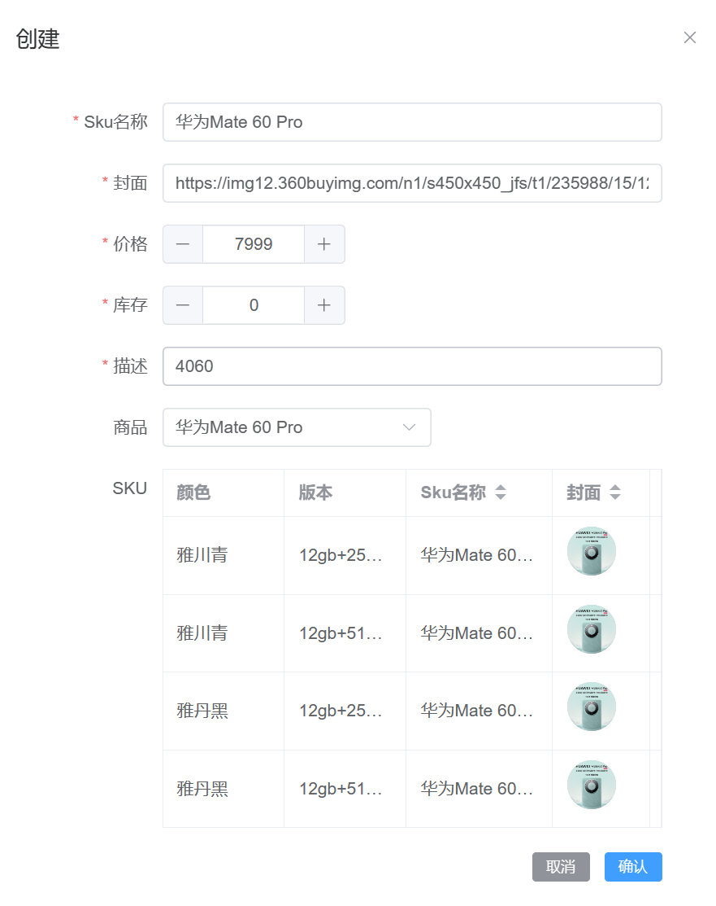

---
category:
  - 起凡商城
tag:
  - 商品管理
  - 商品SKU

order: 3
date: 2024-01-20
timeline: true
---
 

# 商品SKU

:::center

:::

## 建表

```sql
-- auto-generated definition
create table product_sku
(
    id           varchar(36)    not null
        primary key,
    created_time datetime(6)    not null,
    edited_time  datetime(6)    not null,
    creator_id   varchar(36)    not null,
    editor_id    varchar(36)    not null,
    `values`     varchar(255)   not null,
    name         varchar(255)   not null,
    product_id   varchar(255)   not null,
    cover        varchar(255)   null,
    price        decimal(38, 2) null,
    stock        int            null,
    description  varchar(255)   null
);
```

## 实体类

```java
@GenEntity
@Entity
public interface ProductSku extends BaseEntity {

  @Column(name = "`values`")
  @Key
  @Serialized
  List<String> values();

  @GenField(value = "Sku名称", order = 0)
  String name();

  @ManyToOne
  @OnDissociate(DissociateAction.DELETE)
  @Key
  Product product();

  @IdView
  @GenField(value = "商品", order = 1)
  String productId();

  @GenField(value = "封面", type = ItemType.PICTURE, order = 2)
  String cover();

  @NotNull
  @GenField(value = "价格", type = ItemType.INPUT_NUMBER, order = 3)
  BigDecimal price();

  @GenField(value = "库存", order = 4)
  int stock();

  @GenField(value = "描述", order = 5)
  String description();
}
```

## 生成代码

参考[开发流程](../start/develop.md)

## 关联商品

### 修改Dto

`ProductSku.dto`

```text
input ProductSkuInput {
    #allScalars(ProductSku)
    productId
    id? 
}
```

### 商品查询

`product-store.ts`

```ts
export const productQueryOption = async (keyword: string, id: string) => {
  return (
    await api.productController.query({
      body: { query: { name: keyword, id } }
    })
  ).content
}
```

### 商品选择

```html
      <el-form-item label="商品" prop="product">
        <remote-select
          label-prop="name"
          :query-options="productQueryOption"
          :model-value="createForm.productId"
          @update:model-value="handleProductChange"
        ></remote-select>
      </el-form-item>
```

### 复用商品信息

商品sku的默认值可以用关联的商品信息填写. 选择完商品后得到商品的id,请求数据得到商品信息. 将商品信息复制给sku创建表单

```ts
const handleProductChange = (id: string) => {
  api.productController.findById({ id }).then((res) => {
    createForm.value = {
      ...createForm.value,
      ..._.pick(res, ['price', 'cover', 'name', 'description'])
    }
    createForm.value.productId = id
  })
}
```

## sku创建

sku的生成是基于商品的属性进行排列组合生成的. 如手机sku, (黑色, 8gb+256gb),(白色, 8gb+256gb), (黑色, 12gb+512gb), (白色, 12gb+512gb).

### 存储商品属性

```ts
const attributes = ref<Attribute[]>([])
const skuList = ref<ProductSkuInput[]>([])
const handleProductChange = (id: string) => {
  api.productController.findById({ id }).then((res) => {
    attributes.value = res.attributes
    // 忽略...
  })
}
```

### 生成sku

`product-sku-create-table.vue`

```vue
<script lang="ts" setup>
import { computed, watch } from 'vue'
import type { KeyValue, ProductSkuInput } from '@/apis/__generated/model/static'
import type { Scope } from '@/typings'
import _ from 'lodash'

type ProductSku = ProductSkuInput & {
  [index: string]: string | string[] | number
}
type ProductSkuScope = Scope<ProductSku>

const props = withDefaults(
  defineProps<{
    attributes: KeyValue[]
    skuList: ProductSkuInput[]
  }>(),
  {
    attributes: () => {
      return []
    },
    skuList: () => {
      return []
    }
  }
)
const emit = defineEmits<{ 'update:skuList': [skuList: ProductSku[]] }>()
const initSku: ProductSku = {
  productId: '',
  cover: '',
  description: '',
  name: '',
  price: 0,
  stock: 0,
  values: []
}
// 递归排列组合
const deep = (sku: ProductSku, depth: number, attrList: KeyValue[]) => {
  const list: ProductSku[] = []
  if (attrList.length === 0) {
    return []
  }
  if (depth === attrList.length) {
    return [_.cloneDeep(sku)]
  }
  const attribute = attrList[depth]
  if (attribute.values.length === 0) return []
  // 获取每个属性的值(选择的)，将各个属性的值进行组合
  const attrValues = attribute.values
  attrValues.forEach((value) => {
    // sku对象新增字段，字段的名字是属性的名字。比如 {"糖份"："多糖"}
    sku[attribute.name] = value
    // 加入当前属性的参数
    sku.values.push(value)
    // 获取下一个属性的参数
    list.push(...deep(sku, depth + 1, attrList))
    // 弹出当前属性的参数，准备加入当前属性的下一个参数
    sku.values.pop()
  })
  return list
}

// 计算函数，将下面的sku格式转成前端的表格读取格式。
// [{"values": ["黑色", "8gb+256"]},{"values": ["白色", "8gb+256"]}]
// -> [{"颜色": "黑色", "型号": "8gb+256"},{"颜色": "白色", "型号": "8gb+256"}]
const skuArray = computed(() => {
  return props.skuList.map((sku) => {
    const row: ProductSku = { ...sku }
    // attributes=[{"name" :"颜色", "values": ["黑色", "白色"]}, {"name" : "型号", "values": ["8gb+256", "128gb"]}]
    // 可以看到sku中values各个值的索引在attributes中可以对应属性名称。如 黑色(0) 用0在attributes中找到对应属性名称即"颜色"。
    sku.values.forEach((attrValue, index) => {
      row[props.attributes[index].name] = attrValue
    })
    return row
  })
})
watch(
  () => props.attributes,
  (value, oldValue) => {
    // 第一次加载时使用默认的skuList不需要重新生成
    if (oldValue.length === 0 && props.skuList.length > 0) {
      return
    }
    const skuList = deep({ ...initSku }, 0, props.attributes)
    console.log(skuList)
    // 当属性修改时重新生成skuList
    emit('update:skuList', skuList)
  },
  { deep: true }
)
</script>
<template>
  <el-table ref="table" :data="skuArray" :border="true">
    <el-table-column
      v-for="attribute in attributes"
      :key="attribute.name"
      :prop="attribute.name"
      :label="attribute.name"
      minWidth="100"
      show-overflow-tooltip
    >
    </el-table-column>
    <el-table-column
      label="Sku名称"
      prop="name"
      sortable="custom"
      min-width="120"
      show-overflow-tooltip
    >
      <template v-slot:default="{ row }: ProductSkuScope">
        {{ row.name }}
      </template>
    </el-table-column>
    <el-table-column label="封面" prop="cover" sortable="custom" min-width="80">
      <template v-slot:default="{ row }: ProductSkuScope">
        <ElAvatar :src="row.cover"></ElAvatar>
      </template>
    </el-table-column>
    <el-table-column
      label="价格"
      prop="price"
      sortable="custom"
      min-width="80"
      show-overflow-tooltip
    >
      <template v-slot:default="{ row }: ProductSkuScope">
        {{ row.price }}
      </template>
    </el-table-column>
    <el-table-column
      label="库存"
      prop="stock"
      sortable="custom"
      min-width="80"
      show-overflow-tooltip
    >
      <template v-slot:default="{ row }: ProductSkuScope">
        {{ row.stock }}
      </template>
    </el-table-column>
    <el-table-column
      label="描述"
      prop="description"
      sortable="custom"
      min-width="120"
      show-overflow-tooltip
    >
      <template v-slot:default="{ row }: ProductSkuScope">
        {{ row.description }}
      </template>
    </el-table-column>
  </el-table>
</template>

<style lang="scss" scoped>
.create-form {
  margin-right: 30px;
}
</style>
```

### 初始化sku信息

如果用户编辑了sku表单,则把表单中的信息赋值给skuList

```ts
watch(
  () => createForm.value,
  () => {
    skuList.value = skuList.value.map((sku) => {
      console.log(sku.values)
      return { ...sku, ...createForm.value, values: sku.values }
    })
  },
  {
    deep: true
  }
)

```

sku是在用户选择关联的商品之后才会出现的, attributes赋值完之后会生成skuList. nextTick就是等待页面渲染完成之后再执行,这样可以保证skuList已经生成了, createFrom复用product的基础信息, 上面的watch又会更新skuList.

```ts
const handleProductChange = (id: string) => {
  api.productController.findById({ id }).then((res) => {
    attributes.value = res.attributes
    nextTick(() => {
      createForm.value = {
        ...createForm.value,
        ..._.pick(res, ['price', 'cover', 'name', 'description'])
      }
      createForm.value.productId = id
    })
  })
}

```

## 组合值查询条件

### 修改dto

```text
specification ProductSkuSpec {
    #allScalars
    like/i(name)
    like/i(description)
    like/i(cover)
    like/i(id)
    // 新增查询字段
    valueStr: String?
    ge(editedTime)
    le(editedTime)
    ge(createdTime)
    le(createdTime)
}
```

### 模糊查询

jimmer中提供的查询条件满不足不了需求, 下面可以自定sql动态拼接到where中. values字段在实体类中是`List<String>`, 在数据库是`varchar`. jimmer不支持对`List<String>`like查询, 但是在数据库层面是可以的, 因此这种情况我们直接拼接原生sql进行查询.

`ProductSkuRepository`

```java
        .whereIf(StringUtils.hasText(query.getValueStr()),
            Predicate.sql("%e like %v", it -> {
              it.expression(productSkuTable.values())
                  .value("%" + query.getValueStr() + "%");
            }))
```

### 查询项

`product-sku-query`

```html
      <el-form-item label="属性组合值">
        <el-input v-model="query.valueStr"></el-input>
      </el-form-item>
```
