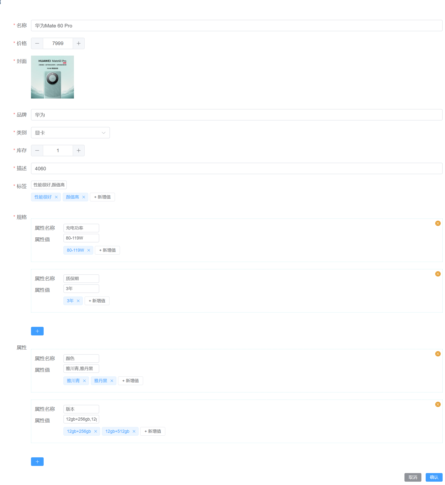

---
category:
  - 起凡商城
tag:
  - 商品管理
  - 商品信息

order: 2
date: 2024-01-19
timeline: true
---


# 商品管理



## 建表

```sql
-- auto-generated definition
create table product
(
    id             varchar(36)    not null
        primary key,
    created_time   datetime(6)    not null,
    edited_time    datetime(6)    not null,
    creator_id     varchar(36)    not null,
    editor_id      varchar(36)    not null,
    name           varchar(255)   not null,
    price          decimal(10, 2) not null,
    cover          varchar(255)   not null,
    brand          varchar(255)   not null,
    category_id    varchar(36)    not null,
    stock          int            not null,
    description    text           not null,
    tags           varchar(255)   not null,
    specifications text           not null,
    attributes     text           not null
);
```

## 实体类

对应前端传来的键值对.

```java
@Data
public class KeyValue {

  private String name;
  private List<String> values;
}
```

在mysql数据库肯定是不支持键值对和列表的数据结构. 所以实际存储的时候会把键值对序列号成json字符串存储.
因此你可以看到表结构中`tags`,`specifications`,`attributes`都是属于字符型. 当是在java代码中它是string类型.

这种映射方式请参考jimmer中的[json映射](https://babyfish-ct.gitee.io/jimmer-doc/docs/mapping/advanced/json)

```java
@Entity
@GenEntity
public interface Product extends BaseEntity {

  @GenField(value = "名称", order = 0)
  String name();

  @NotNull
  @GenField(value = "价格", type = ItemType.INPUT_NUMBER, order = 1)
  BigDecimal price();

  @GenField(value = "封面", type = ItemType.PICTURE, order = 2)
  String cover();

  @GenField(value = "品牌", order = 3)
  String brand();

  @ManyToOne
  ProductCategory category();

  @IdView
  @GenField(value = "类别", order = 4)
  String categoryId();

  @GenField(value = "库存", order = 5, type = ItemType.INPUT_NUMBER)
  int stock();

  @GenField(value = "描述", order = 6)
  String description();

  @GenField(value = "标签", order = 7)
  @Serialized
  List<String> tags();

  @GenField(value = "规格", order = 8)
  @Serialized
  List<KeyValue> specifications();

  @GenField(value = "属性", order = 9)
  @Serialized
  List<KeyValue> attributes();
}
```

:::info
[@Serialized](https://babyfish-ct.gitee.io/jimmer-doc/docs/mapping/advanced/json)
:::

## 生成代码

参考[开发流程](../start/develop.md)

## 商品类别选择

### 修改Dto

`Product.dto`

```text
input ProductInput {
    #allScalars(Product)
    // 接受categoryId
    categoryId
    id?
}
```

### 远程选择器

[categoryQueryOption](./product-category.md/#父亲类别查询)

```html
      <el-form-item label="类别" prop="categoryId">
        <remote-select
          label-prop="name"
          :query-options="categoryQueryOption"
          v-model="createForm.categoryId"
        ></remote-select>
      </el-form-item>
```

## 标签输入

```html
      <el-form-item label="标签" prop="tags">
        <value-input v-model="createForm.tags"></value-input>
      </el-form-item>
```

:::info
[标签输入组件](../reference/front/README.md/#标签列表输入组件)
:::

## 规格输入

规格输入相当于购买商品时的参数. 如屏幕分别率: 1080p. 质保期: 3年. 等等这些比较杂的参数可以放在规格里面进行展示

在输入规格时相当于是输入键值对,值可以有多个.

```html
      <el-form-item label="规格" prop="specifications">
        <key-value-input v-model="createForm.specifications"></key-value-input>
      </el-form-item>
```

:::info
[键值对输入组件](../reference/front/README.md/#键值对输入组件)
:::

## 属性输入

在我们购买商品时需要选择商品的属性后才会出现对应的价格,比如购买手机时选择 颜色: 黑色, 型号: 8gb+256gb.

上面的例子中,颜色和型号都是属于手机号的属性,每个属性可以对应多个值.当这些不同属性的值进行排列组合之后才是购买时的商品.

```html
      <el-form-item label="属性" prop="attributes">
        <key-value-input v-model="createForm.attributes"></key-value-input>
      </el-form-item>
```

:::info
[键值对输入组件](../reference/front/README.md/#键值对输入组件)
:::
