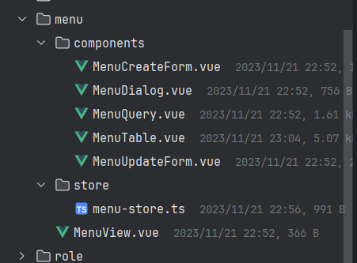

# 代码生成器

## 注解

### @GenEntity

```java
@Target(ElementType.TYPE)
@Retention(RetentionPolicy.RUNTIME)
public @interface GenEntity {

}

```

在需要生成增删改查的实体类上添加该注解。

### @GenField

```java
@Retention(RetentionPolicy.RUNTIME)
@Inherited
@Target({ElementType.METHOD, ElementType.FIELD})
public @interface GenField {

    // 字段注释
    String value() default "";

    // 生成前端表单时选用的组件根据此字段生成。比如：ElInput,ELInputNumber
    ItemType type() default ItemType.AUTO;

    // 字段的展示顺序
    int order() default 9999;

    // 当类型为下拉框时，填写字典编号
    int dictId() default 0;
}
```

生成字段的类型如下，每一种字段类型在前端对应的组件也不一样。

```java
@Getter
public enum ItemType {
    AUTO(-2,"自动判断"),
    SELECTABLE(0, "下拉框"),
    INPUT_TEXT(1, "文本输入框"),
    INPUT_TEXT_AREA(2, "文本域"),
    INPUT_NUMBER(3, "数字输入框"),
    PICTURE(4, "图片"),
    DATETIME(5, "日期"),
    NONE(-1,"不生成");

    private final Integer code;
    private final String name;

    ItemType(Integer code, String name) {
        this.code = code;
        this.name = name;
    }
}
```

## 后端模板

<center>


图1 后端模板结构
</center>

- [dto](https://babyfish-ct.gitee.io/jimmer-doc/docs/object/view/dto-language/#3-viewinput%E5%92%8Cspecification)：根据entity生成dto
    - Input：inputDto用于接收前端的参数，比如修改和创建场景，可以定义哪些字段不能为空。
    - Spec：specDto用于前端的查询，因为查询条件字段不一定对应实体的字段，且查询条件的字段都是可选的。
- controller：save（创建，更新）、findById（根据id查询）、query（查询）、delete(批量删除).
- service：对应controller中的api。
- repository：jimmer通用增删改查。
- entity：对应数据库的表

### [Dto](https://babyfish-ct.gitee.io/jimmer-doc/docs/object/view/dto-language)

Dto语言是jimmer的一个强大功能，你可以通过几行简单的描述为不同的业务场景创建Dto。具体的语法可以参考官网。

#### Input

`#allScalars(Menu)`：取得Menu实体类中的所有字段

`id?`：增加id字段（？代表可选）

#### Spec

`#allScalars`：生成Menu实体类中所有字段的查询条件，包含其父类BaseEntity（id, createdTime, editedTime）。

`like/i(name)`：由于生成的默认查询条件是"相等"，如果你想自定义某个字段的判断条件，
可以像我一样在下面补充`like/i(name)`覆盖掉默认的比较条件改成左右模糊查询。ge, le等等...

这个功能叫[超级QBE](https://babyfish-ct.gitee.io/jimmer-doc/docs/query/super_qbe)，也是jimmer提供的一个强大功能，结合Dto语言的灵活表达能力可以快速生成各种查询条件。

```text
input MenuInput {
    #allScalars(Menu)
    id?
}

specification MenuSpec {
    #allScalars
    like/i(name)
    like/i(parentId)
    like/i(id)
    ge(editedTime)
    le(editedTime)
    ge(createdTime)
    le(createdTime)
}
```

### Repository

[`MenuTable`](https://babyfish-ct.gitee.io/jimmer-doc/docs/query/dynamic-where)对象包含了相关查询条件，可以参考jimmer官方文档，使用`MenuTable`对象可以快速的编程动态查询条件。

[`MenuFetcher`](https://babyfish-ct.gitee.io/jimmer-doc/docs/query/object-fetcher/)对象用于抓取任意的字段甚至是关联对象的任意字段。下面代码中的`COMPLEX_FETCHER`代表选择Menu表中的所有字段。

[`MenuSpec`](https://babyfish-ct.gitee.io/jimmer-doc/docs/query/super_qbe)之前介绍过Spec对象，它的dto类型中的一种，专门为查询服务。既然这种dto的面向查询而生，那当前端在Spec对象中填写了值时，可否相应的生成相应的查询条件？
答案是可以的，这个功能在jimmer中叫超级QBE，可以参考官方文档。

`Pageable`SpringData中的分页对象，Jimmer提供了Repository风格所以这边可以使用SpringData中的分页对象。

`.orderBy(SpringOrders.toOrders(menuTable, pageable.getSort()))`代表动态的orderBy，前端的表格中可以传需要排序的列。

```java
public interface MenuRepository extends JRepository<Menu, String> {
    MenuTable menuTable = MenuTable.$;
    MenuFetcher COMPLEX_FETCHER = MenuFetcher.$.allScalarFields();

    /**
     * @param queryRequest 查询条件
     * @param fetcher 字段选择器，可以选择任意字段
     * @return 分页结果
     */
    default Page<Menu> findPage(QueryRequest<MenuSpec> queryRequest, Fetcher<Menu> fetcher) {
        MenuSpec query = queryRequest.getQuery();
        Pageable pageable = queryRequest.toPageable();
        return pager(pageable).execute(sql().createQuery(menuTable)
                .where(query)
                .orderBy(SpringOrders.toOrders(menuTable, pageable.getSort()))
                .select(menuTable.fetch(fetcher)));
    }
}
```

### Service

在`findById`中第二个参数传入的是Fetcher对象，代表你需要选择那些字段。`MenuRepository.COMPLEX_FETCHER`是定义在[`Repository`](#repository)中的通用字段选择器

```java
@Service
@Slf4j
@AllArgsConstructor
public class MenuService {
    private final MenuRepository menuRepository;

    public Menu findById(String id) {
        return menuRepository.findById(id, MenuRepository.COMPLEX_FETCHER).orElseThrow(() -> new BusinessException(ResultCode.NotFindError, "数据不存在"));
    }

    public String save(MenuInput menuInput) {
        return menuRepository.save(menuInput).id();
    }

    public Page<Menu> query(QueryRequest<MenuSpec> queryRequest) {
        return menuRepository.findPage(queryRequest, MenuRepository.COMPLEX_FETCHER);
    }

    public boolean delete(List<String> ids) {
        menuRepository.deleteAllById(ids);
        return true;
    }
}
```

### Controller

controller对外提供增删改查。

`@FetchBy(value = "SIMPLE_FETCHER", ownerType = MenuRepository.class)`的作用是告诉前端该接口返回了哪些字段。具体返回了哪些字段那就是取决于Fetcher对象了。
[`MenuRepository`](#repository)中定义了通用字段选择器`COMPLEX_FETCHER`其实相当于定义了一种返回类型。可以参考[Typescript类型生成器](#前端typescriptapi生成器)

`QueryRequest<MenuSpec>`接收前端的分页查询

```java
@RestController
@RequestMapping("menu")
@AllArgsConstructor
public class MenuController {
    private final MenuService menuService;

    @GetMapping("{id}")
    public @FetchBy(value = "COMPLEX_FETCHER", ownerType = MenuRepository.class) Menu findById(@PathVariable String id) {
        return menuService.findById(id);
    }

    @PostMapping("query")
    public Page<@FetchBy(value = "COMPLEX_FETCHER", ownerType = MenuRepository.class) Menu> query(@RequestBody QueryRequest<MenuSpec> queryRequest) {
        return menuService.query(queryRequest);
    }

    @PostMapping("save")
    public String save(@RequestBody MenuInput menu) {
        return menuService.save(menu);
    }

    @PostMapping("delete")
    public boolean delete(@RequestBody List<String> ids) {
        return menuService.delete(ids);
    }
}
```

## 前端模板

<center>


图2 前端模板结构
</center>

- view：展示页面
- query：查询框
- table：数据展示
- dialog：对话框，内涵create表单和update表单。
- createForm：创建表单
- updateForm：更新表单
- store：状态管理

### View

<center>


图3 展示页面
</center>

View页面内包含了Query, Table, Dialog。三个组件。View页面组合这些组件并将页面注册到路由中用于访问。
```vue
<script lang="ts" setup>
import MenuTable from './components/MenuTable.vue'
import MenuQuery from './components/MenuQuery.vue'
import MenuDialog from './components/MenuDialog.vue'
</script>
<template>
  <div>
    <MenuQuery></MenuQuery>
    <MenuDialog></MenuDialog>
    <MenuTable></MenuTable>
  </div>
</template>

<style lang="scss" scoped></style>

```
### Query


Query组件点击查询会携带当前的条件去分页请求数组并且刷新表格`menuStore.reloadTableData({ query: query, likeMode: 'ANYWHERE' })`。

```vue
<script lang="ts" setup>
import { toRefs } from 'vue'
import { useMenuStore } from '../store/menu-store'
import { storeToRefs } from 'pinia'
import DictSelect from '@/components/dict/DictSelect.vue'

const menuStore = useMenuStore()
const { queryData } = storeToRefs(menuStore)
const { query } = toRefs(queryData.value)
</script>
<template>
  <div class="search">
    <el-form inline label-width="80" size="small">
      <el-form-item label="菜单名称">
        <el-input v-model="query.name"></el-input>
      </el-form-item>
      <el-form-item label="父菜单Id">
        <el-input v-model="query.parentId"></el-input>
      </el-form-item>
      <el-form-item label="排序号">
        <el-input v-model="query.orderNum"></el-input>
      </el-form-item>
      <el-form-item label="菜单类型">
        <dict-select :dict-id="1002" v-model="query.menuType"></dict-select>
      </el-form-item>
      <el-form-item label=" ">
        <div class="btn-wrapper">
          <el-button
                  type="primary"
                  size="small"
                  @click="menuStore.reloadTableData({ query: query, likeMode: 'ANYWHERE' })"
          >
            查询
          </el-button>
          <el-button type="warning" size="small" @click="menuStore.restQuery()"> 重置</el-button>
        </div>
      </el-form-item>
    </el-form>
  </div>
</template>

<style lang="scss" scoped>
  :deep(.el-form-item) {
    margin-bottom: 5px;
  }

  .search {
    display: flex;
    flex-flow: column nowrap;
    width: 100%;

    .btn-wrapper {
      margin-left: 20px;
    }
  }
</style>

```

:::info
[useMenuStore](#store) MenuStore中包含query查询条件。双向绑定到Query组件。
:::

### Table


Table组件有如下功能

1. 使用ElPagination分页加载数据：`loadTableData`
2. 点击新增/编辑按钮弹出对话框：`handleEdit`，`handleCreate`
3. 多选/单选删除：`handleBatchDelete`，`handleSingleDelete`，` onSelection-change={handleSelectChange}（多选）`
4. 点击列头可以升序/降序排序数据（后端排序）：`onSort-change={handleSortChange}`
5. 请求后端数据时显示加载动画：`v-loading={tableData.value.loading}`

```vue
<script lang="ts" setup>
import { onMounted } from 'vue'
import { storeToRefs } from 'pinia'
import { assertSuccess } from '@/utils/common'
import { api } from '@/utils/api-instance'
import { ElMessageBox } from 'element-plus'
import type { Scope } from '@/typings'
import { useMenuStore } from '../store/menu-store'
import type { MenuDto } from '@/api/__generated/model/dto'
import type { MenuInput } from '@/api/__generated/model/static'
import { Delete, Edit, Plus } from '@element-plus/icons-vue'
import DictColumn from '@/components/dict/DictColumn.vue'

type MenuScope = Scope<MenuDto['MenuRepository/COMPLEX_FETCHER']>
const menuStore = useMenuStore()
const {
  loadTableData,
  reloadTableData,
  openDialog,
  handleSortChange,
  handleSelectChange,
  getTableSelectedRows
} = menuStore
const { pageData, loading, queryRequest, table, updateForm, createForm } = storeToRefs(menuStore)
onMounted(() => {
  reloadTableData()
})
const handleEdit = (row: MenuDto['MenuRepository/COMPLEX_FETCHER']) => {
  openDialog('UPDATE')
  updateForm.value = row
}
const handleCreate = () => {
  openDialog('CREATE')
  createForm.value = menuStore.initForm
}
const handleSingleDelete = (row: { id: string }) => {
  handleDelete([row.id])
}
const handleBatchDelete = () => {
  handleDelete(
    getTableSelectedRows().map((row) => {
      return row.id || ''
    })
  )
}
const handleDelete = (ids: string[]) => {
  ElMessageBox.confirm('此操作将删除数据且无法恢复, 是否继续?', '警告', {
    confirmButtonText: '确定',
    cancelButtonText: '取消',
    type: 'warning'
  }).then(() => {
    api.menuController.delete({ body: ids }).then((res) => {
      assertSuccess(res).then(() => reloadTableData())
    })
  })
}
</script>
<template>
  <div>
    <div class="button-section">
      <el-button type="success" size="small" @click="handleCreate()">
        <el-icon>
          <plus />
        </el-icon>
        新增
      </el-button>
      <el-button type="danger" size="small" @click="handleBatchDelete">
        <el-icon>
          <delete />
        </el-icon>
        删除
      </el-button>
    </div>
    <el-table
      ref="table"
      :data="pageData.content"
      :border="true"
      @selection-change="handleSelectChange"
      @sort-change="handleSortChange"
      v-loading="loading"
    >
      <el-table-column type="selection" width="55"></el-table-column>
      <el-table-column label="菜单名称" prop="name" sortable="custom">
        <template v-slot:default="{ row }: MenuScope">
          {{ row.name }}
        </template>
      </el-table-column>
      <el-table-column label="父菜单Id" prop="parentId" sortable="custom">
        <template v-slot:default="{ row }: MenuScope">
          {{ row.parentId }}
        </template>
      </el-table-column>
      <el-table-column label="排序号" prop="orderNum" sortable="custom">
        <template v-slot:default="{ row }: MenuScope">
          {{ row.orderNum }}
        </template>
      </el-table-column>
      <el-table-column label="菜单类型" prop="menuType" sortable="custom">
        <template v-slot:default="{ row }: MenuScope">
          <dict-column :dict-id="1002" :value="row.menuType"></dict-column>
        </template>
      </el-table-column>
      <el-table-column label="图标" prop="icon" sortable="custom">
        <template v-slot:default="{ row }: MenuScope">
          <el-avatar :src="row.icon" alt=""></el-avatar>
        </template>
      </el-table-column>
      <el-table-column label="操作" fixed="right" width="{280}">
        <template v-slot:default="{ row }">
          <div>
            <el-button class="edit-btn" link size="small" type="primary" @click="handleEdit(row)">
              <el-icon>
                <edit />
              </el-icon>
            </el-button>
            <el-button
              class="delete-btn"
              link
              size="small"
              type="primary"
              @click="handleSingleDelete(row)"
            >
              <el-icon>
                <delete />
              </el-icon>
            </el-button>
          </div>
        </template>
      </el-table-column>
    </el-table>
    <div class="page">
      <el-pagination
        style="margin-top: 30px"
        :current-page="queryRequest.pageNum"
        :page-size="queryRequest.pageSize"
        :page-sizes="[10, 20, 30, 40, 50]"
        :total="pageData.totalElements"
        background
        small
        layout="prev, pager, next, jumper, total, sizes"
        @current-change="(pageNum) => loadTableData({ pageNum })"
        @size-change="(pageSize) => loadTableData({ pageSize })"
      />
    </div>
  </div>
</template>

<style lang="scss" scoped>
.button-section {
  margin: 20px 0;
}

.page {
  display: flex;
  justify-content: flex-end;
}
</style>
```

:::info
[useMenuStore](#store) MenuStore中包含Table组件中通用的pageData（分页结果），queryRequest（分页请求），table（ElTable实例），loading（加载动画控制）以及其他函数。
:::

### Dialog


点击编辑或者新增按钮时，会修改Store中的dialogData。由于Dialog和Table中使用的都是全局状态管理共享dialogData变量。因此Dialog会弹出，对话框内部根据是编辑还是新增显示updateFrom或者createForm。

```vue
<script lang="ts" setup>
import { type Component } from 'vue'
import { storeToRefs } from 'pinia'
import { useMenuStore } from '../store/menu-store'
import MenuCreateForm from './MenuCreateForm.vue'
import MenuUpdateForm from './MenuUpdateForm.vue'
import type { EditMode } from '@/typings'
const menuStore = useMenuStore()
const { dialogData } = storeToRefs(menuStore)

const formMap: Record<EditMode, Component> = {
  CREATE: MenuCreateForm,
  UPDATE: MenuUpdateForm
}
</script>
<template>
  <div>
    <el-dialog v-model="dialogData.visible" :title="dialogData.title" :width="dialogData.width">
      <component :is="formMap[dialogData.mode]"></component>
    </el-dialog>
  </div>
</template>

<style lang="scss" scoped></style>
```

:::info
[useMenuStore](#store) MenuStore中包含Dialog组件中通用的dialogData以及其他函数。
:::

### UpdateForm

更新表单功能如下

1. 监听对话框是否打开，打开则执行init方法，根据id请求数据：`watch`。
2. 请求数据之后需要将后端返回的数据转成前端可以使用的格式：`..._.omitBy(后端数据,_.isNull)`。
3. 提交表单时对数据进行处理，提交成功后关闭对话框并刷新表格：`handleConfirm`。

```vue
<script lang="ts" setup>
import { storeToRefs } from 'pinia'
import { watch } from 'vue'
import { useMenuStore } from '../store/menu-store'
import { assertSuccess } from '@/utils/common'
import _ from 'lodash'
import { api } from '@/utils/api-instance'
import AvatarUpload from '@/components/avatar/AvatarUpload.vue'
import FooterButton from '@/components/base/dialog/FooterButton.vue'
import DictSelect from '@/components/dict/DictSelect.vue'

const menuStore = useMenuStore()
const { closeDialog, reloadTableData } = menuStore
const { updateForm, dialogData } = storeToRefs(menuStore)
const init = async () => {
  dialogData.value.title = '编辑'
  updateForm.value = {
    ...updateForm.value,
    ..._.omitBy(await api.menuController.findById({ id: updateForm.value.id || '' }), _.isNull)
  }
}
watch(
  () => dialogData.value.visible,
  (value) => {
    if (value) {
      init()
    }
  },
  { immediate: true }
)
const handleConfirm = () => {
  api.menuController.save({ body: updateForm.value }).then(async (res) => {
    assertSuccess(res).then(() => {
      closeDialog()
      reloadTableData()
    })
  })
}
</script>
<template>
  <div class="update-form">
    <el-form labelWidth="120" class="form">
      <el-form-item label="菜单名称">
        <el-input v-model="updateForm.name"></el-input>
      </el-form-item>
      <el-form-item label="父菜单Id">
        <el-input v-model="updateForm.parentId"></el-input>
      </el-form-item>
      <el-form-item label="排序号">
        <el-input-number v-model="updateForm.orderNum"></el-input-number>
      </el-form-item>
      <el-form-item label="菜单类型">
        <dict-select :dict-id="1002" v-model="updateForm.menuType"></dict-select>
      </el-form-item>
      <el-form-item label="图标">
        <AvatarUpload v-model:avatar="updateForm.icon"></AvatarUpload>
      </el-form-item>
    </el-form>
    <FooterButton @close="closeDialog" @confirm="handleConfirm"></FooterButton>
  </div>
</template>

<style lang="scss" scoped>
.update-form {
  margin-right: 30px;
}
</style>

```

:::info
[useMenuStore](#store) MenuStore中包含Form组件中通用的updateForm
:::

### CreateForm

创建表单和更新表单类似。

### Store

Store同一管理Query,Table,Dialog,Form中涉及的通用变量。方便各个组件都可以对这些变量进行修改。比如当点击新增按钮时，Table组件会修改dialogData打开Dialog。

:::info
针对增删改查中场景的变量用组合式的思想抽取出来，方便后续快速编写增删改查。
[useTableHelper](../front/README.md/#tablehelper) 抽取Table中常用的变量和函数。
[useDialogHelper](../front/README.md/#dialoghelper) 抽取Dialog中常用的变量和函数。
[useQueryHelper](../front/README.md/#queryhelper) 抽取Query中的通用变量和函数。
:::

```ts
import { defineStore } from 'pinia'
import { useTableHelper } from '@/components/base/table/table-helper'
import { useDialogHelper } from '@/components/base/dialog/dialog-helper'
import { useQueryHelper } from '@/components/base/query/query-helper'
import type { MenuInput, MenuSpec } from '@/api/__generated/model/static'
import { api } from '@/utils/api-instance'
import { ref } from 'vue'
import type { MenuDto } from '@/api/__generated/model/dto'

export const useMenuStore = defineStore('menu', () => {
  const initQuery: MenuSpec = {}
  const initForm: MenuInput = { menuType: '', name: '', parentId: '' }
  const tableHelper = useTableHelper(api.menuController.query, api.menuController, initQuery)
  const dialogHelper = useDialogHelper()
  const queryHelper = useQueryHelper<MenuSpec>(initQuery)
  const updateForm = ref({} as MenuDto['MenuRepository/COMPLEX_FETCHER'])
  const createForm = ref<MenuInput>(initForm)
  return { ...tableHelper, ...dialogHelper, ...queryHelper, updateForm, createForm, initForm }
})
```

## 前端TypescriptAPI生成器

你可以看到上面的模板中有`api.menuController.query`，`api.menuController.delete`等与后端controller对应的api，这些如果让自己去写ts定义显然是很累人的一件事。好消息是jimmer提供了[ts生成器](https://babyfish-ct.gitee.io/jimmer-doc/docs/spring/client/api#%E7%94%9F%E6%88%90%E5%AE%A2%E6%88%B7%E7%AB%AF%E4%BB%A3%E7%A0%81)。
只需要运行`npm run api`就会调用`scripts/generate-api.js`生成代码。