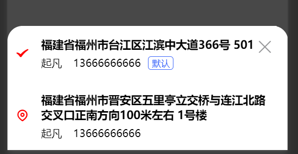

---
category:
  - 起凡商城
tag:
  - 地址
  - 地址选择
order: 0
date: 2024-01-28
timeline: true
---
# 地址选择

该组件用于从地址列表中选择地址。通过弹出框显示地址列表，用户点击地址后，会更新选择的地址并发出选择事件。该组件还会在加载时从API获取用户地址列表，并设置第一个地址作为默认选择。



## 源码解析

### 展示地址

:::tabs
@tab html

- `<nut-popup>`：使用外部库的弹出框组件，可以显示一组地址列表。
- 地址列表：使用`v-for`循环遍历`addressList`中的地址，并在每个地址上添加`address-wrapper`类。点击地址时，调用`handleChoose`方法。
- `<check>`和`<location2>`：这两个组件分别表示选中和未选中的图标，具体取决于当前地址是否与`chosenAddress`相匹配。
- `<address-row>`：这是一个组件，用于显示地址的详细信息。

```html
<template>
  <div class="address-choose">
    <!-- 弹出地址列表 -->
    <nut-popup
      :visible="visible"
      @update:visible="(value) => emit('update:visible', value)"
      position="bottom"
      closeable
      round
    >
      <!-- 点击地址向外发送选择事件，事件内包含了选中的地址信息 -->
      <div
        class="address-wrapper"
        :key="address.id"
        v-for="address in addressList"
        @click="handleChoose(address)"
      >
        <!-- 判断是否选中，选中则显示选中图标 -->
        <check color="red" v-if="address.id == chosenAddress.id"></check>
        <location2 color="red" v-else></location2>
        <!-- 展示地址信息 -->
        <address-row class="address" :address="address"> </address-row>
      </div>
    </nut-popup>
  </div>
</template>
```

@tab ts

- `defineProps`：`visible` 和 emit `update:visible`配合起来可以实现双向绑定。引用地址选择组件的时候`<address-choose v-model:visible="visible"></address-choose>`即可。
- `defineEmits`：定义了两个事件，`update:visible`和`choose`，前者用于更新可见性，后者用于选择地址。
- 使用nut-popup组件，可以实现弹出层效果。接收到visible的改变事件继续向外emit`@update:visible="(value) => emit('update:visible', value)"`
- `ref`：创建了响应式变量 `addressList`用于存储地址列表 和 `chosenAddress`用于存储选中的地址。
- `Taro.useLoad`：使用Taro框架的加载生命周期钩子，从API中获取用户的地址列表，并将其设置为`addressList`。默认情况下，将第一个地址设置为`chosenAddress`，并通过`emit`发出`choose`事件。
- `handleChoose`：当用户选择某个地址时，该方法会更新`chosenAddress`，将弹出框设置为不可见，并通过`emit`发出`choose`事件。
- `api.addressController.getUserAddress`: 调用后端获取用地址API，后端已经把默认地址排序为第一个，使用前端将第一个地址设置为选中的默认地址。

```ts
import { ref } from "vue";
import { AddressDto } from "@/apis/__generated/model/dto";
import { api } from "@/utils/api-instance";
import Taro from "@tarojs/taro";
import { Check, Location2 } from "@nutui/icons-vue-taro";
type SimpleAddressDto = AddressDto["AddressRepository/SIMPLE_FETCHER"];
defineProps<{ visible: boolean }>();
const emit = defineEmits<{
  "update:visible": [value: boolean];
  choose: [address: SimpleAddressDto];
}>();
const addressList = ref<SimpleAddressDto[]>([]);
const chosenAddress = ref({} as SimpleAddressDto);
Taro.useLoad(() => {
  api.addressController.getUserAddress().then((res) => {
    addressList.value = res;
    if (res.length > 0) {
      // 默认地址会在第一个
      chosenAddress.value = res[0];
      emit("choose", res[0]);
    }
  });
});
const handleChoose = (address: SimpleAddressDto) => {
  chosenAddress.value = address;
  emit("update:visible", false);
  emit("choose", address);
};
```

@tab css

```scss
.address-choose {
  .address-wrapper {
    margin: 0 20px;
    display: flex;
    align-items: center;
  }
}
```

:::

:::info
[双向绑定](https://cn.vuejs.org/guide/components/v-model.html)
[地址展示组件`<address-row/>`](./address-row.md)
:::
