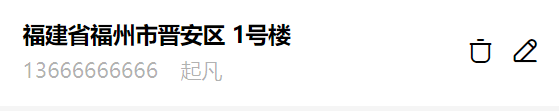

---
category:
  - 起凡商城
tag:
  - 地址
  - 地址详情组件
  - 小程序
date: 2024-01-25
timeline: true
---

# 地址



## 源码

```vue
<script setup lang="ts">
import { AddressDto } from "@/apis/__generated/model/dto";
defineProps<{ address: AddressDto["AddressRepository/SIMPLE_FETCHER"] }>();
</script>

<template>
  <!-- 前面展示地址和收件人信息，后面提供操作按钮插槽 -->
  <div class="address-row">
    <div class="address-info">
      <!-- 上面展示地址信息 -->
      <div class="details">{{ address.address + " " + address.details }}</div>
      <!-- 下面展示收件人信息 -->
      <div class="connector">
        <div class="real-name">{{ address.realName }}</div>
        <div class="phone-number">{{ address.phoneNumber }}</div>
        <!-- 是否是默认地址 -->
        <div class="is-default" v-if="address.top">
          <nut-tag type="primary" plain>默认</nut-tag>
        </div>
      </div>
    </div>
    <slot name="operation"></slot>
  </div>
</template>

<style lang="scss">
.address-row {
  padding: 30rpx;
  background: white;
  display: flex;
  align-items: center;

  .address-info {
    width: 600rpx;
    .details {
      font-size: 30rpx;
      font-weight: bold;
      margin-bottom: 10rpx;
    }
    .connector {
      font-size: 28rpx;
      color: rgba(black, 0.3);
      display: flex;
      align-items: center;
      .real-name {
        margin-right: 30rpx;
      }
      .is-default {
        margin-left: 20px;
      }
    }
  }
}
</style>

```
