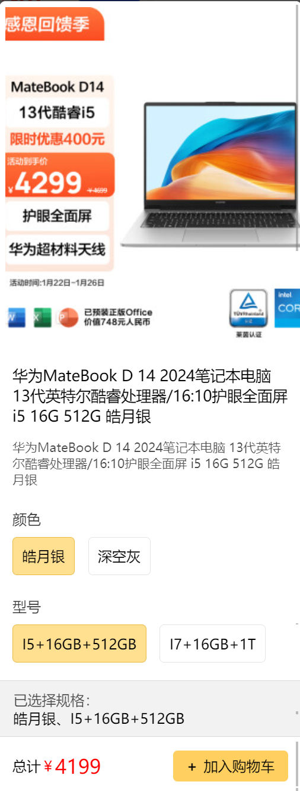

---
category:
  - 起凡商城
  - 小程序
tag:
  - 商品SKU
date: 2024-01-24
timeline: true
---
# 商品SKU对话框

## 效果



## 对话框

:::tabs
@tab html

```html {6-12}
<template>
  <div>
    <div class="product-dialog">
      <!-- 这步不能使用 v-model:visible="visible" 因为visible不能从子组件更新 -->
      <!-- 通过继续把事件emit出去实现双向绑定。emit('update:visible', visible) -->
      <nut-popup
        :visible="visible"
        round
        pop-class="product-popup"
        @update:visible="(value) => emit('update:visible', value)"
      ></nut-popup
      >
    </div>
  </div>
</template>
```

@tab ts

```ts
const props = defineProps<{
  visible: boolean;
}>();
const emit = defineEmits<{
  "update:visible": [visible: boolean];
}>();
```

:::

## 对话框内滚动区域

:::tabs
@tab html

```html {12-14}
<template>
  <div>
    <div class="product-dialog">
      <!-- 这步不能使用 v-model:visible="visible" 因为visible不能从子组件更新 -->
      <!-- 通过继续把事件emit出去实现双向绑定。emit('update:visible', visible) -->
      <nut-popup
        :visible="visible"
        round
        pop-class="product-popup"
        @update:visible="(value) => emit('update:visible', value)"
      >
        <!-- 当设置scroll-y=true 时需要设置固定的高度 -->
        <scroll-view class="product-section" :scroll-y="true">
        </scroll-view></nut-popup
      >
    </div>
  </div>
</template>
```

@tab css

```scss {2-10}
.product-dialog {
  .product-section {
    background-color: white;
    border-radius: 15px;
    overflow: hidden;
    // 界面的最大宽度为750px(rpx)，小程序会根据手机屏幕大小转成实际的像素。
    width: 680px;
    // 需要设置固定的高度，在这个固定的高度内滚动
    height: 1000px;
  }
}
```

:::

## 商品SKU展示骨架

:::tabs
@tab html

```html {11-27}
<template>
  <div>
    <div class="product-dialog">
      <nut-popup
        :visible="visible"
        round
        pop-class="product-popup"
        @update:visible="(value) => emit('update:visible', value)"
      >
        <scroll-view class="product-section" :scroll-y="true">
          <!-- 显示图片 -->
          <div>
          </div>
          <!-- 显示名称 -->
          <div class="product-name"></div>
          <!-- 显示描述 -->
          <div class="product-description">
          </div>
          <!-- 显示属性 -->
          <div class="attributes">
          </div>
          <!-- 已选属性值 -->
          <div class="choose">
          </div>
          <!-- 价格 -->
          <div class="result">
          </div>
        </scroll-view></nut-popup
      >
    </div>
  </div>
</template>
```

:::

## sku选择

:::tabs
@tab html

```html {12-43}
<template>
  <div>
    <div class="product-dialog">
      <nut-popup
        :visible="visible"
        round
        pop-class="product-popup"
        @update:visible="(value) => emit('update:visible', value)"
      >
        <scroll-view class="product-section" :scroll-y="true">
          <!-- 忽略... -->
          <div class="attributes">
            <!-- 遍历商品属性 -->
            <div
              v-for="(attribute, index) in attributes"
              :key="attribute.name"
              class="attribute-row"
            >
            <!-- 每个属性的名称 -->
              <div class="attribute-name">{{ attribute.name }}</div>
              <!-- 每个属性的值列表 -->
              <div class="values">
                <!-- 遍历值列表, 每个属性同一时间只能选一个值，选中时显示激活颜色 -->
                <div
                  v-for="value in attribute.values"
                  :key="value"
                  :class="[
                    'value',
                    attribute.activeValue === value ? 'active' : '',
                  ]"
                  @click="() => changeActive(value, attribute)"
                >
                  {{ value }}
                </div>
              </div>
            </div>
          </div>
          <div class="choose">
            <div class="values">
              <span class="prefix">已选择规格：</span>
              {{ chooseAttribute.join("、") }}
            </div>
          </div>
          <div class="result">
          </div>
        </scroll-view></nut-popup
      >
    </div>
  </div>
</template>
```

@tab css

```scss {11-48}
.product-dialog {
  .product-section {
    background-color: white;
    border-radius: 15px;
    overflow: hidden;
    width: 680px;
    height: 1000px;

    // 忽略...

    .attributes {
      margin: 30px;
      // 每个属性占一行
      .attribute-row {
        margin-top: 50px;

        .attribute-name {
          color: rgba($color: #000000, $alpha: 0.8);
        }
        // 属性值水平排列
        .values {
          display: flex;

          .value {
            margin-top: 20px;
            padding: 20px;
            border-radius: 10px;
            margin-right: 30px;
            border: 1px solid rgba(black, 0.1);
            // 选中的属性值
            &.active {
              background-color: rgba(255, 209, 97, 0.7);
              border: 2px solid rgb(234, 186, 69);
            }
          }
        }
      }
    }
    .choose {
      margin-top: 40px;
      padding: 20px 30px;
      background-color: rgba(black, 0.05);
      border: 1px solid rgba(black, 0.1);

      .prefix {
        color: rgba(black, 0.7);
      }
    }
  }
}
```

@tab ts

```ts
import { ProductDto } from "@/apis/__generated/model/dto";
import { ScrollView } from "@tarojs/components";
import { computed, onMounted, ref } from "vue";
type ProductSkuFetcherDto = ProductDto["ProductRepository/PRODUCT_SKU_FETCHER"];
type Sku = ProductSkuFetcherDto["skuList"][0];
type Attribute = ProductSkuFetcherDto["attributes"][0] & {
  activeValue: string;
};
const props = defineProps<{
  product: ProductSkuFetcherDto;
  visible: boolean;
}>();
const emit = defineEmits<{
  "update:visible": [visible: boolean];
}>();

// 当前选中的商品规格
const activeSku = computed(() => {
  return props.product.skuList.find((sku) => {
    return sku.values.join(",") === chooseAttribute.value.join(",");
  });
});

// 商品的属性, 如 [{name:"颜色", values: ["黑色","白色"], activeValue:"黑色"}, {name: "型号", values: ["8gb+256gb", "12gb+512gb"]}, activeValue: "8gb+256gb"]
const attributes = ref<Attribute[]>([]);
// 当前选择属性值 ["黑色", "8gb+256gb"], 上面attributes的activeValue。
const chooseAttribute = computed(() => {
  return attributes.value.map((attribute) => attribute.activeValue);
});

// 切换属性值（activeValue）时重新计算当前的商品规格
const changeActive = (value: string, attr: Attribute) => {
  attr.activeValue = value;
};
// 首次自动计算当前商品规格，默认都选每个属性的第一个值组合在一起。
onMounted(() => {
  attributes.value = props.product.attributes.map((attribute) => {
    return {
      ...attribute,
      // 默认使用第一个值
      activeValue: attribute.values[0],
    };
  });
});
```

:::

## 封面/名称/描述

:::tabs

@tab html

```html {11-22}
<template>
  <div>
    <div class="product-dialog">
      <nut-popup
        :visible="visible"
        round
        pop-class="product-popup"
        @update:visible="(value) => emit('update:visible', value)"
      >
        <scroll-view class="product-section" :scroll-y="true" v-if="activeSku">
          <div>
            <!-- 由于在样式中固定了图片的高度和宽度为了使图片 aspectFill优先保证图片的比例，切割掉多余的图片 -->
            <image
              class="product-cover"
              :src="activeSku.cover"
              :mode="'aspectFill'"
            ></image>
          </div>
          <div class="product-name">{{ activeSku.name }}</div>
          <div class="product-description">
            {{ activeSku.description }}
          </div>
         <!-- 忽略... -->
        </scroll-view></nut-popup
      >
    </div>
  </div>
</template>
```

@tab css

```scss {9-26}
.product-dialog {
  .product-section {
    background-color: white;
    border-radius: 15px;
    overflow: hidden;
    width: 680px;
    height: 1000px;

    .product-cover {
      // 封面和对话框一样宽，不留缝隙。这样看起来会比较好看。
      width: 100%;
      height: 750px;
    }
    .product-name {
      font-size: 34px;
      margin: 30px;
      word-break: keep-all;
    }

    .product-description {
      margin: 20px 30px;
      // 描述的颜色要淡一些，透明度设置0.7和标题体现出差异。
      color: rgba(black, 0.7);
      // 字体也是一样设置小一些
      font-size: 28px;
    }
    // 忽略 ...
  }
}
```

:::

## 加入购物车

:::tabs
@tab html

```html {12-23}
<template>
  <div>
    <div class="product-dialog">
      <nut-popup
        :visible="visible"
        round
        pop-class="product-popup"
        @update:visible="(value) => emit('update:visible', value)"
      >
        <scroll-view class="product-section" :scroll-y="true" v-if="activeSku">
        <!-- 忽略... -->
          <div class="result">
            <div class="total-price">
              <span>总计</span>
              <span class="price-prefix">￥</span>
              <span class="price">
                {{ activeSku.price }}
              </span>
            </div>
            <div class="add-cert" @click="() => addProduct()">
              <span class="prefix">+</span>加入购物车
            </div>
          </div>
        </scroll-view></nut-popup
      >
    </div>
  </div>
</template>
```

@tab css

```scss {11-43}
.product-dialog {
  .product-section {
    background-color: white;
    border-radius: 15px;
    overflow: hidden;
    width: 680px;
    height: 1000px;

    // 忽略...

    .result {
      padding: 30px;
      display: flex;
      align-items: center;
      justify-content: space-between;

      .total-price {
        display: flex;
        align-items: flex-end;

        .price {
          color: red;
          font-size: 45px;
          line-height: 40px;
        }

        .price-prefix {
          color: red;
        }
      }

      .add-cert {
        background-color: rgba(255, 208, 95);
        border-radius: 10px;
        padding: 15px 30px;
        display: flex;

        .prefix {
          font-weight: bold;
          margin-right: 15px;
        }
      }
    }
  }
}

```

@tab ts

```ts {3,7-12}
const emit = defineEmits<{
  "update:visible": [visible: boolean];
  addSku: [sku: Sku, product: ProductSkuFetcherDto];
}>();

// 忽略...
const addProduct = async () => {
  emit("update:visible", false);
  if (activeSku.value) {
    emit("addSku", activeSku.value, props.product);
  }
};
```

:::

## 源码

```vue
<template>
  <div>
    <div class="product-dialog">
      <!-- 这步不能使用 v-model:visible="visible" 因为visible不能从子组件更新 -->
      <!-- 通过继续把事件emit出去实现双向绑定。emit('update:visible', visible) -->
      <nut-popup
        :visible="visible"
        round
        pop-class="product-popup"
        @update:visible="(value) => emit('update:visible', value)"
      >
        <!-- 当设置scroll-y时需要设置固定的高度 -->
        <scroll-view class="product-section" :scroll-y="true" v-if="activeSku">
          <div>
            <!-- 由于在样式中固定了图片的高度和宽度为了使图片 aspectFill优先保证图片的比例，切割掉多余的图片 -->
            <image
              class="product-cover"
              :src="activeSku.cover"
              :mode="'aspectFill'"
            ></image>
          </div>
          <div class="product-name">{{ activeSku.name }}</div>
          <div class="product-description">
            {{ activeSku.description }}
          </div>
          <div class="attributes">
            <div
              v-for="attribute in attributes"
              :key="attribute.name"
              class="attribute-row"
            >
              <div class="attribute-name">{{ attribute.name }}</div>
              <div class="values">
                <div
                  v-for="value in attribute.values"
                  :key="value"
                  :class="[
                    'value',
                    attribute.activeValue === value ? 'active' : '',
                  ]"
                  @click="() => changeActive(value, attribute)"
                >
                  {{ value }}
                </div>
              </div>
            </div>
          </div>
          <div class="choose">
            <div class="values">
              <span class="prefix">已选择规格：</span>
              {{ chooseAttribute.join("、") }}
            </div>
          </div>
          <div class="result">
            <div class="total-price">
              <span>总计</span>
              <span class="price-prefix">￥</span>
              <span class="price">
                {{ activeSku.price }}
              </span>
            </div>
            <div class="add-cert" @click="() => addProduct()">
              <span class="prefix">+</span>加入购物车
            </div>
          </div>
        </scroll-view></nut-popup
      >
    </div>
  </div>
</template>

<script setup lang="ts">
import { ProductDto } from "@/apis/__generated/model/dto";
import { ScrollView } from "@tarojs/components";
import { computed, onMounted, ref } from "vue";
type ProductSkuFetcherDto = ProductDto["ProductRepository/PRODUCT_SKU_FETCHER"];
type Sku = ProductSkuFetcherDto["skuList"][0];
type Attribute = ProductSkuFetcherDto["attributes"][0] & {
  activeValue: string;
};
const props = defineProps<{
  product: ProductSkuFetcherDto;
  visible: boolean;
}>();
const emit = defineEmits<{
  "update:visible": [visible: boolean];
  addSku: [sku: Sku, product: ProductSkuFetcherDto];
}>();

// 当前选中的商品规格
const activeSku = computed(() => {
  return props.product.skuList.find((sku) => {
    return sku.values.join(",") === chooseAttribute.value.join(",");
  });
});

// 商品的属性, 如 [{name:"颜色", values: ["黑色","白色"], activeValue:"黑色"}, {name: "型号", values: ["8gb+256gb", "12gb+512gb"]}, activeValue: "8gb+256gb"]
const attributes = ref<Attribute[]>([]);
// 当前选择属性值 ["黑色", "8gb+256gb"], 上面attributes的activeValue。
const chooseAttribute = computed(() => {
  return attributes.value.map((attribute) => attribute.activeValue);
});

// 切换属性值（activeValue）时重新计算当前的商品规格
const changeActive = (value: string, attr: Attribute) => {
  attr.activeValue = value;
};
// 首次自动计算当前商品规格，默认都选每个属性的第一个值组合在一起。
onMounted(() => {
  attributes.value = props.product.attributes.map((attribute) => {
    return {
      ...attribute,
      // 默认使用第一个值
      activeValue: attribute.values[0],
    };
  });
});

const addProduct = async () => {
  emit("update:visible", false);
  if (activeSku.value) {
    emit("addSku", activeSku.value, props.product);
  }
};
</script>

<style lang="scss">
.product-dialog {
  .product-section {
    background-color: white;
    border-radius: 15px;
    overflow: hidden;
    width: 680px;
    height: 1000px;

    .product-cover {
      // 封面和对话框一样宽，不留缝隙。这样看起来会比较好看。
      width: 100%;
      height: 750px;
    }
    .product-name {
      font-size: 34px;
      margin: 30px;
      word-break: keep-all;
    }

    .product-description {
      margin: 20px 30px;
      // 描述的颜色要淡一些，透明度设置0.7和标题体现出差异。
      color: rgba(black, 0.7);
      // 字体也是一样设置小一些
      font-size: 28px;
    }

    .attributes {
      margin: 30px;
      // 每个属性占一行
      .attribute-row {
        margin-top: 50px;

        .attribute-name {
          color: rgba($color: #000000, $alpha: 0.8);
        }
        // 属性值水平排列
        .values {
          display: flex;

          .value {
            margin-top: 20px;
            padding: 20px;
            border-radius: 10px;
            margin-right: 30px;
            border: 1px solid rgba(black, 0.1);
            // 选中的属性值
            &.active {
              background-color: rgba(255, 209, 97, 0.7);
              border: 2px solid rgb(234, 186, 69);
            }
          }
        }
      }
    }

    .choose {
      margin-top: 40px;
      padding: 20px 30px;
      background-color: rgba(black, 0.05);
      border: 1px solid rgba(black, 0.1);

      .prefix {
        color: rgba(black, 0.7);
      }
    }

    .result {
      padding: 30px;
      display: flex;
      align-items: center;
      justify-content: space-between;

      .total-price {
        display: flex;
        align-items: flex-end;

        .price {
          color: red;
          font-size: 45px;
          line-height: 40px;
        }

        .price-prefix {
          color: red;
        }
      }

      .add-cert {
        background-color: rgba(255, 208, 95);
        border-radius: 10px;
        padding: 15px 30px;
        display: flex;

        .prefix {
          font-weight: bold;
          margin-right: 15px;
        }
      }
    }
  }
}
</style>

```
