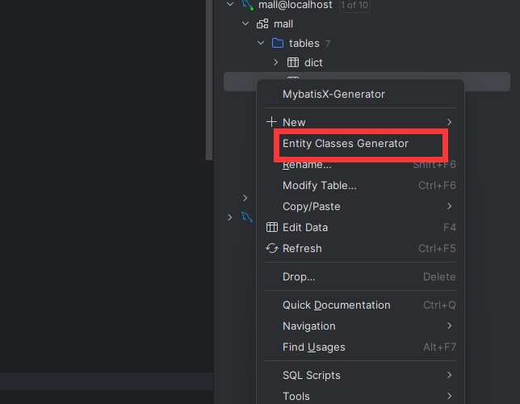
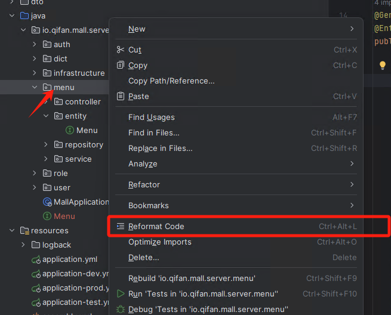
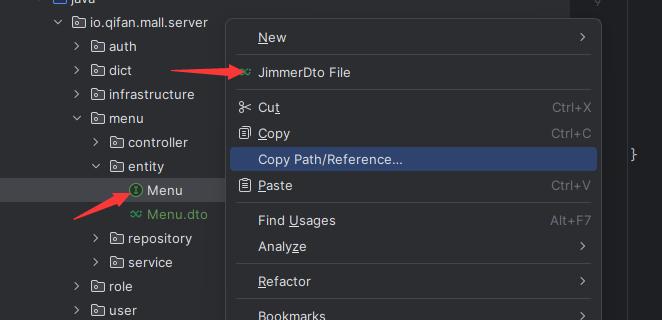
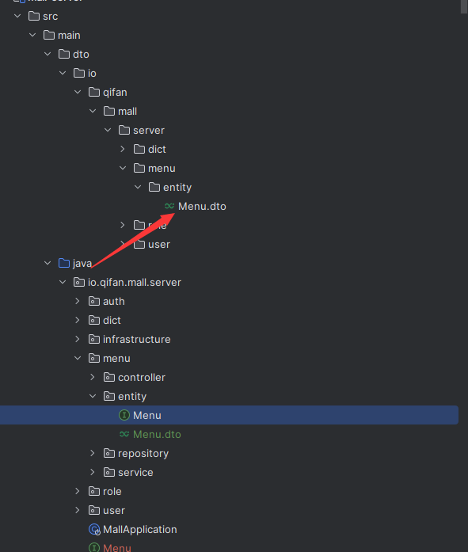
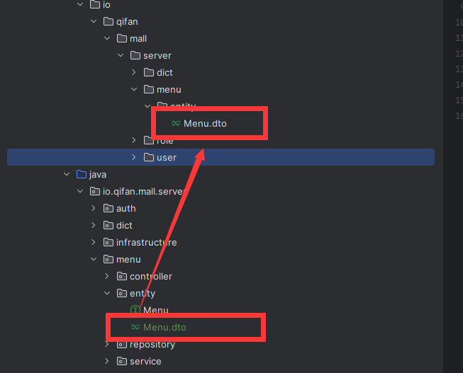
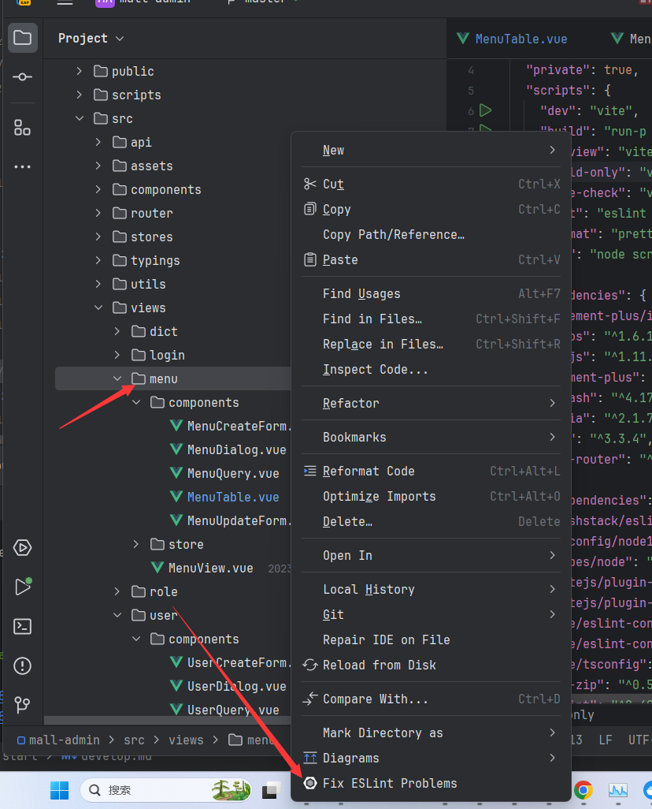

# 开发流程

## 后端

### 编写DDL

```sql
create table menu
(
    id           varchar(36)  not null
        primary key,
    created_time datetime(6)  not null,
    edited_time  datetime(6)  not null,
    creator_id   varchar(36)  not null,
    editor_id    varchar(36)  not null,
    name         varchar(20)  not null,
    parent_id    varchar(36)  not null,
    order_num    int          null,
    menu_type    varchar(36)  not null,
    icon         varchar(255) null
);
```

:::center

:::

在数据库建好表之后使用`Jimmer-generator`插件生成实体。以上面的menu表为例，生成的`menu.java`需要放到`src/main/java/io/qifan/mall/server/menu/entity` 中。

即`src/main/java/io/qifan/mall/server/{你的表名}/entity`

### 生成代码

```java
@GenEntity
@Entity
public interface Menu extends BaseEntity {
    @GenField(value = "菜单名称", order = 0)
    String name();

    @GenField(value = "父菜单Id", order = 1)
    String parentId();

    @GenField(value = "排序号")
    Integer orderNum();

    @GenField(value = "菜单类型", type = ItemType.SELECTABLE, dictId = 1002)
    String menuType();

    @GenField(value = "图标", type = ItemType.PICTURE)
    @Nullable
    String icon();

    @OneToMany(mappedBy = "menu")
    List<RoleMenuRel> roles();
}
```

在需要生成代码的实体类上添加[`@GenEntity`](../../reference/generator/README.md/#genentity)这样即可生成该实体的前后端增删改查。在需要生成的字段上使用[`@GenField`](../../reference/generator/README.md/#genfield)标注，然后在生成的前端表格，表单，查询框中会包括这些字段。

在mall-server模块下的test包下找到`MallCodeGenerator`运行生成代码。

### 使用后端生成代码

生成的代码在`template/src/main/java/io/qifan/mall/server`下面，复制`menu`文件夹到`mall-server`模块内，然后整理生成的代码。

:::center

:::

整理完之后需要用鼠标把`controller`,`service`,`repository`一个个点过去，确保idea可以正确加载这些类。

### 生成dto文件

:::center

:::

使用`JimmerDTO`插件可以右键实体类生成对应的dto文件。

::: center

:::

然后将代码`Menu.dto`覆盖掉生成的`Menu.dto`
::: center

:::

### 重新编译

由于新增了实体类，需要重新编译。

1. 在mall-server下 maven-clean
2. 重新运行MallApplication

::: tip
如果报xxx找不到符号，请在mall-parent模块下`maven clean`然后再`maven install`。最后重新执行上面的编译步骤。
:::

## 前端

### 使用前端生成代码

生成的前端文件在`template/front`下，复制`menu`文件夹到后台管理(mall-admin)工程。

使用eslint可以整理代码的格式，然后再把文件一个个点开确保没有错误。


### 添加路由

在`router/index.ts`下添加menu路由

```ts
import {createRouter, createWebHistory} from 'vue-router'
import HomeView from '../views/HomeView.vue'
import MenuView from '@/views/menu/MenuView.vue'

const router = createRouter({
    history: createWebHistory('mall-admin'),
    routes: [
        {
            path: '/',
            name: 'home',
            component: HomeView,
            children: [
                {path: 'menu', name: 'menu', component: MenuView}
            ]
        }
    ]
})

export default router
```

### 同步API

运行`npm run api`即可同步后端的api