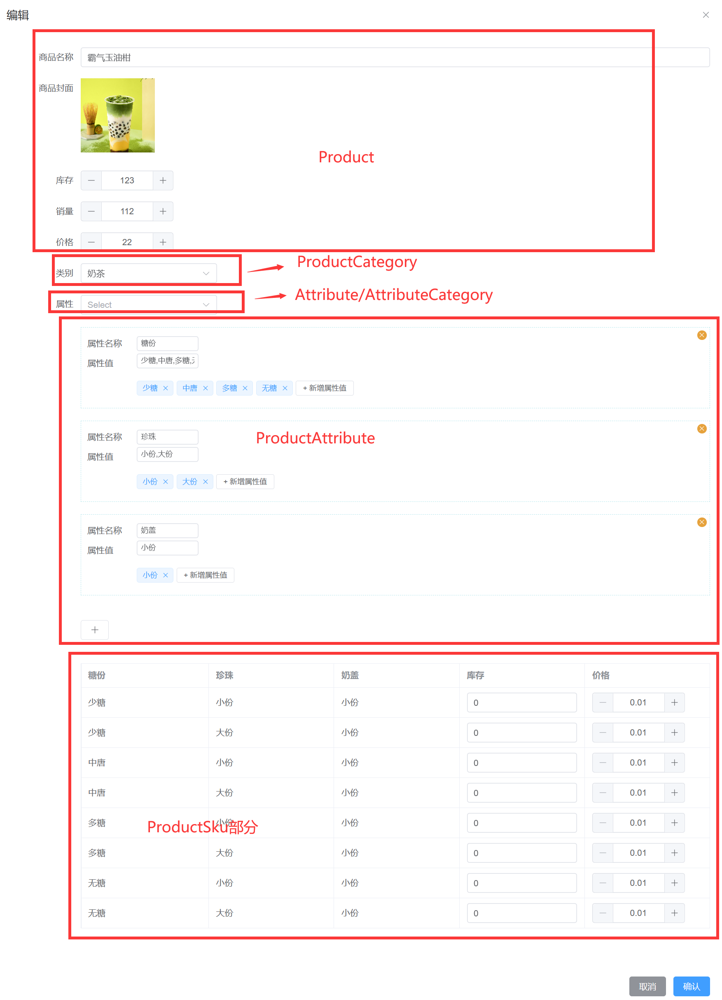
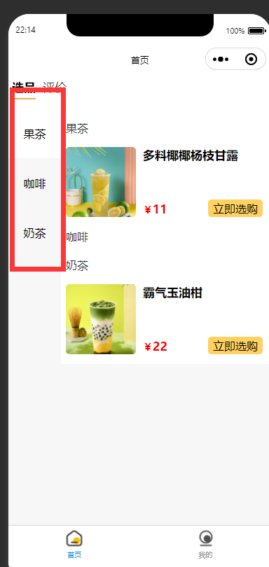
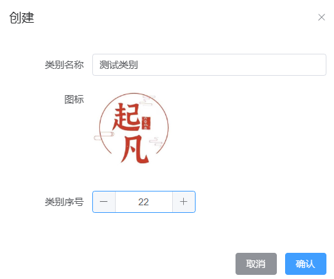
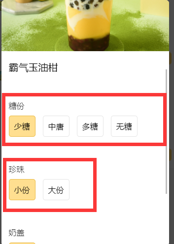
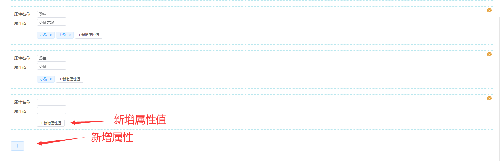
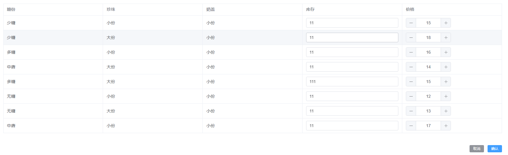

---
category:
  - 起凡小商店
  - 商品
tag:
  - 业务设计
  - JPA
  - 商品

date: 2023-09-14
timeline: true
---

# 商品模块设计

平常我们在购买奶茶的时候，左侧会有商品类别的选择，右侧会显示该类别下的商品。商品会有封面、价格和名称，点进商品可以看见商品的详情。购买商品可以选择不同的商品规格，比如奶茶的糖份维度上可以选择多糖，少糖，无糖，珍珠维度上可以选择大份，中份，少份。
将上面不同维度的属性值排列组合之后就形成了商品的规格（芋泥波波奶茶-少糖-少份珍珠，芋泥波波奶茶-多糖-大份珍珠等），实际售卖时也是按照规格售卖。所以每个规格同样拥有价格，封面等信息。

## 表关系设计

<center>
    

图0 表之间的关系
</center>

下图是新增商品时涉及的表，下面将会一一介绍每个表的设计。


<center>
    

图1 操作逻辑上的关系
</center>

- `ProductCategory`：商品类别
- `ProductSku`：商品规格
- `ProductAttribute`：商品属性
- `Product`：商品
- `Attribute`：商品属性模板
- `AttributeCategory`：商品属性模板类别

`Product`和`ProductSku`是一对多的联系，如奶茶拥有多种规格（芋泥波波奶茶-少糖-少份珍珠，芋泥波波奶茶-多糖-大份珍珠等）。
`Product`和`ProductAttribute`是一对多的联系，如奶茶拥有糖份属性和珍珠属性。
`Product`和`ProductCategory`是多对一的联系，一个商品只有一个类别，一个类别下可以有很多商品。
`Attribute`和`AttributeCategory`和商品属性模板类别是多对一的联系，一个类别下可以用有多个属性模板。

## 实体设计

在小程序展示的时候（图3）可能会对类别有排序需求和图标自定义需求，我增加了图标和排序字段。

### ProductCategory

<center>
    

图2 商品类别展示
</center>
<center>
    

图3 商品类别创建
</center>

::: tip
通过图1可以知道一个类别下有多个商品，一个商品只有一个类别。因此ProductCategory的实体内使用`@OneToMany`关联了子实体[Product](#product)

```tip
@GenField(association = true, value = "产品列表")
@OneToMany(mappedBy = "category")
@ToString.Exclude
private List<Product> products;
```

详细用法请参考[`@OneToMany`](../../../knowledge/jpa/hibernate/#onetomany)
:::

```java
@GenEntity
@Entity
@Accessors(chain = true)
@Getter
@Setter
@ToString
@RequiredArgsConstructor
public class ProductCategory extends BaseEntity {

  @GenField(value = "类别名称")
  private String name;
  @GenField(value = "图标", type = ItemType.PICTURE)
  private String icon;
  @GenField(value = "类别序号", type = ItemType.INPUT_NUMBER)
  private Integer sort;
  @GenField(association = true, value = "产品列表")
  @OneToMany(mappedBy = "category")
  @ToString.Exclude
  private List<Product> products;
  @GenField(ignoreRequest = true)
  private ValidStatus validStatus;


  public void valid() {
    setValidStatus(ValidStatus.VALID);
  }

  public void invalid() {
    setValidStatus(ValidStatus.INVALID);
  }

  @Override
  public final boolean equals(Object o) {
    if (this == o) {
      return true;
    }
    if (o == null) {
      return false;
    }
    Class<?> oEffectiveClass =
        o instanceof HibernateProxy ? ((HibernateProxy) o).getHibernateLazyInitializer()
            .getPersistentClass() : o.getClass();
    Class<?> thisEffectiveClass =
        this instanceof HibernateProxy ? ((HibernateProxy) this).getHibernateLazyInitializer()
            .getPersistentClass() : this.getClass();
    if (thisEffectiveClass != oEffectiveClass) {
      return false;
    }
    ProductCategory that = (ProductCategory) o;
    return getId() != null && Objects.equals(getId(), that.getId());
  }

  @Override
  public final int hashCode() {
    return this instanceof HibernateProxy ? ((HibernateProxy) this).getHibernateLazyInitializer()
        .getPersistentClass().hashCode() : getClass().hashCode();
  }
}
```

::: info
id，创建时间，更新时间等字段。请参考[BaseEntity](../reference#baseentity)
:::

### ProductAttribute

<center>
    

图4 商品属性展示
</center>

<center>
    

图5 商品属性创建
</center>

::: tip

图4中可以看出一个商品有多个属性。每个属性对应一个商品。因此在ProductAttribute使用[`@ManyToOne`](../../../knowledge/jpa/hibernate/#manytoone)关联[Product](#product)。

```java
@GenField(value = "商品", association = true)
@ManyToOne
private Product product;
```

:::

```java
@GenEntity
@Entity
@Accessors(chain = true)
@Getter
@Setter
@ToString
@RequiredArgsConstructor
public class ProductAttribute extends BaseEntity {

  @GenField(value = "商品", association = true)
  @ManyToOne
  private Product product;
  @GenField(value = "属性名称")
  private String name;
  // 多个属性值用","隔开拼接成一个字符串存储。
  @GenField(value = "属性值")
  private String attributeValues;
  @GenField(ignoreRequest = true)
  private ValidStatus validStatus;


  public void valid() {
    setValidStatus(ValidStatus.VALID);
  }

  public void invalid() {
    setValidStatus(ValidStatus.INVALID);
  }

  @Override
  public final boolean equals(Object o) {
    if (this == o) {
      return true;
    }
    if (o == null) {
      return false;
    }
    Class<?> oEffectiveClass =
        o instanceof HibernateProxy ? ((HibernateProxy) o).getHibernateLazyInitializer()
            .getPersistentClass() : o.getClass();
    Class<?> thisEffectiveClass =
        this instanceof HibernateProxy ? ((HibernateProxy) this).getHibernateLazyInitializer()
            .getPersistentClass() : this.getClass();
    if (thisEffectiveClass != oEffectiveClass) {
      return false;
    }
    ProductAttribute that = (ProductAttribute) o;
    return getId() != null && Objects.equals(getId(), that.getId());
  }

  @Override
  public final int hashCode() {
    return this instanceof HibernateProxy ? ((HibernateProxy) this).getHibernateLazyInitializer()
        .getPersistentClass().hashCode() : getClass().hashCode();
  }
}
```

### ProductSku

图4中商品拥有多个属性，将这些属性的值组合在一起就形成了 ProductSku。可以对每一个Sku配置价格、库存、封面、文案等等。

<center>
    

图6 商品规格创建
</center>

::: tip

```java
@GenField(value = "商品", association = true)
@ManyToOne
private Product product;
```

参考图6得知，每个商品可以有多个ProductSku，每个ProductSku属于一个Product。所以这边使用`@ManyToOne`关联父实体。

```java
@GenField(value = "属性值组合")
private String attributeValues;
```

需要特别注意上面这个字段的含义。在[ProductAttribute](#productattribute)中也有一个attributeValues，下面做出区别解释。在ProductAttribute中attributeValues中的属性值都是属于同一个维度的比如糖份："多糖,少糖,无糖"。 此处的attributeValues是来此不同属性的值组合。比如"多糖,大份珍珠,小份奶盖"（图6）。
:::

```java
@GenEntity
@Entity
@Accessors(chain = true)
@Getter
@Setter
@ToString
@RequiredArgsConstructor
public class ProductSku extends BaseEntity {

  @GenField(value = "商品", association = true)
  @ManyToOne
  private Product product;
  @GenField(value = "属性名称")
  private String name;
  @GenField(value = "封面", type = ItemType.PICTURE)
  private String cover;
  @GenField(value = "属性值组合")
  private String attributeValues;
  @GenField(value = "库存", type = ItemType.INPUT_NUMBER)
  private Integer stock;
  @GenField(value = "价格", type = ItemType.INPUT_NUMBER)
  private BigDecimal price;
  @GenField(ignoreRequest = true)
  private ValidStatus validStatus;


  public void valid() {
    setValidStatus(ValidStatus.VALID);
  }

  public void invalid() {
    setValidStatus(ValidStatus.INVALID);
  }

  @Override
  public final boolean equals(Object o) {
    if (this == o) {
      return true;
    }
    if (o == null) {
      return false;
    }
    Class<?> oEffectiveClass =
        o instanceof HibernateProxy ? ((HibernateProxy) o).getHibernateLazyInitializer()
            .getPersistentClass() : o.getClass();
    Class<?> thisEffectiveClass =
        this instanceof HibernateProxy ? ((HibernateProxy) this).getHibernateLazyInitializer()
            .getPersistentClass() : this.getClass();
    if (thisEffectiveClass != oEffectiveClass) {
      return false;
    }
    ProductSku that = (ProductSku) o;
    return getId() != null && Objects.equals(getId(), that.getId());
  }

  @Override
  public final int hashCode() {
    return this instanceof HibernateProxy ? ((HibernateProxy) this).getHibernateLazyInitializer()
        .getPersistentClass().hashCode() : getClass().hashCode();
  }
}
```

### Product

在图1可以看见商品中关联了ProductCategory、ProductAttribute、ProductSku。下面使用`@OneToMany`和`@ManyToOne`配置关联关系，最后形成了双向关联。

```java
@GenField(value = "规格", association = true)
@OneToMany(mappedBy = "product", cascade = CascadeType.ALL, orphanRemoval = true)
@ToString.Exclude
private List<ProductSku> skuList;

@GenField(value = "类别", association = true)
@ManyToOne
private ProductCategory category;

@GenField(value = "属性", association = true)
@OneToMany(mappedBy = "product", cascade = CascadeType.ALL, orphanRemoval = true)
@ToString.Exclude
private List<ProductAttribute> attributes;
```

::: info

请参考[@OneToMany](../../../knowledge/jpa/hibernate/#onetomany),[@ManyToOne](../../../knowledge/jpa/hibernate/#manytoone)
:::

```java
@GenEntity
@Entity
@Accessors(chain = true)
@Getter
@Setter
@ToString
@RequiredArgsConstructor
public class Product extends BaseEntity {

  @GenField(value = "商品名称")
  private String name;
  @GenField(value = "商品封面", type = ItemType.PICTURE)
  private String cover;
  @GenField(value = "商品描述")
  private String description;
  @GenField(value = "库存", type = ItemType.INPUT_NUMBER)
  private Integer stock;
  @GenField(value = "销量", type = ItemType.INPUT_NUMBER)
  private Integer sales;
  @GenField(value = "销量", type = ItemType.INPUT_NUMBER)
  private BigDecimal price;

  @GenField(value = "规格", association = true)
  @OneToMany(mappedBy = "product", cascade = CascadeType.ALL, orphanRemoval = true)
  @ToString.Exclude
  private List<ProductSku> skuList;

  @GenField(value = "类别", association = true)
  @ManyToOne
  private ProductCategory category;

  @GenField(value = "属性", association = true)
  @OneToMany(mappedBy = "product", cascade = CascadeType.ALL, orphanRemoval = true)
  @ToString.Exclude
  private List<ProductAttribute> attributes;

  @GenField(ignoreRequest = true)
  private ValidStatus validStatus;


  public void valid() {
    setValidStatus(ValidStatus.VALID);
  }

  public void invalid() {
    setValidStatus(ValidStatus.INVALID);
  }

  @Override
  public final boolean equals(Object o) {
    if (this == o) {
      return true;
    }
    if (o == null) {
      return false;
    }
    Class<?> oEffectiveClass =
        o instanceof HibernateProxy ? ((HibernateProxy) o).getHibernateLazyInitializer()
            .getPersistentClass() : o.getClass();
    Class<?> thisEffectiveClass =
        this instanceof HibernateProxy ? ((HibernateProxy) this).getHibernateLazyInitializer()
            .getPersistentClass() : this.getClass();
    if (thisEffectiveClass != oEffectiveClass) {
      return false;
    }
    Product product = (Product) o;
    return getId() != null && Objects.equals(getId(), product.getId());
  }

  @Override
  public final int hashCode() {
    return this instanceof HibernateProxy ? ((HibernateProxy) this).getHibernateLazyInitializer()
        .getPersistentClass().hashCode() : getClass().hashCode();
  }
}
```
