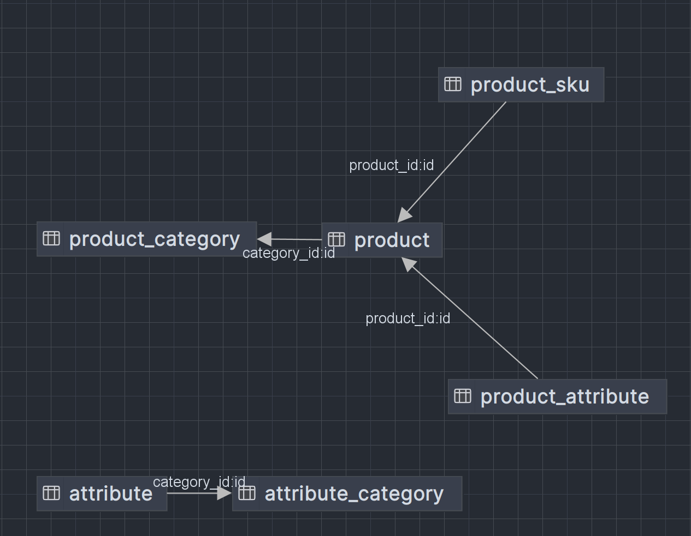

# 商品

平常我们在电商网站买商品的时候，映入眼帘的就是商品的封面、价格和名称，点进商品可以看见商品的详情。购买商品可以选择不同的商品规格，比如手机的颜色维度上可以选择黑色、白色、红色，内存维度上可以选择6gb、8gb、12gb。
将上面不同维度的属性值排列组合之后就形成了商品的规格（如黑色-6gb，白色-6gb等），实际售卖时也是按照规格售卖。所以每个规格同样拥有价格，封面等信息。

## 表设计

- `ProductCategory`：商品类别
- `ProductSku`：商品规格
- `ProductSk`：

    

