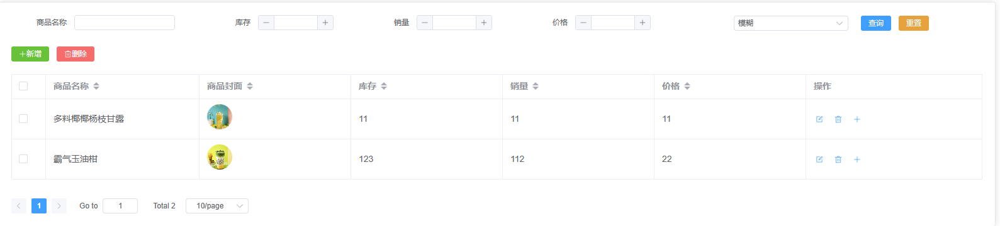
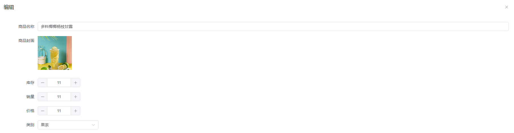
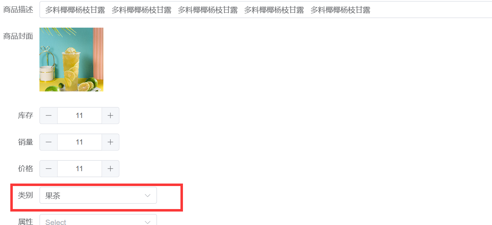
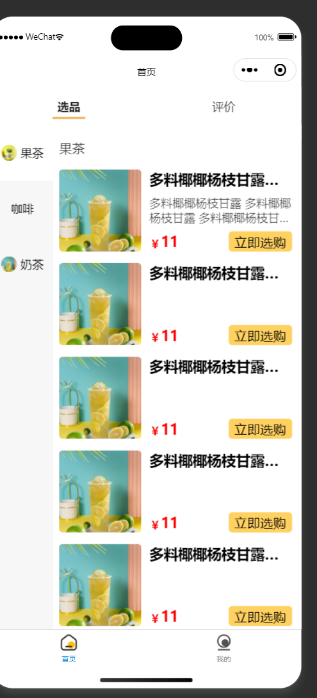
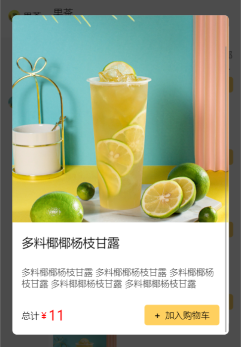

---
category:
  - 起凡小商店
  - 商品
tag:
  - 商品列表
  - 小程序联动菜单

order: 3
date: 2023-10-07
timeline: true
---

# 商品

## 商品前端显示效果

### 后台管理页面

<center>


图1 商品展示
</center>

<center>


图2 商品编辑
</center>

### 小程序展示

## 后端实现

大部分内容都是[代码生成器](../reference/generator/#后端模板)生成。

在编辑商品时可以更换商品类别，在JPA中如果需要更换`@ManyToOne`联系，需要重新创建一个对象。要不然JPA会以为你需要更新关联的对象。

```java
  public void updateProduct(ProductUpdateRequest request, String id) {
    EntityOperations.doUpdate(productRepository).loadById(id).update(e -> {
      // 如果类别id发生改变，则重新创建类别，这样JPA会更新外键。
      if (!e.getCategory().getId().equals(request.getCategory().getId())) {
        e.setCategory(new ProductCategory());
      }
      // 将请求dto复制到实体类上
      productMapper.updateEntityFromUpdateRequest(request, e);
    }).successHook(e -> log.info("更新Product：{}", e)).execute();
  }
```

## 后台管理页面实现

管理页面实现请参考[后台管理页面生成模板](../reference/generator/#后台管理模板)

### product-store.ts

为了防止空指针异常，需要对product内的嵌套对象初始化。

```ts
export const useProductStore = defineStore('product', () => {
    const initQuery = new Product()
    initQuery.category = new ProductCategory()
    const initForm = new Product()
    initForm.attributes = []
    initForm.skuList = []
    initForm.category = new ProductCategory()
    const tableHelper = useTableHelper(queryProduct, initQuery)
    const dialogHelper = useDialogHelper()
    const queryHelper = useQueryHelper<Product>(initQuery)
    const formHelper = useFormHelper<Product>(initForm)
    return {...tableHelper, ...dialogHelper, ...queryHelper, ...formHelper}
})

```

### ProductCommon.tsx

<center>


图3 商品类别表单项
</center>
在`productFormItemList`中新增一个表单项，用于选择商品类别。

RemoteSelect用于选择关联的对象，传入一个选项列表提供方法（queryOptions）。 下面的queryOptions方法内根据关键词查找商品类别，并将查询的结果转成{label:'xxx',value:'xxx'}的格式。

```tsx
<ElFormItem label="类别">
    <RemoteSelect
        v-model:value={form.category.id}
        queryOptions={async (keyword) => {
            const res = await queryProductCategory(
                new QueryRequest<ProductCategory>({name: keyword})
            )
            return res.result.list.map((row) => {
                return {label: row.name, value: row.id}
            })
        }}
    ></RemoteSelect>
</ElFormItem>
```

## 小程序实现

### 商品列表

<center>


图4 商品列表
</center>

使用NutUI的Tabs组件实现选品和评价页签。商品菜单引用左右联动菜单组件和商品封面组件。

```vue

<script lang="ts" setup>
  import {queryProductCategory} from "@/api/product-category";
  import {useUserStore} from "@/stores/user";
  import {Product, ProductCategory} from "@/typings";
  import Taro from "@tarojs/taro";
  import {ref} from "vue";
  import QiCategoryProducts from "@/components/category-products/QiCategoryProducts.vue";
  import QiProductDialog from "@/components/product/QiProductDialog.vue";
  import QiProduct from "@/components/product/QiProduct.vue";
  import {findProductById} from "@/api/product";

  const activeTab = ref(0);
  const dialogVisible = ref(false);

  const userStore = useUserStore();
  userStore.getUserInfo();
  const categories = ref<ProductCategory[]>([]);
  Taro.useDidShow(() => {
    // 查询商品的分类，每个分类下有商品。
    queryProductCategory({
      pageNum: 1,
      pageSize: 1000,
      matchMode: "VAGUE",
      query: {},
    }).then((res) => {
      categories.value = res.result.list;
    });
  });
  // 当前选中的商品
  const chosenProduct = ref(new Product());
  // 点击封面触发
  const handleChoose = (product: Product) => {
    // 根据商品id获取详情
    findProductById(product.id).then((res) => {
      // 设置当前选择的商品
      chosenProduct.value = res.result;
      // 弹出商品详情对话框
      dialogVisible.value = true;
    });
  };
</script>
<template>
  <div class="index">
    <!-- 页签 -->
    <nut-tabs v-model="activeTab">
      <nut-tab-pane title="选品" pane-key="0">
        <!-- 引用左右联动菜单 -->
        <QiCategoryProducts :categories="categories">
          <template #default="{ product }">
            <!-- 用商品封面组件填充插槽 -->
            <QiProduct :product="product" @choose="handleChoose"></QiProduct>
          </template>
        </QiCategoryProducts>
      </nut-tab-pane>
      <nut-tab-pane title="评价" pane-key="1">评价页面</nut-tab-pane>
    </nut-tabs>
    <!-- 弹出商品详情对话框 -->
    <QiProductDialog
        v-model:visible="dialogVisible"
        :product="chosenProduct"
    ></QiProductDialog>
    <!-- 登录对话框 -->
    <QiLoginPopup></QiLoginPopup>
  </div>
</template>
<style lang="scss">
  .index {
    background-color: rgba(#000, 0.03);
  }

  :root,
  page {
    .nut-tab-pane {
      padding: 0;
    }

    --nut-tabs-titles-background-color: white;
    --nut-tabs-horizontal-tab-line-color: #f0ad4e;
  }
</style>

```

:::info
参考组件[左右联动菜单](../reference/front/#左右联动菜单)
参考组件[商品封面](../reference/front/#商品封面)
:::

### 商品详情对话框

<center>


图5 商品详情对话框
</center>

```vue

<template>
  <div>
    <div class="product-dialog">
      <!-- 这步不能使用 v-model:visible="props.visible" 因为props.visible不能从子组件更新 -->
      <!-- 通过继续把事件emit出去实现双向绑定。emit('update:visible', visible) -->
      <nut-popup
          :visible="props.visible"
          round
          :lock-scroll="true"
          pop-class="product-popup"
          @update:visible="(visible) => emit('update:visible', visible)"
      >
        <!-- 当设置scroll-y时需要设置固定的高度 -->
        <scroll-view class="product-section" :scroll-y="true">
          <div>
            <!-- aspectFill优先保证图片的比例 -->
            <image
                class="product-cover"
                :src="props.product.cover"
                :mode="'aspectFill'"
            ></image>
          </div>
          <div class="product-name">{{ props.product.name }}</div>
          <div class="product-description">{{ props.product.description }}</div>
          <div class="result">
            <div class="total-price">
              <span>总计</span>
              <span class="price-prefix">￥</span>
              <span class="price">
                {{ product.price }}
              </span>
            </div>
            <div class="add-cert" @click="() => addProduct()">
              <span class="prefix">+</span>加入购物车
            </div>
          </div>
        </scroll-view>
      </nut-popup
      >
    </div>
  </div>
</template>

<script setup lang="ts">
  import {Product} from "@/typings";
  import {ScrollView} from "@tarojs/components";

  const props = defineProps<{ product: Product; visible: boolean }>();
  const emit = defineEmits<{ "update:visible": [visible: boolean] }>();

  const addProduct = async () => {
    emit("update:visible", false);
  };
</script>

<style lang="scss">
  .product-dialog {
    .product-section {
      background-color: white;
      border-radius: 15px;
      overflow: hidden;
      width: 680px;
      height: 1000px;

      .product-name {
        font-size: 40px;
        padding: 30px;
        // 文字溢出处理开始
        // 文字只能显示一行
        -webkit-line-clamp: 1;
        -webkit-box-orient: vertical;
        display: -webkit-box;
        overflow: hidden;
        // 溢出部分用 ...代替
        text-overflow: ellipsis;
        // 文字溢出处理结束
      }

      .product-description {
        padding: 20px 30px;
        // 描述的颜色要淡一些，透明度设置0.7和标题体现出差异。
        color: rgba(black, 0.7);
        // 字体也是一样设置小一些
        font-size: 28px;
      }

      .product-cover {
        // 封面和对话框一样宽，不留缝隙。这样看起来会比较好看。
        width: 100%;
        height: 750px;
      }

      .result {
        padding: 30px;
        display: flex;
        align-items: center;
        justify-content: space-between;

        .total-price {
          display: flex;
          align-items: flex-end;

          .price {
            color: red;
            font-size: 45px;
            line-height: 40px;
          }

          .price-prefix {
            color: red;
          }
        }

        .add-cert {
          background-color: rgba(255, 208, 95);
          border-radius: 10px;
          padding: 15px 30px;
          display: flex;

          .prefix {
            font-weight: bold;
            margin-right: 15px;
          }
        }
      }
    }
  }
</style>

```


