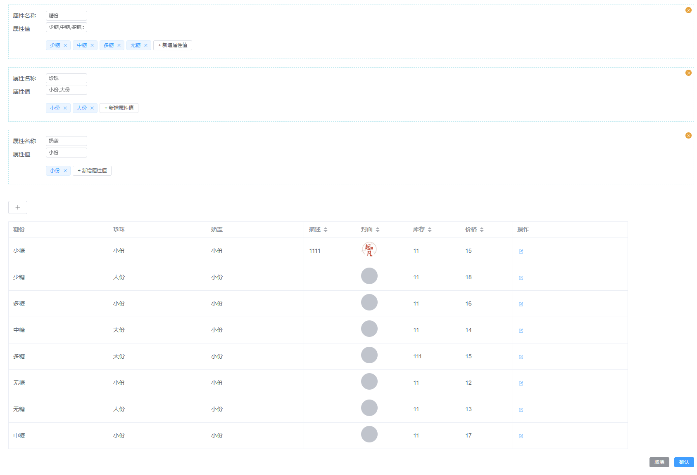
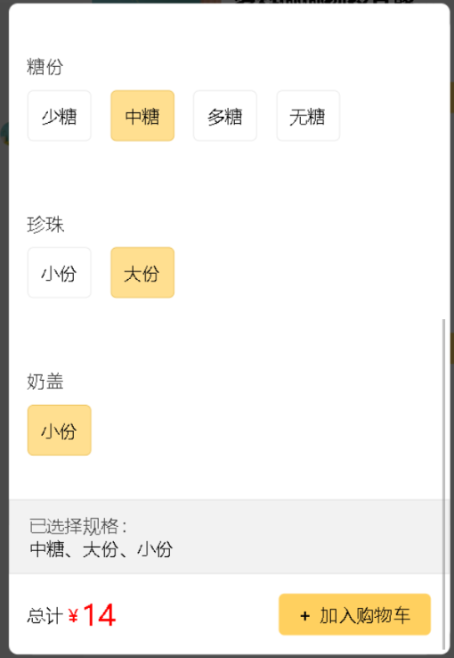

---
category:
  - 起凡小商店
  - 商品
tag:
  - 商品SKU
  - 小程序SKU选择器

order: 4
date: 2023-10-15
timeline: true

---

# 商品规格

## 显示效果

### 后台管理页面

在填写完商品的基本信息后，可以新增商品的属性。一个属性对应多个值，商品规格会将多个属性的值进行组合形成下面的商品规格表。

在商品规格表中可以调整每个商品规格的价格/库存/描述封面。

<center>


图1 商品规格编辑
</center> 

### 小程序展示

在用户选择好属性的值后，如图2选中的是中糖，大份，小份。这个组合就可以确定是属于哪个规格了，可以在图1中查出该规格的价格是14，库存是11。

<center>


图2 规格选择对话框
</center>

## 后端实现

后端实现请参考[后端代码生成模板](../reference/generator/#后端模板)

## 后台管理实现

### 属性选择

在ProductCommon.ts中的`productFormItemList`新增一个表单项，用于填写商品的属性。

```tsx

<ElFormItem label="属性">
    <div class="attribute-section">
        {/* 新增/删除属性 */}
        {form.attributes.map((attribute, index) => (
            <div class="attribute-wrapper" key={index}>
                {/* 删除当前属性 */}
                <ElButton
                    class="close-btn"
                    type="warning"
                    size="small"
                    circle
                    onClick={() => {
                        deleteAttribute(index)
                    }}
                >
                    <ElIcon>
                        <Close/>
                    </ElIcon>
                </ElButton>
                <ElForm labelWidth={80} labelPosition="left">
                    <ElFormItem label="属性名称">
                        <ElInput style={{width: '100px'}} v-model={attribute.name} size="small"></ElInput>
                    </ElFormItem>
                    <ElFormItem label="属性值">
                        {/* 新增/删除属性值 */}
                        <AttributeChoose v-model:values={attribute.attributeValues}></AttributeChoose>
                    </ElFormItem>
                </ElForm>
            </div>
        ))}
        <div>
            {/* 新增属性 */}
            <ElButton
                class={'plus'}
                icon={Plus}
                onClick={() => {
                    addAttribute()
                }}
            ></ElButton>
        </div>
    </div>
</ElFormItem>
```

```vue

<template>
  <div class="attribute-chose">
    <div class="attribute">
      <!-- 显示当前属性内的多个属性值，用','连接多个属性值 -->
      <el-input
          class="attribute-values"
          size="small"
          readonly
          :model-value="props.values"
      ></el-input>
    </div>
    <div class="attribute-input">
      <template v-for="(tag, index) in tags" :key="tag">
        <!-- 编辑属性值 -->
        <el-input
            v-if="editIndex === index"
            v-model="editInputValue"
            class="attribute-value-input attribute-value"
            size="small"
            @blur="handleEditConfirm"
            @keydown.enter="handleEditConfirm"
        ></el-input>
        <!-- 显示属性值 -->
        <el-tag
            v-else
            class="attribute-value"
            closable
            :disable-transitions="false"
            @close="handleClose(index)"
            @click="handleEdit(index)"
        >{{ tag }}
        </el-tag
        >
      </template>
      <!-- 点击新增属性显示输入框，否则显示新增按钮  -->
      <ElInput
          v-if="inputVisible"
          ref="inputRef"
          v-model="inputValue"
          class="value-input"
          size="small"
          @blur="handleInputConfirm"
          @keydown.enter="handleInputConfirm"
      ></ElInput>
      <ElButton v-else size="small" @click="showInput"> + 新增属性值</ElButton>
    </div>
  </div>
</template>
<script lang="ts" setup>
  import {computed, nextTick, ref} from 'vue'
  import {ElButton, ElInput, ElTag} from 'element-plus'

  const props = defineProps({values: {type: String, required: false, default: ''}})
  const emit = defineEmits<{ 'update:values': [values: string] }>()

  const tags = computed({
    get: () => {
      return props.values ? props.values.split(',') : []
    },
    set: (values) => {
      emit('update:values', values.join(','))
    }
  })
  // 编辑属性值
  const editIndex = ref(-1)
  const editInputValue = ref('')
  // 点击属性值标签，显示输入框编辑属性值
  const handleEdit = (index: number) => {
    editInputValue.value = tags.value[index]
    editIndex.value = index
  }
  // 编辑属性值输入框确认
  const handleEditConfirm = () => {
    if (editInputValue.value === tags.value[editIndex.value]) {
      return
    }
    tags.value[editIndex.value] = editInputValue.value
    tags.value = [...tags.value]
    editIndex.value = -1
  }
  // 点击属性值标签的右上角触发删除属性值
  const handleClose = (index: number) => {
    tags.value.splice(index, 1)
    tags.value = [...tags.value]
  }

  // 新增属性值
  const inputRef = ref<InstanceType<typeof ElInput>>()
  const inputVisible = ref(false)
  const inputValue = ref('')
  const handleInputConfirm = () => {
    if (inputValue.value) {
      tags.value = [...tags.value, inputValue.value]
    }
    inputVisible.value = false
    inputValue.value = ''
  }
  const showInput = () => {
    inputVisible.value = true
    nextTick(() => {
      if (inputRef.value && inputRef.value.input) {
        inputRef.value.input.focus()
      }
    })
  }
</script>

<style lang="scss" scoped>
  .attribute {
    display: flex;
    justify-content: flex-start;

    .attribute-values {
      width: 100px;
    }
  }

  .attribute-input {
    margin-top: 10px;
    display: flex;
    align-items: center;
    flex-wrap: wrap;
    margin-bottom: 10px;

    .attribute-value-input {
      width: 100px;
    }

    .attribute-value {
      margin-right: 5px;
    }

    .value-input {
      width: 100px;
    }
  }
</style>


```

### 商品规格生成

在ProductCommon.ts中的`productFormItemList`新增一个表单项，用于展示商品规格。

```tsx
<ElFormItem>
    {/* 根据属性生成商品规格，每次属性改变都会触发 skuListChange。 */}
    <ProductSkuTable
        attributes={form.attributes}
        v-model:skuList={form.skuList}
    ></ProductSkuTable>
</ElFormItem>
```

监听属性的变化，并递归生成规格列表。每个规格可以编辑，每行右侧的编辑按钮弹出编辑对话框。

```vue

<script lang="tsx">
  import {defineComponent, type PropType, ref, watch} from 'vue'
  import {ElButton, ElIcon, ElTable, ElTableColumn, ElForm, ElDialog} from 'element-plus'
  import {Page, ProductAttribute, ProductSku, QueryRequest, Result} from '@/typings'
  import {Edit} from '@element-plus/icons-vue'
  import {productSkuTableItemList, productSkuFormItemList} from './ProductSkuCommon'
  import {useTableHelper} from '@/components/base/table/table-helper'
  import {useDialogHelper} from '@/components/base/dialog/dialog-helper'
  import FooterButton from '@/components/base/dialog/FooterButton.vue'

  const tableHelper = useTableHelper(async (query: QueryRequest<ProductSku>) => {
    return new Result<Page<ProductSku>>()
  })
  const dialogHelper = useDialogHelper()

  export default defineComponent({
    props: {
      attributes: {
        type: Array as PropType<ProductAttribute[]>,
        default: () => {
          return []
        }
      },
      skuList: {
        type: Array as PropType<ProductSku[]>,
        default: () => {
          return []
        }
      }
    },
    emits: {
      'update:skuList'(skuList: ProductSku[]) {
        return true
      }
    },
    setup(props, {emit}) {
      const {dialogData} = dialogHelper
      const formData = ref(new ProductSku())
      const skuList = ref<ProductSku[]>(props.skuList)
      const handleEdit = (row: ProductSku) => {
        formData.value = {...row}
        dialogHelper.openDialog()
      }
      const handleEditConfirm = () => {
        const index = skuList.value.findIndex(
            (row) => row.attributeValues === formData.value.attributeValues
        )
        if (index >= 0) {
          skuList.value[index] = formData.value
        }
        emit('update:skuList', skuList.value)
        dialogData.value.visible = false
      }
      // 递归排列组合
      const deep = (sku: ProductSku, depth: number, attrList: ProductAttribute[]) => {
        if (depth === attrList.length) {
          sku.attributeValues = sku.attributeValueList.join(',')
          const copySku = new ProductSku()
          Object.assign(copySku, sku)
          skuList.value.push(copySku)
          return
        }
        const attribute = attrList[depth]
        if (attribute.attributeValues.length === 0) return
        // 获取每个属性的值(选择的)，将各个属性的值进行组合
        const attrValues = attribute.attributeValues.split(',')
        attrValues.forEach((value) => {
          // sku对象新增字段，字段的名字是属性的名字。比如 {"糖份"："多糖"}
          sku[attribute.name] = value
          // 加入当前属性的参数
          sku.attributeValueList.push(value)
          // 获取下一个属性的参数
          deep(sku, depth + 1, attrList)
          // 弹出当前属性的参数，准备加入当前属性的下一个参数
          sku.attributeValueList.pop()
        })
      }
      watch(
          () => props.attributes,
          (value, oldValue) => {
            // 第一次加载时使用默认的skuList不需要重新生成
            if (oldValue.length === 0 && props.skuList.length > 0) {
              skuList.value = props.skuList
              return
            }
            // 当属性修改时重新生成skuList
            skuList.value = []
            deep(new ProductSku(), 0, props.attributes)
            emit('update:skuList', skuList.value)
          },
          {deep: true}
      )

      return () => (
          <div>
            <ElDialog
                v-model={dialogData.value.visible}
                title={dialogData.value.title}
                width={dialogData.value.width}
                appendToBody
            >
              <div class={'update-form'}>
                <ElForm labelWidth={120} class={'form'} size={'small'}>
                  {productSkuFormItemList(formData.value).map((item) => item)}
                </ElForm>
              </div>
              <FooterButton onConfirm={handleEditConfirm} showClose={false}></FooterButton>
            </ElDialog>
            {/* 展示规格列表 */}
            <ElTable data={skuList.value} border={true} v-loading={tableHelper.tableData.loading}>
              {/* 由于属性是动态的，所以规格的前面列也是动态的。根据属性的名字生成列 */}
              {props.attributes.map((attribute) => (
                  <ElTableColumn
                      prop={attribute.name}
                      label={attribute.name}
                      key={attribute.name}
                      minWidth={150}
                  ></ElTableColumn>
              ))}
              {/* 后面是静态的列，包含封面/描述/价格/库存。这些是可以编辑的 */}
              {productSkuTableItemList((index) => skuList.value[index]).map((column) => column)}
              <ElTableColumn label="操作" fixed="right" width={280}>
                {{
                  default: ({row}: { row: ProductSku }) => (
                      <div>
                        <ElButton
                            class={'edit-btn'}
                            link
                            size="small"
                            type="primary"
                            onClick={(event) => {
                              handleEdit(row)
                            }}
                        >
                          <ElIcon>
                            <Edit/>
                          </ElIcon>
                        </ElButton>
                      </div>
                  )
                }}
              </ElTableColumn>
            </ElTable>
          </div>
      )
    }
  })
</script>

<style lang="scss" scoped>
  .button-section {
    margin: 20px 0;
  }
</style>

```

## 小程序实现

```vue

<template>
  <div>
    <div class="product-dialog">
      <!-- 这步不能使用 v-model:visible="props.visible" 因为props.visible不能从子组件更新 -->
      <!-- 通过继续把事件emit出去实现双向绑定。emit('update:visible', visible) -->
      <nut-popup
          :visible="props.visible"
          round
          :lock-scroll="true"
          pop-class="product-popup"
          @update:visible="(visible) => emit('update:visible', visible)"
      >
        <!-- 当设置scroll-y时需要设置固定的高度 -->
        <scroll-view class="product-section" :scroll-y="true">
          <div>
            <!-- aspectFill优先保证图片的比例 -->
            <image
                class="product-cover"
                :src="activeSku.cover || props.product.cover"
                :mode="'aspectFill'"
            ></image>
          </div>
          <div class="product-name">{{ props.product.name }}</div>

          <div class="product-description">
            {{ activeSku.description || props.product.description }}
          </div>
          <div>
            <div
                v-for="(attribute, index) in product.attributes"
                :key="attribute.id"
                class="attribute-row"
            >
              <div class="attribute-name">{{ attribute.name }}</div>
              <div class="values">
                <div
                    v-for="value in attribute.attributeList"
                    :key="value"
                    :class="[
                    'value',
                    attribute.activeValue === value ? 'active' : '',
                  ]"
                    @click="() => changeActive(value, attribute, index)"
                >
                  {{ value }}
                </div>
              </div>
            </div>
          </div>
          <div class="choose">
            <div class="values">
              <span class="prefix">已选择规格：</span>
              {{ chooseAttribute.join("、") }}
            </div>
          </div>
          <div class="result">
            <div class="total-price">
              <span>总计</span>
              <span class="price-prefix">￥</span>
              <span class="price">
                {{ activeSku ? activeSku.price : product.price }}
              </span>
            </div>
            <div class="add-cert" @click="() => addProduct()">
              <span class="prefix">+</span>加入购物车
            </div>
          </div>
        </scroll-view>
      </nut-popup
      >
    </div>
  </div>
</template>

<script setup lang="ts">
  import {Product, ProductAttribute, ProductSku} from "@/typings";
  import {ScrollView} from "@tarojs/components";
  import {computed, ref, watch} from "vue";

  const props = defineProps<{ product: Product; visible: boolean }>();
  const emit = defineEmits<{ "update:visible": [visible: boolean] }>();

  const skuList = computed(() => {
    return props.product.skuList;
  });
  const chooseAttribute = ref<string[]>([]);
  // 当前选中的商品规格
  const activeSku = ref({} as ProductSku);
  // 切换属性时重新计算当前的商品规格
  const changeActive = (value: string, attr: ProductAttribute, index: number) => {
    attr.activeValue = value;
    chooseAttribute.value[index] = value;
    activeSku.value = skuList.value.filter((sku) => {
      return sku.attributeValues === chooseAttribute.value.join(",");
    })[0];
  };
  // 当传入的商品发送改变时重新计算商品的属性
  watch(
      () => props.product.attributes,
      () => {
        const attributes = props.product.attributes;
        chooseAttribute.value = [];
        attributes.forEach((attribute: ProductAttribute, index: number) => {
          attribute.attributeList = attribute.attributeValues.split(",");
          changeActive(attribute.attributeList[0], attribute, index);
        });
      },
  );
  const addProduct = async () => {
    emit("update:visible", false);
  };
</script>

<style lang="scss">
  .product-dialog {
    .product-section {
      background-color: white;
      border-radius: 15px;
      overflow: hidden;
      width: 680px;
      height: 1000px;

      .product-name {
        font-size: 40px;
        padding: 30px;
        // 文字溢出处理开始
        // 文字只能显示一行
        -webkit-line-clamp: 1;
        -webkit-box-orient: vertical;
        display: -webkit-box;
        overflow: hidden;
        // 溢出部分用 ...代替
        text-overflow: ellipsis;
        // 文字溢出处理结束
      }

      .product-description {
        padding: 20px 30px;
        // 描述的颜色要淡一些，透明度设置0.7和标题体现出差异。
        color: rgba(black, 0.7);
        // 字体也是一样设置小一些
        font-size: 28px;
      }

      .product-cover {
        // 封面和对话框一样宽，不留缝隙。这样看起来会比较好看。
        width: 100%;
        height: 750px;
      }

      // 每个属性占一行
      .attribute-row {
        margin-top: 50px;
        padding: 30px;

        .attribute-name {
          color: rgba($color: #000000, $alpha: 0.8);
        }

        // 属性值水平排列
        .values {
          display: flex;

          .value {
            margin-top: 20px;
            padding: 20px;
            border-radius: 10px;
            margin-right: 30px;
            border: 1px solid rgba(black, 0.1);
            // 选中的属性值
            &.active {
              background-color: rgba(255, 209, 97, 0.7);
              border: 2px solid rgb(234, 186, 69);
            }
          }
        }
      }

      .choose {
        margin-top: 40px;
        padding: 20px 30px;
        background-color: rgba(black, 0.05);
        border: 1px solid rgba(black, 0.1);

        .prefix {
          color: rgba(black, 0.7);
        }
      }

      .result {
        padding: 30px;
        display: flex;
        align-items: center;
        justify-content: space-between;

        .total-price {
          display: flex;
          align-items: flex-end;

          .price {
            color: red;
            font-size: 45px;
            line-height: 40px;
          }

          .price-prefix {
            color: red;
          }
        }

        .add-cert {
          background-color: rgba(255, 208, 95);
          border-radius: 10px;
          padding: 15px 30px;
          display: flex;

          .prefix {
            font-weight: bold;
            margin-right: 15px;
          }
        }
      }
    }
  }
</style>

```

