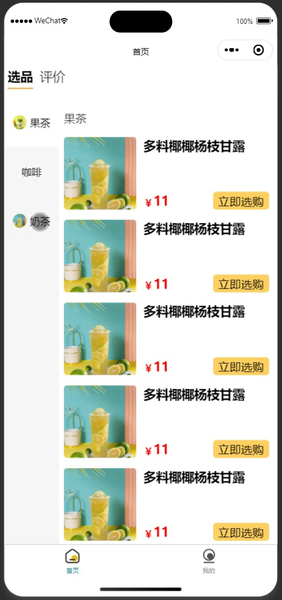
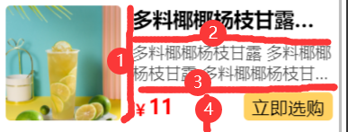

---
category:
  - 起凡小商店
  - 前端基础
tag:
  - 组合式API
  - 双向联动菜单
  - 商品封面

date: 2023-10-02
timeline: true
---

# 前端基础

## Helper工具类

### TableHelper

TableHelper抽取了表格组件中的通用变量pageData(分页结果), queryRequest(分页请求), tableSelectedRows(已选数据), loading([v-loading](https://element-plus.gitee.io/zh-CN/component/loading.html#%E5%8C%BA%E5%9F%9F%E5%8A%A0%E8%BD%BD)), table(ElTable实例)。除了通用的变量外还有通用的方法。

```ts
import {Page, QueryRequest, Result} from '@/typings'
import {ElTable} from 'element-plus'
import {reactive, ref} from 'vue'

export const useTableHelper = <T>(
    // 调用后端的查询接口
    queryApi: (query: QueryRequest<T>) => Promise<Result<Page<T>>>,
    // 查询条件
    initQuery?: T,
    // 分页数据后置处理
    postProcessor?: (data: Result<Page<T>>) => void
) => {
    const tableData: {
        // 表格内的分页数据
        pageData: Page<T>
        // 分页请求
        queryRequest: QueryRequest<T>
        // 表格内选中的数据
        tableSelectedRows: T[]
        // 当表格数据刷新时表格要出现loading图标
        loading: boolean
    } = reactive({
        pageData: {
            list: [],
            pageNum: 0,
            pageSize: 0,
            total: 0,
            totalPages: 0
        },
        queryRequest: {
            query: initQuery ?? {},
            pageNum: 1,
            pageSize: 10,
            matchMode: 'VAGUE',
            sorts: [{property: 'createdAt', direction: 'DESC'}]
        },
        tableSelectedRows: [],
        loading: false
    })
    // ElTable实例
    const table = ref<InstanceType<typeof ElTable>>()

    // 请求分页数据
    const loadTableData = (queryRequest: Partial<QueryRequest<T>>) => {
        const {pageNum, pageSize, query, sorts, matchMode} = queryRequest
        if (pageNum !== undefined) {
            tableData.queryRequest.pageNum = pageNum
        }
        if (pageSize !== undefined) {
            tableData.queryRequest.pageSize = pageSize
        }
        if (query !== undefined) {
            tableData.queryRequest.query = query
        }
        if (sorts !== undefined) {
            tableData.queryRequest.sorts = sorts
        }
        if (matchMode !== undefined) {
            tableData.queryRequest.matchMode = matchMode
        }
        tableData.loading = true
        queryApi(tableData.queryRequest).then(
            (res) => {
                if (postProcessor !== undefined) {
                    postProcessor(res)
                }
                tableData.pageData = res.result
                tableData.loading = false
            },
            (res) => {
                console.log(res)
            }
        )
    }
    // 重新请求分页数据，pageNum=1, pageSize=10
    const reloadTableData = (
        queryRequest: Partial<QueryRequest<T>> = {pageNum: 1, pageSize: 10}
    ) => {
        loadTableData(queryRequest)
    }
    // 获取表格选中的数据
    const getTableSelectedRows = () => {
        return tableData.tableSelectedRows
    }
    // 当表格选择变动时更新选中的数据
    const handleSelectChange = (selectedRows: T[]) => {
        tableData.tableSelectedRows = selectedRows
    }
    const handleSortChange = ({
                                  prop,
                                  order
                              }: {
        prop: string
        order: 'ascending' | 'descending'
    }) => {
        const directionMap: { ascending: 'ASC'; descending: 'DESC' } = {
            ascending: 'ASC',
            descending: 'DESC'
        }
        const sorts = tableData.queryRequest.sorts
        if (sorts !== undefined) {
            sorts[sorts.length - 1].property = prop
            sorts[sorts.length - 1].direction = directionMap[order]
        }
        reloadTableData()
    }

    return {
        table,
        tableData,
        loadTableData,
        reloadTableData,
        getTableSelectedRows,
        handleSortChange,
        handleSelectChange
    }
}

```

### FormHelper

创建表单和更新表单的通用变量

```ts
import {type Ref, ref} from 'vue'
import {BaseEntity} from '@/typings'

export const useFormHelper = <T extends BaseEntity>(formValue: T) => {
    const formData = ref({...formValue}) as Ref<T>
    const restForm = (form?: T) => {
        formData.value = {...formValue, id: form?.id}
    }
    return {formData, restForm}
}
```

### DialogHelper

DialogHelper将Dialog通用的变量抽取出来，每次新建一个Dialog时只需要调用useDialogHelper就可以快速写出一个对话框。

```ts
import {nextTick, ref} from 'vue'
import type {EditMode} from '@/typings'

export const useDialogHelper = () => {
    const dialogData = ref<{ width: number; title: string; visible: boolean; mode: EditMode }>({
        width: 600,
        title: '',
        visible: false,
        mode: 'CREATE'
    })
    const closeDialog = () => {
        dialogData.value.visible = false
    }
    const openDialog = async (mode?: EditMode) => {
        if (mode !== undefined) {
            dialogData.value.mode = mode
        }
        await nextTick()
        dialogData.value.visible = true
    }
    return {dialogData, closeDialog, openDialog}
}

```

### queryHelper

queryHelper抽取查询表单的通用变量和方法。辅助Query编写组件。

```ts
import {type Ref, ref} from 'vue'
import type {LikeMode} from '@/api/__generated/model/enums'

export const useQueryHelper = <T>(initQuery: T) => {
    const queryData = ref({query: initQuery, likeMode: 'ANYWHERE'}) as Ref<{
        query: T
        likeMode: LikeMode
    }>
    const restQuery = () => {
        queryData.value.query = {...initQuery}
        queryData.value.likeMode = 'ANYWHERE'
    }
    return {queryData, restQuery}
}
```

## 左右联动菜单

<center>


图1 左右联动菜单效果图
</center>
搭建基本的结构，左侧（left-scroll）用于存放类别（category-section），右侧（right-scroll）用于存放商品（product-section）。类别区域中有多类别（category-item），每个类别呈左右结构（icon）和（name）。

### 样式

```vue

<script lang="tsx">
  import {PropType, SlotsType, defineComponent} from "vue";
  import {ScrollView} from "@tarojs/components";
  import {Product, ProductCategory} from "@/typings";

  export default defineComponent({
    name: "CategoryProducts",
    props: {
      categories: {
        type: Array as PropType<ProductCategory[]>,
        required: true,
      },
    },
    slots: Object as SlotsType<{
      default: { product: Product };
    }>,
    setup(props, {slots}) {
      return () => (
          <div class="side-menu">
            {/* 左右结构left-scroll和right-scroll */}
            {/* scrollY： 可以在垂直方向上滚动。必须指定hight的值。 */}
            <ScrollView
                class="left-scroll"
                scrollY={true}
                scrollWithAnimation={true}
            >
              {/* 左侧存放类别，所有类别垂直排列，且在水平居中 */}
              <div class="category-section">
                {props.categories.map((category) => (
                    // 每个类别左边是图标，右边是类别名字。且图标和名字垂直/水平居中。
                    <div class="category-item" key={category.id}>
                      <div class="name-icon">
                        {category.icon ? (
                            // mode={"aspectFill"} 优先保证图片的比例，无法显示的部分会截切掉。
                            <image
                                src={category.icon}
                                class="icon"
                                mode={"aspectFill"}
                            ></image>
                        ) : (
                            ""
                        )}
                        <div class="name">{category.name}</div>
                      </div>
                    </div>
                ))}
              </div>
            </ScrollView>
            <ScrollView
                class="right-scroll"
                scrollY={true}
                scrollWithAnimation={true}
            >
              <div class="product-section">
                {props.categories.map((category) => (
                    // 每个类别对应多个商品
                    <div class="category-products">
                      <div class="category-name">{category.name}</div>
                      <div class="product-wrapper">
                        {/* 商品插槽，商品的样式比较动态，留给引用方实现。 */}
                        {category.products.map((product) => (
                            <div>{slots.default({product})}</div>
                        ))}
                      </div>
                    </div>
                ))}
              </div>
            </ScrollView>
          </div>
      );
    },
  });
</script>

<style lang="scss">
  .side-menu {
    display: flex;

    .left-scroll {
      height: 100vh;
      width: 150px;

      .category-section {
        // 类别区域内的类别垂直排列且水平居中
        display: flex;
        flex-direction: column;
        align-items: center;

        .category-item {
          // 类别的图标和名字的相关样式。
          display: flex;
          padding: 50px 0;
          align-items: center;
          justify-content: center;
          width: 100%;

          .name-icon {
            display: flex;
            align-items: center;

            .icon {
              width: 40px;
              height: 40px;
              margin-right: 10px;
              border-radius: 50%;
            }
          }

          &.active {
            background-color: white;
          }
        }
      }
    }

    .right-scroll {
      height: 100vh;
      width: 600px;

      .product-section {
        background-color: white;
        padding: 15px;

        .category-products {
          .category-name {
            padding: 20px 0;
            font-size: 32px;
            color: rgba(#000, 0.8);
          }
        }
      }
    }
  }
</style>

```

### 数据初始化

1. 想要实现点击左侧类别时，让右侧的区域滚动到该类别商品所在的位置那必然需要知道每个category-products顶部与right-scroll的距离。然后才能控制滚动条移动到相应的位置。

2. 在右侧滚动时，也需要知道当前的商品是属于哪个类别，让左侧的类别也跟着滚动。要实现这个功能需要知道category-products顶部和底部与right-scroll的距离，这样可以知道滚动条落在哪个区间，通过区间可以反推出是属于哪个类别。
   现在有三个区间：[0,100],[101,300],[300,350]。每个区间代表category-products的顶部和底部与right-scroll的距离。每个区间同时也对应一个类别。0：果茶，1：咖啡，2：奶茶。当前滚动条所在位置是200，遍历区间发现当前滚动条在[101,300]这个区间，反推得知当前区间对应的类别是咖啡。

3. 为了节流还需要知道right-scroll的高度。假设right-scroll的高度是100px，product-section的高度是300px。当滚动条滚动到200px时其实就已经到达底部了，因为200px+100px=300px。通过这个计算公式可以提前停止滚动，防止出现滚动抽搐现象。

```vue

<script lang="tsx">
  import {PropType, SlotsType, defineComponent, reactive} from "vue";
  import {ScrollView} from "@tarojs/components";
  import {Product, ProductCategory} from "@/typings";
  import Taro from "@tarojs/taro";

  export default defineComponent({
    // 忽略...
    setup(props, {slots}) {
      const scrollState = reactive({
        // 存储右侧category-products的头部和底部与product-section的距离。
        rightToTopList: [] as Array<[number, number]>,
        // 存储左侧每个category-item的顶部距与category-section的距离
        leftToTopList: [] as number[],
        // 左侧滚动区域滚动条与category-section的距离
        leftScrollTop: 0,
        // 右侧滚动区域滚动条与product-section的距离
        rightScrollTop: 0,
        // right-scroll的高度
        rightHeight: 0,
        // 当前激活的类别
        activeCategory: 0,
      });
      Taro.useDidShow(() => {
        Taro.nextTick(() => {
          const query = Taro.createSelectorQuery();
          // 对步骤1
          query
              .selectAll(".category-products")
              .boundingClientRect((data) => {
                // 第一个category-products与小程序顶部的距离（约等于product-section到小程序顶部的距离）
                const toTop = data[0].top;
                if (scrollState.rightToTopList.length === 0) {
                  if (data instanceof Array) {
                    for (let i = 0; i < data.length; i++) {
                      // 通过css选择器得到的top是与小程序顶部的距离，这步我们需要的是与product-section顶部的距离。
                      // 因此下面的top都是需要减去toTop
                      scrollState.rightToTopList.push([
                        // 计算得到顶部和 product-section 的距离。
                        data[i].top - toTop,
                        // 计算得到底部和 product-section 的距离。
                        data[i].top + data[i].height - toTop,
                      ]);
                    }
                  }
                }
              })
              .exec();
          // 对应步骤2
          query
              .selectAll(".category-item")
              .boundingClientRect((data) => {
                // 第一个category-item到小程序顶部的距离（约等于category-section到小程序顶部的距离）
                const toTop = data[0].top;
                if (scrollState.leftToTopList.length === 0) {
                  if (data instanceof Array) {
                    for (let i = 0; i < data.length; i++) {
                      // 计算得到 category-item顶部到category-section的距离
                      scrollState.leftToTopList.push(data[i].top - toTop);
                    }
                  }
                }
              })
              .exec();
          // 对应步骤3
          query
              .select(".right-scroll")
              .boundingClientRect(
                  (data: Taro.NodesRef.BoundingClientRectCallbackResult) => {
                    // 右侧的高度（不是滚动区域的总高度）
                    scrollState.rightHeight = data.height;
                  },
              );
        });
      });
      return () => (
          //  忽略 JSX内容
      );
    },
  });
</script>


<!-- 忽略样式...-->
```

### 逻辑实现

1. 在left-scroll和right-scroll分别增加了`scrollTop={scrollState.leftScrollTop}` 和`scrollTop={scrollState.rightScrollTop}`用于控制滚动条的位置。比如修改`scrollState.leftScrollTop=0`,那么左侧类别区域的滚动条就会滚动到顶部。
2. 当点击左侧的类别时会触发leftClick，该方法会切换激活的类别并且将右侧的商品区域滚动到该类别所在位置。参考上面的1
3. 当右侧商品滚动时，联动左侧类别一起滚动。参考上面的2，3

```vue

<script lang="tsx">
  import {PropType, SlotsType, defineComponent, reactive} from "vue";
  import {ScrollView, ScrollViewProps} from "@tarojs/components";
  import {Product, ProductCategory} from "@/typings";
  import Taro from "@tarojs/taro";

  export default defineComponent({
    // 忽略...
    setup(props, {slots}) {
      // 忽略...
      const leftClick = (index: number) => {
        scrollState.activeCategory = index;
        scrollState.rightScrollTop = scrollState.rightToTopList[index][0];
      };
      const rightScroll: ScrollViewProps["onScroll"] = (event) => {
        const scrollTop = event.detail.scrollTop;
        // 滚动到底部了
        if (scrollTop + scrollState.rightHeight >= event.detail.scrollHeight) {
          scrollState.leftScrollTop =
              scrollState.leftToTopList[scrollState.leftToTopList.length - 1];
          scrollState.activeCategory = scrollState.leftToTopList.length - 1;
          return;
        }
        // 判断当前滚动条在哪个商品区间
        for (let i = 0; i < scrollState.rightToTopList.length; i++) {
          if (
              scrollState.rightToTopList[i][0] < scrollTop &&
              scrollState.rightToTopList[i][1] > scrollTop
          ) {
            scrollState.leftScrollTop = scrollState.leftToTopList[i];
            scrollState.activeCategory = i;
            break;
          }
        }
      };
      return () => (
          <div class="side-menu">
            <ScrollView
                class="left-scroll"
                scrollY={true}
                scrollWithAnimation={true}
                scrollTop={scrollState.leftScrollTop}
            >
              <div class="category-section">
                {props.categories.map((category, index) => (
                    <div
                        class={[
                          "category-item",
                          scrollState.activeCategory === index ? "active" : "",
                        ]}
                        key={category.id}
                        onClick={() => {
                          leftClick(index);
                        }}
                    >
                      {/* 忽略... */}
                    </div>
                ))}
              </div>
            </ScrollView>
            <ScrollView
                class="right-scroll"
                scrollY={true}
                scrollWithAnimation={true}
                scrollTop={scrollState.rightScrollTop}
                onScroll={rightScroll}
            >
              {/* 忽略... */}
            </ScrollView>
          </div>
      );
    },
  });
</script>


<!--忽略...-->
```

## 商品封面

<center>


图2 商品封面布局
</center>

整个商品封面的布局如图2所示。可以用切蛋糕的思路去理解。①把商品切成左右两部分，②③把右侧切成上中下三部分。④把右下切成左右两部分

```vue

<template>
  <div class="qi-product">
    <!-- 封面 aspectFill优先保证图片比例 -->
    <image class="cover" :src="product.cover" mode="aspectFill"></image>
    <!-- 商品详情 -->
    <div class="info">
      <div class="name">{{ product.name }}立即选购立即选购</div>
      <div v-if="product.description" class="description">
        {{ product.description }}
      </div>
      <div v-if="product.price" class="price-row">
        <div class="price">
          <span class="prefix">￥</span>
          <span>{{ product.price }}</span>
        </div>
        <div class="choose" @click="handleChoose">立即选购</div>
      </div>
    </div>
  </div>
</template>

<script setup lang="ts">
  import {Product} from "@/typings";
  import type {PropType} from "vue";
  // 接受参数
  const props = defineProps({
    product: {type: Object as PropType<Product>, required: true},
  });
  // 定义事件
  const emit = defineEmits<{ choose: [product: Product] }>();
  const handleChoose = () => {
    emit("choose", props.product);
  };
</script>

<style lang="scss">
  .qi-product {
    padding: 15px 0;
    display: flex;
    align-items: flex-start;

    .cover {
      width: 200px;
      height: 200px;
      border-radius: 10px;
    }

    .info {
      // 撑开多余的空间
      flex: 2;
      margin-left: 20px;
      padding-right: 10px;
      display: flex;
      // 元素排列方向变为垂直
      flex-direction: column;
      // 各个元素之间在垂直方向上均衡分布
      justify-content: space-between;
      height: 200px;

      .name {
        font-size: 35px;
        font-weight: bold;
        // 文字溢出处理开始
        // 文字只能显示一行
        -webkit-line-clamp: 1;
        -webkit-box-orient: vertical;
        display: -webkit-box;
        overflow: hidden;
        // 溢出部分用 ...代替
        text-overflow: ellipsis;
        // 文字溢出处理结束
      }

      .description {
        font-size: 28px;
        color: rgba($color: #000000, $alpha: 0.7);
        -webkit-line-clamp: 2;
        -webkit-box-orient: vertical;
        display: -webkit-box;
        overflow: hidden;
        text-overflow: ellipsis;
      }

      .price-row {
        width: 100%;
        display: flex;
        // 水平方向上均衡分布
        justify-content: space-between;
        // 垂直方向居中
        align-items: center;

        .price {
          display: flex;
          // ￥ 和 数字底部对齐
          align-items: flex-end;

          .prefix {
            font-size: 28px;
            color: red;
          }

          color: red;
          font-weight: bold;
          font-size: 35px;
        }

        .choose {
          padding: 5px 15px;
          font-size: 32px;
          color: black;
          background-color: rgb(255, 209, 97);
          border-radius: 10px;
        }
      }
    }
  }
</style>

```
