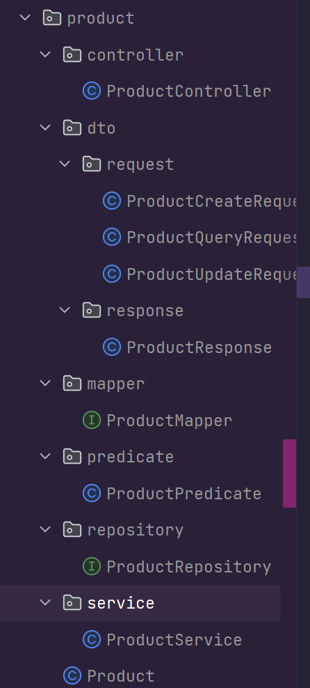
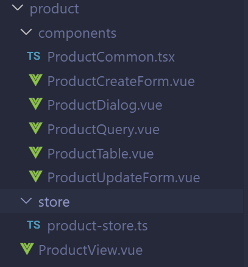
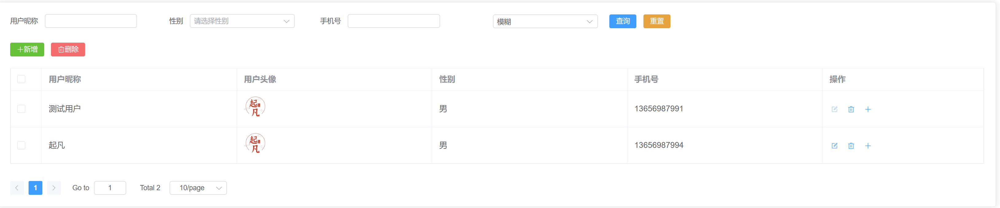
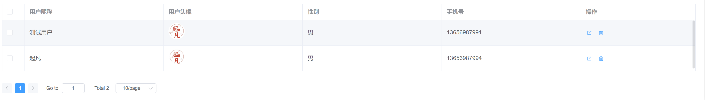
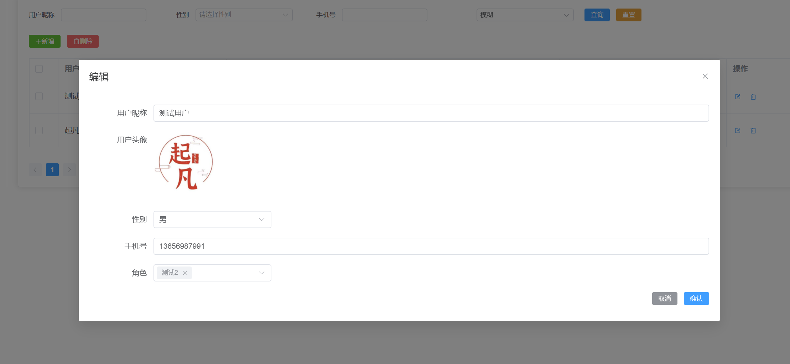

---
category:
  - 起凡小商店
  - 后端基础
tag:
  - 代码生成器

date: 2023-09-28
timeline: true
---

# 代码生成器

## 注解

### @GenEntity

在实体类上增加该注解自动生成后端增删改查和前端的增删改查。

### @GenField

用于生成后端查询条件、前端的表格、创建表单、删除表单、查询表单。

```java
@Retention(RetentionPolicy.RUNTIME)
@Inherited
@Target({ElementType.FIELD})
public @interface GenField {

  // 字段注释
  String value() default "";

  // 生成dto时的类型
  String dtoType() default "";

  // 是否是关联实体
  boolean association() default false;

  // 生成dto时在request中忽略
  boolean ignoreRequest() default false;

  // 生成dto时在response中忽略
  boolean ignoreResponse() default false;

  // 生成前端表单时选用的组件根据此字段生成。比如：ElInput,ELInputNumber
  ItemType type() default ItemType.INPUT_TEXT;

  // 前端v-model绑定的路径
  String bind() default "";

  // 枚举Class
  Class<? extends SelectableItem> selectOptionClass() default SelectableItem.class;

  // 获取所有的枚举值方法
  String selectOptionMethod() default "getSelectOptions";

  // 当type=INPUT_NUMBER时可以填写最大值和最小值在前端做限制
  String max() default "99999999";

  String min() default "0";

}
```

## 后端模板

<center>


图1 后端模板结构
</center>

- dto：根据entity生成dto
    - request：dto中的request分别对应create/update/query三种请求。
    - response：通用的response用与返回查询的数据
- mapper：dto和entity之间的映射，可以灵活的控制各个字段的映射规则。
- controller：接收create（创建）、update（更新）、findById（根据id查询）、query（查询）、invalid（失效）、valid（生效）。
- service：对应controller中的api。
- repository：SpringDataJpa通用增删改查。
- predicate：query中的查询条件，根据实体类的字段生成。

### Dto

下面展示以User实体类和UserCreateRequest为例子，UserCreateRequest是User的dto，字段的属性上名称是一致的但是类型不一定一致。`gender`、`roles`、`phonePassword`、`weChat`这四个属性的类型和实体类中的都不一致。

剩余的`UpdateRequest`、`QueryRequest`，`CommonResponse`都是一样的。

```java
@Data
public class UserCreateRequest implements BaseRequest {

  private LocalDateTime createdAt;
  private LocalDateTime updatedAt;
  private Integer version;
  private String nickname;
  private String avatar;
  private Integer gender = GenderType.PRIVATE.getCode();
  private Set<RoleCreateRequest> roles;
  private UserPhonePasswordCreateRequest phonePassword;
  private UserWeChatCreateRequest weChat;
}
```

用户实体类

```java
@GenEntity
@Entity
@Accessors(chain = true)
@Table(name = "USER")
@Getter
@Setter
@ToString
@RequiredArgsConstructor
public class User extends BaseEntity {

  @GenField(value = "用户昵称")
  private String nickname;

  @GenField(value = "用户头像", type = ItemType.PICTURE)
  private String avatar;

  @Convert(converter = GenderTypeConverter.class)
  @GenField(value = "性别", dtoType = "java.lang.Integer", type = ItemType.SELECTABLE, selectOptionClass = GenderType.class)
  private GenderType gender;

  @GenField(value = "角色列表", association = true, type = ItemType.NONE)
  @ManyToMany(fetch = FetchType.LAZY)
  @ToString.Exclude
  @JoinTable(name = "USER_ROLE", joinColumns = @JoinColumn(name = "user_id"), inverseJoinColumns = @JoinColumn(name = "role_id"))
  private Set<Role> roles;

  @GenField(value = "手机号", bind = "phonePassword.phoneNumber")
  @OneToOne(mappedBy = "user", cascade = CascadeType.ALL)
  @ToString.Exclude
  private UserPhonePassword phonePassword;

  @GenField(value = "小程序openId", bind = "weChat.openId")
  @OneToOne(mappedBy = "user", cascade = CascadeType.ALL)
  @ToString.Exclude
  private UserWeChat weChat;

  @GenField(value = "是否生效", ignoreRequest = true, type = ItemType.NONE)
  @Convert(converter = ValidStatusConverter.class)
  private ValidStatus validStatus;

  @Override
  public void preCreate0() {
    valid();
  }

  public void valid() {
    setValidStatus(ValidStatus.VALID);
  }

  public void invalid() {
    setValidStatus(ValidStatus.INVALID);
  }

  @Override
  public final boolean equals(Object o) {
    if (this == o) {
      return true;
    }
    if (o == null) {
      return false;
    }
    Class<?> oEffectiveClass =
        o instanceof HibernateProxy ? ((HibernateProxy) o).getHibernateLazyInitializer()
            .getPersistentClass() : o.getClass();
    Class<?> thisEffectiveClass =
        this instanceof HibernateProxy ? ((HibernateProxy) this).getHibernateLazyInitializer()
            .getPersistentClass() : this.getClass();
    if (thisEffectiveClass != oEffectiveClass) {
      return false;
    }
    User user = (User) o;
    return getId() != null && Objects.equals(getId(), user.getId());
  }

  @Override
  public final int hashCode() {
    return getClass().hashCode();
  }
}
```

### Mapper

Mapper文件用于dto和实体类之间的映射，通过下面的几个方法的入参和返回值可以知道映射关系。

```java
@Mapper(
        uses = {CustomMapper.class},
        nullValueCheckStrategy = NullValueCheckStrategy.ALWAYS,
        componentModel = MappingConstants.ComponentModel.SPRING

)
public interface UserMapper {

    User createRequest2Entity(UserCreateRequest request);

    User queryRequest2Entity(UserQueryRequest request);

    User updateEntityFromUpdateRequest(UserUpdateRequest request, @MappingTarget User entity);

    UserResponse entity2Response(User entity);
}
```

### Controller

生成基本地增删改查生效失效。

```java
@RestController
@Slf4j
@AllArgsConstructor
@RequestMapping("user")
public class UserController {
    private final UserService userService;

    @GetMapping("{id}")
    public UserResponse findById(@PathVariable String id) {
        return userService.findById(id);
    }

    @PostMapping
    public String createUser(@RequestBody @Validated UserCreateRequest createRequest) {
        return userService.createUser(createRequest);
    }

    @PutMapping("{id}")
    public Boolean updateUser(@RequestBody UserUpdateRequest updateRequest, @PathVariable String id) {
        userService.updateUser(updateRequest, id);
        return true;
    }

    @PatchMapping("{id}/valid")
    public Boolean validUser(@PathVariable String id) {
        userService.validUser(id);
        return true;
    }

    @PatchMapping("{id}/invalid")
    public Boolean invalidUser(@PathVariable String id) {
        userService.invalidUser(id);
        return true;
    }

    @PostMapping("query")
    public Page<UserResponse> queryUser(
            @RequestBody QueryRequest<UserQueryRequest> queryRequest) {
        return userService.queryUser(queryRequest);
    }

    @DeleteMapping
    public Boolean deleteUser(@RequestBody List<String> ids) {
        return userService.deleteUser(ids);
    }
```

### Service

和Controller中的API一一对应。
::: info
service中使用的[EntityOperations](../reference/#entityoperations)是增改两个操作的流程封装。
:::

```java

@Slf4j
@Service
@Transactional
@AllArgsConstructor
public class UserService {

  private final RoleMapper roleMapper;
  private final UserMapper userMapper;
  private final MenuMapper menuMapper;
  private final UserRepository userRepository;
  private final UserPhonePasswordMapper phonePasswordMapper;

  public UserResponse findById(String id) {
    return userMapper.entity2Response(userRepository.findById(id)
        .orElseThrow(() -> new BusinessException(ResultCode.NotFindError)));
  }

  public void updateUser(UserUpdateRequest request, String id) {
    EntityOperations.doUpdate(userRepository).loadById(id).update(e -> {
      userMapper.updateEntityFromUpdateRequest(request, e);
      if (e.getPhonePassword().getUser() == null) {
        e.getPhonePassword().setUser(e);
      }
    }).successHook(e -> log.info("更新user：{}", e)).execute();
  }

  public String createUser(UserCreateRequest request) {
    Optional<User> user = EntityOperations.doCreate(userRepository)
        .create(() -> userMapper.createRequest2Entity(request))
        .update(e -> e.getPhonePassword().setUser(e)).successHook(e -> log.info("创建user：{}", e))
        .execute();
    return user.isPresent() ? user.get().getId() : "";
  }

  public void validUser(String id) {
    EntityOperations.doUpdate(userRepository).loadById(id).update(User::valid)
        .successHook(e -> log.info("生效user：{}", e)).execute();
  }

  public void invalidUser(String id) {
    EntityOperations.doUpdate(userRepository).loadById(id).update(User::invalid)
        .successHook(e -> log.info("失效user：{}", e)).execute();
  }

  public Page<UserResponse> queryUser(QueryRequest<UserQueryRequest> request) {
    Page<User> page = userRepository.findAll((root, query, criteriaBuilder) -> {
      // 拼接User实体类上的查询条件
      List<Predicate> predicates = UserPredicate.predicate(root, criteriaBuilder,
          request.getQuery(), request.getMatchMode(), userMapper);
      // 拼接UserPhonePassword实体类上的查询条件
      Join<User, UserPhonePassword> phonePasswordJoin = root.join(User_.phonePassword,
          JoinType.LEFT);
      predicates.addAll(UserPhonePasswordPredicate.predicate(phonePasswordJoin, criteriaBuilder,
          request.getQuery().getPhonePassword(), request.getMatchMode(), phonePasswordMapper));
      return SpecificationUtils.conjunction(predicates, criteriaBuilder);
    }, request.toPageable());
    return page.map(userMapper::entity2Response);
  }
}
```

### Predicate

在Predicate中可以定义动态的查询条件，根据参数值是否存在来确定是否要拼接条件。

```java
@Slf4j
public class UserPredicate {

  public static <T> List<Predicate> predicate(From<T, User> root, CriteriaBuilder criteriaBuilder,
      UserQueryRequest request, QueryRequest.MatchMode matchMode, UserMapper userMapper) {
    List<Predicate> predicates = new ArrayList<>();
    User requestQuery = userMapper.queryRequest2Entity(request);
    if (StringUtils.hasText(requestQuery.getId())) {
      predicates.add(criteriaBuilder.equal(root.get(User_.id), requestQuery.getId()));
    }
    if (StringUtils.hasText(requestQuery.getNickname())) {
      predicates.add(criteriaBuilder.like(root.get(User_.nickname),
          matchMode.toPredicate(requestQuery.getNickname())));
    }
    // 根据
    if (requestQuery.getGender() != null) {
      predicates.add(criteriaBuilder.equal(root.get(User_.gender), requestQuery.getGender()));
    }

    return predicates;
  }
}
```

### Repository

```java
public interface UserRepository extends BaseRepository<User> {

}
```

## 后台管理模板

<center>


图2 后台管理模板
</center>

- view：展示页面
- query：查询框
- table：数据展示
- dialog：对话框，内涵create表单和update表单。
- createForm：创建表单
- updateForm：更新表单
- common：表格列，查询条件，创建/更新表单项
- store：状态管理

### View

<center>


图3 展示页面
</center>

View页面内包含了Query, Table, Dialog。三个组件。View页面组合这些组件并将页面注册到路由中用于访问。

### Query

<center>


图4 查询框
</center>

Query组件点击查询会携带当前的条件去分页请求数组并且刷新表格`userStore.reloadTableData({query: query.value, matchMode: matchMode.value})`。

```vue

<script lang="tsx">
  import {ElButton, ElForm, ElFormItem, ElOption, ElSelect} from 'element-plus'
  import {defineComponent, toRefs} from 'vue'
  import {useUserStore} from '../store/user-store'
  import {storeToRefs} from 'pinia'
  import {matchModeList} from '@/utils/constants'
  import {userQueryItemList} from './UserCommon'

  export default defineComponent({
    setup() {
      const userStore = useUserStore()
      const {queryData} = storeToRefs(userStore)
      // query是一个响应式的变量 const query= ref({})
      // matchMode同理
      const {query, matchMode} = toRefs(queryData.value)

      return () => (
          <div class="search">
            <ElForm inline labelWidth={60} size="small">
              {/* 导入查询条件 用户昵称：, 性别：， 手机号: */}
              {userQueryItemList(query.value).map((item) => item)}
              <ElFormItem label=" ">
                <div>
                  <ElSelect v-model={matchMode.value} placeholder="匹配模式">
                    {matchModeList.map((item) => (
                        <ElOption key={item.value} label={item.label} value={item.value}></ElOption>
                    ))}
                  </ElSelect>
                </div>
                <div class="btn-wrapper">
                  <ElButton
                      type="primary"
                      size="small"
                      onClick={() => {
                        // 调用Store中方法刷新表格中的数据，携带新的查询条件。
                        userStore.reloadTableData({query: query.value, matchMode: matchMode.value})
                      }}
                  >
                    {'查询'}
                  </ElButton>
                  <ElButton
                      type="warning"
                      size="small"
                      onClick={(event) => {
                        userStore.restQuery()
                      }}
                  >
                    {'重置'}
                  </ElButton>
                </div>
              </ElFormItem>
            </ElForm>
          </div>
      )
    }
  })
</script>

<style lang="scss" scoped>
  :deep(.el-form-item) {
    margin-bottom: 5px;
  }

  .search {
    display: flex;
    flex-flow: column nowrap;
    width: 100%;

    .btn-wrapper {
      margin-left: 20px;
    }
  }
</style>

```

:::info
[useUserStore](#store) UserStore中包含query查询条件。双向绑定到Query组件。
[userQueryItemList](#common) 抽取查询条件
:::

### Table

<center>


图5 数据展示表格
</center>

Table组件有如下功能

1. 使用ElPagination分页加载数据：`loadTableData`
2. 点击新增/编辑按钮弹出对话框：`handleEdit`，`handleCreate`
3. 多选/单选删除：`handleBatchDelete`，`handleSingleDelete`，` onSelection-change={handleSelectChange}（多选）`
4. 点击列头可以升序/降序排序数据（后端排序）：`onSort-change={handleSortChange}`
5. 请求后端数据时显示加载动画：`v-loading={tableData.value.loading}`

```vue

<script lang="tsx">
  import {defineComponent, onMounted, toRefs} from 'vue'
  import {ElButton, ElIcon, ElMessageBox, ElPagination, ElTable, ElTableColumn} from 'element-plus'
  import {BaseEntity, User} from '@/typings'
  import {Delete, Edit, Plus} from '@element-plus/icons-vue'
  import {useUserStore} from '../store/user-store'
  import {storeToRefs} from 'pinia'
  import {deleteUser} from '@/api/user'
  import {assertSuccess} from '@/utils/common'
  import {userTableItemList} from './UserCommon'

  export default defineComponent({
    setup() {
      const userStore = useUserStore()
      const {
        loadTableData,
        reloadTableData,
        openDialog,
        restForm,
        handleSelectChange,
        handleSortChange,
        getTableSelectedRows
      } = userStore
      const {tableData, table} = storeToRefs(userStore)
      const {pageData, queryRequest} = toRefs(tableData.value)
      onMounted(() => {
        reloadTableData()
      })
      const handleEdit = (row: User) => {
        openDialog('UPDATE')
        restForm(row)
      }
      const handleCreate = (row: User) => {
        openDialog('CREATE')
        restForm(row)
      }
      const handleSingleDelete = (row: BaseEntity) => {
        handleDelete([row.id])
      }
      const handleBatchDelete = () => {
        handleDelete(getTableSelectedRows().map((row: BaseEntity) => row.id))
      }
      const handleDelete = (ids: string[]) => {
        ElMessageBox.confirm('此操作将删除数据且无法恢复, 是否继续?', '警告', {
          confirmButtonText: '确定',
          cancelButtonText: '取消',
          type: 'warning'
        }).then(() => {
          deleteUser(ids).then((res) => {
            assertSuccess(res).then(() => reloadTableData())
          })
        })
      }
      return () => (
          <div>
            <div class="button-section">
              <ElButton
                  type="success"
                  size="small"
                  onClick={() => {
                    handleCreate({id: ''} as User)
                  }}
              >
                <ElIcon>
                  <Plus/>
                </ElIcon>
                新增
              </ElButton>
              <ElButton
                  type="danger"
                  size="small"
                  onClick={() => {
                    handleBatchDelete()
                  }}
              >
                <ElIcon>
                  <Delete/>
                </ElIcon>
                删除
              </ElButton>
            </div>
            {/* ref={table} ：将ElTable实例绑定到table变量上。table.value就可以调用ElTable的方法了 */}
            {/* onSelection-change={handleSelectChange}：当表格选择生改变时，tableData.value.tableSelectedRows也会随之改变 */}
            {/* data={pageData.value.list} : 表格内的数据定义在Store中，也是响应式的。当pageData发生改变时表格内的数据也会改变 */}
            {/*  v-loading={tableData.value.loading} : 请求分页数据时出现加载图标，后端成功响应数据之后取消加载 */}
            <ElTable
                ref={table}
                data={pageData.value.list}
                border={true}
                onSelection-change={handleSelectChange}
                onSort-change={handleSortChange}
                v-loading={tableData.value.loading}
            >
              {/* 表格多选 */}
              <ElTableColumn type="selection" width="55"></ElTableColumn>
              {/* 导入表格的列 */}
              {userTableItemList((index) => pageData.value.list[index]).map((column) => column)}
              <ElTableColumn label="操作" fixed="right" width={280}>
                {{
                  default: ({row}: { row: User }) => (
                      <div>
                        <ElButton
                            class={'edit-btn'}
                            link
                            size="small"
                            type="primary"
                            onClick={() => {
                              handleEdit(row)
                            }}
                        >
                          <ElIcon>
                            <Edit/>
                          </ElIcon>
                        </ElButton>
                        <ElButton
                            class={'delete-btn'}
                            link
                            size="small"
                            type="primary"
                            onClick={() => {
                              handleSingleDelete(row)
                            }}
                        >
                          <ElIcon>
                            <Delete/>
                          </ElIcon>
                        </ElButton>
                      </div>
                  )
                }}
              </ElTableColumn>
            </ElTable>
            {/* 分页组件 */}
            <ElPagination
                style={{marginTop: '30px'}}
                v-model:currentPage={queryRequest.value.pageNum}
                v-model:pageSize={queryRequest.value.pageSize}
                pageSizes={[10, 20, 30, 40, 50]}
                total={pageData.value.total}
                background
                small
                layout="prev, pager, next, jumper, total, sizes"
                onCurrent-change={(pageNum) => loadTableData({pageNum})}
                onSize-change={(pageSize) => loadTableData({pageSize})}
            />
          </div>
      )
    }
  })
</script>

<style lang="scss" scoped>
  .button-section {
    margin: 20px 0;
  }
</style>

```

:::info
[useUserStore](#store) UserStore中包含Table组件中通用的pageData（分页结果），queryRequest（分页请求），table（ElTable实例），loading（加载动画控制）以及其他函数。
[userTableItemList](#common) 抽取Table中的列，方便后续的其他业务复用。
:::

### Dialog

<center>


图6 数据展示表格
</center>

点击编辑或者新增按钮时，会修改Store中的dialogData。由于Dialog和Table中使用的都是全局状态管理共享dialogData变量。因此Dialog会弹出，对话框内部根据是编辑还是新增显示updateFrom或者createForm。

```vue

<script lang="tsx">
  import {ElDialog} from 'element-plus'
  import {defineComponent} from 'vue'
  import {storeToRefs} from 'pinia'
  import {useUserStore} from '../store/user-store'
  import UserCreateForm from './UserCreateForm.vue'
  import UserUpdateForm from './UserUpdateForm.vue'
  import {type EditMode} from '@/typings'

  export default defineComponent({
    components: {
      UserCreateForm,
      UserUpdateForm
    },
    setup() {
      const userStore = useUserStore()
      const {dialogData} = storeToRefs(userStore)
      const formMap: Record<EditMode, JSX.Element> = {
        CREATE: <UserCreateForm/>,
        UPDATE: <UserUpdateForm/>
      }
      return () => (
          <div>
            <ElDialog
                v-model={dialogData.value.visible}
                title={dialogData.value.title}
                width={dialogData.value.width}
            >
              {/* 根据是创建还是编辑显示不同表单 */}
              {{
                default: () => formMap[dialogData.value.mode]
              }}
            </ElDialog>
          </div>
      )
    }
  })
</script>

<style lang="scss" scoped></style>

```

:::info
[useUserStore](#store) UserStore中包含Dialog组件中通用的dialogData以及其他函数。
:::

### UpdateForm

更新表单功能如下

1. 监听对话框是否打开，打开则执行init方法，根据id请求数据：`watch`。
2. 请求数据之后需要将后端返回的数据转成前端可以使用的格式：`..._.omitBy(后端数据,_.isNull)`。
3. 提交表单时对数据进行处理，提交成功后关闭对话框并刷新表格：`handleConfirm`。

```vue

<script lang="tsx">
  import {storeToRefs} from 'pinia'
  import {defineComponent, watch} from 'vue'
  import {useUserStore} from '../store/user-store'
  import {findUserById, getUserRole, saveUser} from '@/api/user'
  import {assertSuccess} from '@/utils/common'
  import {ElForm} from 'element-plus'
  import {Role} from '@/typings'
  import FooterButton from '@/components/base/dialog/FooterButton.vue'
  import {userFormItemList} from './UserCommon'
  import _ from 'lodash'

  export default defineComponent({
    setup() {
      const userStore = useUserStore()
      const {closeDialog, reloadTableData} = userStore
      const {formData, dialogData} = storeToRefs(userStore)
      const init = async () => {
        dialogData.value.title = '编辑'
        // 加载用户的信息合并默认值，防止空指针异常
        formData.value = {
          ...formData.value,
          // 忽略值是null的属性
          ..._.omitBy((await findUserById(formData.value.id)).result, _.isNull)
        }
        // 加载用户的角色信息
        getUserRole(formData.value.id).then((res) => {
          formData.value.selectedRoleIds = res.result.map((role) => role.id)
        })
      }
      // 当对话框打开时执行初始化操作
      watch(
          () => dialogData.value.visible,
          (value) => {
            if (value) {
              init()
            }
          },
          {immediate: true}
      )
      // 提交时对表单进行处理
      const handleConfirm = () => {
        formData.value.roles = formData.value.selectedRoleIds.map((id) => {
          const role = new Role()
          role.id = id
          return role
        })
        // 操作成功则关闭对话框并重新加载表格
        saveUser(formData.value).then((res) => {
          assertSuccess(res).then(() => {
            closeDialog()
            reloadTableData()
          })
        })
      }

      return () => (
          <div class="update-form">
            <ElForm labelWidth={120} class={'form'}>
              {userFormItemList(formData.value)}
            </ElForm>
            <FooterButton onClose={closeDialog} onConfirm={handleConfirm}></FooterButton>
          </div>
      )
    }
  })
</script>

<style scoped></style>

```

:::info
[useUserStore](#store) UserStore中包含Form组件中通用的formData以及其他函数。
:::

### CreateForm

创建表单和更新表单类似。

### Common

以UserCommon.tsx为例子，它抽取了User相关的表格列，查询条件，创建/更新表单项。相关的枚举值也会存放在这里。

考虑到下面的这些TableItem很容易被复用，所以采用`columnProvider($index).nickname`代替`row.nickname`。这种方式可以降低耦合性，有些业务可能关联了User表也想展示用户的信息，比如展示订单的用户信息，`userUserTableItemList((index)=> pageData.value.list[index].user)`，此时采用第一种方式订单业务也可以复用用户的表格。

```tsx
import {ElAvatar, ElFormItem, ElInput, ElOption, ElSelect, ElTableColumn} from 'element-plus'
import {User, type Scope, type OptionEnum, QueryRequest, Role} from '@/typings'
import AvatarUpload from '@/components/avatar/AvatarUpload.vue'
import RemoteSelect, {type OptionItem} from '@/components/base/form/RemoteSelect.vue'
import {queryRole} from '@/api/role'

export const genderList: OptionEnum = [
    {label: '女', value: 1},
    {label: '保密', value: 2},
    {label: '男', value: 0}
]
export const userFormItemList = (form: User) => {
    return [
        <ElFormItem label="用户昵称">
            <ElInput v-model={form.nickname}/>
        </ElFormItem>,
        <ElFormItem label="用户头像">
            <AvatarUpload v-model:avatar={form.avatar}></AvatarUpload>
        </ElFormItem>,
        <ElFormItem label="性别">
            <ElSelect v-model={form.gender} placeholder="请选择性别">
                {genderList.map((item) => (
                    <ElOption key={item.value} label={item.label} value={item.value}></ElOption>
                ))}
            </ElSelect>
        </ElFormItem>,
        <ElFormItem label="手机号">
            <ElInput v-model={form.phonePassword.phoneNumber}/>
        </ElFormItem>,
        <ElFormItem label="角色">
            <RemoteSelect
                v-model={form.selectedRoleIds}
                multiple
                queryOptions={async (keyword) => {
                    const res = await queryRole(new QueryRequest<Role>({name: keyword}))
                    return res.result.list.map((role) => {
                        return {label: role.name, value: role.id} satisfies OptionItem
                    })
                }}
            ></RemoteSelect>
        </ElFormItem>
    ]
}
export const userQueryItemList = (query: User) => {
    return [
        <ElFormItem label="用户昵称">
            <ElInput v-model={query.nickname} style={{width: '100%'}}/>
        </ElFormItem>,
        <ElFormItem label="性别">
            <ElSelect
                v-model={query.gender}
                placeholder="请选择性别"
                fitInputWidth={true}
                style={{width: '100%'}}
            >
                {genderList.map((item) => (
                    <ElOption key={item.value} label={item.label} value={item.value}></ElOption>
                ))}
            </ElSelect>
        </ElFormItem>,
        <ElFormItem label="手机号">
            <ElInput v-model={query.phonePassword.phoneNumber}/>
        </ElFormItem>
    ]
}
type UserScope = Scope<User>
export const userTableItemList = (columnProvider: (index: number) => User) => {
    return [
        <ElTableColumn label="用户昵称" prop="nickname" sortable="custom">
            {{
                default: ({$index}: UserScope) => {
                    return columnProvider($index).nickname
                }
            }}
        </ElTableColumn>,
        <ElTableColumn label="用户头像" prop="avatar" sortable="custom">
            {{
                default: ({$index}: UserScope) => {
                    return <ElAvatar src={columnProvider($index).avatar} alt=""></ElAvatar>
                }
            }}
        </ElTableColumn>,
        <ElTableColumn label="性别" prop="gender" sortable="custom">
            {{
                default: ({$index}: UserScope) => {
                    const result = genderList.filter((item) => item.value === columnProvider($index).gender)
                    return result.length > 0 ? result[0].label : ''
                }
            }}
        </ElTableColumn>,
        <ElTableColumn label="手机号" prop="phonePassword.phoneNumber" sortable="custom">
            {{
                default: ({$index}: UserScope) => {
                    return columnProvider($index).phonePassword?.phoneNumber
                }
            }}
        </ElTableColumn>
    ]
}

```

### Store

Store同一管理Query,Table,Dialog,Form中涉及的通用变量。方便各个组件都可以对这些变量进行修改。比如当点击新增按钮时，Table组件会修改dialogData打开Dialog。

:::info
针对增删改查中场景的变量用组合式的思想抽取出来，方便后续快速编写增删改查。
[useTableHelper](./front/#tablehelper) 抽取Table中常用的变量和函数。
[useDialogHelper](./front/#dialoghelper) 抽取Dialog中常用的变量和函数。
[useQueryHelper](./front/#queryhelper) 抽取Query中的通用变量和函数。
[useFormHelper](./front/#formhelper) 抽取UpdateForm/CreateForm中的通用变量和函数。

:::

```ts
import {queryUser} from '@/api/user'
import {User, UserPhonePassword} from '@/typings'

import {defineStore} from 'pinia'

import {useTableHelper} from '@/components/base/table/table-helper'
import {useDialogHelper} from '@/components/base/dialog/dialog-helper'
import {useQueryHelper} from '@/components/base/query/query-helper'
import {useFormHelper} from '@/components/base/form/form-helper'

export const useUserStore = defineStore('user', () => {
    const initQuery = new User()
    initQuery.phonePassword = new UserPhonePassword()
    const initForm = new User()
    initForm.phonePassword = new UserPhonePassword()
    initForm.selectedRoleIds = []

    const tableHelper = useTableHelper(queryUser, initQuery)
    const dialogHelper = useDialogHelper()
    const queryHelper = useQueryHelper<User>(initQuery)
    const formHelper = useFormHelper<User>(initForm)
    return {...tableHelper, ...dialogHelper, ...queryHelper, ...formHelper}
})

```

