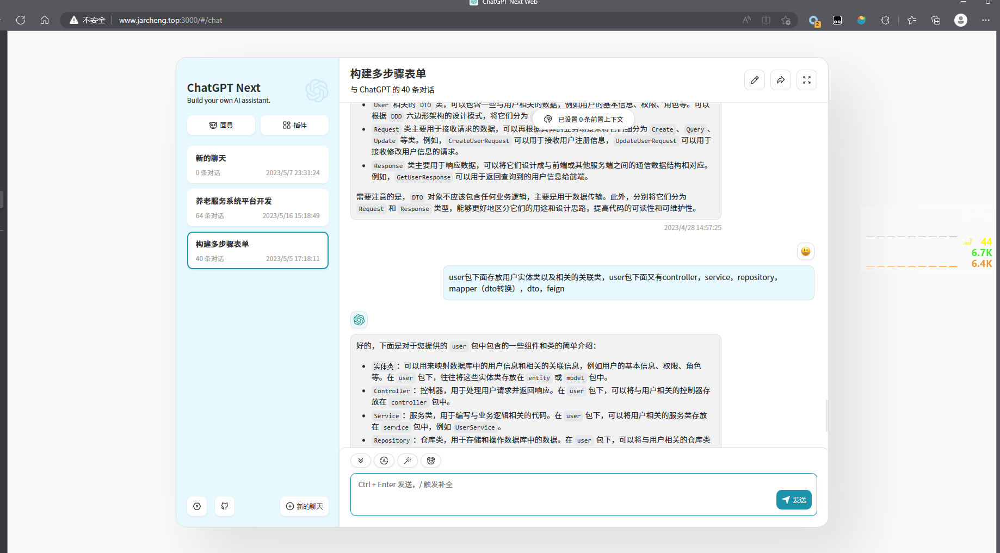
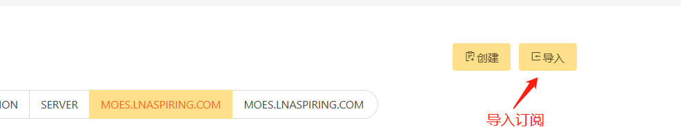
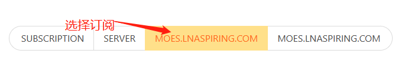
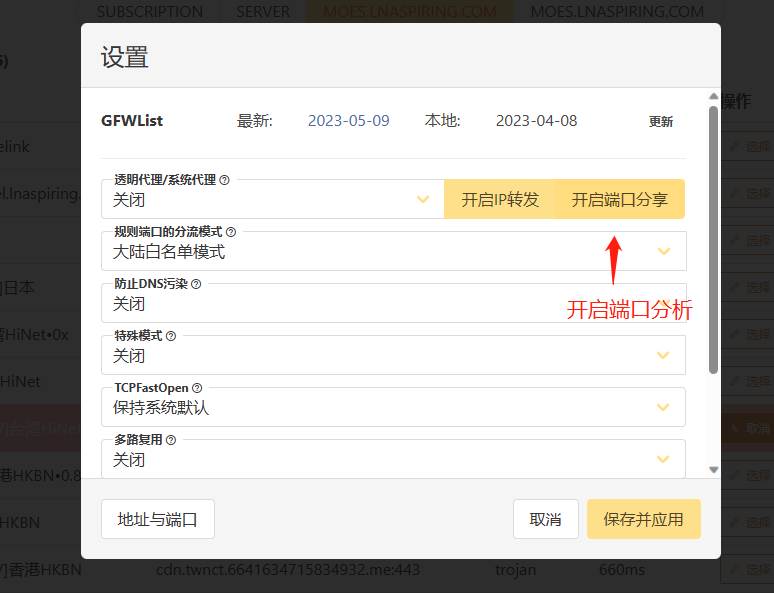
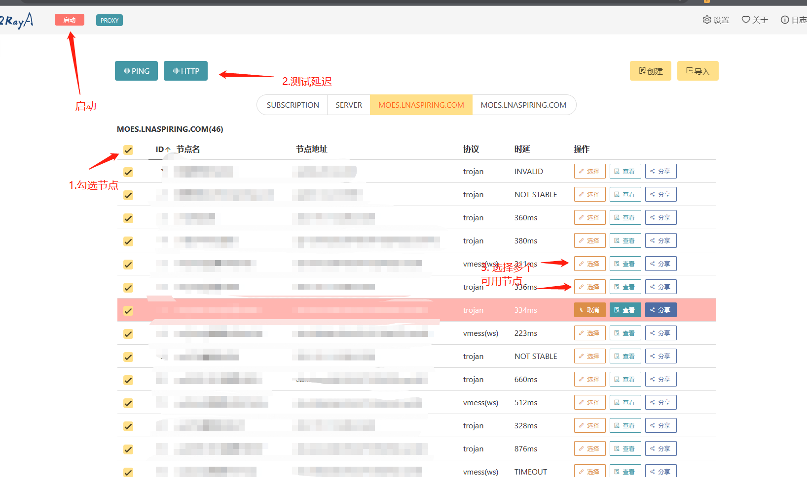
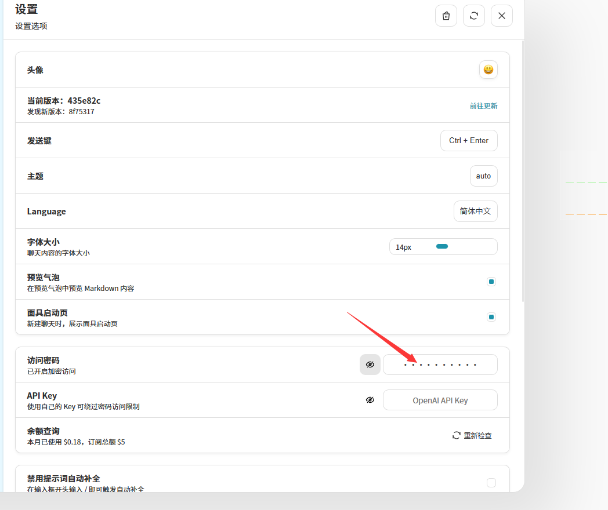
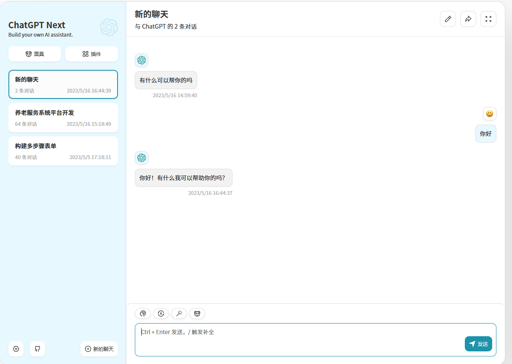

# ChatGPT Next Web 搭建教程

## 1.2 介绍

### 1.2.1 自我介绍

我是起凡，一名全栈程序员，刚刚毕业于华侨大学。主要技术栈后端SpringBoot,Jpa, MongoDb等。前端Vue3, Typescript, Taro小程序。

### 1.2.2 ChatGPT Next Web 介绍

ChatGPT Next Web可以使用OpenAI官方提供的API。比如ChatGPT3.5模型，ChatGPT4.0模型等等。并且提供了一个WEB界面将我们输入的内容转发给OpenAI。同时支持多聊天窗口会话等。
<div style="text-align: center">

</div>

### 1.2.3 被封锁的中国区域

在中国地区无法调用OpenAI的接口，意味着即使你在本地部署了ChatGPT Next Web你无法与之对话。要解决上面的问题只能通过代理。

- 使用稳定的代理服务软件和节点比如Windows的Clash for windows/v2ayN, linux的v2raya, mac下的Clash for mac等。
- 配置代理软件让ChatGPT Next Web能够走代理

## 1.3 先决条件

### 1.3.1 Docker

ChatGPT Next
Web可以通过源码安装，这种方式对于不熟悉开发的人来说要安装许多的软件和配置很多环境所以不推荐。使用Docker安装只需要一行命令。所以我推荐使用Docker来安装。如果是Windows或者Mac用户下载Docker
Desktop。

请根据不同的操作系统安装docker。下面以Centos7操作系统为例安装docker。

| 家族      | 发行版                                                              |
|---------|------------------------------------------------------------------|
| Debian  | Debian, Ubuntu, Mint, Pop!_OS, Elementary OS                     |
| Red Hat | Red Hat Enterprise Linux, Fedora, CentOS, AlmaLinux, Rocky Linux |

1. 配置yum 仓库
    ```shell
    sudo yum install -y yum-utils
    sudo yum-config-manager --add-repo https://download.docker.com/linux/centos/docker-ce.repo
    ```

2. 卸载旧版本
    ```shell
     sudo yum remove docker \
                  docker-client \
                  docker-client-latest \
                  docker-common \
                  docker-latest \
                  docker-latest-logrotate \
                  docker-logrotate \
                  docker-engine
    ```

3. 安装docker
    ```shell
     sudo yum install docker-ce docker-ce-cli containerd.io docker-buildx-plugin docker-compose-plugin
    ```
4. 启动docker
    ```shell
    sudo systemctl enable docker
    sudo systemctl start docker
    ```
5. 验证
    ```shell
    sudo docker run hello-world
    ```

### 1.3.2 V2rayA

将V2rayA安装到容器内与ChatGPT Next Web组成网络可以让ChatGPT Next Web走代理向OpenAI发请求。

1. 创建网络
   ```shell
    docker network create \
    --driver=bridge \
    --subnet=172.28.0.0/16 \
    --ip-range=172.28.5.0/24 \
    --gateway=172.28.5.254 \
    gpt-network
   ```
2. 运行V2rayA容器
   ```shell
   docker run -d \
   --restart=always \
   --privileged \
   --network=gpt-network \
   --network-alias=v2raya \
   --name v2raya \
   -p 2017:2017 \
   --ip=172.28.5.1 \
   -e V2RAYA_ADDRESS=0.0.0.0:2017 \
   -v /lib/modules:/lib/modules:ro \
   -v /etc/resolv.conf:/etc/resolv.conf \
   -v /etc/v2raya:/etc/v2raya \
   mzz2017/v2raya
   # 打开端口
   firewall-cmd --zone=docker --add-port=2017/tcp --permanent
   firewall-cmd --reload
   ```
3. 配置V2rayA

   - **导入订阅地址**
      
   - **选择订阅地址**
      
   - **允许局域网访问**
      
   - **开启代理**
      

## 1.4 安装 ChatGPT Next Web

1. 获取[OpenAI API Key](https://platform.openai.com/account/api-keys) 。
2. Docker安装ChatGPT Next Web
    ```shell
    docker run -d -p 3000:3000 \
       -e OPENAI_API_KEY="api-keys" \
       -e CODE="设置一个密码。如果有多个密码用,隔开。如：123456,2345612" \
       -e PROXY_URL="http://172.28.5.1:20171" \
       --name=gpt-web \
       --network=gpt-network \
       yidadaa/chatgpt-next-web
    # 打开端口
   firewall-cmd --zone=docker --add-port=3000/tcp --permanent
   firewall-cmd --reload
    ```

## 1.5 测试

1. 打开浏览器输入 http://localhost:3000。点击左下角设置输入之前设置的密码。
2. 输入密码
    <div style="text-align: center;">
    
    </div>

3. 开始聊天
    <div style="text-align: center;">
        
    </div>

## 1.6 参考

- [ChatGPT Next Web git仓库](https://github.com/Yidadaa/ChatGPT-Next-Web)
- [v2rayA git仓库](https://github.com/v2rayA/v2rayA)
- [Docker官方文档](https://docs.docker.com/)