---
category:
  - IDEA技巧
tag:
  - SSH
  - 数据库
  - SFTP
  - 部署
date: 2023-09-24
timeline: true
---

# IDEA——强大的Shell工具

## SSH

在使用Shell工具时最常用的是SSH输入命令操控远程服务器。在idea中使用SSH也是很简单的事情。

settings -> tools -> ssh congratulations

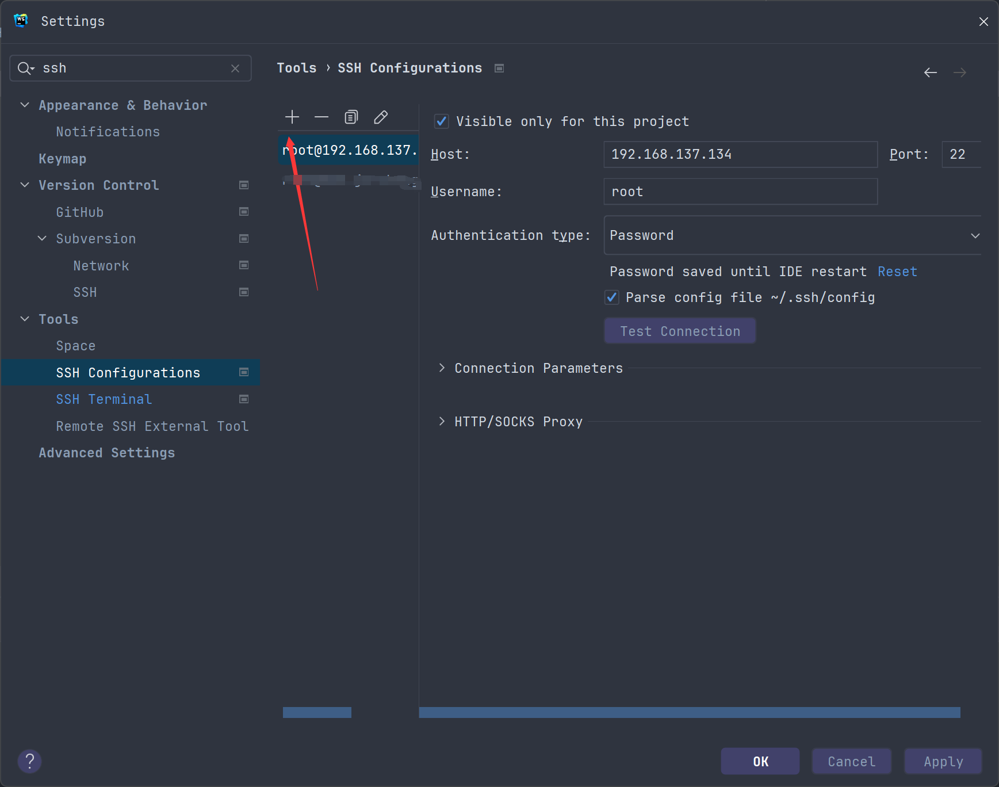

图1 配置SSH

alt+f12打开命令行，在右上角的下拉框中选择上面配置好的SSH会话。之后直接在命令行中就可以向服务器发送命令了。

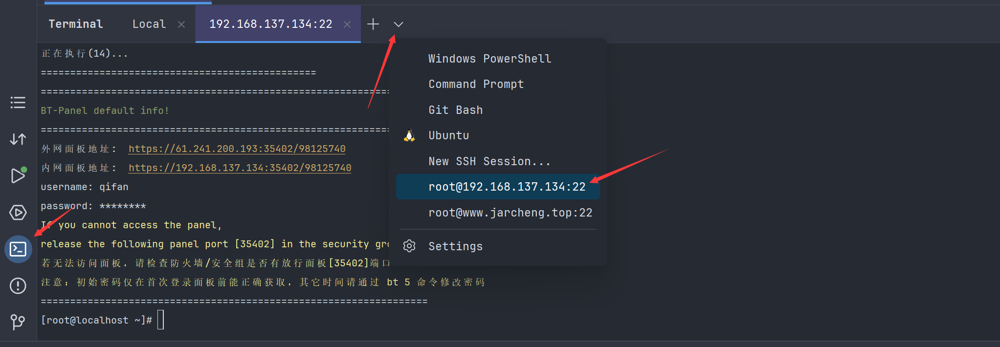

图2 命令行连接SSH

## SFTP

在控制远程服务器时除了发送命令行，自然少不了互传文件，文件预览编辑的功能。幸运的是强大的idea也有这个功能

settings -> deployment。点击左上角的➕添加sftp服务器，可以从之前已经配置的ssh session中选择。

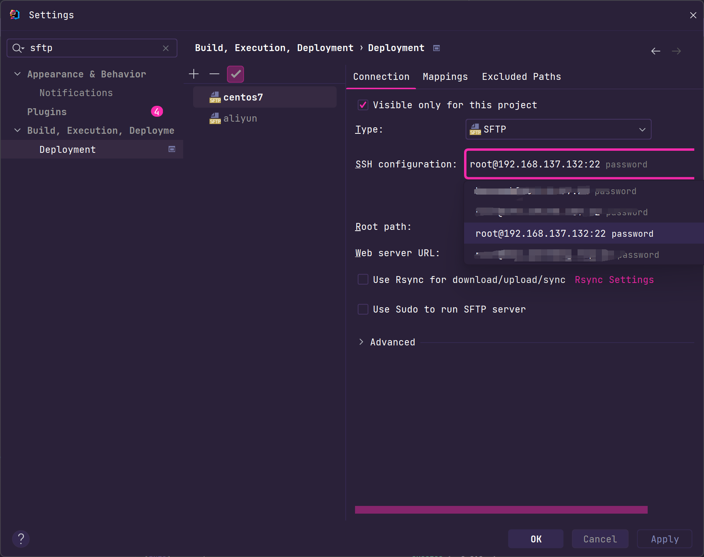

图3 配置sftp

默认情况下idea没有显示远程sftp服务器的菜单，需要手动打开。

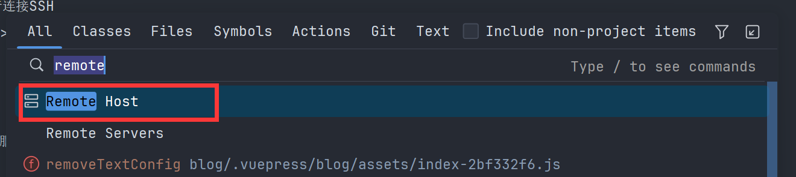

图4 显示sftp服务器

在右侧的菜单栏中打开sftp服务器列表，选择已经配置好的sftp服务器，确认后下面就可以显示服务器内的文件了，可以编辑，可以下载，可以拖动本地文件到远程文件夹。

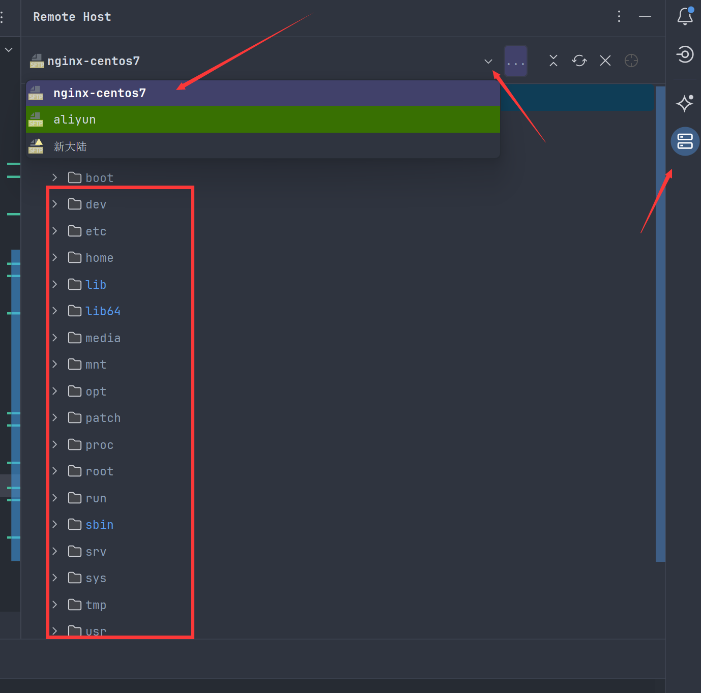

图5 显示sftp服务器

## Database

作为一名软件开发程序员，经常需要远程查看服务器上的数据库。所以除了shell工具之外还需准备数据库连接工具。

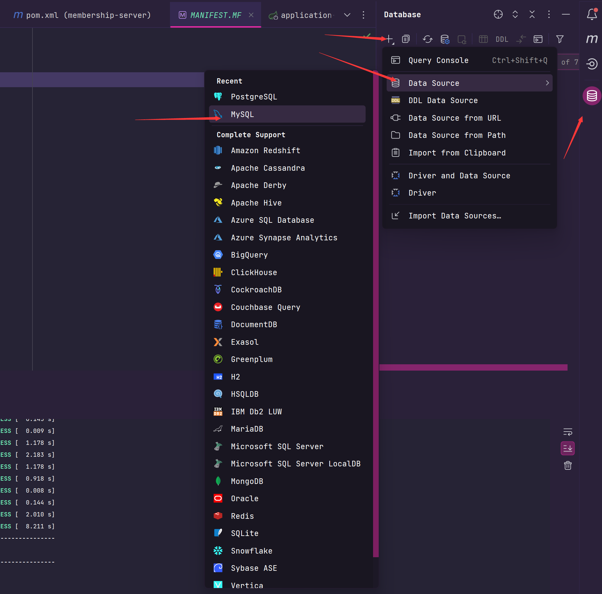

图6 选择数据库

在ssh/ssl页签中选择已经配置好的ssh。之后切换到general页签输入数据库的账号密码，记住不需要修改host。

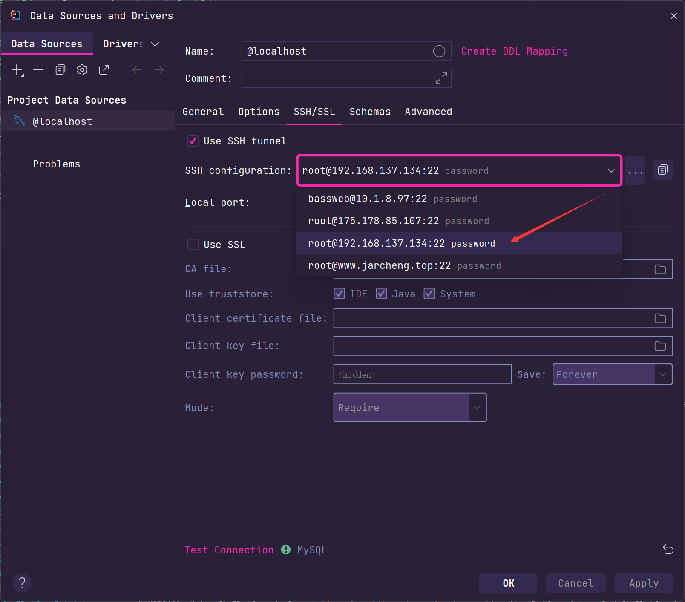

图7 连接数据库

连接数据库后你使用这

- 数据库迁移
  在服务器上部署新项目的时候需要在服务器上新建数据库，然后把本地的表迁移到服务器上，在idea中就可以实现这个操作。

- 结构对比
  如果你在本地的数据库修改了某个字段，然后想同步到服务器上，idea的数据库/表结构对比非常好用。

- 数据导出导入

## 部署

settings -> deployment

将本地编译后的文件映射到服务器的目录。

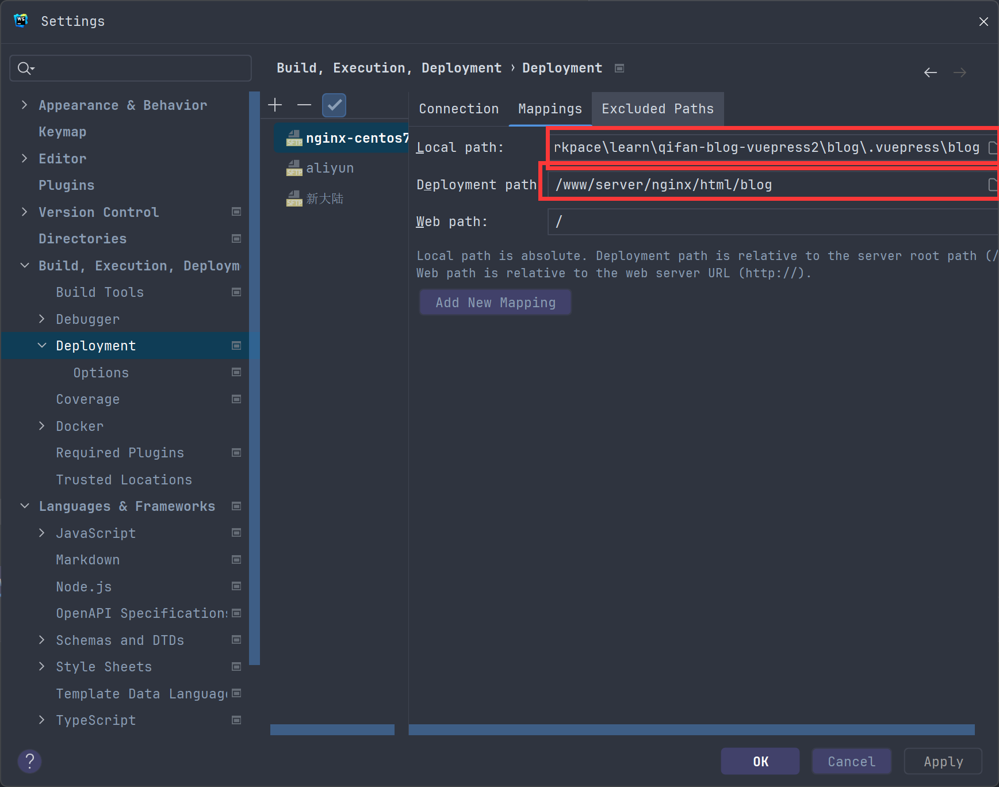

图8 映射路径

在本地映射到服务器的文件上右键，上传。

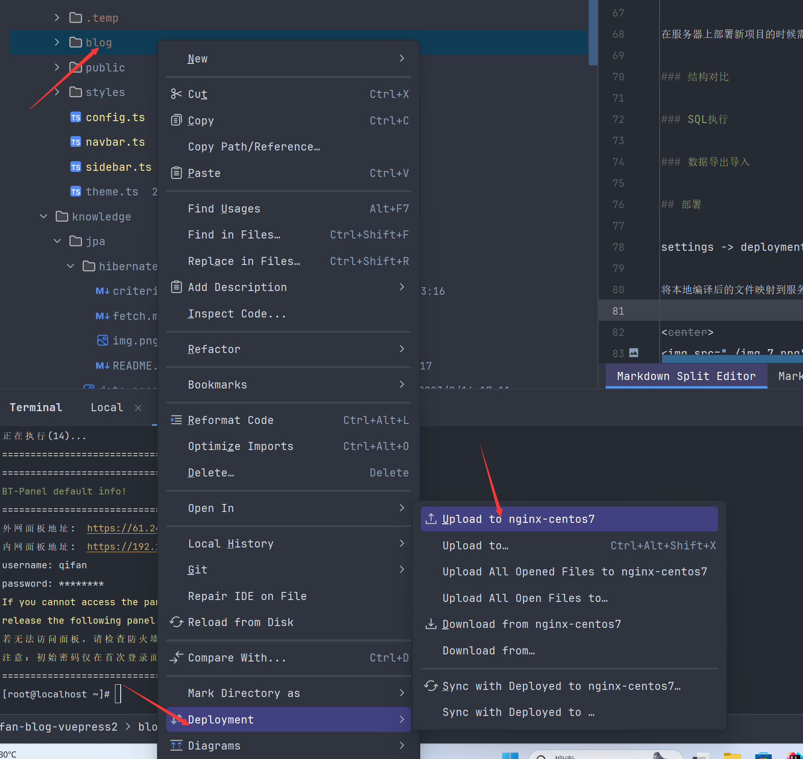

图9 上传本地文件

## 远程命令

在部署完之后一般需要执行命令或者脚本，这边我演示将远程服务器的nginx命令映射到idea里面。

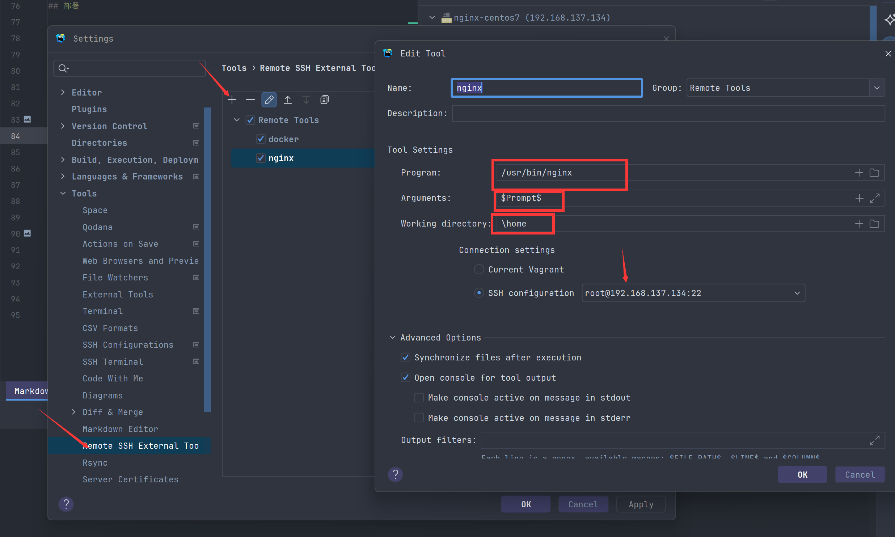

图10 配置远程命令

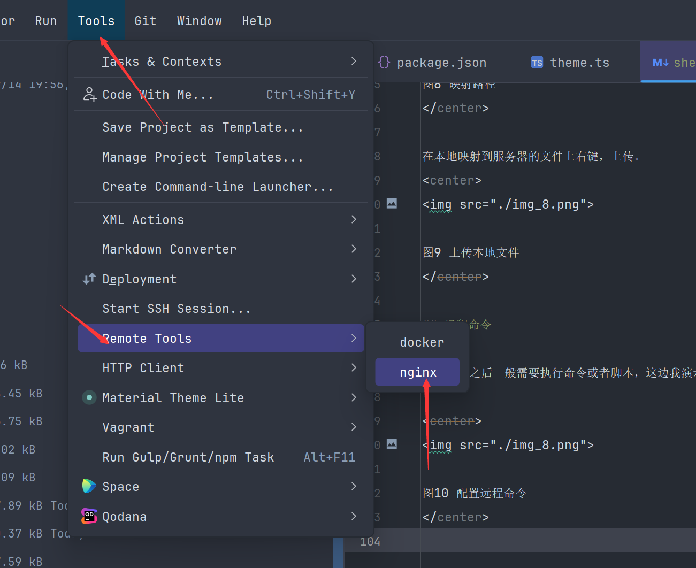

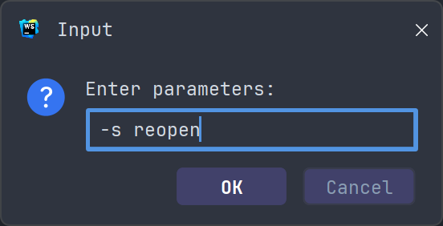

图11 执行远程命令

## 远程执行

如果大家有做过支付功能可以知道它必须用于公网ip，我们在本地调试不了支付功能（除非内网穿透），只能将应用打包放到服务器上运行。这样做每次修改代码都需要重新打包部署很费时间。这个远程执行的功能就很好用了，可以直接指定你的应用运行机器。

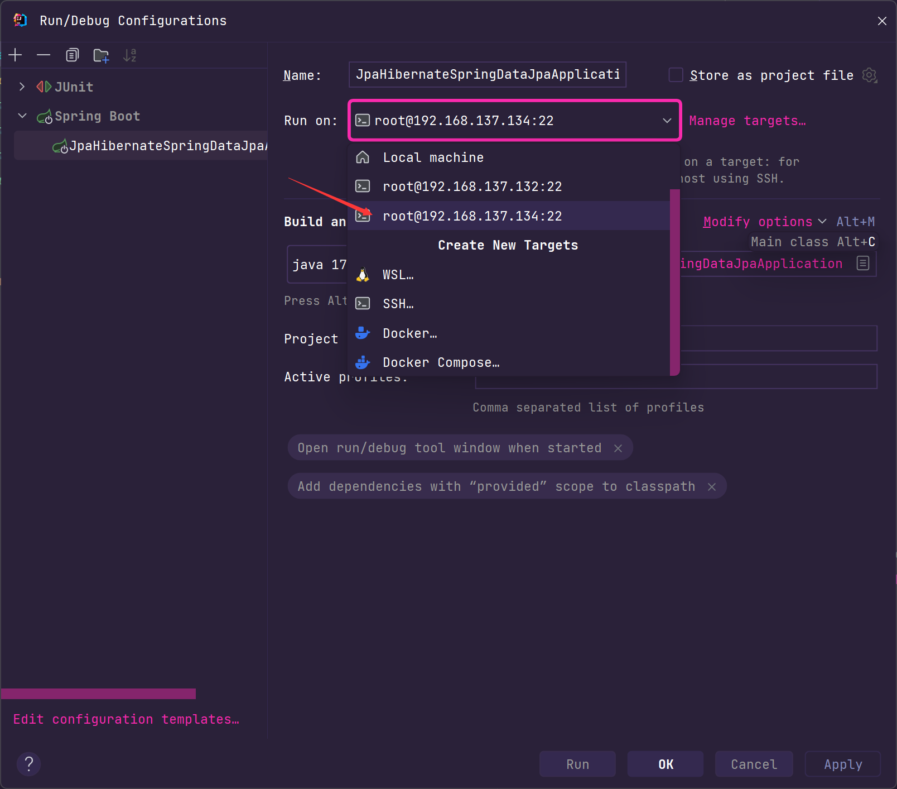

图12 远程运行应用

