# 工作必用的Jenkins

Jenkins是一个可扩展的自动化服务器，Jenkins 可以作为一个简单的 CI 服务器使用，或者成为任何项目的持续交付中心。

## CI/CD

<center>
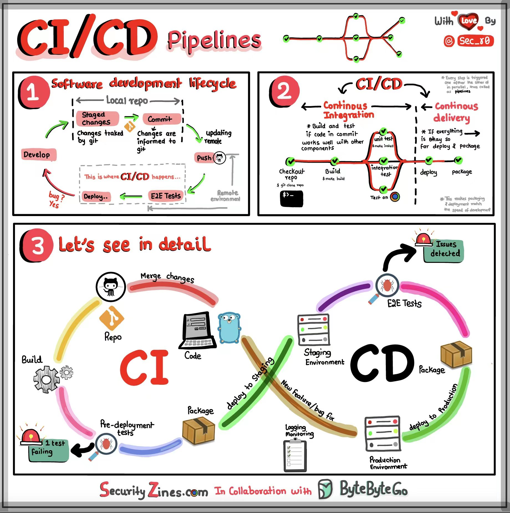

图0 CI/CD概念图
</center>

通过上面这张图可以分三部分来理解CI/CD

- **第一部分**

先看看软件开发生命周期（SDLC）和CI/CD是如何结合的。软件开发一般包含几个重要的阶段：开发（Develop），测试（Test），部署（Deploy），维护（Maintain）。CI/CD可以将上述的流程流程串联一起来形成一个自动化的闭环，使得每次发布都更快更可靠。

- **第二部分**

Continuous Integration(CI) 持续集成会不断的监听仓库并且执行构建测试确保最后合并到发布分支是没问题的。这样可以提早的发现问题，而不是累计了多次提交等合并到发布分支的时候才发现问题，这样回滚的时候会比较麻烦。

Continuous Delivery(CD) 持续交付主要是在部署方面的自动化，它也会运行一些测试，每次发布分支有更新CD就会把CI构建好的代码部署到生产上。

- **第三部分**

总结一下整体的流程可以有如下步骤

- 开发者提交代码到参考
- CI 服务器检测到代码更新触发构建
- 构建好代码并且测试
- 生成测试结果报告
- 部署打包的代码到模拟环境
- 后续可能会有模拟环境的测试
- 最后发布到生成环境

那CI/CD是如何工作的呢？它其实不神秘，你把它看成一个软件（Jenkins），它可以运行在你的电脑上也可以单独运行在服务器上。它首先会监听你的代码仓库，每次有代码提交到仓库上它就会开始运转第一部分的流程图，先是把代码拉取下来在本地编译（Jenkins所在的机器）和测试(
测试环境)。然后用前端的自动化测试模拟用户点击（e2e
test），这步通过后就可以部署到模拟环境（Staging）或者生成环境（Production）。如果出现了问题就会通知开发者，开发者根据报错日志修改bug并且提交代码，接着又重复上述的流程。

## Jenkins安装

本教程以windows为例安装jenkins，其他系统请参照官方文档。

- 第一步
  在[官网](https://www.jenkins.io/doc/book/installing/windows/)
  下载[安装包](https://www.jenkins.io/download/#downloading-jenkins)

打开安装包链接出现图1网页，再点击Windows即可下载。
<center>
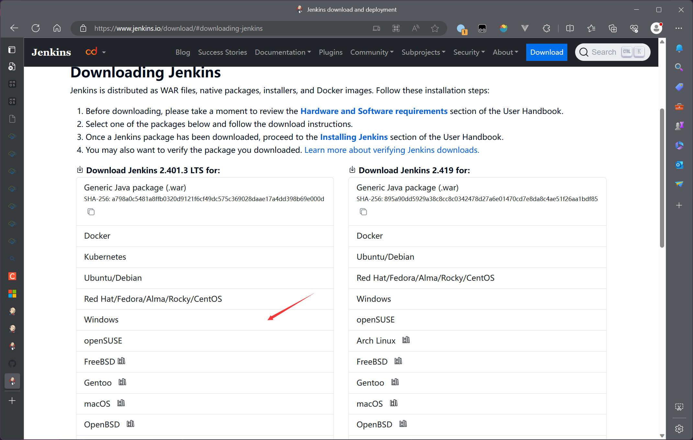

图1 下载Jenkins Windows安装包
</center>

- 第二步

按照提示走到这边。在这边输入你windows的用户名和密码。然后点击验证凭证。

<center>
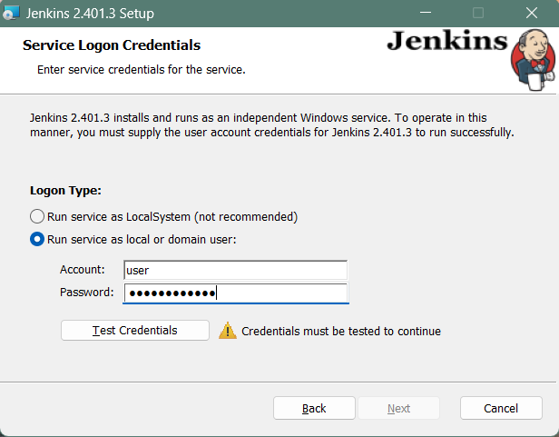

图2 以本地用户运行
</center>

如果出错请按照以下步骤添加权限

1. 打开开始，输入`本地安全策略`
2. 展开`本地策略`并点击右侧的`用户权限分配`
3. 在右侧面板中找到`作为服务登录`，右键->属性
4. 点击`添加用户或组`
5. 在输入框内输入你的Windows用户名，然后点击`检查名称`再点击确定。

<center>
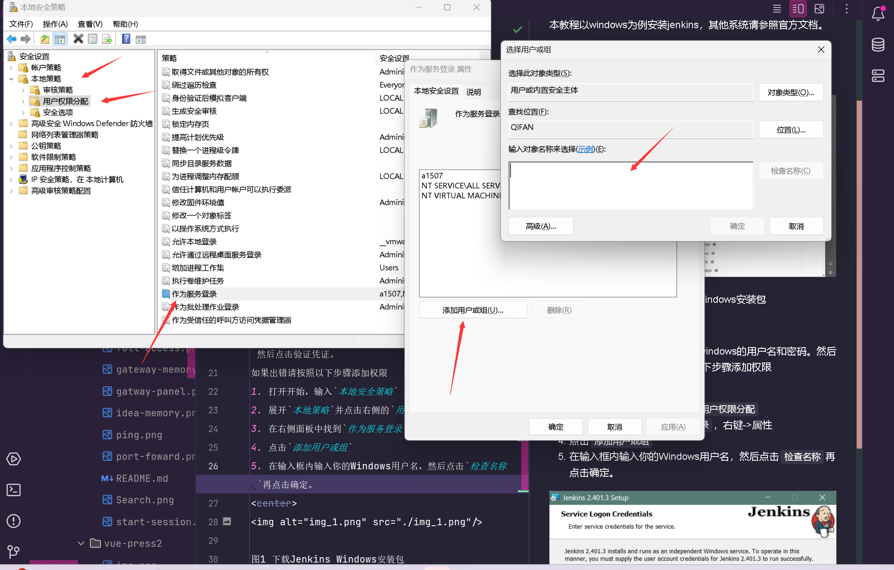

图3 为用户添加作为服务登录权限
</center>

- 第三步

在选择好端口和jdk路径后就安装结束了。安装成功后在任务管理器的服务中可以看见Jenkins服务
<center>
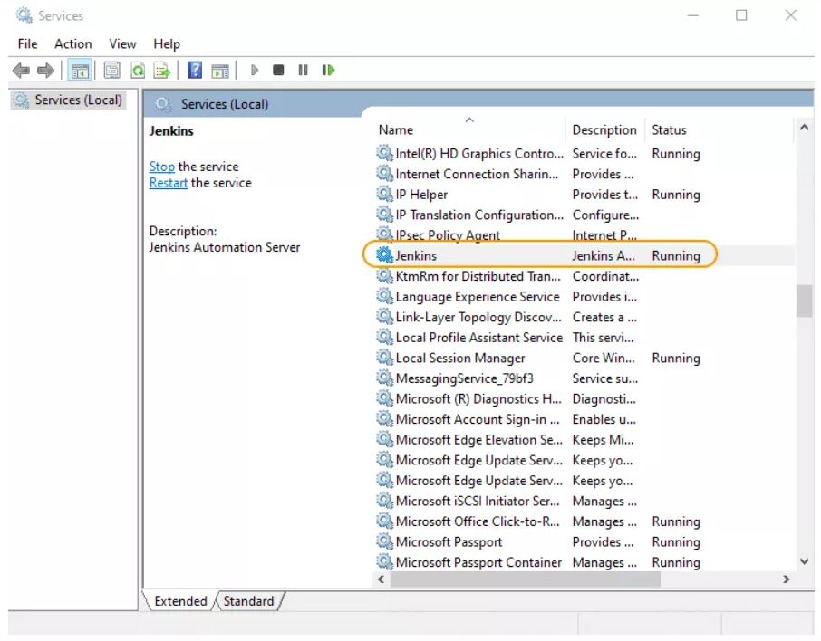

图4 安装成功查看Jenkins服务
</center>

- 第四步

在浏览器中打开`http://localhost:8080`，如果你是安装时选择的端口号不是8080那替换成你选择的端口。打开后出现图5页面，根据红色的提示路径获取初始密码（图6）
<center>
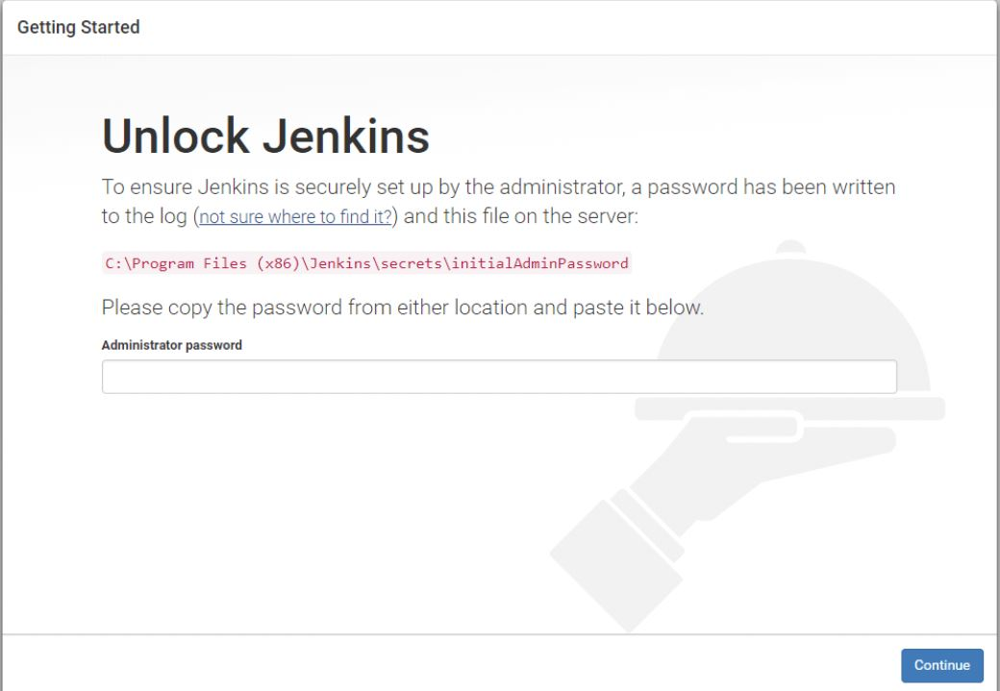

图5 输入初始密码
</center>
<center>
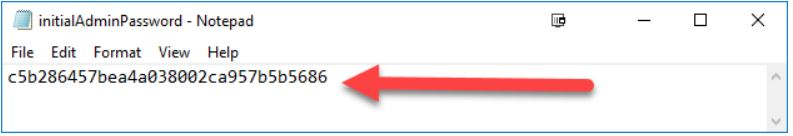

图6 初始密码
</center>

- 第五步

安装推荐的插件，并且创建一个用户。

## 博客CI/CD案例

以前我每次写完博客需要自己编译打包部署。有时候部署完后发现格式或者内容出了一些问题又要重新打包部署，每次重复的干这些事显然是很枯燥无味的。使用Jenkins编写pipeline就可以帮助我完成这些重复的工作。

### 安装插件

除了安装推荐的插件之外还需要安装下面两个插件

- `Publish Over SSH` 用于发送构建好的文件到服务器
- `NodeJS Plugin` 管理不同版本的Node.js

### 配置

- **配置服务器信息**

`Dashboard-> Manage Jenkins-> System -> Publish over SSH -> 新增SSH Server`

<center>
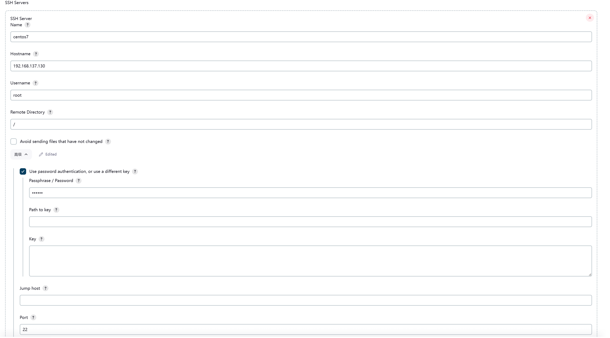

图7 配置服务信息
</center>

- **配置Node.js**

`Dashboard-> Manage Jenkins-> Tools -> NodeJS -> 新增NodeJS`

<center>
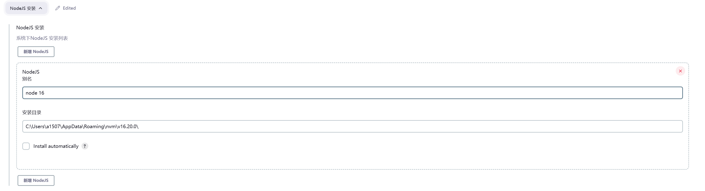

图8 nodejs配置
</center>

### 新建Pipeline项目

`Dashboard -> 新建Item -> Pipeline`

<center>
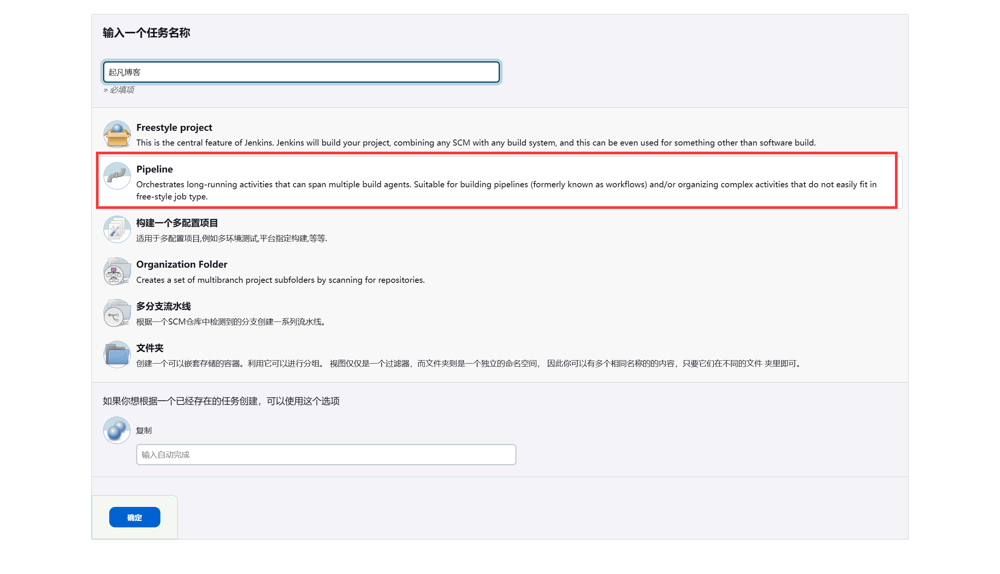

图9 新建pipeline项目
</center>

### 编写Pipeline

`Dashboard -> qifan-blog(你的项目) -> 配置`

```text
pipeline {
    agent any
    // 选择node 16
    tools {
      nodejs 'node 16'
    }
   // 将整个构建部署分成三个阶段，整个分成几个阶段没有一个标准，全部合成一个阶段也可以。
   // 分成多个阶段的好处的优点有 1. 逻辑清晰 2. 对于大项目如果其中某个阶段失败了，下次可以从失败的地方再运行。已经成功的阶段就不需要运行了。可以节省时间。3. 方便统计每个阶段的运行时间，好定位问题。
    stages {
        // 从git参考获取代码
        stage('Git Checkout') {
            steps {
              // 从github获取代码，这边使用的是你本机的git。相当于你自己执行了git clone https://github.com/qifan777/qifan-blog-vuepress2.git
              // git checkout master
              git branch: 'master', url: 'https://github.com/qifan777/qifan-blog-vuepress2.git'
            }
        }
        // 获取代码后在node16上构建博客代码
        stage('Build') {
            steps {
                bat "node -v"
                bat "npm install"
                bat "npm run docs:build"
            }
        }
        // 将构建好的博客上传到服务器上
        stage('SSH Punlisher') {
            steps{
                sshPublisher(publishers: [sshPublisherDesc(configName: 'centos7',
                 transfers: [sshTransfer( execCommand: 'nginx -s reopen',
                 remoteDirectory: '/www/server/nginx/html/blog',
                 removePrefix: 'docs/.vuepress/dist',
                  sourceFiles: 'docs/.vuepress/dist/**')])])
            }
        }
    }
}

```

点击保存

### 构建Pipeline

`Dashboard -> qifan-blog(你的项目) -> Build Now`


<center>
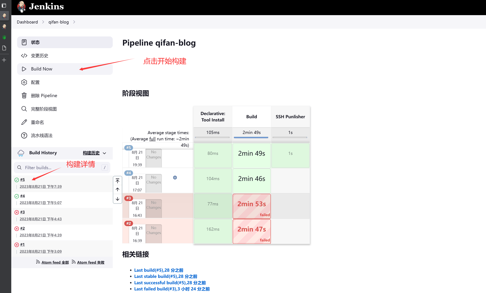

图10 查看构建详情
</center>

## Pipeline介绍

### 概念介绍

pipeline流水线以`pipeline {}`开始，`pipeline{}`下可以包含`Sections`,`Steps`,`Directives`, 赋值语句。


<center>
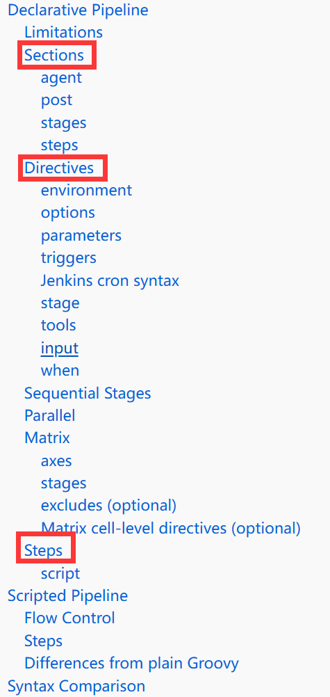

图11 pipeline基本概念
</center>

<center>
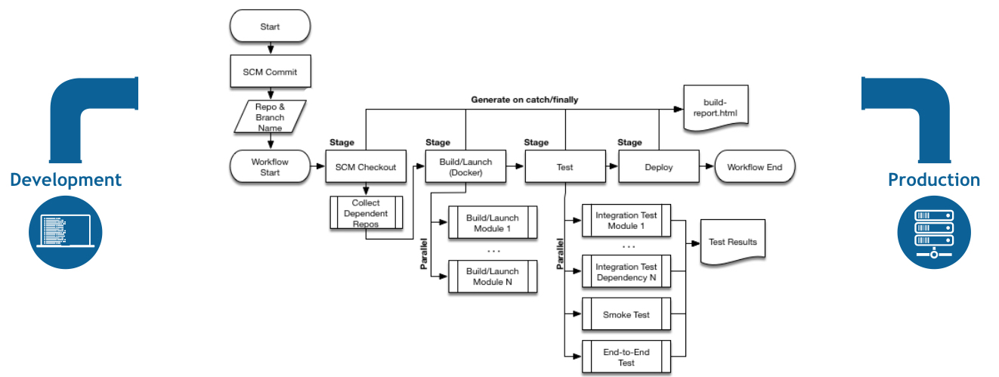

图12 pipeline结构图
</center>


通过上面的例子相信大家对pipeline有了初步的了解。

我们看图11中pipeline启动的方式可以是监听git仓库，每次git仓库有代码推送就会自动启动pipeline。前面的例子中我们是手动点击`Build Now`
启动Pipeline的。

在观察图中有多个Stage，对照我们之前写的例子其中有`Git Checkout`,`Build`和`SSH Punlisher`
三个Stage。Stage的作用就是将整个构建部署流程从逻辑上划分成多个阶段。

每个阶段（Stage）中又可以添加`Steps`，在`Steps`下可以添加`Directives`。我们看一下之前例子中的`Build`阶段，该阶段下有一个
`Steps`其中包含了三条`Directives`。在同一个`Steps`下的指令是可以共享局部变量，比如你可以在`Steps`中顶一个变量`def
count=1`，下面的指令都可以使用count变量。

```text
steps {
    bat "node -v"
    bat "npm install"
    bat "npm run docs:build"
}
```

### 如何编写Pipeline

一般分如下几个步骤

1. 确定Pipeline运行的`agent（机器/环境）`

如果是本机直接填写`agent: any`，还可以运行在docker，其他服务器，k8s上。可以参考官方文档中的`agent`参数。

2. 配置需要工具

如果你安装了git，maven插件，下面你tools你也可以添加。其他的工具也可以在插件市场中找到，安装完插件配置工具的版本，然后在`tools{}`
中选择相应的版本。

```text
 tools {
    nodejs 'node 16'
    git '配置的git版本'
    maven '配置的maven版本'
 }
```

3. 划分stage

参考我写的例子

4. 在每个stage中使用指令(Directives)

编写指令的时候，如果你不知道如何使用指令可以参考这个指令生成器和片段生成器。
指令生成器生成（Declarative Directive
Generator）的是官方提供的语法，片段生成器可以生成你下载的插件指令。比如之前写的例子中`tools`,`bat`
就是官方的指令，`git`,`sshPublisher`就是我安装的插件提供的指令。

`Dashboard -> qifan-blog(你的项目)  -> 流水线语法 -> Declarative Directive Generator`

`Dashboard -> qifan-blog(你的项目)  -> 流水线语法 -> 片段生成器`
