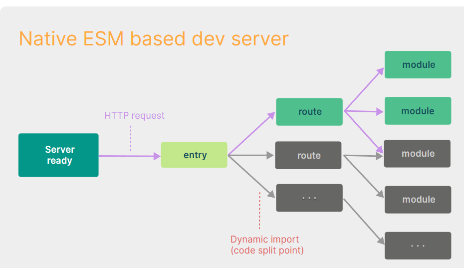
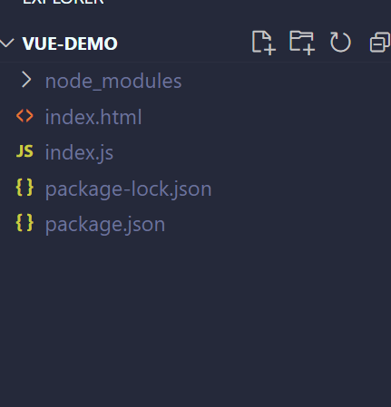
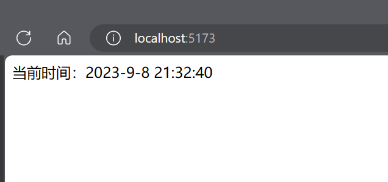

# vite

以前的vue-cli是基于webpack，而webpack在开发阶段启动的速度是十分缓慢。原因是webpack会把一整个项目从入口开始（index.html）将涉及的所有的模块打包成一个js文件（图1）。

随着现代浏览器对js模块的支持，现在在浏览器中就可以使用`export` 和 `import`关键字来生命模块和导入模块，这意味着浏览器现在不需要一次性获取所有的模块，可以在需要的时候去请求相应的模块（图2）。
并且当我们修改了代码时，vite只会更新代码涉及到模块进行热模块替换（HMR），使用我们在使用vite进行开发是每次更新都是十分的丝滑，很少出现整个页面都全部重新加载的情况。

> 需要注意的是，vite在打包时（npm run build）使用的是`rollup`。在开发时`npm run dev`使用的是`esbuild`。也就是说打包时会打包成几个大的js，而不是像开发时那样划分出很多模块。因为这样会增多浏览器和服务端的http请求，使得服务器压力增大。除此之外`rollup`在打包方面更加灵活有丰富的拓展插件。


<center>


图1 基于打包器的开发服务器
</center>

<center>


图2 基于ESM的开发服务器
</center>


## 安装
安装 vite 
```shell
npm i vite -D
```
在package.json中添加npm script
```json
{
  "scripts": {
    "dev": "vite",
    "build": "vite build",
    "preview": "vite preview"
  }
}
```
```json
{
  "scripts": {
    "dev": "vite",
    "build": "vite build",
    "preview": "vite preview"
  },
  "devDependencies": {
    "vite": "^4.4.9"
  }
}

```
## 代码

相比于`vue-cli`你会发现vite的项目中，index.html不在public目录下，并且你可以看见index.html中直接引用了js/ts文件。原因是`vite`会把index.html视为你源码的一部分。默认index.html是整个项目的入口。

`index.html`

```html
<!DOCTYPE html>
<html lang="en">
<head>
  <meta charset="UTF-8">
  <meta name="viewport" content="width=device-width, initial-scale=1.0">
  <title>Document</title>
</head>
<script type="module">

  import {showCurrentTime} from './index.js'

  setInterval(() => document.querySelector(".time").innerHTML = showCurrentTime() + '', 1000)

</script>

<body>
<div>当前时间：<span class="time"></span></div>
</body>
</html>
```

`index.js`

```js
export const showCurrentTime=()=>{
    const date=new Date();
    return  `${date.getFullYear()}-${date.getMonth()+1}-${date.getDate()} ${date.getHours()}:${date.getMinutes()}:${date.getSeconds()}`
}
```
<center>


图3 目录结构
</center>

## 运行
执行 `npm run dev` 访问`http://localhost:5173`

<center>


图4 效果图
</center>


