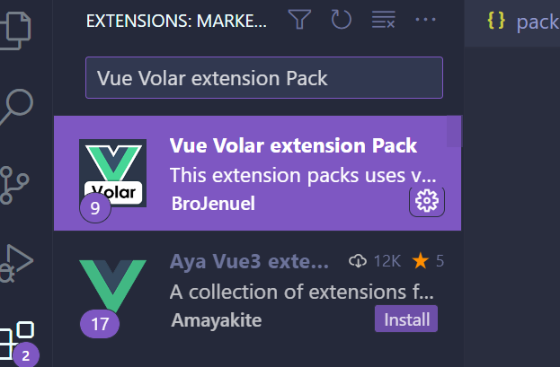
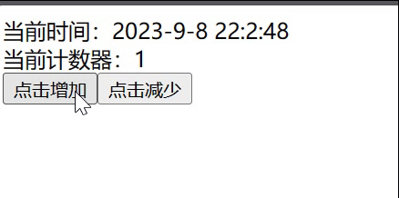

# vue

现在我们开始在vite上加入vue框架。vue我就不多介绍了相信大家都懂。

## 安装

**插件安装**

在 vscode 插件市场中搜索`Vue Volar extension Pack`
<center>


图1 vscode安装插件
</center>

**依赖安装**

```shell
# 运行时依赖
npm i vue
# vue语法转html+js+css
npm i @vitejs/plugin-vue -D
```

## 配置

新建 vite.config.js。引用vue编译插件，使得我们写的.vue文件经过编译后可以被浏览器识别。

`vite.config.js`
```js
import { defineConfig } from 'vite'
import vue from '@vitejs/plugin-vue'
export default defineConfig({
  plugins:[vue()]
})
```

## 代码


vue作为一个单页面应用，我们会将vue的入口组件（App.vue）挂载到html元素下。
因此首先，我们先在index.html中创建一个唯一的元素用于挂载vue的入口组件。

`index.html`
```html
<!--忽略...-->
<!--引用main.js中返回的vue入口组件-->
<script src="/src/main.js" type="module"></script>

<!--忽略...-->
<body>
<!--用于挂载vue入口组件-->
    <div id="app"></div>
</body>
<!--忽略...-->
```

下面我在App.vue中编写了一个简单的计数器用于验证vue的功能。

`src/App.vue`
```vue
<template>
    <div>
        <div >当前计数器：{{ counter }}</div>
        <button @click="()=>counter++">点击增加</button> 
        <button @click="()=>counter--">点击减少</button>
    </div>
</template>

<script setup>
import { ref } from 'vue';
const counter=ref(0)

</script>

<style scoped>

</style
```

在main.js我们指定了入口组件返回了一个vue单页面应用实例。并将该组件挂载到index.html的#app元素上。

`src/main.js`

```js
import {createApp} from'vue'
import App from './App.vue'
const app= createApp(App)
app.mount('#app')
```

## 运行

`npm run dev`

<center>


图6 效果图
</center>

