# 工作报告

## 指标推送

指标推送是我在今年2月份做的一个完整功能。其中的推送功能具有复杂的逻辑性。当指标推送给机构时，机构下所有的人员都会收到指标。面对如此庞大的用户，一个指标的推送就会产生大量的数据，如果大量的指标推送给大量的用户那数据量就呈几何倍增。

因此在和李昕洪导师经过一上午的讨论后采纳了我提出的懒加载方案，即在用户登录到首页时去拉取属于自己的指标。此思路将”管理员推送“（图1）与”用户主动拉取“（图2）结合起来大大的降低了数据量。解决了低活跃用户的数据浪费，优化了推送的速度。

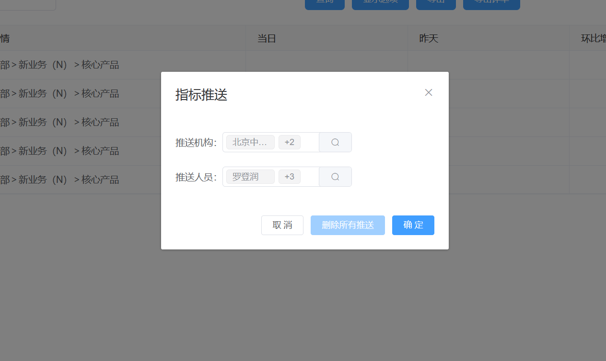

图1 推送指标

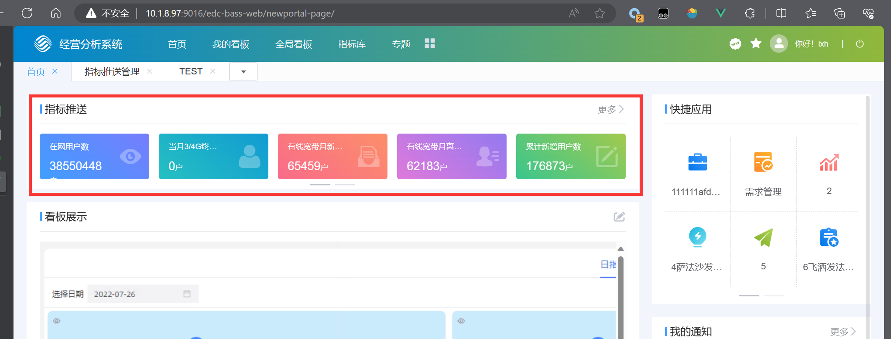

图2 用户拉取指标

用户在收到指标后也可以对首页的指标进行 **排序**、**指定**、**隐藏**等个性化操作。

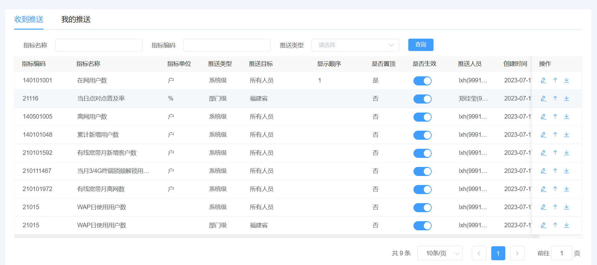

图3 个性化展示指标

## 调度指标/调度应用

调度指标和调度应用功能是一个典型的增删改查功能。调度指标在指标库的现有指标上封装一层形成调度指标，调度应用可以选取多个调度指标形成调度应用，最后调度应用用于展示。

针对这种典型的增删改查，可以用面向对象的思想将各个表的查询条件复用，可以快速的写出新业务。我还针对这种场景封装了一些组件，同样增加了开发速度。

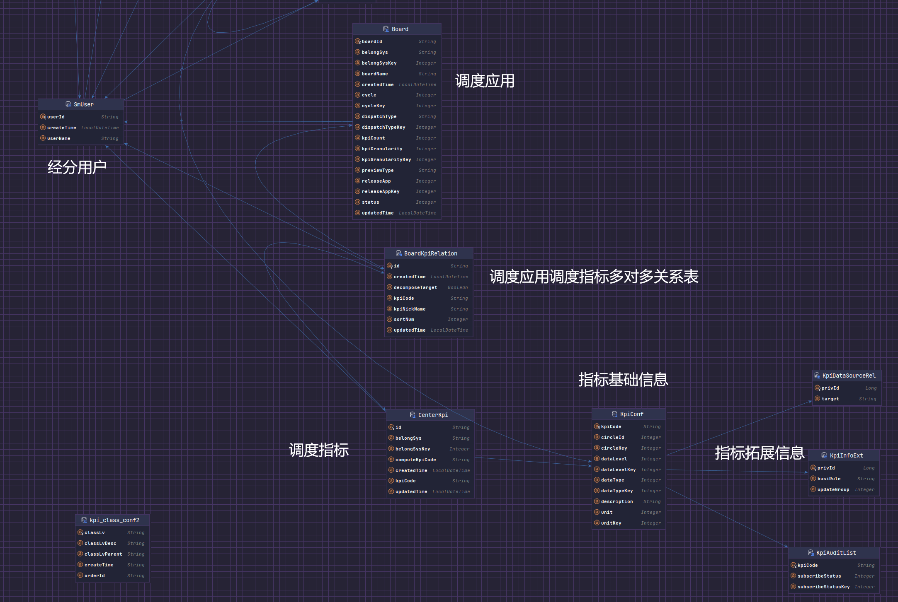

图5 调度应用/调度指标表关系图

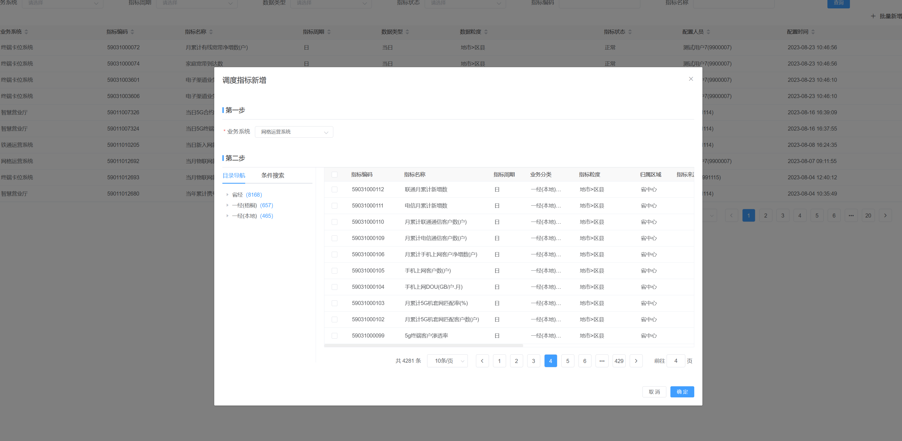

图6 调度指标创建

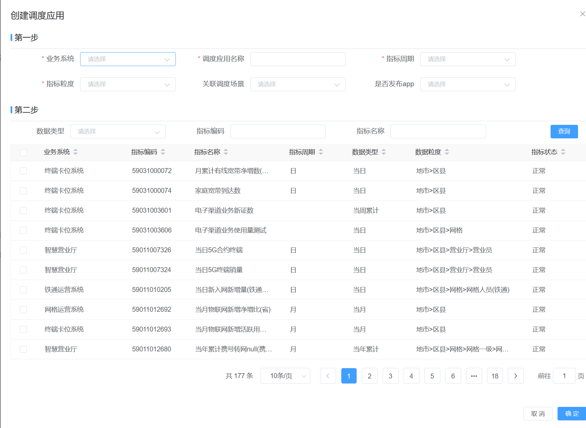

图7 调度应用创建

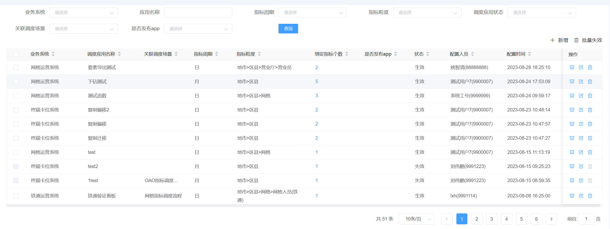

图8 调度应用查询

## 杂项功能

### 树形穿梭框/树形菜单

自己实现了类似ElementUI穿梭框体，和侧边树形菜单提现了扎实的前端基础。首页的树形侧边菜单栏，采用递归+组件化实现无线深层次树形菜单。将数据结构与算法的知识和前端结合。

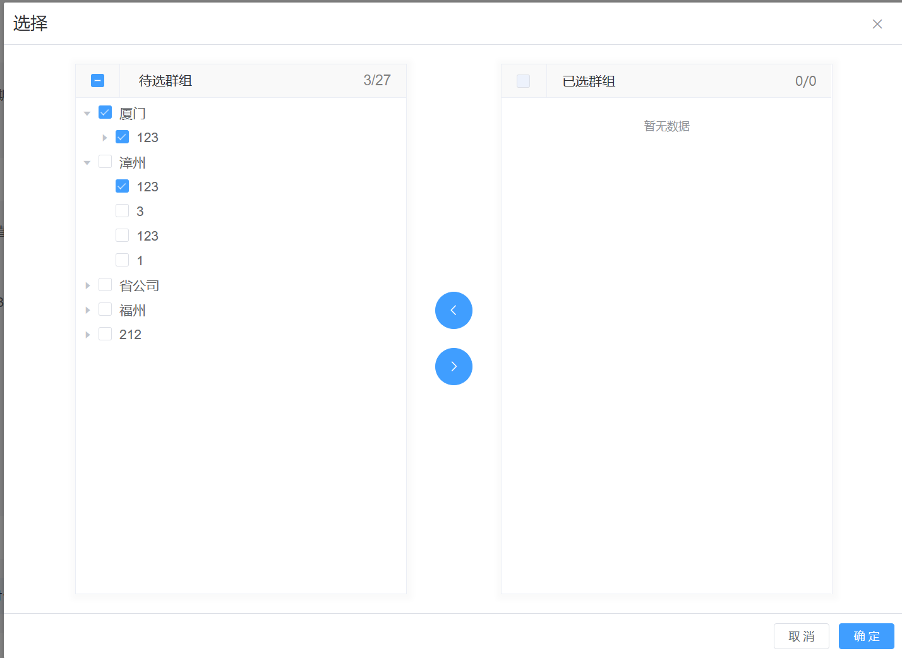

图8 树形穿梭框

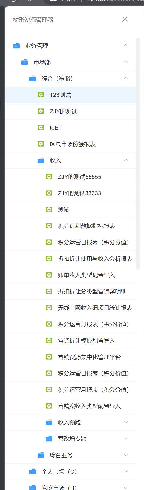

图9 树形侧边菜单

### 一经接口复核

对接应用资产，写定时任务根据接口定级去查询待复核的一经接口。

图10 一经接口复合

### 指标关联

配置指标的关联指标。

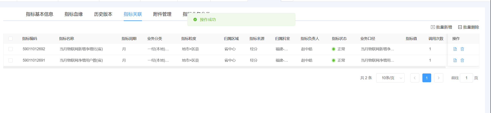

图11 指标关联

### 文件导出

将调度应用内的指标信息导出成excel。需要连接sftp再将数据构建成excel最后开启线程异步导出。

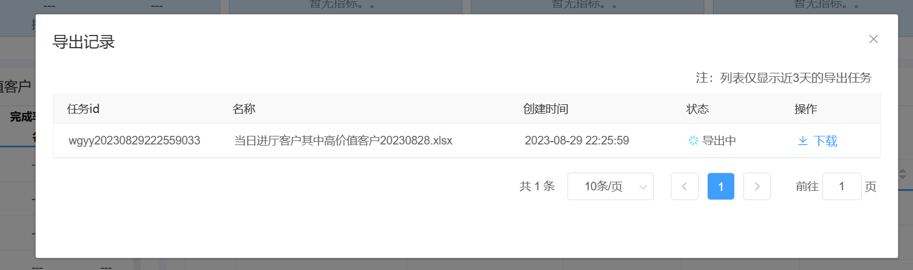

图12 调度应用导出

