# 在线邮筒

## 项目介绍

[springboot后端链接 ](https://gitee.com/jarcheng/post-letter/tree/master/springboot-letter)

[uni-app小程序链接](https://gitee.com/jarcheng/post-letter/tree/master/uniapp-letter)

[vue3后台管理页面](https://gitee.com/jarcheng/post-letter/tree/master/vue3-letter)

- 在线寄信
- 微信支付
- 富文本编辑（需要有管理员权限）
- 快递查询
- 购物车
- 小商店
- 推广拉新
- 提现（需要有权限才能开通）
### 技术栈
小程序端：

- `vue2`
- `uni-app`
- `typescript`

后端：
- `sa-token` 权限认证框架
- `mybati-plus`
- `springboot`
- `mysql`
- `redis`
- `rabbitmq`

后台管理页面：

- `vue3`
- `element-ui`
- `typescript`
- `vuex`
- `router`
## 页面设计

### 首页  

一共有三种类型的订单  

普通信件，明信片，商品。

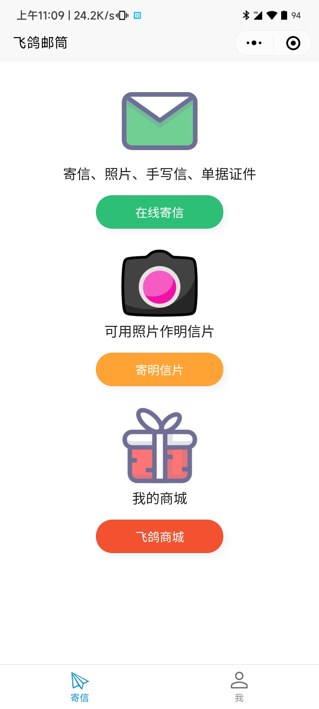

### 寄信页面

填写信件

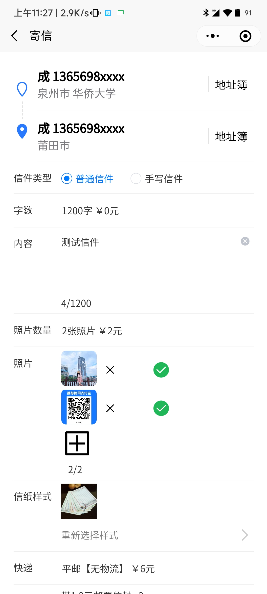

### 地址簿

在寄信页面中可以选择地址

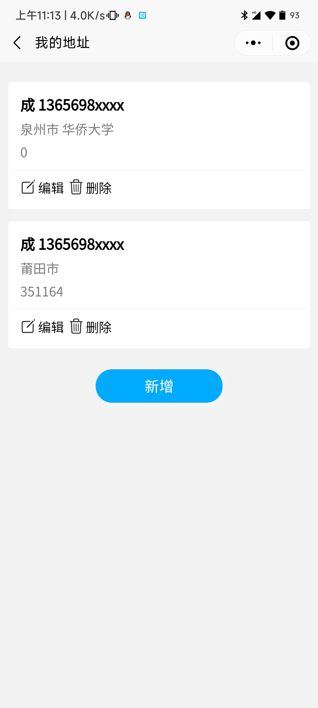

### 商品页面

可以单独寄商品也可以在寄信中随寄商品

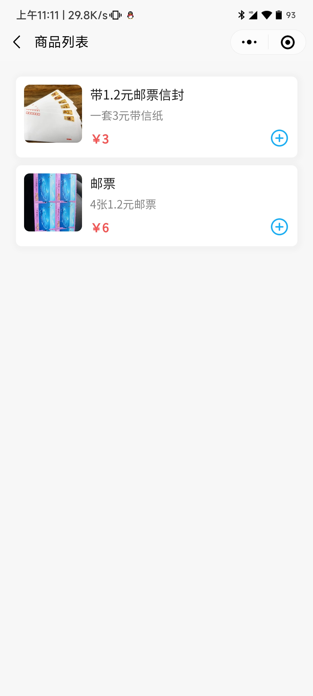

### 购物车页面

在商品页面中选取好商品，然后结算

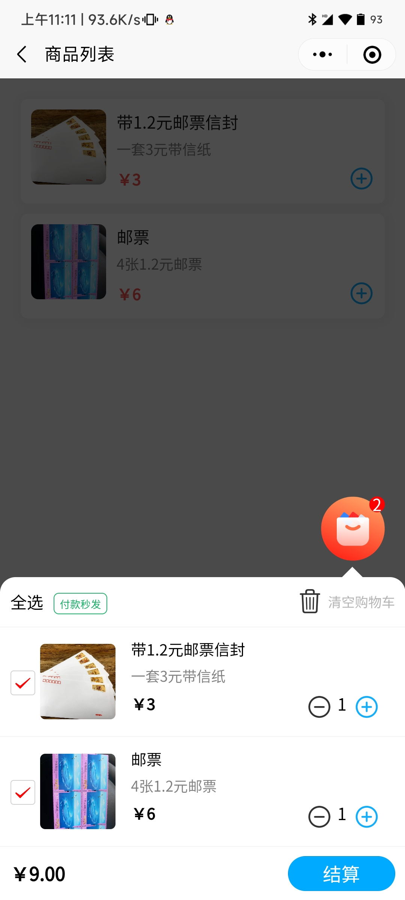

### 订单详情

提交订单后进入详情页面。  
在支付完成后，商家会在后台发货。如果15分账内未支付会自动取消订单。

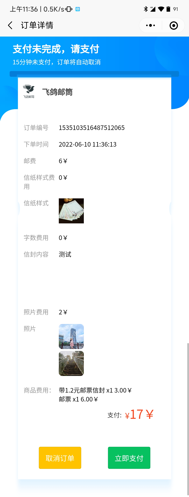

### 订单列表

历史订单展示

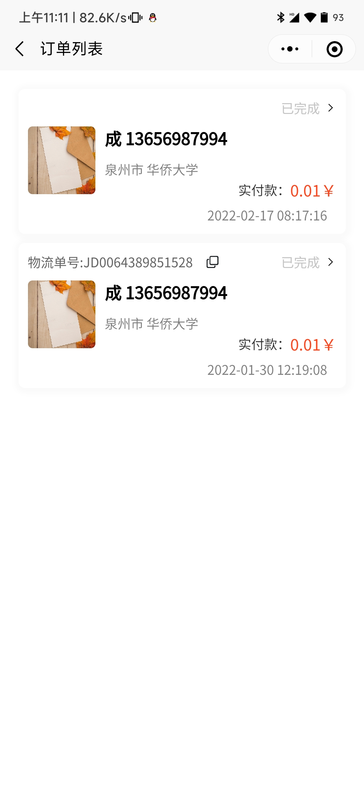

### 用户页面

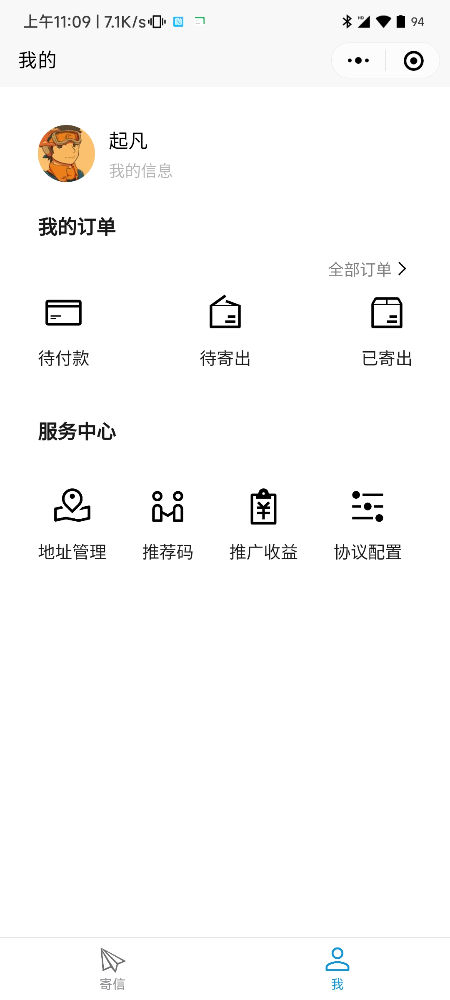

### 用户详情页面

### 推广码

每个用户可以生成自己的推广码，用于推广。  
新用户扫这个码就可以赚取推广费用

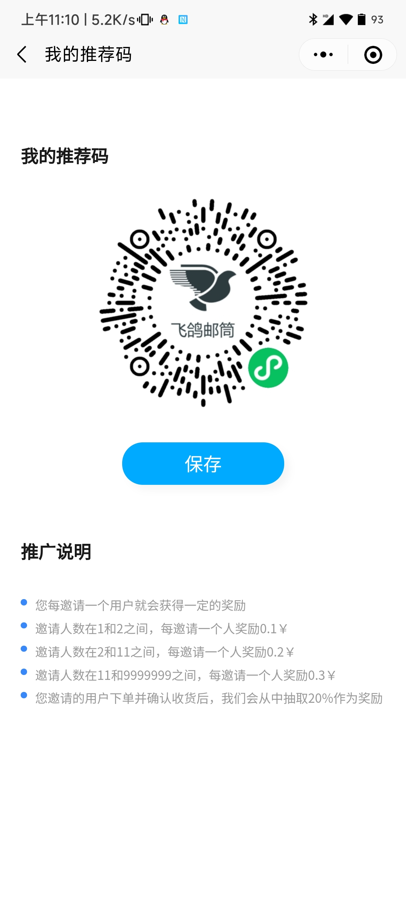

### 推广记录

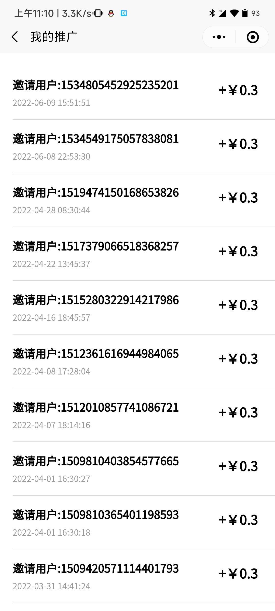

### 钱包

1. 通过邀请新用户赚取的推广费
2. 你邀请的新用户下单后从中得到一部分抽成
   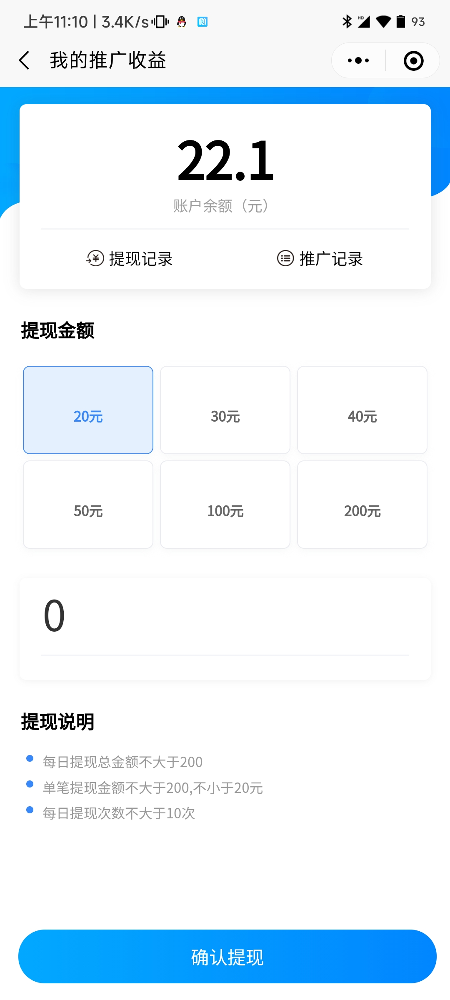

有问题可以联系wx：ljc666max
qq：1507906763
