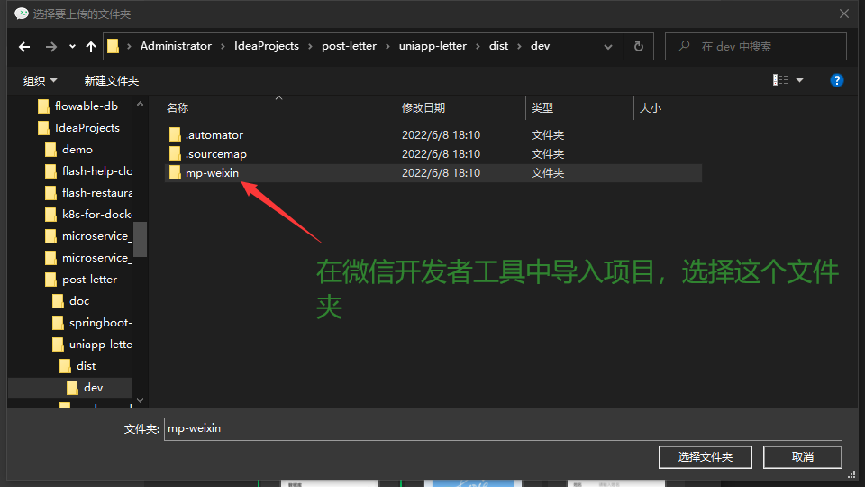

## 技术栈

- `vue2`
- `uni-app`
- `typescript`

## 运行步骤

### 1. 安装依赖包

```shell
yarn install
```

出现提示按 enter 等待下载完成

### 2. 修改 appid

在 manifest.json 中修改 mp-wexin-> appId

### 3. 运行到微信小程序

运行下面这个命令

```shell
yarn dev:mp-weixin
```

然后会生成 dist 文件夹，在微信开发者工具打开导入

`dist/dev/mp-weixin`


