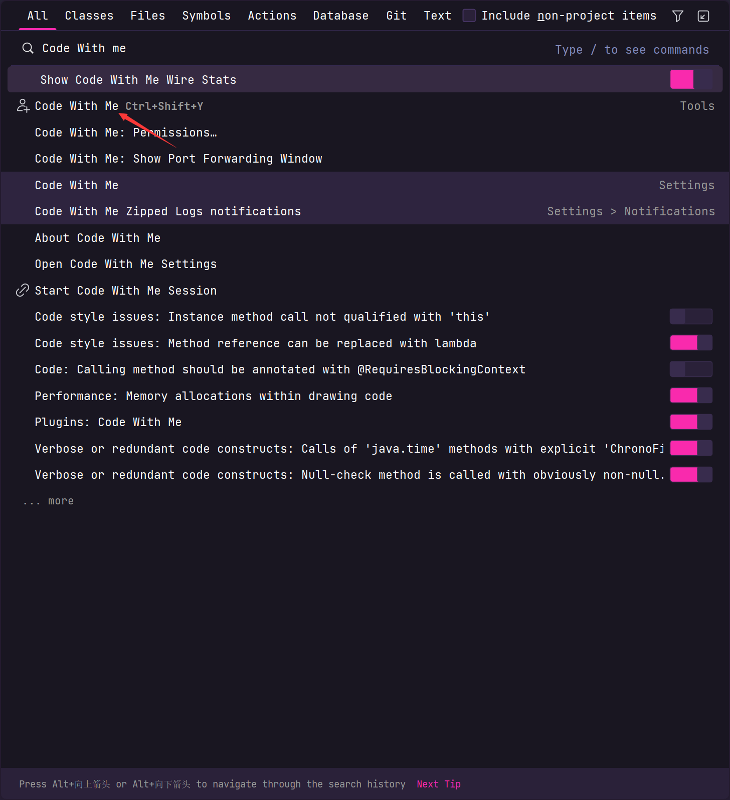
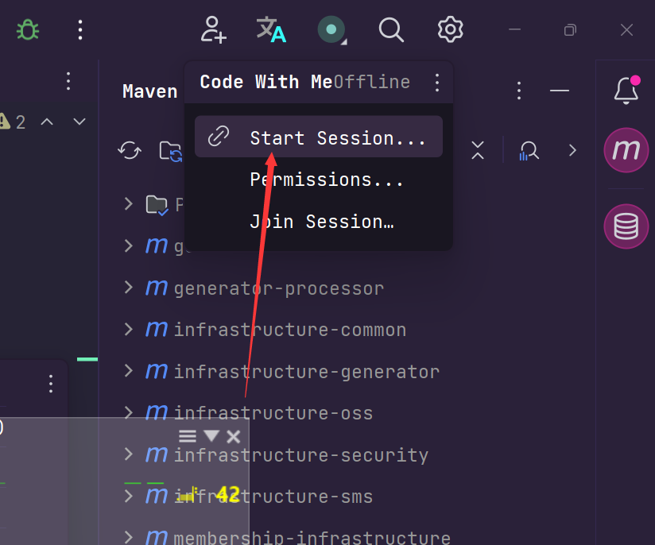
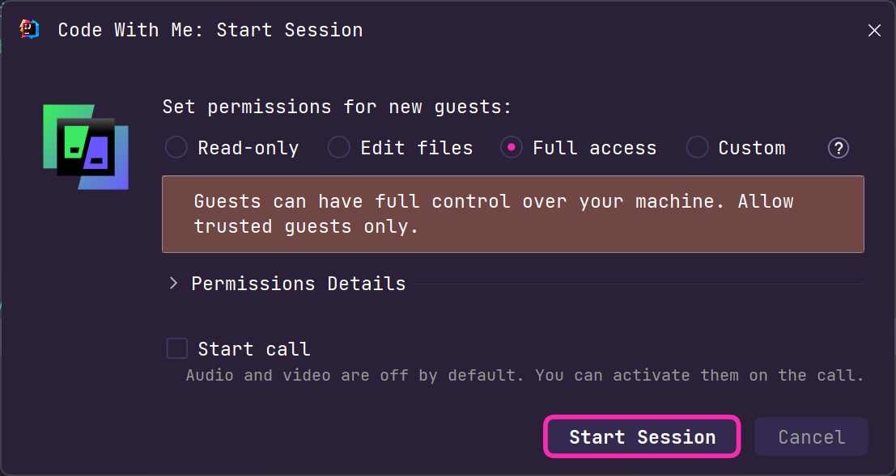
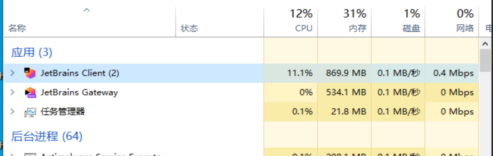
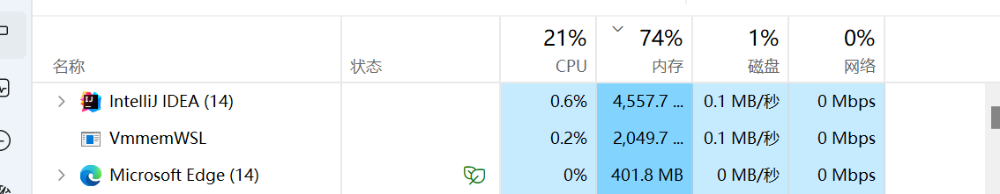
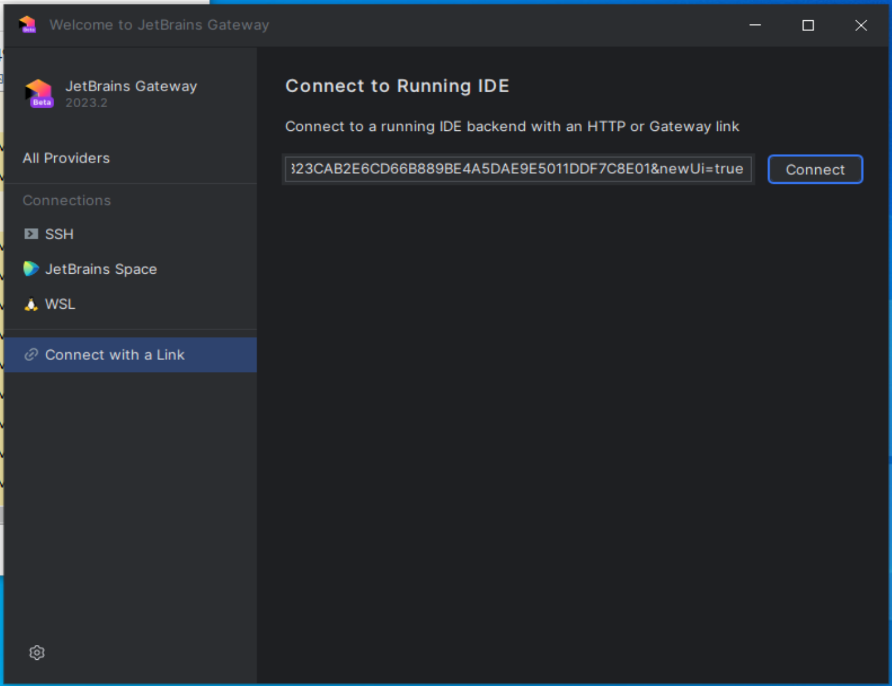
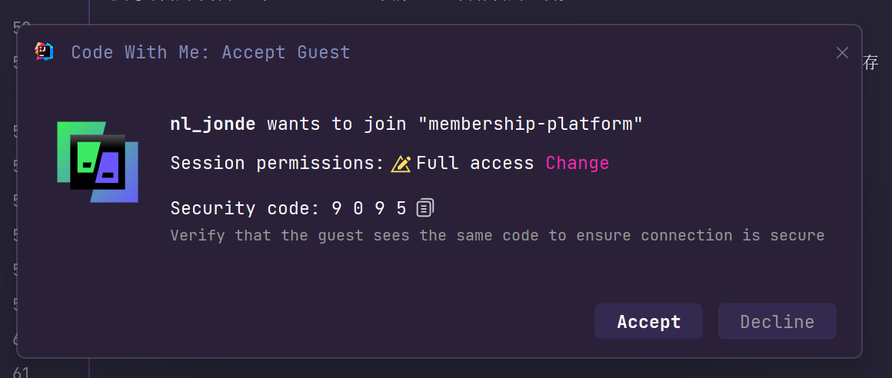
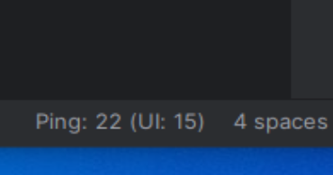
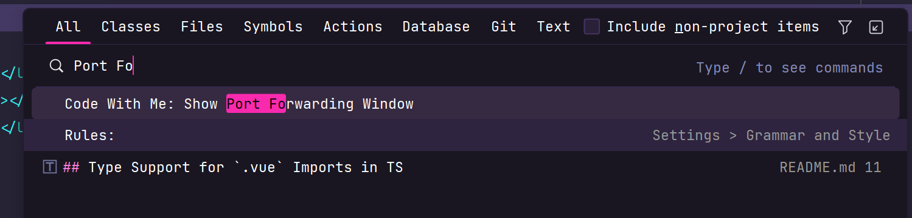
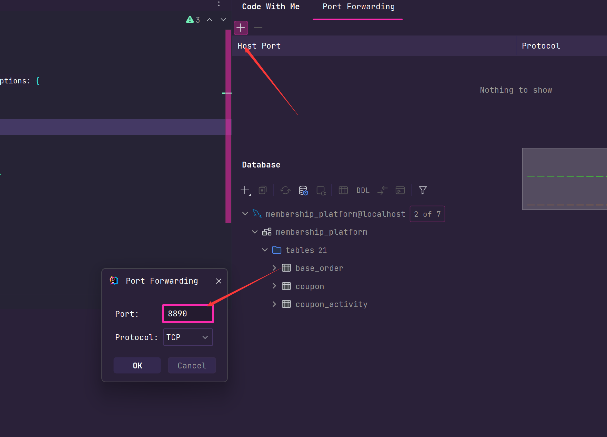

# 远程开发工具分享

想到远程开发工具，大家必然会想到远程操控软件如TeamView，向日葵远程操控，ToDesk等等。在使用远程操控我们可以明显感觉到以下几个缺点

##### 1. 画质低

大部人是使用免费的远程操控软件，平常我们写代码的时候字体本来就不是很大加上画面一糊根本就看不见代码。即使看得见也很难受，我自己是很难接受长时间在这种画质下写代码。

##### 2. 延迟高

我在使用远程操控写代码时候经常因为输入了一段代码但是还没反应过来导致我以为还没输入，然后又重新输入了一遍。更难受的时候，这个时候我删除也会出现同样的情况

##### 3. 无法访问服务

我们在远程电脑假设运行了一个后端服务，或者前端项目，因为远程电脑没有拥有公网IP，我们没有办法在本机上访问到远程电脑上运行的服务。

当然远程操控软件也有很明显的有点，那就是你可以拥有你电脑完整的操控权，你可以打开电脑上的各种软件，文档，随时的复制粘贴等。
所以如果我们能在远程操控软件的基础上解决画质低，延迟高，公网访问那岂不是完美了！

ps：其实还有一个文件传输，这个只能通过微信QQ这种通讯工具解决了。

## Idea插件Code With Me

Jetbrains 下面的旗舰版IDE如 IDEA，Pycharm，Webstorm都自带这个插件。也是可以和IDE一起破解的。

使用介绍：在上诉介绍的IDE（2023版本）中，双击 `SHIFT` 输入`Code With Me`（图 1）。随后在右上角的弹出框中选择`Start Session`（图
2）。然后我们再选择第三个选项`Full Access`开放所有权限（图 3），最后点击 `Start Session`
。启动后会自动把控制链接复制到粘贴板。然后你就可以在本机电脑的IDEA打开`Code With Me`然后`Join Session`
在弹出框中输入刚刚远程机上得到是链接就可以远程开发了。

图 1

图 2

图 3

## Jetbrains Gateway

总所周知，IDEA的内存占用至少那就是3，4个G。如果我们在本机电脑上打开IDEA去控制远程电脑上的IDEA这样本机电脑的IDEA内存占用就有些浪费了，因为我们没有在本机电脑的IDEA上写代码，现在本机电脑的IDEA只是一个远程操控软件。所以针对这种需求场景，JetBrains有一款产品叫`JetBrains Gateway`
它就是专门用来操控远程JetBrains下的IDE，内存占用也会少。

下面们就对比下IDEA和JetBrains的内存占用情况。可以看到Gateway的内存占用1G不到，IDEA内存占用高达4.5G。所以我们如果只是为了远程控制IDEA只需要在本机开Gateway就行了。

图 4 Gateway内存占用

图 5 Idea 内存占用

使用介绍：我们在Gateway的首页上点击左侧菜单栏`Connect with a Link`（图6），将我们之前远程机中开启`Code With Me`得到的链接复制到里面再点击`Connect`。随后我们需要在远程机同意控制（图7）。

图 6 Gateway首页面板

图 7 远程机同意控制

Gateway的右下角可以看见延迟，我目前最高在100以内，大部分都是在30左右非常稳定。

图 8 ping延迟

如果你需要开启远程端口访问，来访问远程机上的服务，你可以在远程机的IDEA上双击Shift输入`Port Foward`。在右侧的面板中添加需要转发的端口，比如我的后端服务端口是8890。开启后你在本机上就可以通过localhost:8890来访访问远程机上的8890了。

图 9 显示端口转发面板

图 10 添加需要转发的端口

