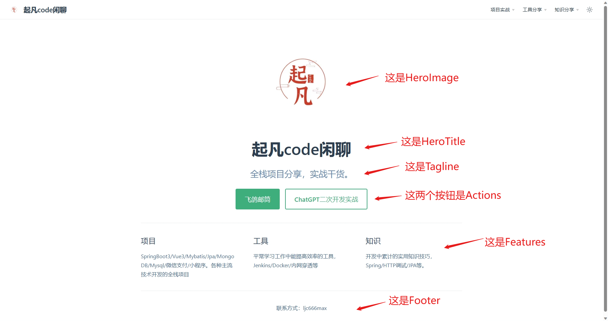

# VuePress2搭建自己的博客/官方网站


<center>图1 VuePress效果图</center>

VuePress 是一个以 Markdown 为中心的静态网站生成器。你可以使用 Markdown 来书写内容（如文档、博客等），然后 VuePress
会帮助你生成一个静态网站来展示它们。

> ps: 以上介绍摘自官网

平常我写博客只需要用markdown写好，然后运行打包命令，就可以将markdown转成html。接着将打包好的文件到nginx服务器上就可以供用户访问了。

## 快速上手

### 依赖环境

- Node.js v16.19.0+

### 手动安装

- **步骤 1**: 创建并进入一个新目录

```shell
mkdir vuepress-starter
cd vuepress-starter
```

- **步骤 2**: 初始化项目

```shell
git init
pnpm init
```

- **步骤 3**: 将 VuePress 安装为本地依赖

```shell
pnpm add -D vuepress@next @vuepress/client@next vue
```

- 步骤 4: 在 package.json 中添加一些 scripts

```json
{
  "scripts": {
    "docs:dev": "vuepress dev docs",
    "docs:build": "vuepress build docs"
  }
}
```

- 步骤 5: 在 .gitignore 文件中添加下面内容

```ignorelang
.DS_Store
node_modules
/dist
.temp
.cache

docs/.vuepress/dist
# local env files
.env.local
.env.*.local

# Log files
npm-debug.log*
yarn-debug.log*
yarn-error.log*
pnpm-debug.log*

# Editor directories and files
.idea/
.vscode
*.suo
*.ntvs*
*.njsproj
*.sln
*.sw?
```

- **步骤 6**: 创建你的第一篇文档

```shell
mkdir docs
echo '# Hello VuePress' > docs/README.md
```

- **步骤 7**: 在本地启动服务器来开发你的文档网站

```shell
pnpm docs:dev
```

## 页面

### 页面路由

vuepress会读取docs目录下所有的markdown文件转成html。然后通过浏览器的输入对应的路径就可以访问了。
比如下面几个例子，左侧是文件在目录中的位置和文件名，右侧是在浏览器中的路由地址。

| 相对路径	                      | 路由路径                        |
|----------------------------|-----------------------------|
| /docs/README.md	           | /                           |
| /docs/index.md	            | /                           |
| /contributing.md	          | /                           |
| /guide/README.md	          | /guide/                     |
| /guide/getting-started.md	 | /guide/getting-started.html |

## 配置

vue-press的目录结构是这样的，config.js就是配置文件了。我们可以在这个文件里面定义vue-press的基本配置和主题配置。

```text
├─ docs
│  ├─ .vuepress
│  │  └─ config.js
│  └─ README.md
├─ .gitignore
└─ package.json
```

不同的主题提供了不同的页面配置。同一主题对于首页和普通页面也有不同的配置选项。
下面以默认主题为例子来讲述如何配置首页和普通页面。

### 首页配置

先介绍一下首页中的哪些元素是可以配置的。在图2中我已经一一标注在上面了。


<center>图2 首页配置介绍</center>

在了解了基本的配置元素后，我们在docs下新建README.md。这个页面就当作我们的首页了，我们在这个页面下输入以下配置。

```text
---
home: true
heroImage: /images/logo.jpg
heroText: 起凡code闲聊
tagline: 全栈项目分享，实战干货。
actions:
  - text: 飞鸽邮筒
    link: /project/post-letter/
    type: primary
  - text: ChatGPT二次开发实战
    link: /project/chatgpt-assistant/
    type: secondary
features:
  - title: 项目
    details: SpringBoot3/Vue3/Mybatis/Jpa/MongoDB/Mysql/微信支付/小程序。各种主流技术开发的全栈项目
  - title: 工具
    details: 平常学习工作中能提高效率的工具，Jenkins/Docker/内网穿透等
  - title: 知识
    details: 开发中累计的实用知识技巧，Spring/HTTP调试/JPA等。
footer: 联系方式：ljc666max
---
```

其中的`home: true`代表当前页面设为首页。`heroImage: /images/logo.jpg`
设置图2中的HeroImage，需要注意的是该图片的存放位置位于`/docs/.vuepress/public/images/logo.jpg`
。该位置后的图片在打包后都会在根目录下，所以`/images/logo.jpg`可以生效。

### 普通页面配置

#### 生成当前页面侧边栏

在普通页面的中输入`sidebar: auto`就会自动根据标题大小生成侧边目录。`sidebarDepth: 2`，用来控制侧边目录的深度，默认是2。

```text
---
sidebar: auto
sidebarDepth: 2
---
```

#### 多个页面公用侧边栏
有些博客的内容较多，需要分成很多期来讲，这种情况就可以在全局配置里面对同一路由开头下的页面公用侧边栏。
