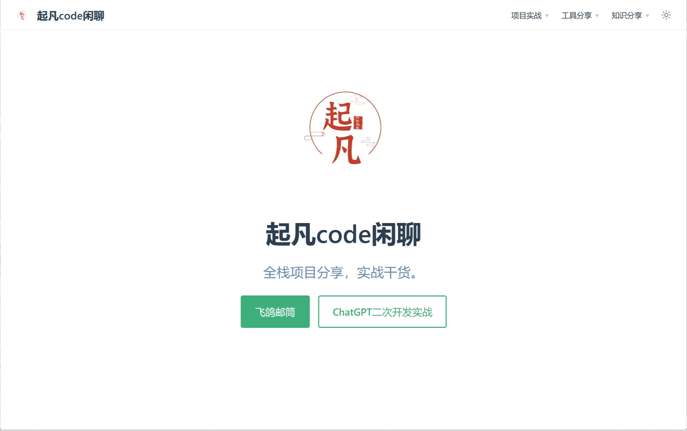

# VuePress2搭建自己的博客/官方网站



VuePress 是一个以 Markdown 为中心的静态网站生成器。你可以使用 Markdown 来书写内容（如文档、博客等），然后 VuePress
会帮助你生成一个静态网站来展示它们。

> ps: 以上介绍摘自官网

平常我写博客只需要用markdown写好，然后运行打包命令，就可以将markdown转成html。接着将打包好的文件到nginx服务器上就可以供用户访问了。

## 快速上手

### 依赖环境

- Node.js v16.19.0+

### 手动安装

- **步骤 1**: 创建并进入一个新目录

```shell
mkdir vuepress-starter
cd vuepress-starter
```

- **步骤 2**: 初始化项目

```shell
git init
pnpm init
```

- **步骤 3**: 将 VuePress 安装为本地依赖

```shell
pnpm add -D vuepress@next @vuepress/client@next vue
```

- 步骤 4: 在 package.json 中添加一些 scripts

```json
{
  "scripts": {
    "docs:dev": "vuepress dev docs",
    "docs:build": "vuepress build docs"
  }
}
```

- 步骤 5: 在 .gitignore 文件中添加下面内容

```ignorelang
.DS_Store
node_modules
/dist
.temp
.cache

docs/.vuepress/dist
# local env files
.env.local
.env.*.local

# Log files
npm-debug.log*
yarn-debug.log*
yarn-error.log*
pnpm-debug.log*

# Editor directories and files
.idea/
.vscode
*.suo
*.ntvs*
*.njsproj
*.sln
*.sw?
```

- **步骤 6**: 创建你的第一篇文档

```shell
mkdir docs
echo '# Hello VuePress' > docs/README.md
```

- **步骤 7**: 在本地启动服务器来开发你的文档网站

```shell
pnpm docs:dev
```

## 页面路由

vuepress会读取docs目录下所有的markdown文件转成html。然后通过浏览器的输入对应的路径就可以访问了。
比如下面几个例子，左侧是文件在目录中的位置和文件名，右侧是在浏览器中的路由地址。

| 相对路径	                      | 路由路径                        |
|----------------------------|-----------------------------|
| /docs/README.md	           | /                           |
| /docs/index.md	            | /                           |
| /contributing.md	          | /                           |
| /guide/README.md	          | /guide/                     |
| /guide/getting-started.md	 | /guide/getting-started.html |

